# QA Evidence — NEARS-3954

**NEARS-3954 fix-cycle 2 delta re-QA PASS @ 38fc8d5ab: held confirm-sheet rows name+skeleton, spoken 'Loading...' (EN/AR), replay lands on original group, no 3849 coupon-missing line under hold**

**21 screenshot(s).** Click any thumbnail for full resolution.

<table>
<tr>
<td align="center" width="33%"><a href="ac13-buynow-tracking.png">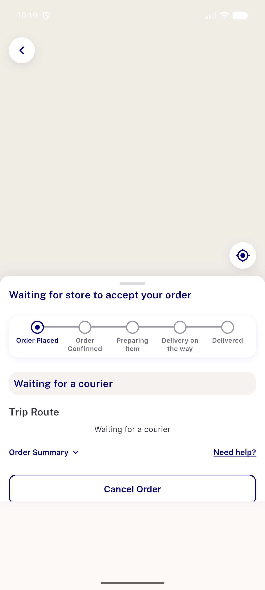</a> ac13 buynow tracking</td>
<td align="center" width="33%"><a href="ac5-found-earlier-tracking.png">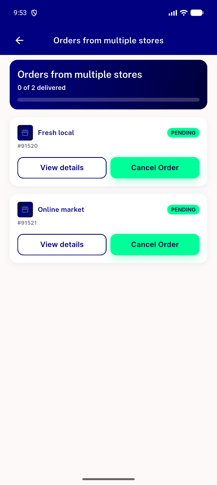</a> ac5 found earlier tracking</td>
<td align="center" width="33%"> bug held confirm store row a11y says error</td>
</tr>
<tr>
<td align="center" width="33%"><a href="c7-payagain-prompt.png">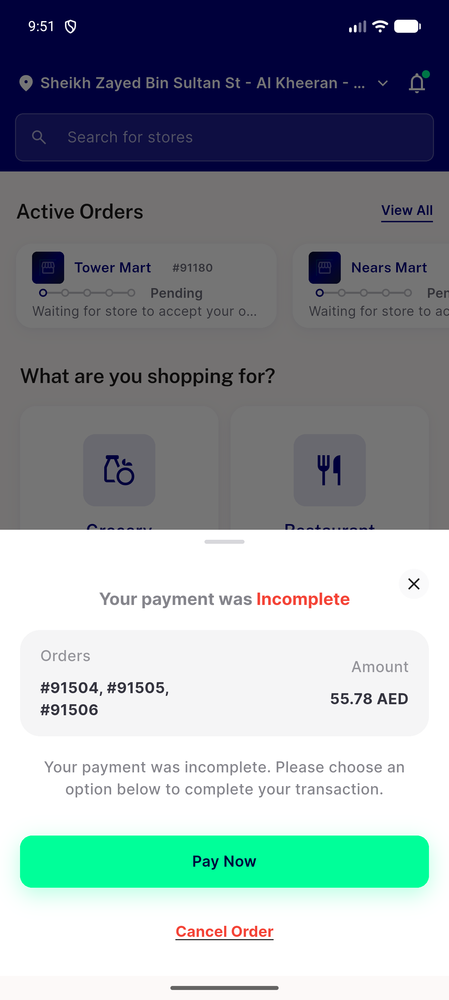</a> c7 payagain prompt</td>
<td align="center" width="33%"><a href="fc2-c1-held-confirm-sheet-en.png">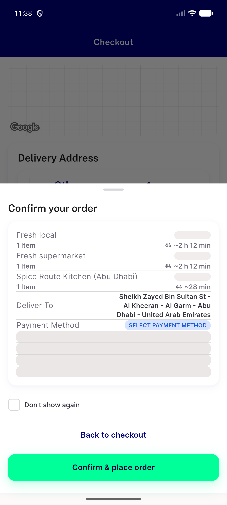</a> fc2 c1 held confirm sheet en</td>
<td align="center" width="33%"><a href="fc2-c1b-held-confirm-sheet-en.png">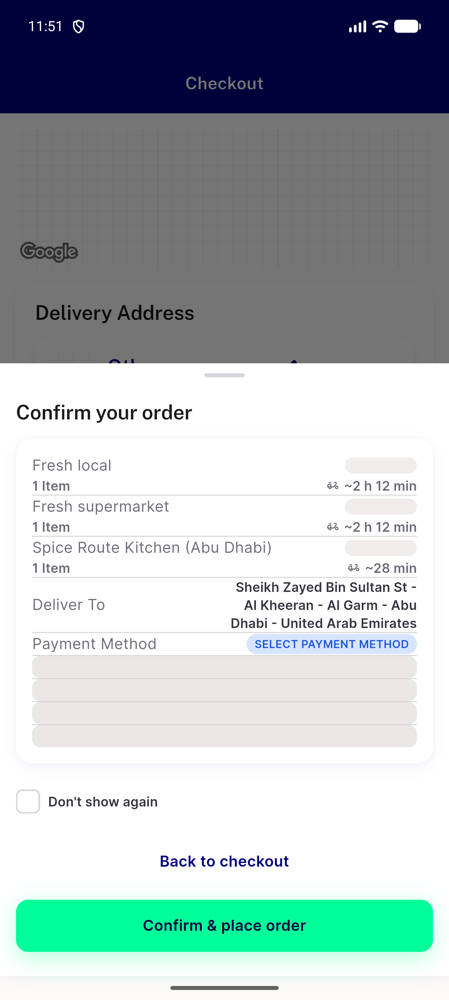</a> fc2 c1b held confirm sheet en</td>
</tr>
<tr>
<td align="center" width="33%"><a href="fc2-c2-control-settled.png">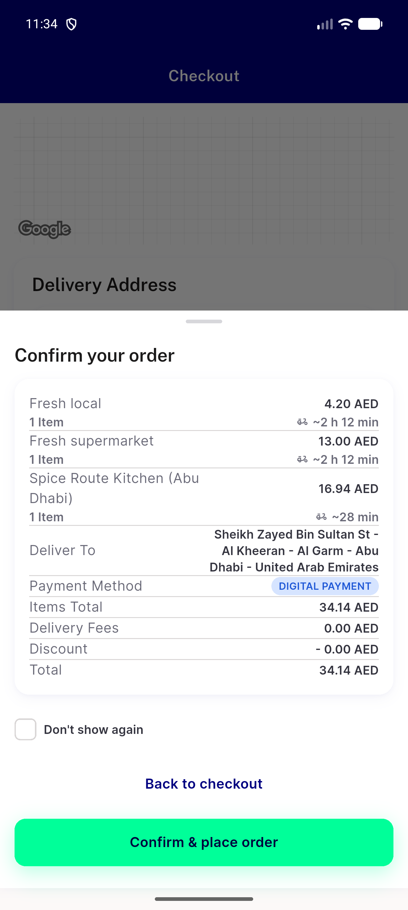</a> fc2 c2 control settled</td>
<td align="center" width="33%"><a href="fc2-c4-held-confirm-sheet-ar.png">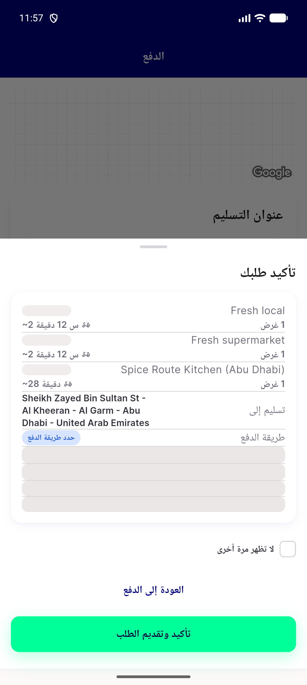</a> fc2 c4 held confirm sheet ar</td>
<td align="center" width="33%"><a href="fc2-c4-montage-en-ar.png">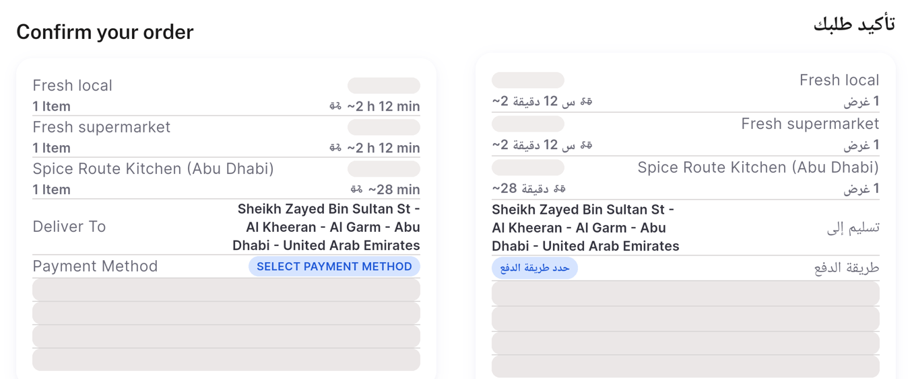</a> fc2 c4 montage en ar</td>
</tr>
<tr>
<td align="center" width="33%"><a href="preqa-ac10-montage-en-ar.png">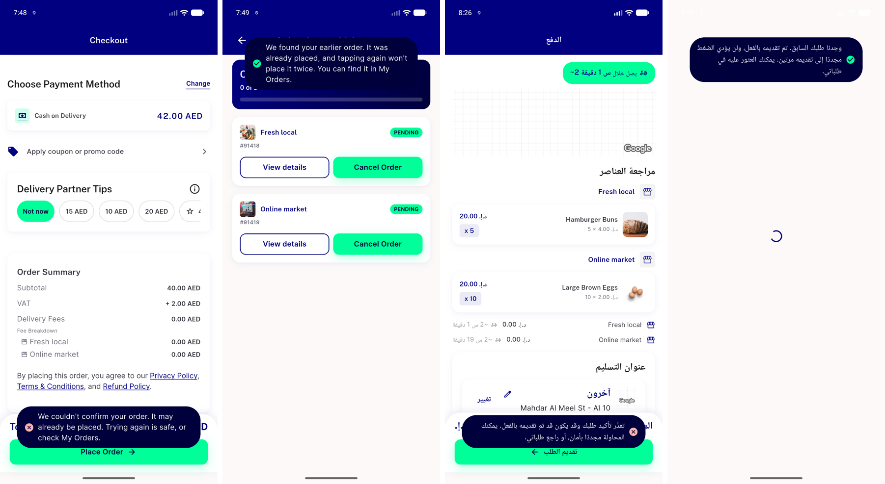</a> preqa ac10 montage en ar</td>
<td align="center" width="33%"> preqa ac14i found earlier tracking</td>
<td align="center" width="33%"><a href="preqa-ac14iii-found-earlier.png">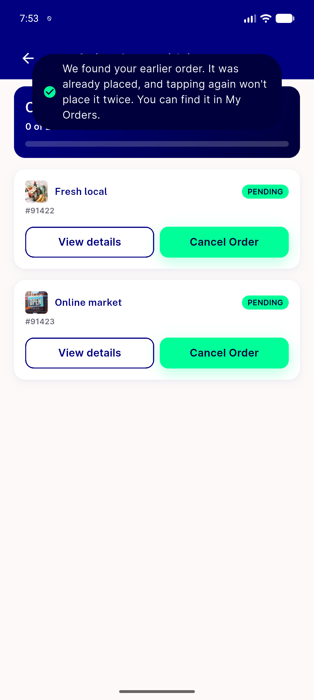</a> preqa ac14iii found earlier</td>
</tr>
<tr>
<td align="center" width="33%"><a href="preqa-ac5-could-not-confirm-en.png">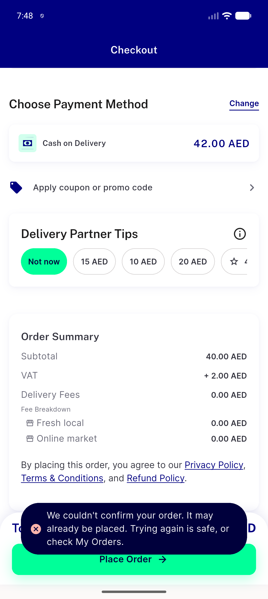</a> preqa ac5 could not confirm en</td>
<td align="center" width="33%"><a href="preqa-ac8a-retap-success.png">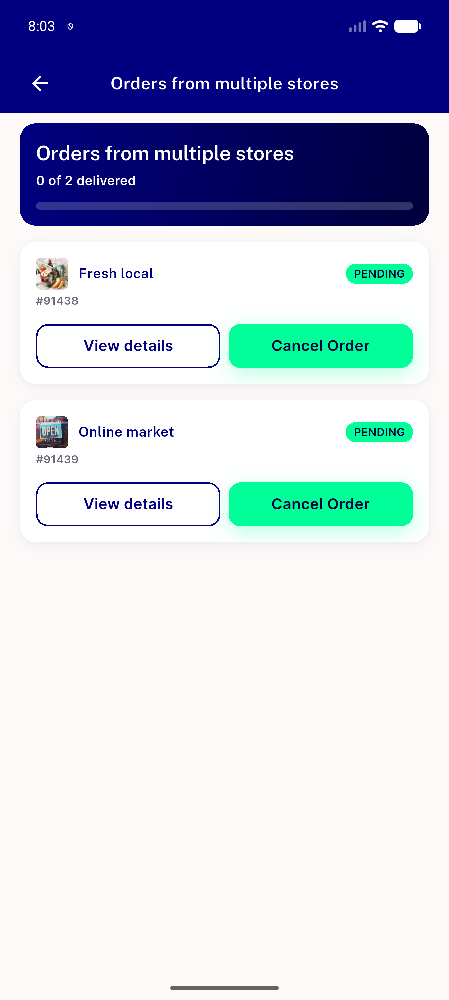</a> preqa ac8a retap success</td>
<td align="center" width="33%"><a href="preqa-ac9-found-earlier-tracking.png">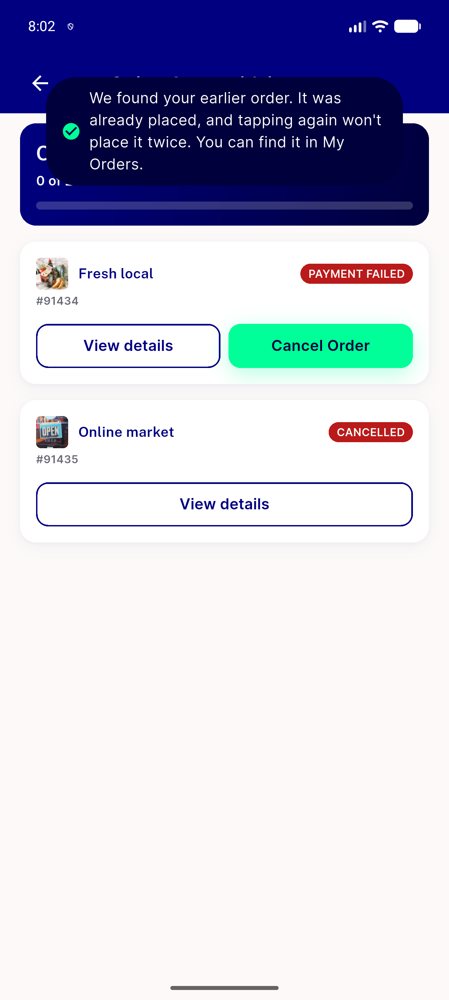</a> preqa ac9 found earlier tracking</td>
</tr>
<tr>
<td align="center" width="33%"><a href="preqa-bug-held-payment-prompt-shows-client-total.png">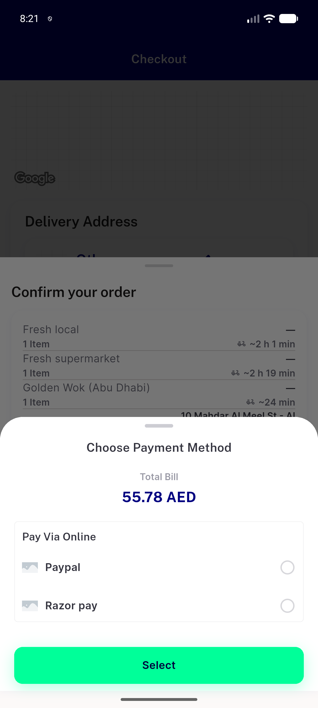</a> preqa bug held payment prompt shows client total</td>
<td align="center" width="33%"><a href="preqa-c41-held-checkout-small.png">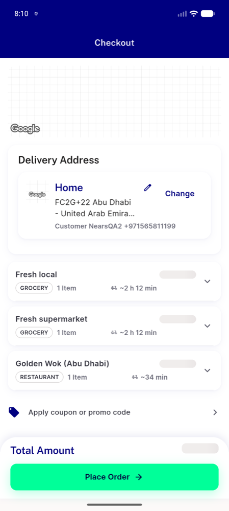</a> preqa c41 held checkout small</td>
<td align="center" width="33%"><a href="tb1-control-nohold-sheet.png">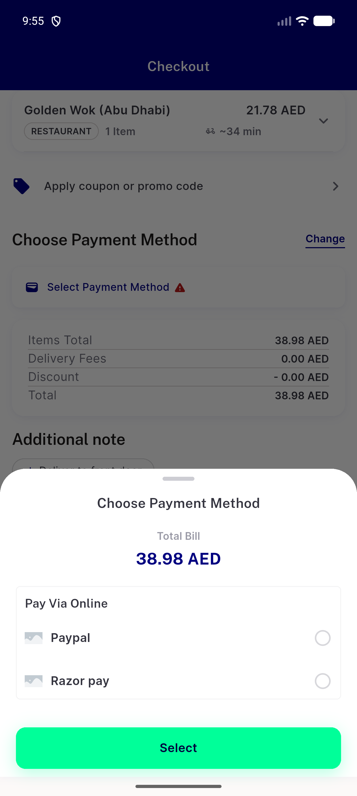</a> tb1 control nohold sheet</td>
</tr>
<tr>
<td align="center" width="33%"><a href="tb1-held-change-sheet.png">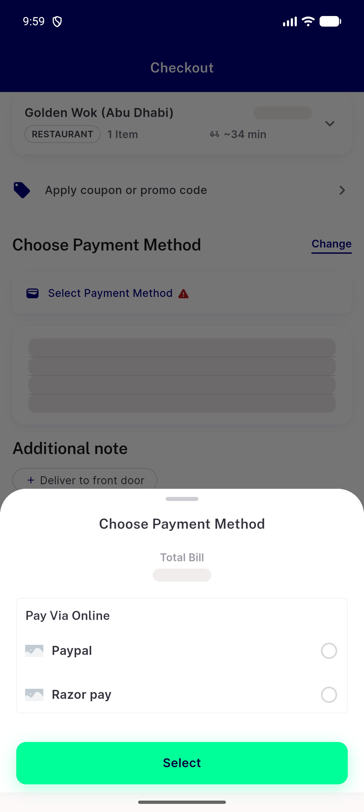</a> tb1 held change sheet</td>
<td align="center" width="33%"><a href="tb1-held-confirm-sheet.png">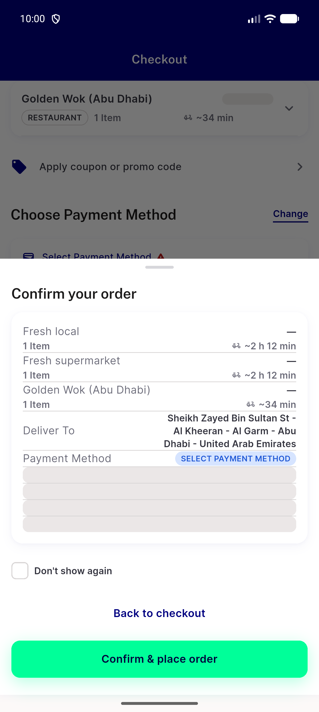</a> tb1 held confirm sheet</td>
<td align="center" width="33%"><a href="tb1-noprompt-sheet.png">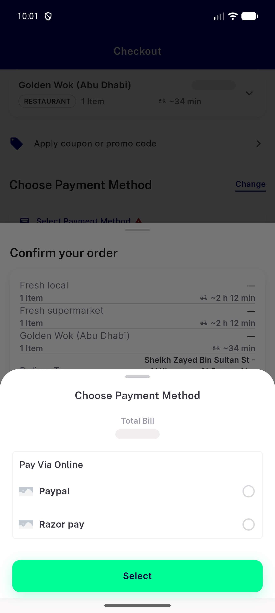</a> tb1 noprompt sheet</td>
</tr>
</table>

### Other artifacts
- [`ac11-key-absence.txt`](ac11-key-absence.txt)
- [`ac12-this-run.txt`](ac12-this-run.txt)
- [`ac13-after-place.txt`](ac13-after-place.txt)
- [`ac13-db.txt`](ac13-db.txt)
- [`ac13-journal.txt`](ac13-journal.txt)
- [`ac2-live.txt`](ac2-live.txt)
- [`ac3-belog.txt`](ac3-belog.txt)
- [`ac3-live.txt`](ac3-live.txt)
- [`ac4-live.txt`](ac4-live.txt)
- [`ac5-after-retap.txt`](ac5-after-retap.txt)
- [`ac5-belog.txt`](ac5-belog.txt)
- [`ac5-db.txt`](ac5-db.txt)
- [`ac5-journal.txt`](ac5-journal.txt)
- [`backend-freshness-8104-restart.txt`](backend-freshness-8104-restart.txt)
- [`backend-freshness-8104.txt`](backend-freshness-8104.txt)
- [`bug-held-confirm-store-row-a11y-says-error.xml`](bug-held-confirm-store-row-a11y-says-error.xml)
- [`c41-after-addr.txt`](c41-after-addr.txt)
- [`c41-after-place.txt`](c41-after-place.txt)
- [`c41-db.txt`](c41-db.txt)
- [`c41-replay-belog.txt`](c41-replay-belog.txt)
- [`c41-requests-after-addr.txt`](c41-requests-after-addr.txt)
- [`c42-after-addr.txt`](c42-after-addr.txt)
- [`c42-db.txt`](c42-db.txt)
- [`c42-replay-readback.txt`](c42-replay-readback.txt)
- [`c42-requests-after-addr.txt`](c42-requests-after-addr.txt)
- [`c42-sheet-before-drop.txt`](c42-sheet-before-drop.txt)
- [`c42-sheet-shown.txt`](c42-sheet-shown.txt)
- [`c42-wallet-tx.txt`](c42-wallet-tx.txt)
- [`c7-payagain-prompt-b83dbd6d.txt`](c7-payagain-prompt-b83dbd6d.txt)
- [`c7-payagain-prompt.txt`](c7-payagain-prompt.txt)
- [`c7-payagain-prompt.xml`](c7-payagain-prompt.xml)
- [`db_writes.log`](db_writes.log)
- [`fc2-backend-freshness-8104.txt`](fc2-backend-freshness-8104.txt)
- [`fc2-c1-db.txt`](fc2-c1-db.txt)
- [`fc2-c1-held-confirm-sheet-en.xml`](fc2-c1-held-confirm-sheet-en.xml)
- [`fc2-c1b-applog.txt`](fc2-c1b-applog.txt)
- [`fc2-c1b-held-confirm-sheet-en.xml`](fc2-c1b-held-confirm-sheet-en.xml)
- [`fc2-c1b-replay-belog.txt`](fc2-c1b-replay-belog.txt)
- [`fc2-c1b-replay-journal.txt`](fc2-c1b-replay-journal.txt)
- [`fc2-c2-control-settled.xml`](fc2-c2-control-settled.xml)
- [`fc2-c3-anr-dropbox-head.txt`](fc2-c3-anr-dropbox-head.txt)
- [`fc2-c3-anr.log`](fc2-c3-anr.log)
- [`fc2-c3-db.txt`](fc2-c3-db.txt)
- [`fc2-c3-drop-journal.txt`](fc2-c3-drop-journal.txt)
- [`fc2-c3-held-checkout-coupon-ar.xml`](fc2-c3-held-checkout-coupon-ar.xml)
- [`fc2-c3-vm-isolate-state.txt`](fc2-c3-vm-isolate-state.txt)
- [`fc2-c3-vm-stack.txt`](fc2-c3-vm-stack.txt)
- [`fc2-c3b-applog.txt`](fc2-c3b-applog.txt)
- [`fc2-c3b-journal.txt`](fc2-c3b-journal.txt)
- [`fc2-c3b-logcat-dump-full.txt`](fc2-c3b-logcat-dump-full.txt)
- [`fc2-c4-db.txt`](fc2-c4-db.txt)
- [`fc2-c4-drop-journal.txt`](fc2-c4-drop-journal.txt)
- [`fc2-c4-held-confirm-sheet-ar.xml`](fc2-c4-held-confirm-sheet-ar.xml)
- [`fc2-db_writes.log`](fc2-db_writes.log)
- [`fc2-flutter-test-fixcycle2.txt`](fc2-flutter-test-fixcycle2.txt)
- [`fc2-run-notes.txt`](fc2-run-notes.txt)
- [`fc2-spoken-label-assertions.txt`](fc2-spoken-label-assertions.txt)
- [`flutter-test-changed-files.txt`](flutter-test-changed-files.txt)
- [`phpunit-BuyNowOrderIdempotencyTest.log`](phpunit-BuyNowOrderIdempotencyTest.log)
- [`phpunit-GroupOrderPlacementTest.log`](phpunit-GroupOrderPlacementTest.log)
- [`phpunit-Nears3901GroupPlaceBuyNowPinTest.log`](phpunit-Nears3901GroupPlaceBuyNowPinTest.log)
- [`phpunit-Nears3902PartialWalletRemainderTest.log`](phpunit-Nears3902PartialWalletRemainderTest.log)
- [`phpunit-Nears3902PartialWalletSplitTest.log`](phpunit-Nears3902PartialWalletSplitTest.log)
- [`phpunit-Nears3947PaymentFailedGroupFieldsTest.log`](phpunit-Nears3947PaymentFailedGroupFieldsTest.log)
- [`phpunit-Nears3954GroupPlaceIdempotencyTest.log`](phpunit-Nears3954GroupPlaceIdempotencyTest.log)
- [`phpunit-Nears3957GroupPaymentChildGateTest.log`](phpunit-Nears3957GroupPaymentChildGateTest.log)
- [`preqa-ac12-fa-summary.txt`](preqa-ac12-fa-summary.txt)
- [`preqa-ac16-step1.txt`](preqa-ac16-step1.txt)
- [`preqa-ac16-step2.txt`](preqa-ac16-step2.txt)
- [`preqa-ac16-step3.txt`](preqa-ac16-step3.txt)
- [`preqa-ac4-belog.txt`](preqa-ac4-belog.txt)
- [`preqa-bug-ac17-conflict-warn-extra-fields.log`](preqa-bug-ac17-conflict-warn-extra-fields.log)
- [`preqa-bug-held-payment-prompt-shows-client-total.log`](preqa-bug-held-payment-prompt-shows-client-total.log)
- [`preqa-progress.md`](preqa-progress.md)
- [`progress.md`](progress.md)
- [`reg-db.txt`](reg-db.txt)
- [`reg1-journal.txt`](reg1-journal.txt)
- [`reg2-journal.txt`](reg2-journal.txt)
- [`run-notes.txt`](run-notes.txt)
- [`tb1-confirm-sheet.txt`](tb1-confirm-sheet.txt)
- [`tb1-control-nohold-sheet.xml`](tb1-control-nohold-sheet.xml)
- [`tb1-db.txt`](tb1-db.txt)
- [`tb1-held-change-sheet.txt`](tb1-held-change-sheet.txt)
- [`tb1-held-change-sheet.xml`](tb1-held-change-sheet.xml)
- [`tb1-held-checkout.txt`](tb1-held-checkout.txt)
- [`tb1-held-confirm-sheet.xml`](tb1-held-confirm-sheet.xml)
- [`tb1-noprompt.txt`](tb1-noprompt.txt)
- [`tb1-noprompt.xml`](tb1-noprompt.xml)
- [`tb1-place-1.txt`](tb1-place-1.txt)
- [`tb1b-client-fail-lines.txt`](tb1b-client-fail-lines.txt)
- [`tb1b-client.log`](tb1b-client.log)
- [`tb1b-noprompt.txt`](tb1b-noprompt.txt)
- [`tb1b-noprompt.xml`](tb1b-noprompt.xml)
- [`tb1b-replay-belog.txt`](tb1b-replay-belog.txt)
- [`tb2-belog.txt`](tb2-belog.txt)
- [`tb2-db.txt`](tb2-db.txt)
- [`tb2-rids.txt`](tb2-rids.txt)
- [`tb2-steps.txt`](tb2-steps.txt)

---
*From `nears/docs/qa-evidence/NEARS-3954/` · public-repo scrub policy (no live secrets; verified clean).*
