# QA Evidence — NEARS-3956

**NEARS-3956 QA PASS (delta2): success path re-taken with the REAL order_group_place hook (children confirmed+paid)**

**27 screenshot(s).** Click any thumbnail for full resolution.

<table>
<tr>
<td align="center" width="33%"> c0 before dialog inert</td>
<td align="center" width="33%"><a href="c1-after-dialog-ready.png">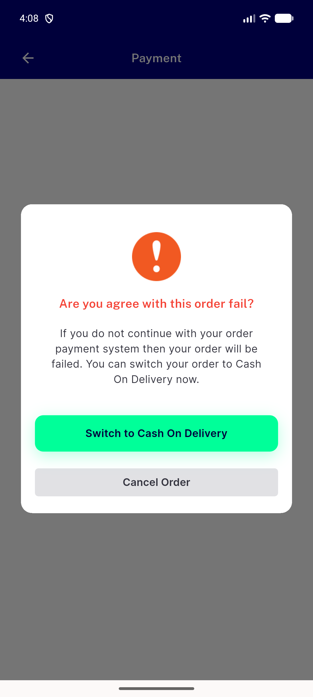</a> c1 after dialog ready</td>
<td align="center" width="33%"><a href="c1-after-switch-cash-home.png">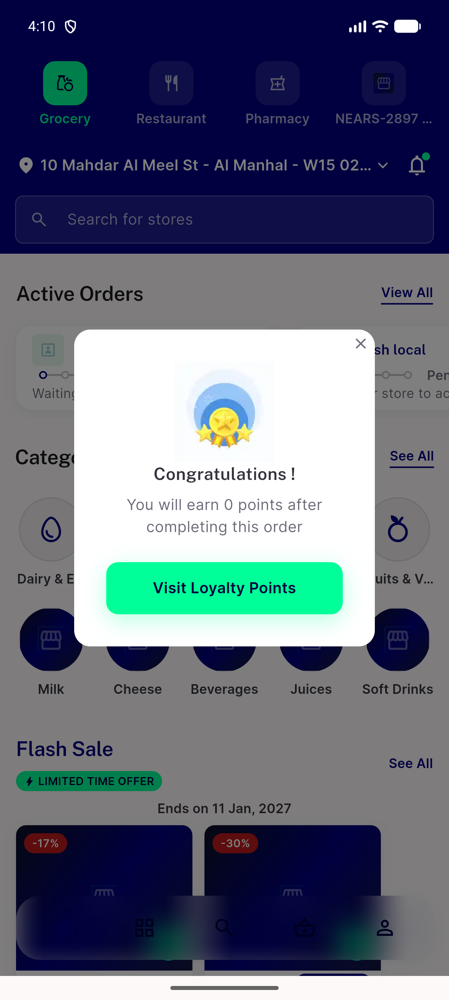</a> c1 after switch cash home</td>
</tr>
<tr>
<td align="center" width="33%"><a href="c10d-before-cod-no-order-found.png">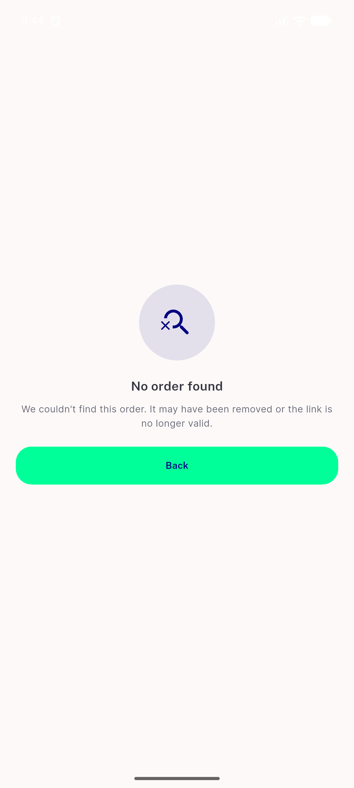</a> c10d before cod no order found</td>
<td align="center" width="33%"><a href="c10d-cod-group-create-account-no-login-track-404.png">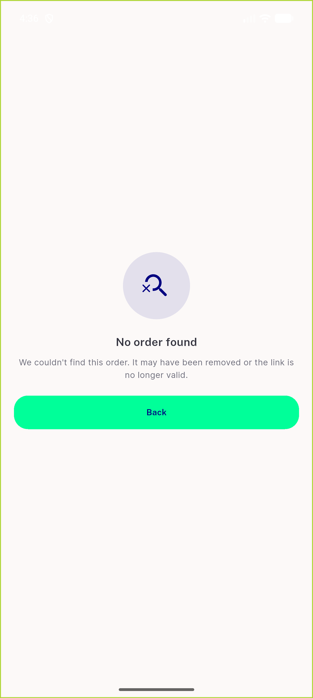</a> c10d cod group create account no login track 404</td>
<td align="center" width="33%"><a href="c11-arabic-retry-leave.png">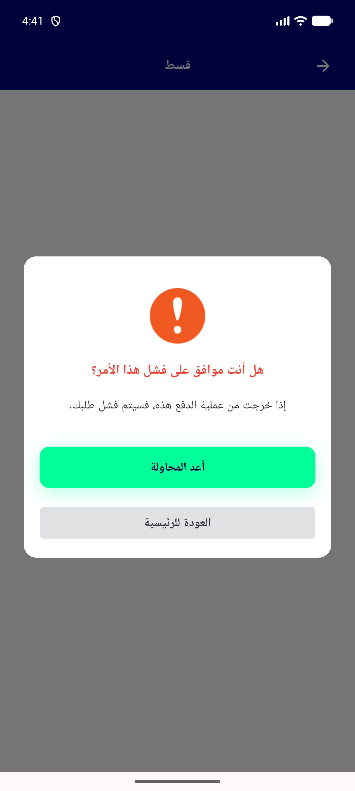</a> c11 arabic retry leave</td>
</tr>
<tr>
<td align="center" width="33%"><a href="c12-control-home-after-success.png">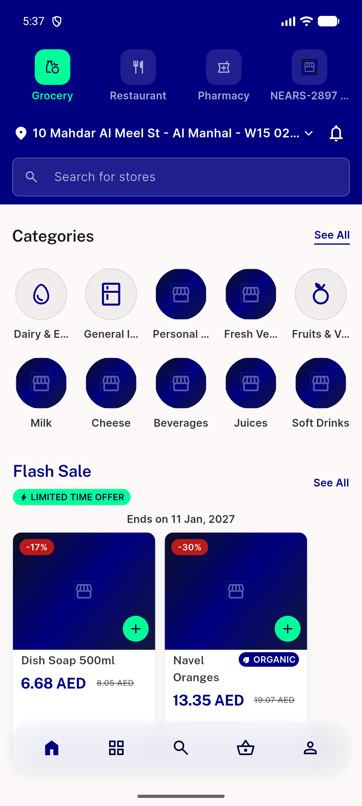</a> c12 control home after success</td>
<td align="center" width="33%"><a href="c12a-home-incomplete-sheet-after-success.png">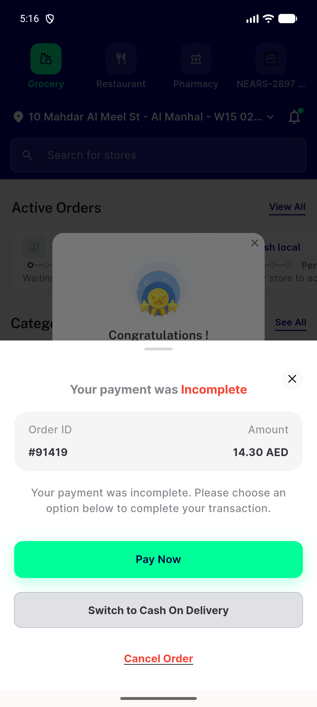</a> c12a home incomplete sheet after success</td>
<td align="center" width="33%"> c12a lane adopted success screen</td>
</tr>
<tr>
<td align="center" width="33%"><a href="c12b-control-guest-success-something-went-wrong.png">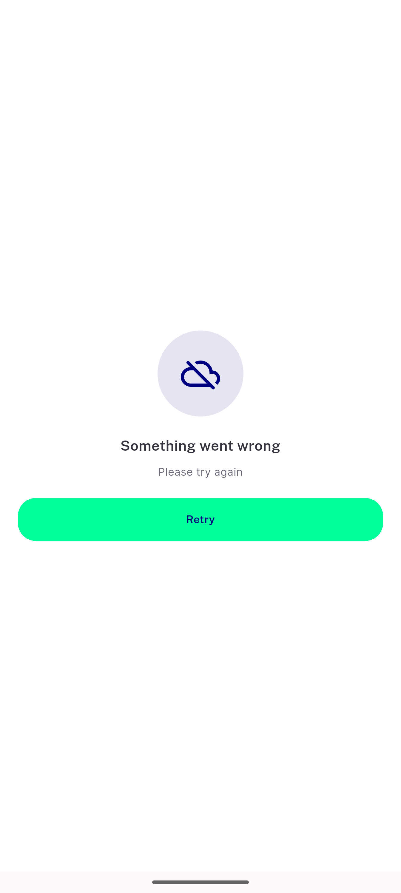</a> c12b control guest success something went wrong</td>
<td align="center" width="33%"><a href="c12c-control-plain-guest-success-screen.png">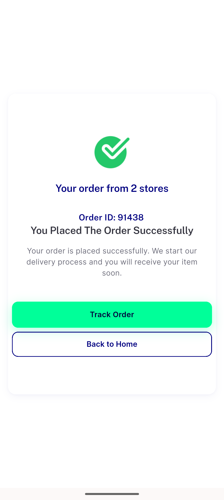</a> c12c control plain guest success screen</td>
<td align="center" width="33%"> c12c lane plain guest success screen</td>
</tr>
<tr>
<td align="center" width="33%"> c12d lane loggedin success screen</td>
<td align="center" width="33%"><a href="c12e-lane-adopted-payment-fail-screen.png">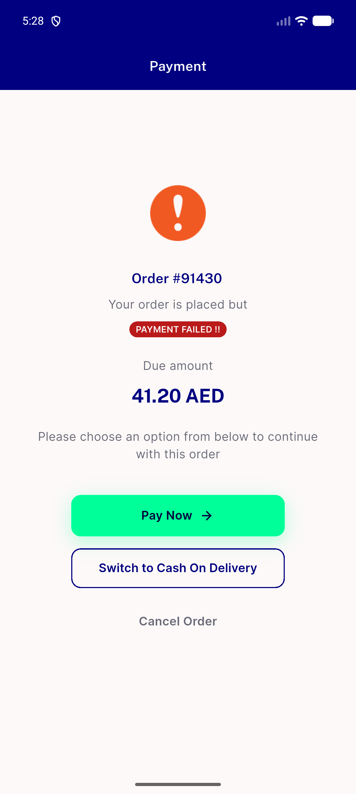</a> c12e lane adopted payment fail screen</td>
<td align="center" width="33%"> c4 after failed roster retry leave</td>
</tr>
<tr>
<td align="center" width="33%"><a href="c4b-locked-failed-retry-leave.png">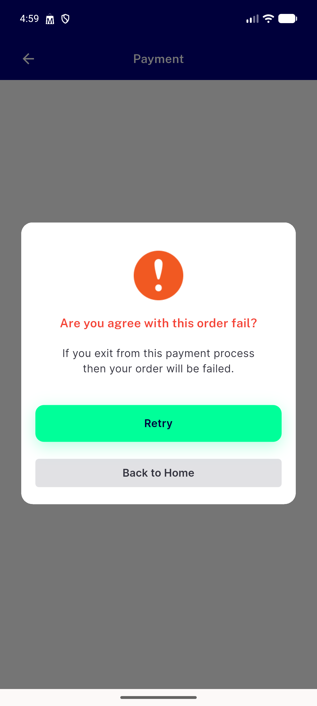</a> c4b locked failed retry leave</td>
<td align="center" width="33%"><a href="c5-verification-on-retry-leave.png">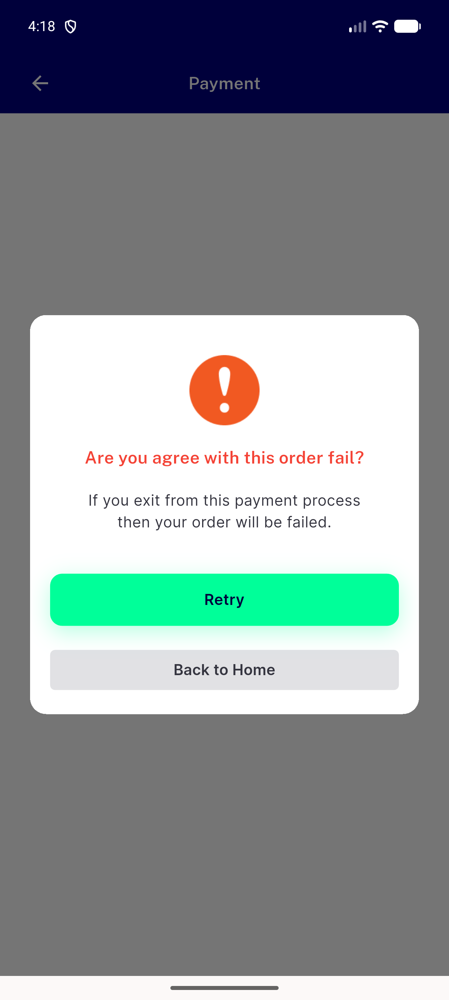</a> c5 verification on retry leave</td>
<td align="center" width="33%"><a href="c8a-basket-empty-after-adopt-flag0.png">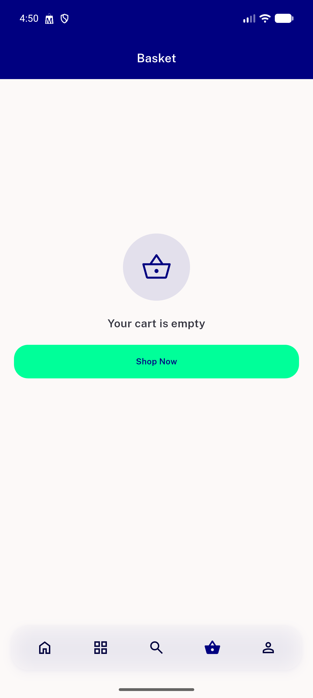</a> c8a basket empty after adopt flag0</td>
</tr>
<tr>
<td align="center" width="33%"> c8b basket empty after adopt flag1</td>
<td align="center" width="33%"><a href="d2-c12a-home-no-incomplete-sheet.png">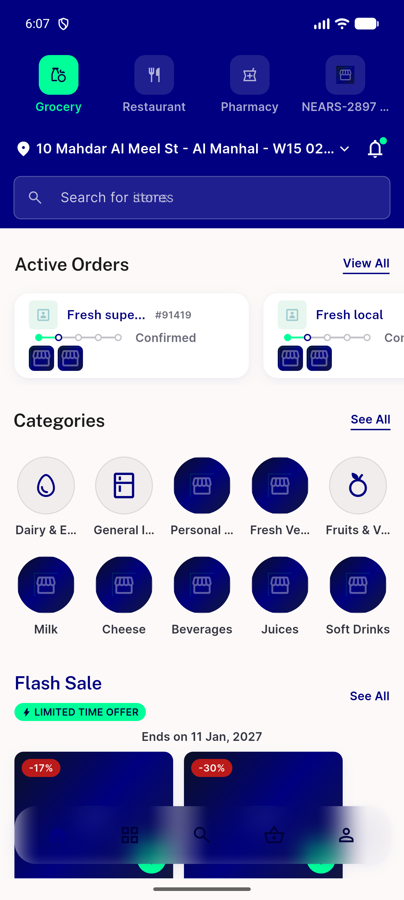</a> d2 c12a home no incomplete sheet</td>
<td align="center" width="33%"><a href="d2-c12a-lane-adopted-success-real-hook.png">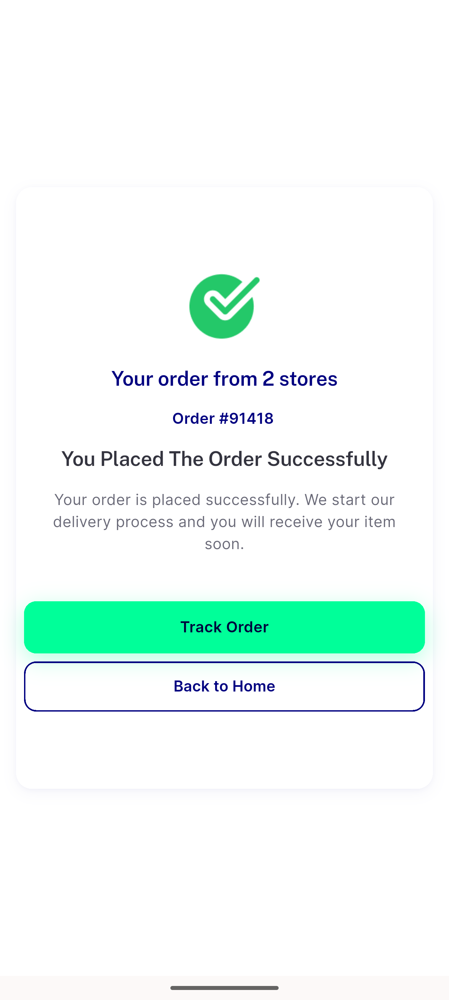</a> d2 c12a lane adopted success real hook</td>
</tr>
<tr>
<td align="center" width="33%"><a href="d2-c12a-my-orders-ongoing.png">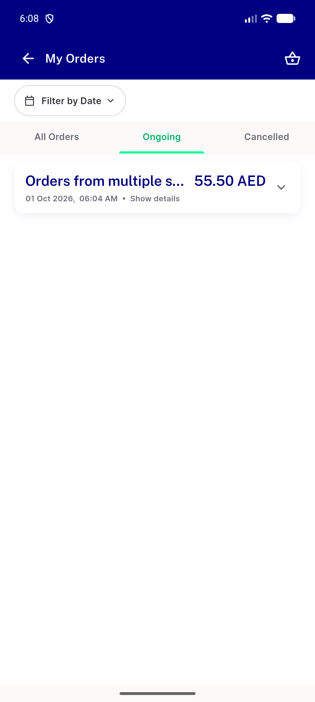</a> d2 c12a my orders ongoing</td>
<td align="center" width="33%"><a href="d2-c12a-my-orders.png">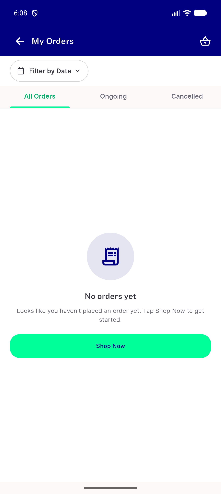</a> d2 c12a my orders</td>
<td align="center" width="33%"> d2 c12b control guest something went wrong real hook</td>
</tr>
<tr>
<td align="center" width="33%"><a href="d2-c12c-control-plain-guest-success-real-hook.png">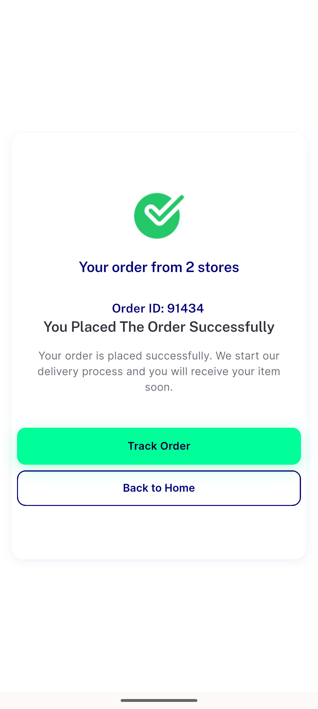</a> d2 c12c control plain guest success real hook</td>
<td align="center" width="33%"> d2 c12c lane plain guest success real hook</td>
<td align="center" width="33%"> d2 c12d lane loggedin success real hook</td>
</tr>
</table>

### Other artifacts
- [`automated-backstop.txt`](automated-backstop.txt)
- [`c0-before-defect.log`](c0-before-defect.log)
- [`c1-c4-after-recovery.log`](c1-c4-after-recovery.log)
- [`c10-unchanged-paths.log`](c10-unchanged-paths.log)
- [`c10d-cod-group-before-after.log`](c10d-cod-group-before-after.log)
- [`c11-arabic-failed-roster-a11y-dump.xml`](c11-arabic-failed-roster-a11y-dump.xml)
- [`c12a-lane-adopted-payment-success.log`](c12a-lane-adopted-payment-success.log)
- [`c12b-control-guest-payment-success.log`](c12b-control-guest-payment-success.log)
- [`c12c-control-plain-guest-payment-success.log`](c12c-control-plain-guest-payment-success.log)
- [`c12c-lane-plain-guest-payment-success.log`](c12c-lane-plain-guest-payment-success.log)
- [`c12d-lane-loggedin-payment-success.log`](c12d-lane-loggedin-payment-success.log)
- [`c12e-lane-adopted-payment-fail.log`](c12e-lane-adopted-payment-fail.log)
- [`c2-after-cancel.log`](c2-after-cancel.log)
- [`c4-failed-roster-a11y-dump.xml`](c4-failed-roster-a11y-dump.xml)
- [`c4b-locked-leave.log`](c4b-locked-leave.log)
- [`c5-verification-on.log`](c5-verification-on.log)
- [`c6-short-password.log`](c6-short-password.log)
- [`c7-analytics-fa.log`](c7-analytics-fa.log)
- [`c8-basket-empty-flag0-flag1.log`](c8-basket-empty-flag0-flag1.log)
- [`c9-ac6-negatives-and-positive-control.txt`](c9-ac6-negatives-and-positive-control.txt)
- [`c9b-ac6-second-group-with-owner-positive-controls.txt`](c9b-ac6-second-group-with-owner-positive-controls.txt)
- [`d2-c12a-lane-adopted-real-hook.log`](d2-c12a-lane-adopted-real-hook.log)
- [`d2-c12b-control-real-hook.log`](d2-c12b-control-real-hook.log)
- [`d2-c12c-control-plain-guest-real-hook.log`](d2-c12c-control-plain-guest-real-hook.log)
- [`d2-c12c-lane-plain-guest-real-hook.log`](d2-c12c-lane-plain-guest-real-hook.log)
- [`d2-c12d-lane-loggedin-real-hook.log`](d2-c12d-lane-loggedin-real-hook.log)
- [`progress.md`](progress.md)

---
*From `nears/docs/qa-evidence/NEARS-3956/` · public-repo scrub policy (no live secrets; verified clean).*
