# QA Evidence — NEARS-3958

**NEARS-3958 QA PASS - popup toasts drawn above dialog/sheet barrier (head) vs under it (base)**

**15 screenshot(s).** Click any thumbnail for full resolution.

<table>
<tr>
<td align="center" width="33%"><a href="ac1-base-paymentfaileddialog-single-switch-refusal-under-barrier.png">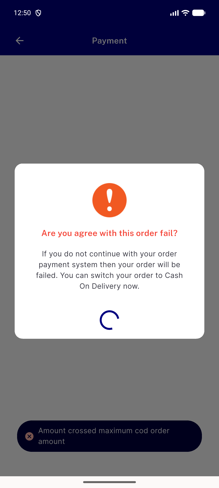</a> ac1 base paymentfaileddialog single switch refusal under barrier</td>
<td align="center" width="33%"><a href="ac1-head-group-dialog-3955-probe-toast-visible.png">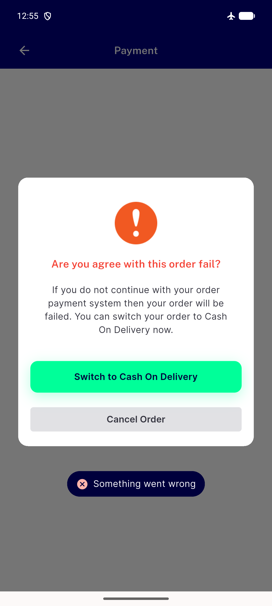</a> ac1 head group dialog 3955 probe toast visible</td>
<td align="center" width="33%"><a href="ac1-head-paymentfaileddialog-single-switch-refusal-visible.png">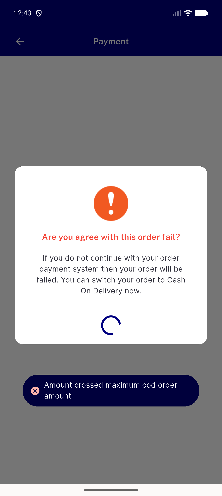</a> ac1 head paymentfaileddialog single switch refusal visible</td>
</tr>
<tr>
<td align="center" width="33%"><a href="ac2-base-confirm-sheet-refusal-toast-invisible.png">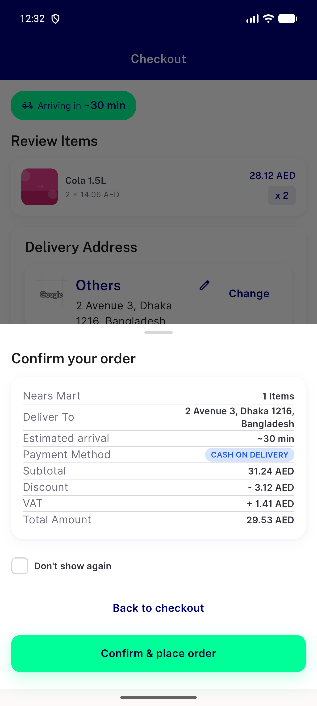</a> ac2 base confirm sheet refusal toast invisible</td>
<td align="center" width="33%"><a href="ac2-head-confirm-sheet-refusal-toast-visible.png">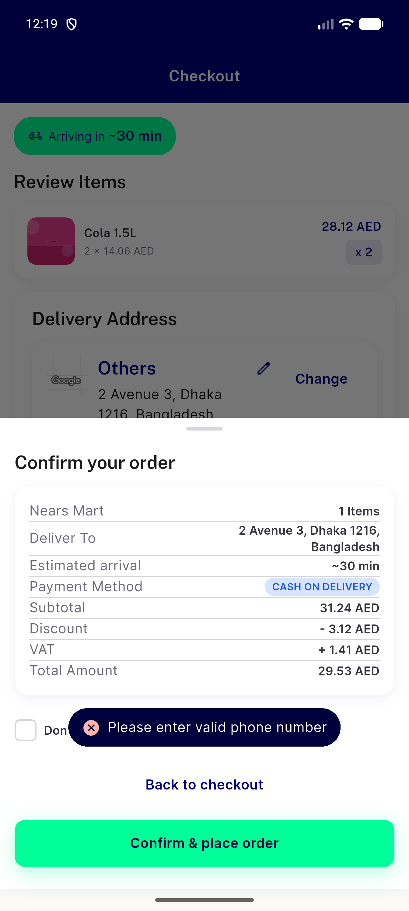</a> ac2 head confirm sheet refusal toast visible</td>
<td align="center" width="33%"><a href="ac3-head-no-popup-store-page-scaffoldmessenger-toast.png">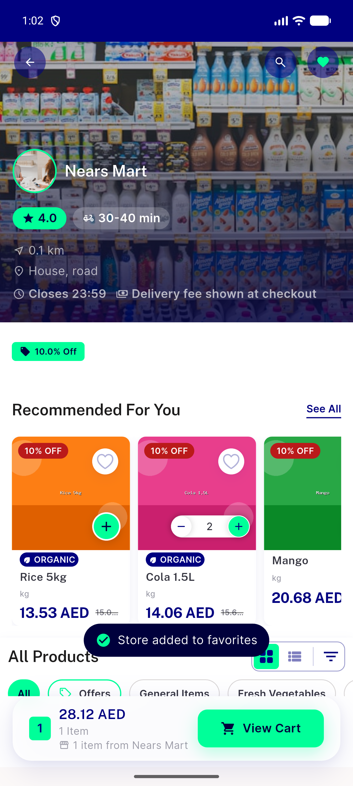</a> ac3 head no popup store page scaffoldmessenger toast</td>
</tr>
<tr>
<td align="center" width="33%"><a href="ac3-head-scaffoldless-nointernet-getx-fallback-toast.png">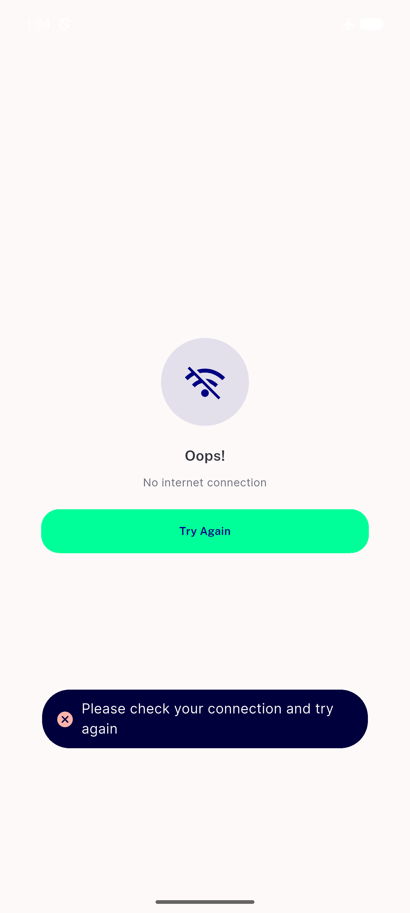</a> ac3 head scaffoldless nointernet getx fallback toast</td>
<td align="center" width="33%"><a href="ac3-head-small-healthy-basket-scaffoldmessenger-toast.png">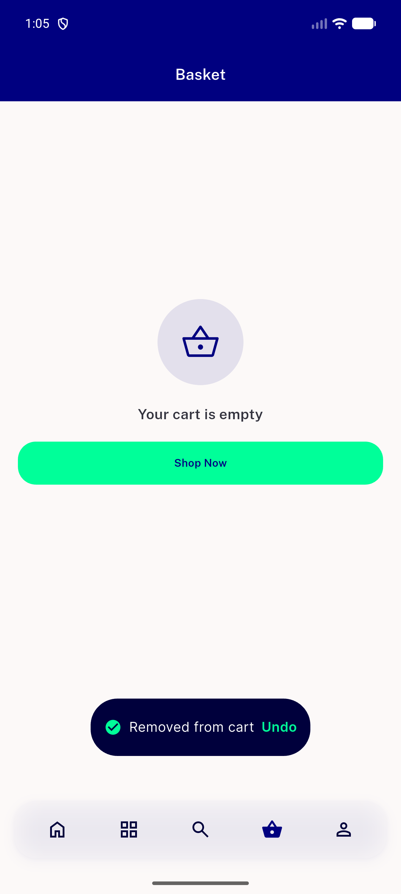</a> ac3 head small healthy basket scaffoldmessenger toast</td>
<td align="center" width="33%"><a href="extra-base-resume-sheet-switch-refusal-invisible.png">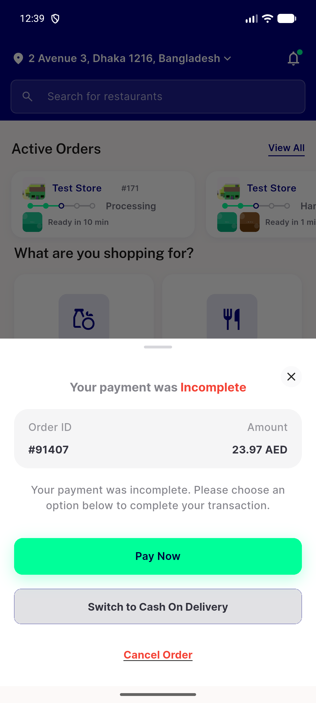</a> extra base resume sheet switch refusal invisible</td>
</tr>
<tr>
<td align="center" width="33%"><a href="extra-head-resume-sheet-switch-refusal-visible.png">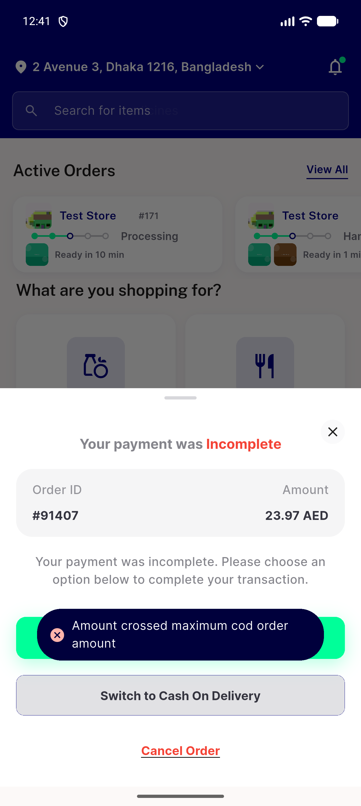</a> extra head resume sheet switch refusal visible</td>
<td align="center" width="33%"><a href="q10-head-rtl-arabic-popup-toast-centred.png">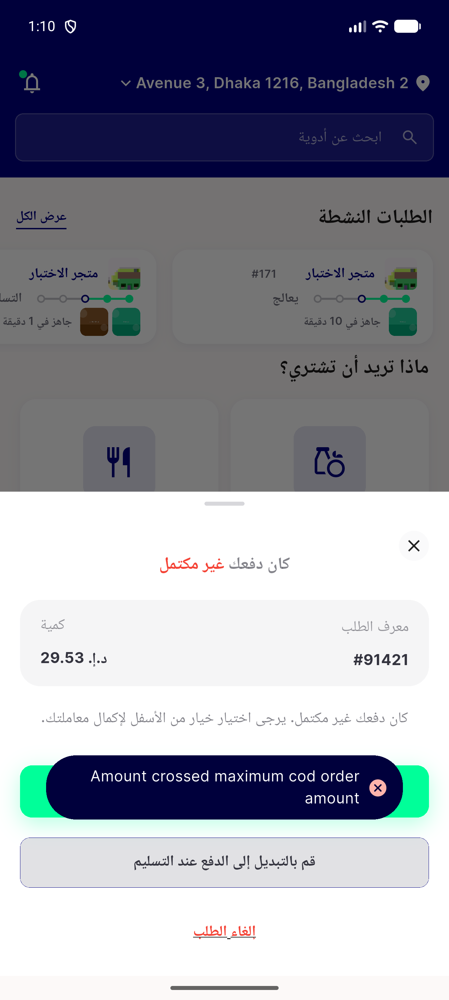</a> q10 head rtl arabic popup toast centred</td>
<td align="center" width="33%"><a href="q11-head-toast-above-keyboard-coupon-sheet.png">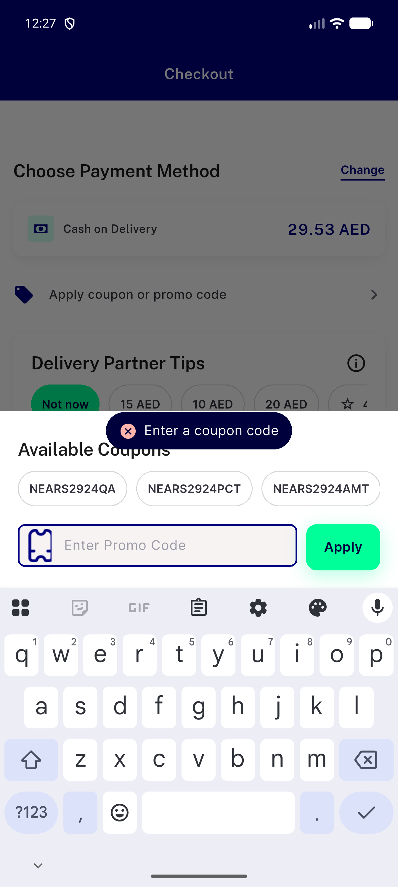</a> q11 head toast above keyboard coupon sheet</td>
</tr>
<tr>
<td align="center" width="33%"><a href="q6-head-address-sheet-use-my-location-unserviceable-toast.png">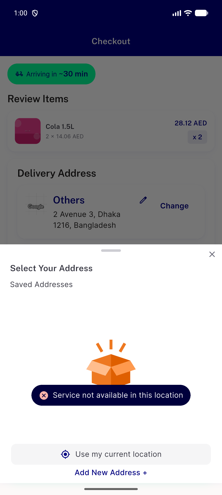</a> q6 head address sheet use my location unserviceable toast</td>
<td align="center" width="33%"><a href="q6-head-coupon-success-toast-after-sheet-closed.png">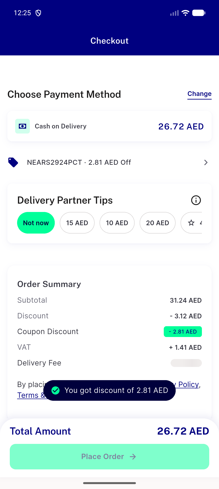</a> q6 head coupon success toast after sheet closed</td>
<td align="center" width="33%"><a href="q6-head-guest-use-my-location-loader-closed-toast-visible.png">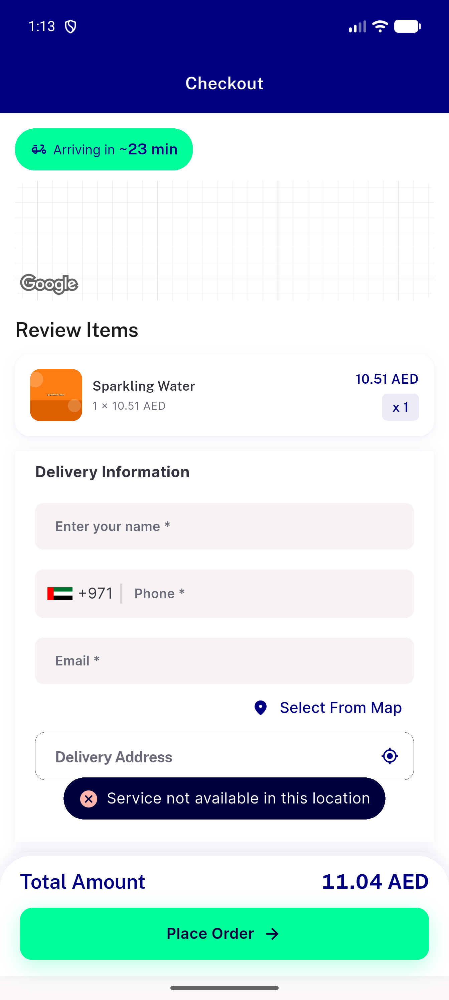</a> q6 head guest use my location loader closed toast visible</td>
</tr>
</table>

### Other artifacts
- [`progress.md`](progress.md)

---
*From `nears/docs/qa-evidence/NEARS-3958/` · public-repo scrub policy (no live secrets; verified clean).*
