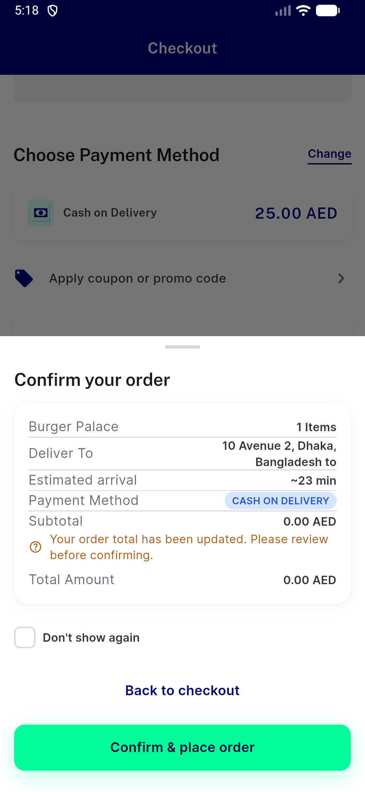
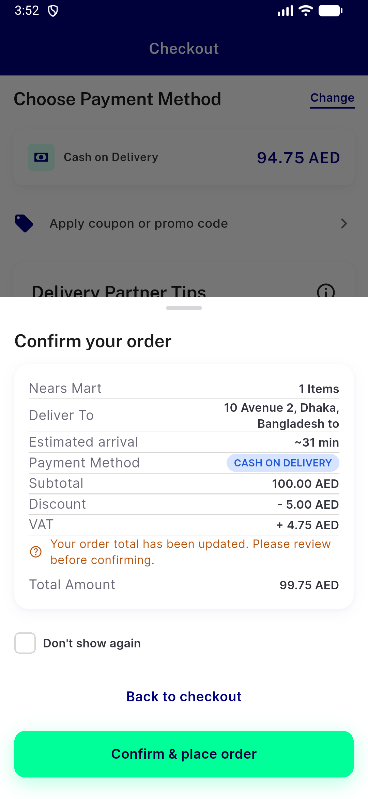
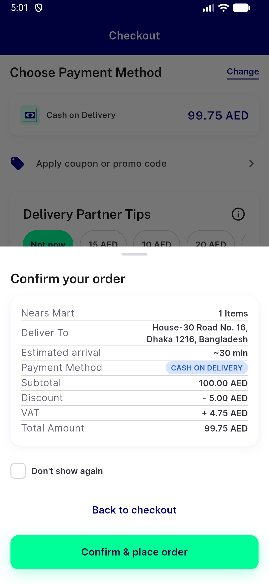
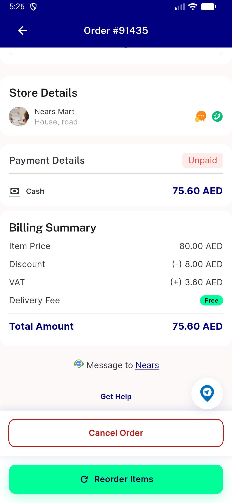

# QA Evidence — NEARS-3960

**NEARS-3960 routing cell 004: mixed basket + campaign quick-add - placed=false; group/validate refuses store 4 empty_cart; no Remove exit**

**4 screenshot(s).** Click any thumbnail for full resolution.

<table>
<tr>
<td align="center" width="33%"> bug campaign add wrong server row</td>
<td align="center" width="33%"> bug optimistic row cap drift</td>
<td align="center" width="33%"> c2 R1 confirm sheet</td>
</tr>
<tr>
<td align="center" width="33%"> c2 R6 order details 91435</td>
</tr>
</table>

### Other artifacts
- [`ac3-diff-ddd578e8b..0cc129423-UserApp-lib.patch`](ac3-diff-ddd578e8b..0cc129423-UserApp-lib.patch)
- [`bug-basket-summary-vs-checkout.log`](bug-basket-summary-vs-checkout.log)
- [`bug-campaign-add-wrong-server-row.log`](bug-campaign-add-wrong-server-row.log)
- [`bug-optimistic-row-cap-drift.log`](bug-optimistic-row-cap-drift.log)
- [`bug-search-rendertable-semantics.log`](bug-search-rendertable-semantics.log)
- [`cell004`](cell004)
- [`cycle2`](cycle2)
- [`flutter-test-cycle2.log`](flutter-test-cycle2.log)
- [`flutter-test-pricing_service_checkout.log`](flutter-test-pricing_service_checkout.log)
- [`progress.md`](progress.md)
- [`seed-nears_qa_3960.sql`](seed-nears_qa_3960.sql)

---
*From `nears/docs/qa-evidence/NEARS-3960/` · public-repo scrub policy (no live secrets; verified clean).*
