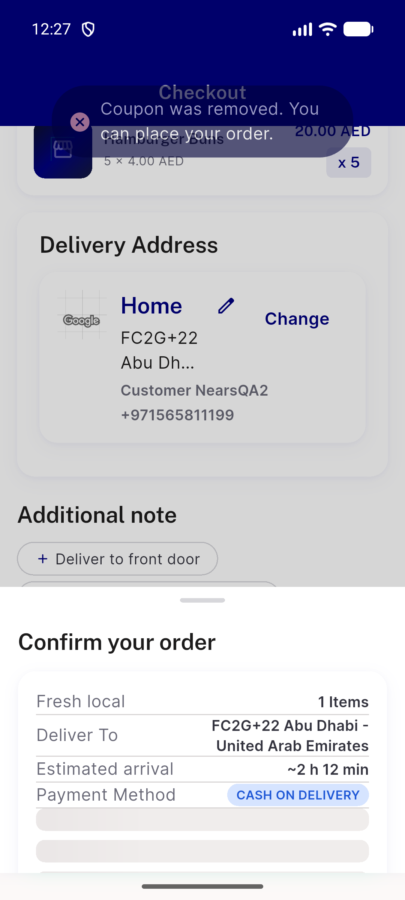
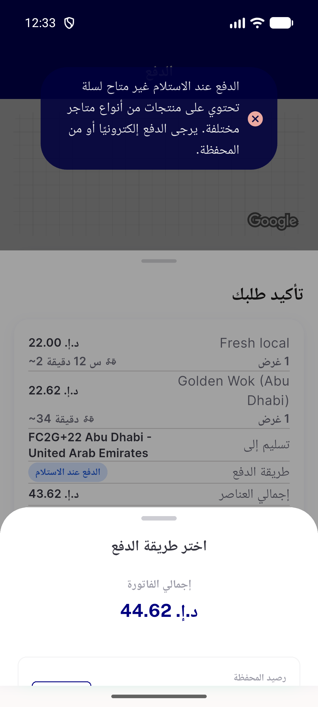
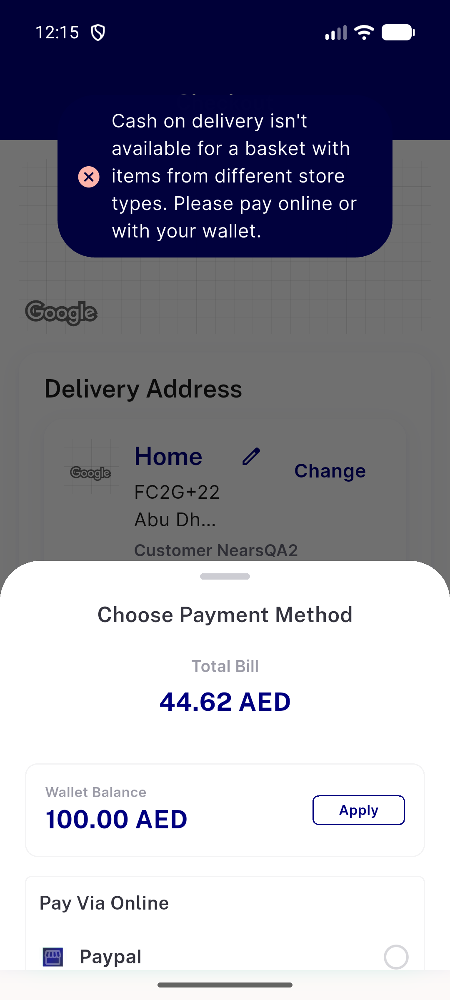
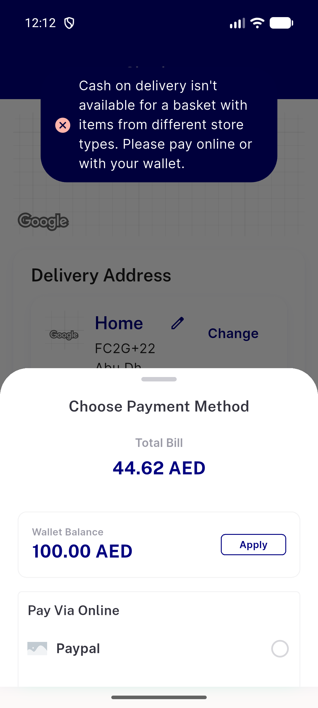
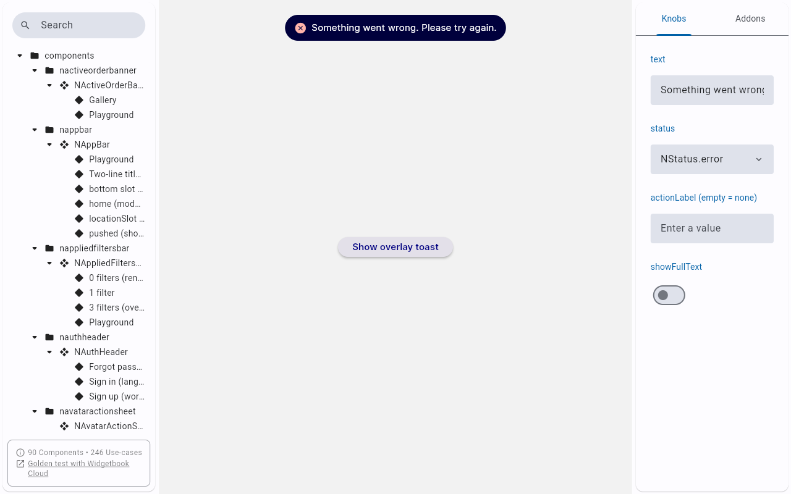

# QA Evidence — NEARS-3962

**QA PASS head 22bf24227 vs base ff4fea929: NSnackBar.showOverlay geometry byte-identical (pill [138,228][942,618] both), hit-area parity, re-check A/B, FIFO, AR**

**6 screenshot(s).** Click any thumbnail for full resolution.

<table>
<tr>
<td align="center" width="33%"> ac fifo head two error toasts over coupon sheet single pill</td>
<td align="center" width="33%"> ac recheckA head coupon removed notice over forced confirm sheet</td>
<td align="center" width="33%"> ac rtl head ar 360dp toast symmetric 46dp</td>
</tr>
<tr>
<td align="center" width="33%"> ac1 after head 22bf24227 360dp toast over method sheet</td>
<td align="center" width="33%"> ac1 before base ff4fea929 360dp toast over method sheet</td>
<td align="center" width="33%"> ac7 widgetbook overlay popup story toast top anchored</td>
</tr>
</table>

### Other artifacts
- [`ac-recheckA-head-t0-dump.xml`](ac-recheckA-head-t0-dump.xml)
- [`ac-rtl-head-t0-dump.xml`](ac-rtl-head-t0-dump.xml)
- [`ac1-after-head-t0-dump.xml`](ac1-after-head-t0-dump.xml)
- [`ac1-before-base-t0-dump.xml`](ac1-before-base-t0-dump.xml)
- [`app-log-head-and-base-flutter-logcat.log`](app-log-head-and-base-flutter-logcat.log)
- [`hit-base-below-pill-after-dump.xml`](hit-base-below-pill-after-dump.xml)
- [`hit-base-margin-after-dump.xml`](hit-base-margin-after-dump.xml)
- [`hit-base-pill-tap-then-swipe-after-dump.xml`](hit-base-pill-tap-then-swipe-after-dump.xml)
- [`hit-head-below-pill-after-dump.xml`](hit-head-below-pill-after-dump.xml)
- [`hit-head-margin-after-dump.xml`](hit-head-margin-after-dump.xml)
- [`hit-head-pill-tap-then-swipe-after-dump.xml`](hit-head-pill-tap-then-swipe-after-dump.xml)
- [`hit-head-wallet-apply-then-leftswipe-after-dump.xml`](hit-head-wallet-apply-then-leftswipe-after-dump.xml)
- [`progress.md`](progress.md)
- [`test-dls-n_snackbar_test.log`](test-dls-n_snackbar_test.log)

---
*From `nears/docs/qa-evidence/NEARS-3962/` · public-repo scrub policy (no live secrets; verified clean).*
