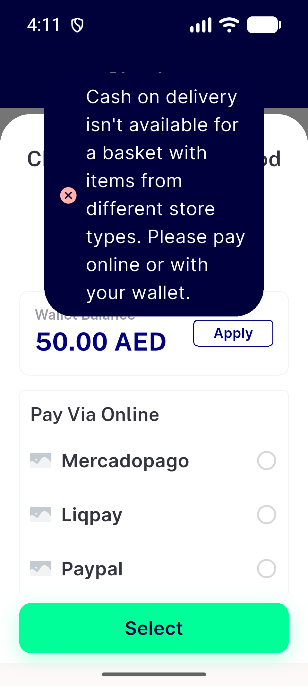
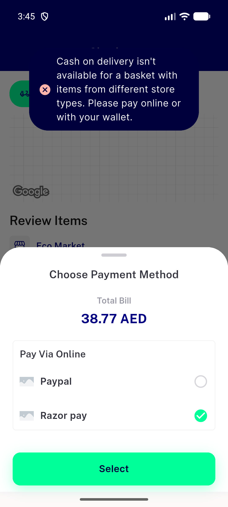
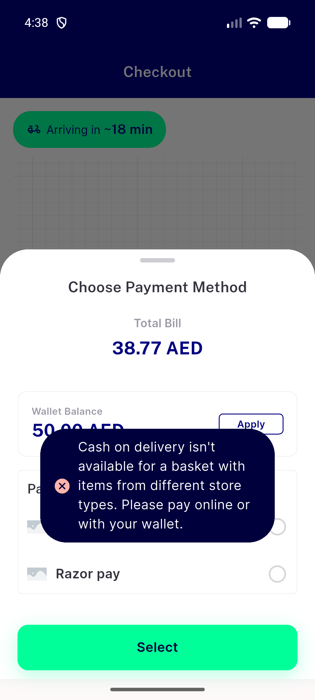
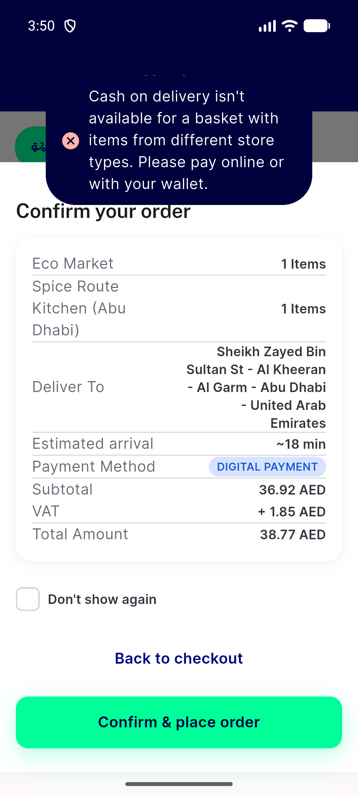
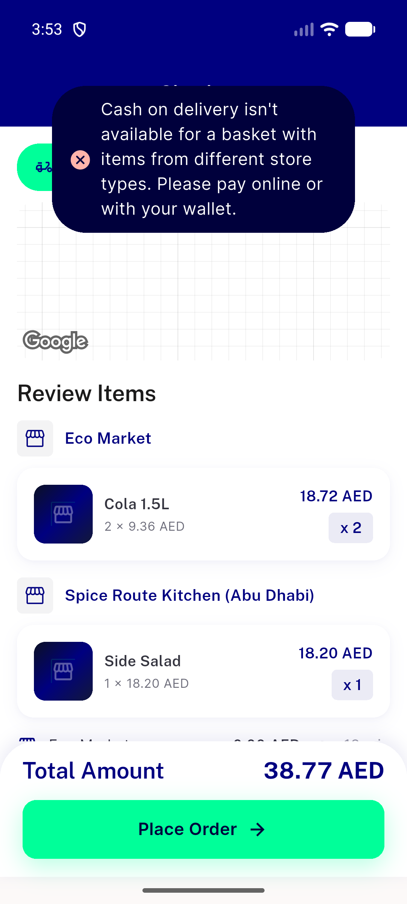
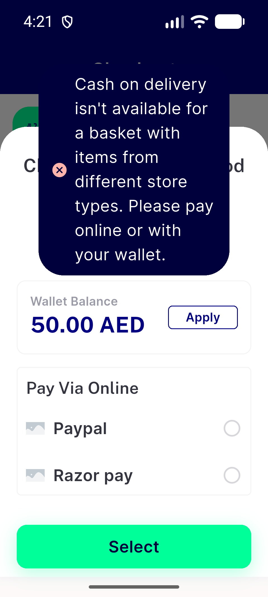
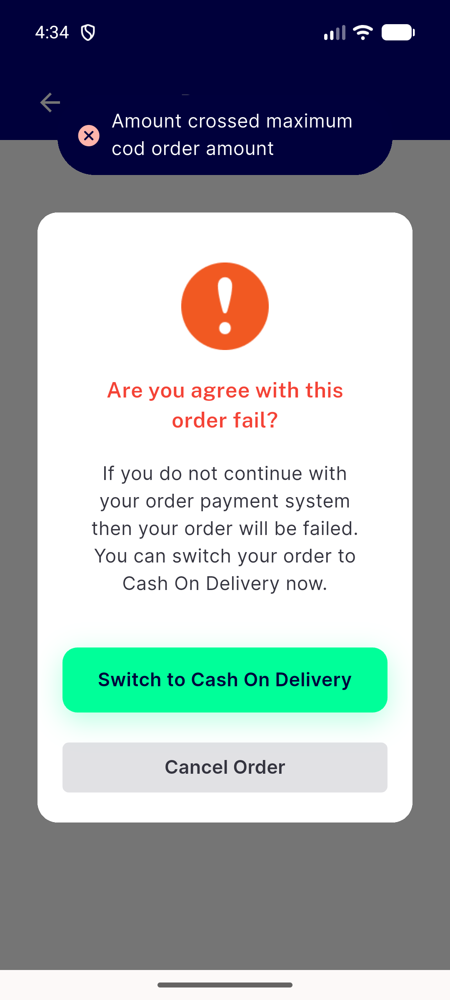
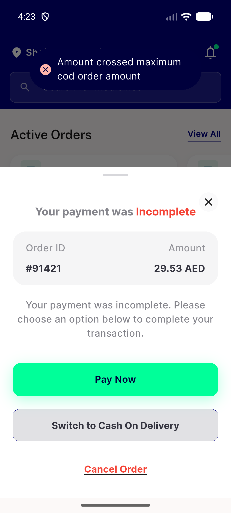

# QA Evidence — NEARS-3967

**FAIL @13d61c074 - AC1/AC2/AC3 PASS; required cell C5 FAIL: popup toast hit box covers wallet Apply at 320dp x1.3 EN**

**10 screenshot(s).** Click any thumbnail for full resolution.

<table>
<tr>
<td align="center" width="33%"> bug popup toast hitbox covers wallet apply tall sheet</td>
<td align="center" width="33%"> c1 head 360dp toast over method sheet rows tappable</td>
<td align="center" width="33%"> c2 base 360dp getx toast absorbs rows and select</td>
</tr>
<tr>
<td align="center" width="33%"> c3 head 360dp place order opens confirm sheet during toast</td>
<td align="center" width="33%"> c4 head 360dp barrier tap dismissed sheet toast stays</td>
<td align="center" width="33%"> c5 head 320dp 1.3x 2gw wallet apply centre absorbed</td>
</tr>
<tr>
<td align="center" width="33%"> c6 head ar 320dp 1.3x toast over tall method sheet</td>
<td align="center" width="33%"> c8 head coupon sheet keyboard up toast top field apply clear</td>
<td align="center" width="33%"> c8 head paymentfaileddialog cod cap toast top above barrier</td>
</tr>
<tr>
<td align="center" width="33%"> c8 head resume sheet cod cap toast top above barrier</td>
</tr>
</table>

### Other artifacts
- [`bug-popup-toast-hitbox-covers-wallet-apply-tall-sheet.log`](bug-popup-toast-hitbox-covers-wallet-apply-tall-sheet.log)
- [`progress.md`](progress.md)

---
*From `nears/docs/qa-evidence/NEARS-3967/` · public-repo scrub policy (no live secrets; verified clean).*
