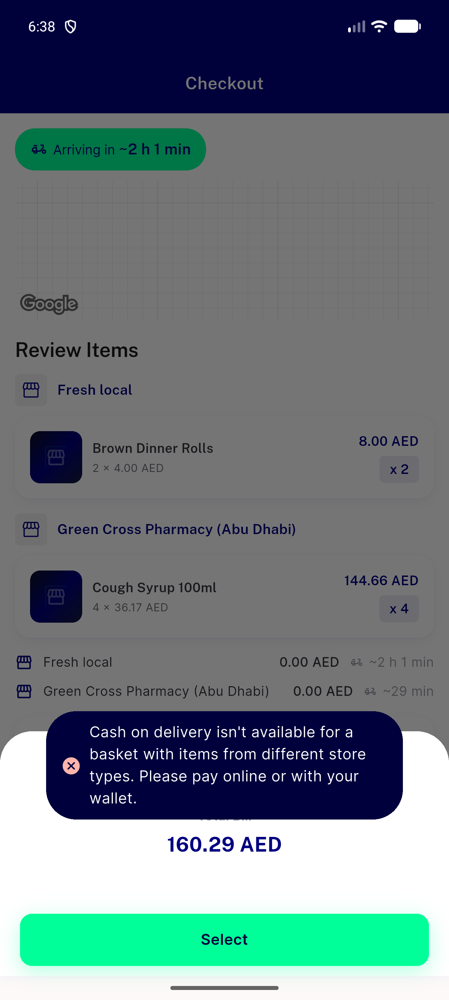
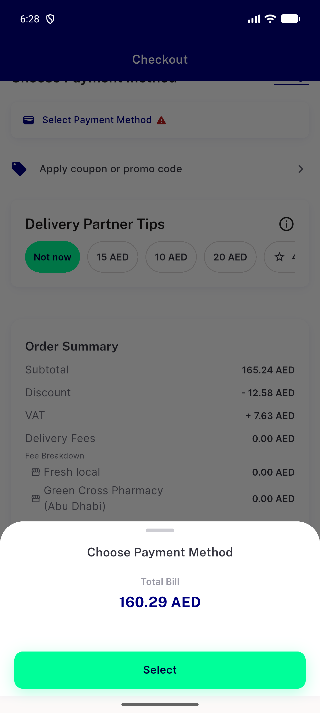
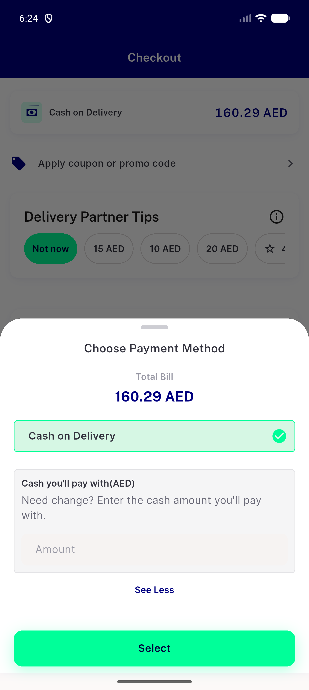
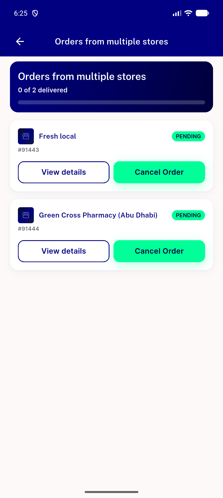
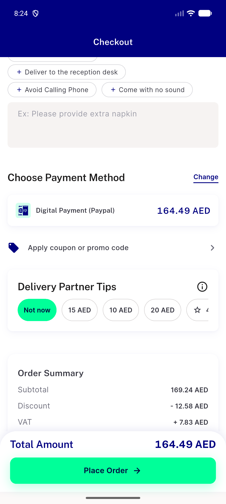
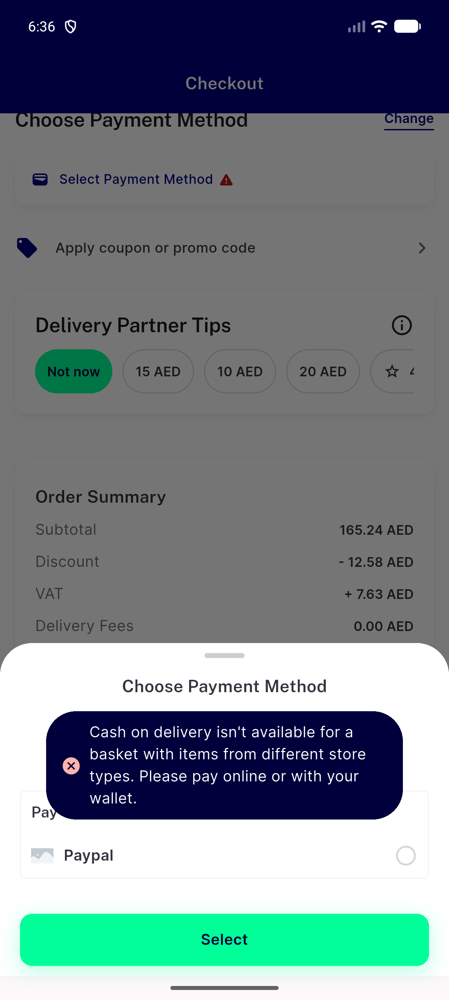

# QA Evidence — NEARS-3969

**NEARS-3969 [8] delta re-QA cycle 1: FAIL (AC5 Place-time 403 FAIL lines); stale heal/unhealed/reverse/re-entry/wallet PASS**

**7 screenshot(s).** Click any thumbnail for full resolution.

<table>
<tr>
<td align="center" width="33%"> bug narrowingN handleMixedBasketRejection zero row sheet</td>
<td align="center" width="33%"> bug stale config change opens zero row sheet</td>
<td align="center" width="33%"> cellA payment sheet cash row</td>
</tr>
<tr>
<td align="center" width="33%"> cellA placed 2 cod children</td>
<td align="center" width="33%"> cellB payment sheet paypal row no cash</td>
<td align="center" width="33%"> delta heal payment section paypal selected</td>
</tr>
<tr>
<td align="center" width="33%"> regr3967 cash refusal toast and sheet</td>
</tr>
</table>

### Other artifacts
- [`bug-delta-cart-stale-blocks-proceed-a11y-dump.xml`](bug-delta-cart-stale-blocks-proceed-a11y-dump.xml)
- [`bug-delta-cart-stale-blocks-proceed.log`](bug-delta-cart-stale-blocks-proceed.log)
- [`bug-delta-placetime403-doubled-validate-fail.log`](bug-delta-placetime403-doubled-validate-fail.log)
- [`bug-delta-placetime403-transient-section-fail.log`](bug-delta-placetime403-transient-section-fail.log)
- [`bug-narrowingN-loop-no-fail.log`](bug-narrowingN-loop-no-fail.log)
- [`bug-stale-config-place-confirm-zero-row-sheet-loop.log`](bug-stale-config-place-confirm-zero-row-sheet-loop.log)
- [`cellA-no-gateway-cod-split.log`](cellA-no-gateway-cod-split.log)
- [`cellA-payment-sheet-a11y-dump.xml`](cellA-payment-sheet-a11y-dump.xml)
- [`cellB-cellC-api.log`](cellB-cellC-api.log)
- [`cellB-payment-sheet-gateway-rows-a11y-dump.xml`](cellB-payment-sheet-gateway-rows-a11y-dump.xml)
- [`cellC-payment-incomplete-no-gateway-switch-to-cod-a11y-dump.xml`](cellC-payment-incomplete-no-gateway-switch-to-cod-a11y-dump.xml)
- [`cellD-same-module-unchanged.log`](cellD-same-module-unchanged.log)
- [`cellE-flag-off-unchanged.log`](cellE-flag-off-unchanged.log)
- [`delta-cellA-smoke.log`](delta-cellA-smoke.log)
- [`delta-cellD-same-module.log`](delta-cellD-same-module.log)
- [`delta-flag-off.log`](delta-flag-off.log)
- [`delta-heal-change-sheet-paypal-a11y-dump.xml`](delta-heal-change-sheet-paypal-a11y-dump.xml)
- [`delta-heal-payment-section-a11y-dump.xml`](delta-heal-payment-section-a11y-dump.xml)
- [`delta-partial-wallet-applied-sheet-a11y-dump.xml`](delta-partial-wallet-applied-sheet-a11y-dump.xml)
- [`delta-regr3967-consistent.log`](delta-regr3967-consistent.log)
- [`delta-reverse-stale-change-sheet-a11y-dump.xml`](delta-reverse-stale-change-sheet-a11y-dump.xml)
- [`delta-reverse-stale.log`](delta-reverse-stale.log)
- [`delta-stale-heal.log`](delta-stale-heal.log)
- [`delta-stale-place403-healed.log`](delta-stale-place403-healed.log)
- [`delta-stale-place403-unhealed.log`](delta-stale-place403-unhealed.log)
- [`delta-stale-unhealed.log`](delta-stale-unhealed.log)
- [`delta-unhealed-no-method-row-a11y-dump.xml`](delta-unhealed-no-method-row-a11y-dump.xml)
- [`delta-wallet-covers-place-sheet-a11y-dump.xml`](delta-wallet-covers-place-sheet-a11y-dump.xml)
- [`delta-wallet-partial.log`](delta-wallet-partial.log)
- [`narrowingN-rejection-sheet-a11y-dump.xml`](narrowingN-rejection-sheet-a11y-dump.xml)
- [`progress.md`](progress.md)
- [`regr3846-payment-incomplete-gateway-active-a11y-dump.xml`](regr3846-payment-incomplete-gateway-active-a11y-dump.xml)
- [`regr3967-cash-refusal-sheet.log`](regr3967-cash-refusal-sheet.log)
- [`stale-after-confirm-1-a11y-dump.xml`](stale-after-confirm-1-a11y-dump.xml)
- [`stale-change-sheet-a11y-dump.xml`](stale-change-sheet-a11y-dump.xml)
- [`stale-checkout-payment-section-a11y-dump.xml`](stale-checkout-payment-section-a11y-dump.xml)

---
*From `nears/docs/qa-evidence/NEARS-3969/` · public-repo scrub policy (no live secrets; verified clean).*
