# QA Evidence — NEARS-397

**PASS — Home marketplace reskin: 4 modules (grocery/food/pharmacy live, shop env-gated), bottom-nav FILL, closed-store grayscale, NEARS-340 safe, RTL+dark, 876 tests green**

**17 screenshot(s).** Click any thumbnail for full resolution.

<table>
<tr>
<td align="center" width="33%"><a href="01-sector-picker-rtl.png">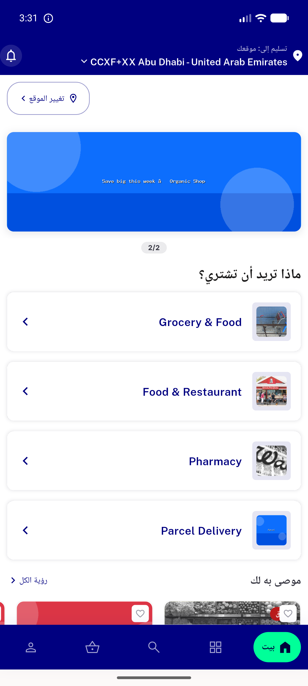</a> sector picker rtl</td>
<td align="center" width="33%"><a href="02-grocery-module-rtl.png">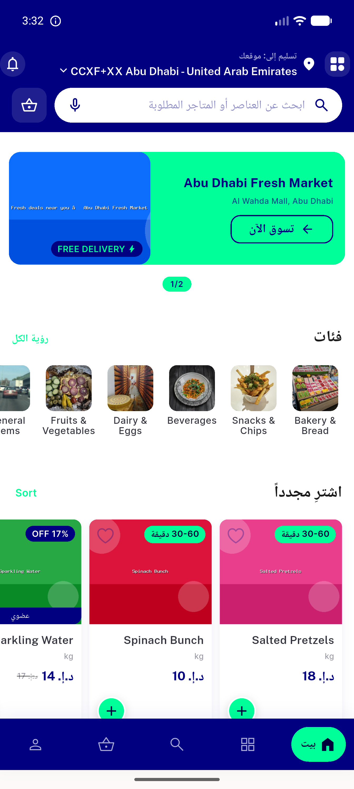</a> grocery module rtl</td>
<td align="center" width="33%"><a href="03-settings-dark.png">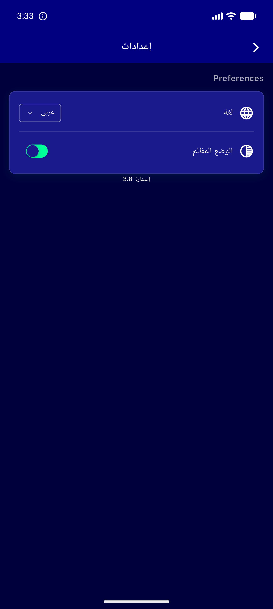</a> settings dark</td>
</tr>
<tr>
<td align="center" width="33%"><a href="04-grocery-home-dark-en.png">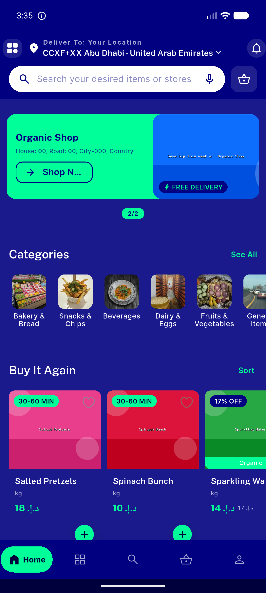</a> grocery home dark en</td>
<td align="center" width="33%"><a href="05-grocery-home-light-en.png">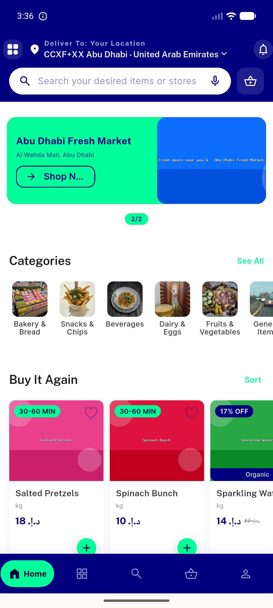</a> grocery home light en</td>
<td align="center" width="33%"><a href="06-sector-picker-light-en.png">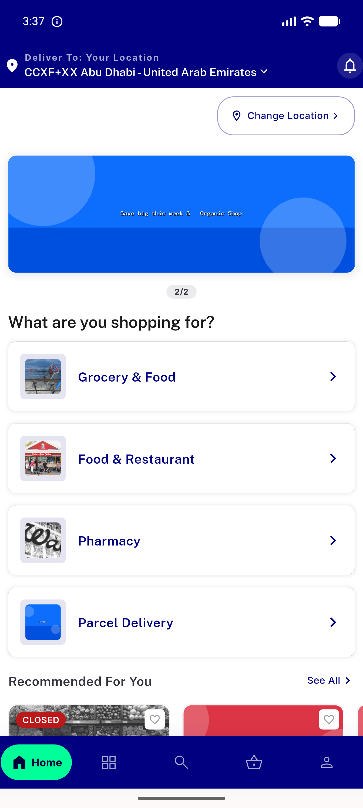</a> sector picker light en</td>
</tr>
<tr>
<td align="center" width="33%"><a href="07-food-module-top.png">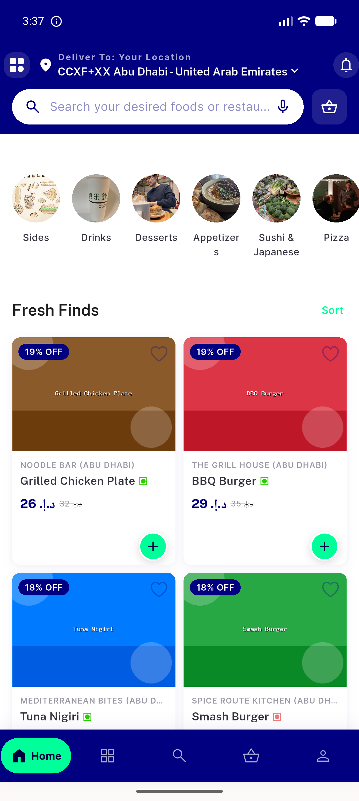</a> food module top</td>
<td align="center" width="33%"><a href="08-food-allstores-filters.png">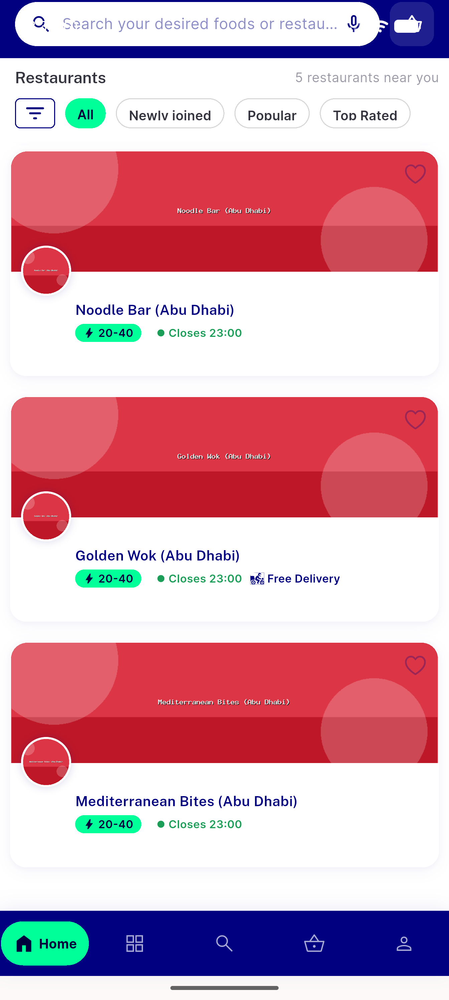</a> food allstores filters</td>
<td align="center" width="33%"><a href="09-pull-to-refresh.png">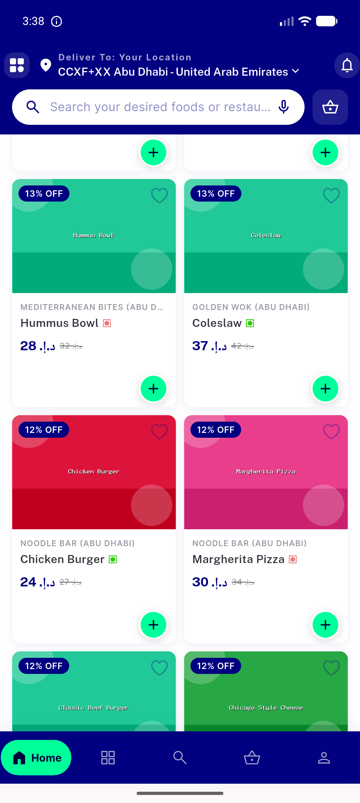</a> pull to refresh</td>
</tr>
<tr>
<td align="center" width="33%"><a href="10-pharmacy-closed-store.png">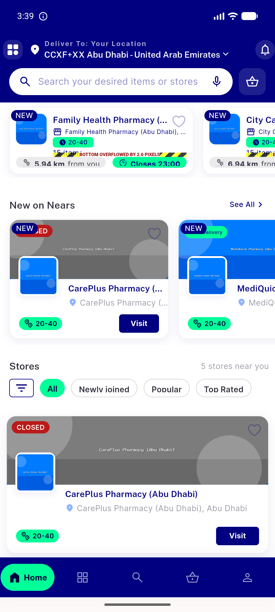</a> pharmacy closed store</td>
<td align="center" width="33%"><a href="11-pharmacy-top.png">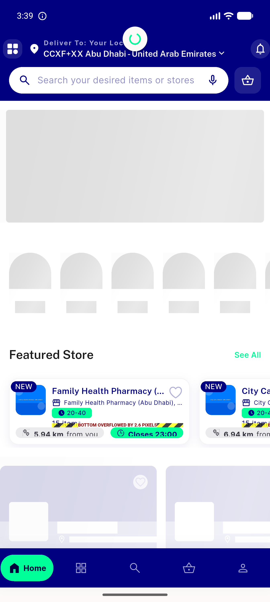</a> pharmacy top</td>
<td align="center" width="33%"><a href="12-tab-categories.png">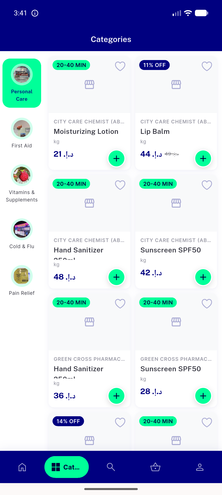</a> tab categories</td>
</tr>
<tr>
<td align="center" width="33%"><a href="13-tab-search.png">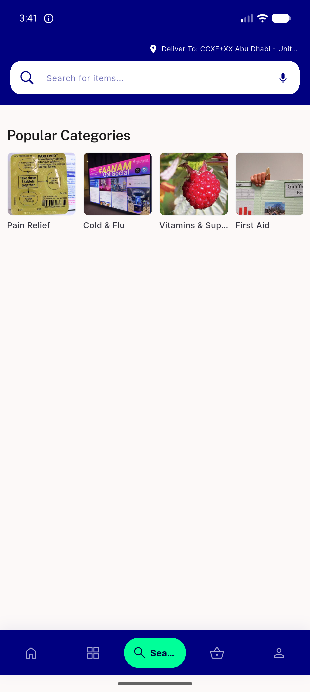</a> tab search</td>
<td align="center" width="33%"><a href="14-tab-basket.png">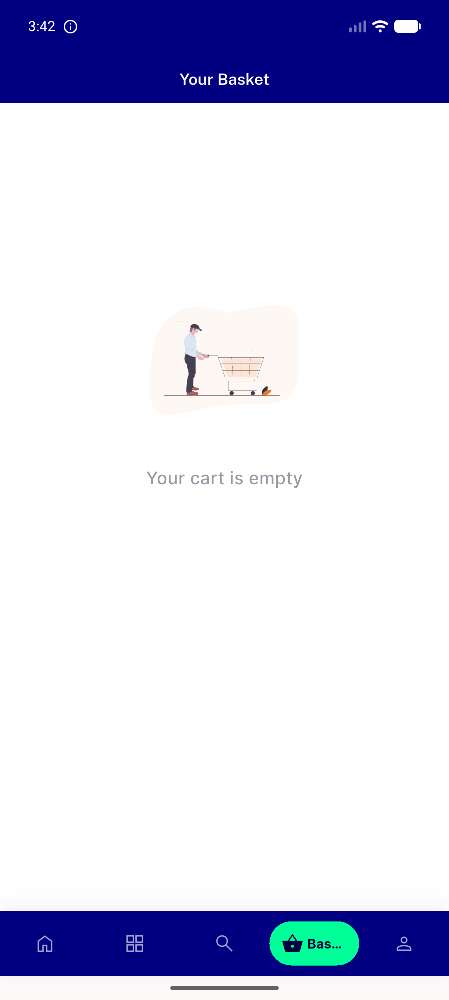</a> tab basket</td>
<td align="center" width="33%"><a href="15-tab-profile.png">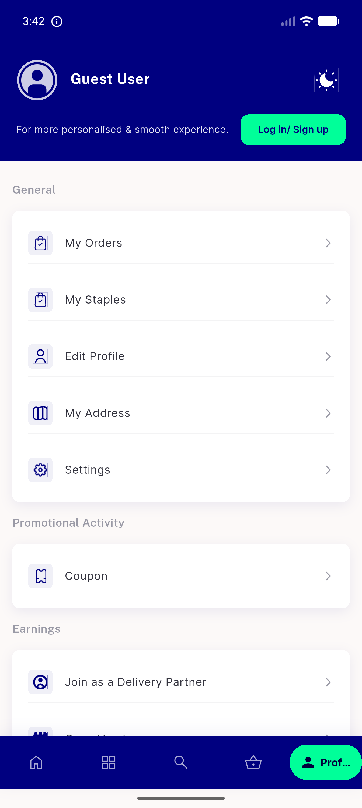</a> tab profile</td>
</tr>
<tr>
<td align="center" width="33%"><a href="16-store-detail.png">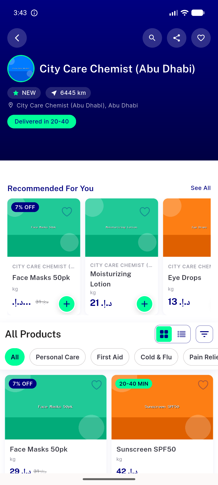</a> store detail</td>
<td align="center" width="33%"><a href="17-search-results.png">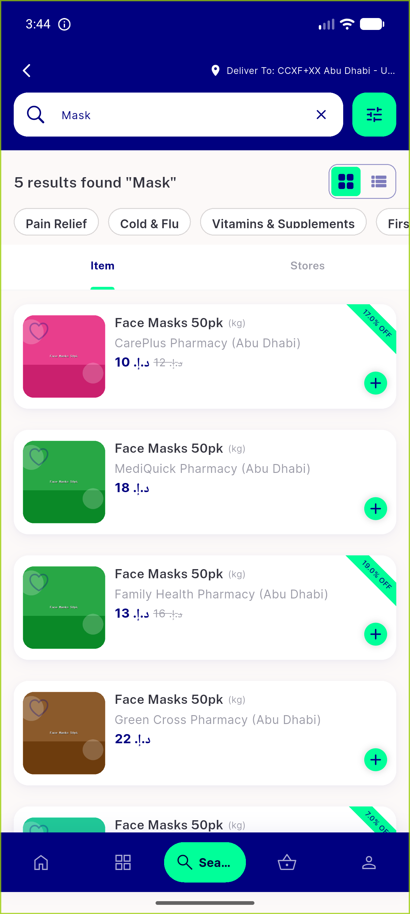</a> search results</td>
</tr>
</table>

### Other artifacts
- [`progress.md`](progress.md)

---
*From `nears/docs/qa-evidence/NEARS-397/` · public-repo scrub policy (no live secrets; verified clean).*
