# QA Evidence — NEARS-397

**verify**

**36 screenshot(s).** Click any thumbnail for full resolution.

<table>
<tr>
<td align="center" width="33%"><a href="00-location-selector.png">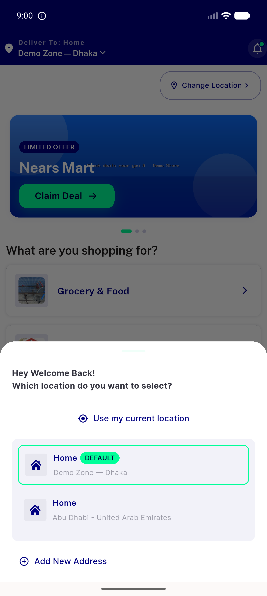</a> location selector</td>
<td align="center" width="33%"><a href="01-module-dashboard-banner-hero.png">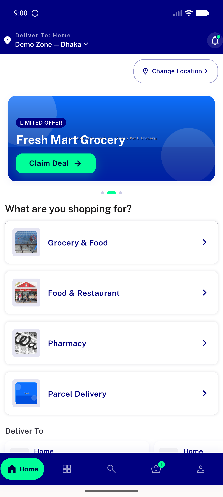</a> module dashboard banner hero</td>
<td align="center" width="33%"> sector picker rtl</td>
</tr>
<tr>
<td align="center" width="33%"><a href="02-before-claimdeal-tap.png">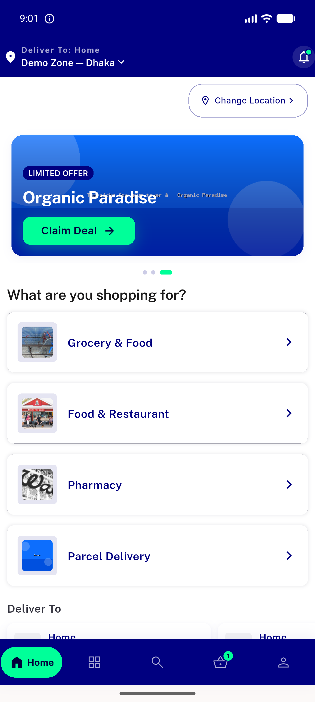</a> before claimdeal tap</td>
<td align="center" width="33%"> grocery module rtl</td>
<td align="center" width="33%"><a href="03-hero-tap-store-screen.png">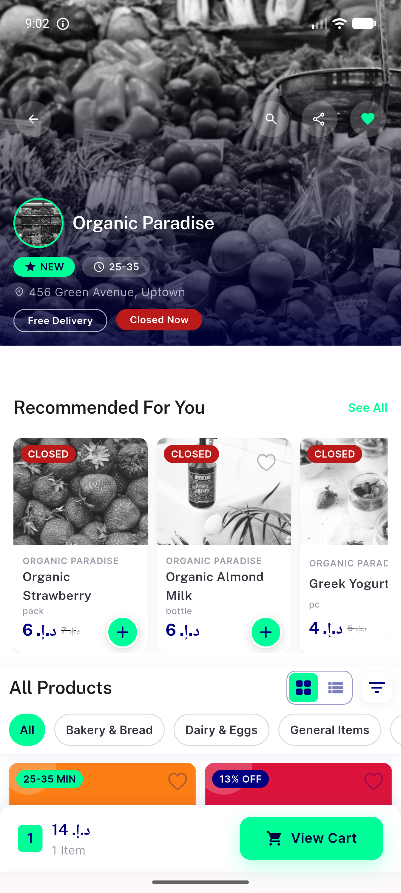</a> hero tap store screen</td>
</tr>
<tr>
<td align="center" width="33%"> settings dark</td>
<td align="center" width="33%"> grocery home dark en</td>
<td align="center" width="33%"><a href="04-grocery-home-top.png">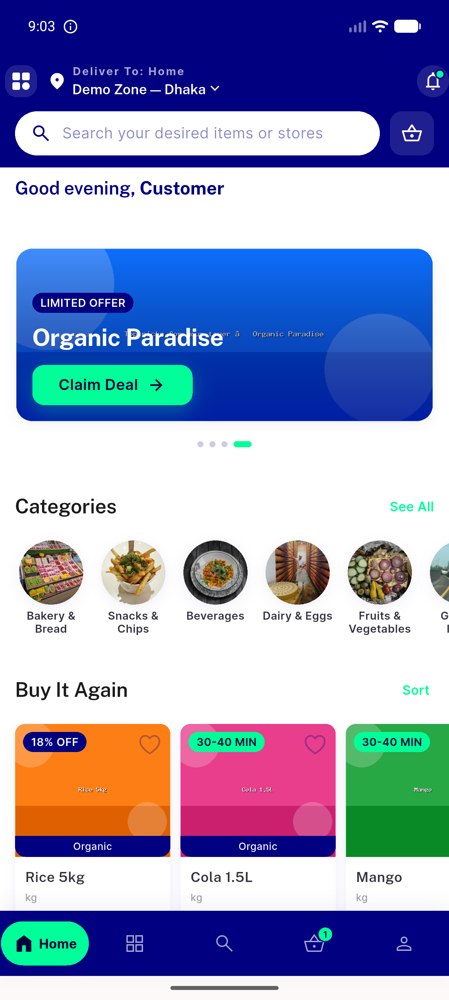</a> grocery home top</td>
</tr>
<tr>
<td align="center" width="33%"> grocery category chips</td>
<td align="center" width="33%"> grocery home light en</td>
<td align="center" width="33%"> flash sale live countdown</td>
</tr>
<tr>
<td align="center" width="33%"> sector picker light en</td>
<td align="center" width="33%"><a href="07-flash-add-to-cart.png">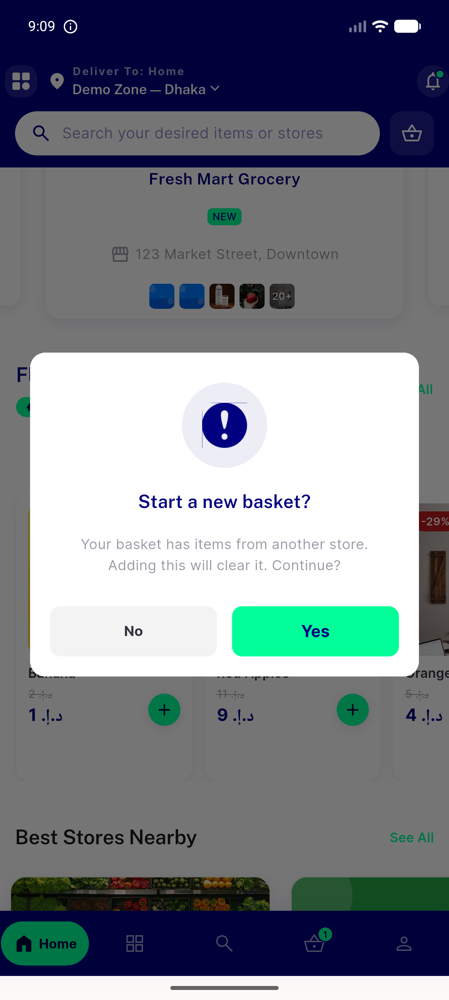</a> flash add to cart</td>
<td align="center" width="33%"> food module top</td>
</tr>
<tr>
<td align="center" width="33%"> flash stepper and store rail</td>
<td align="center" width="33%"> food allstores filters</td>
<td align="center" width="33%"><a href="09-featured-stores-card.png">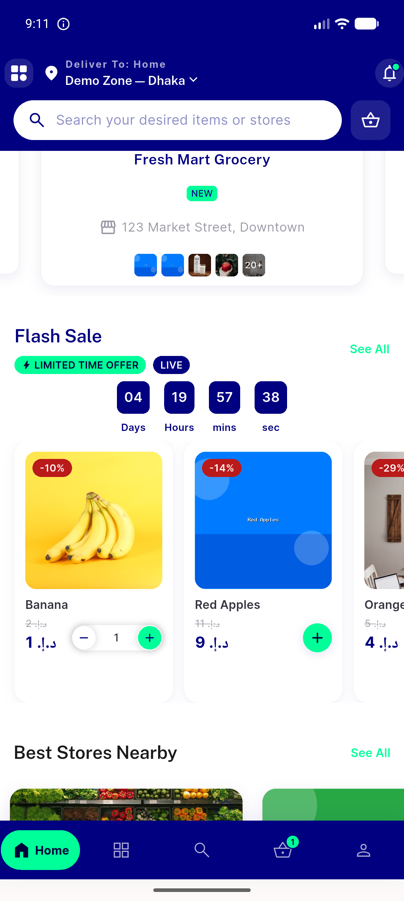</a> featured stores card</td>
</tr>
<tr>
<td align="center" width="33%"> pull to refresh</td>
<td align="center" width="33%"><a href="10-allstore-list-cards.png">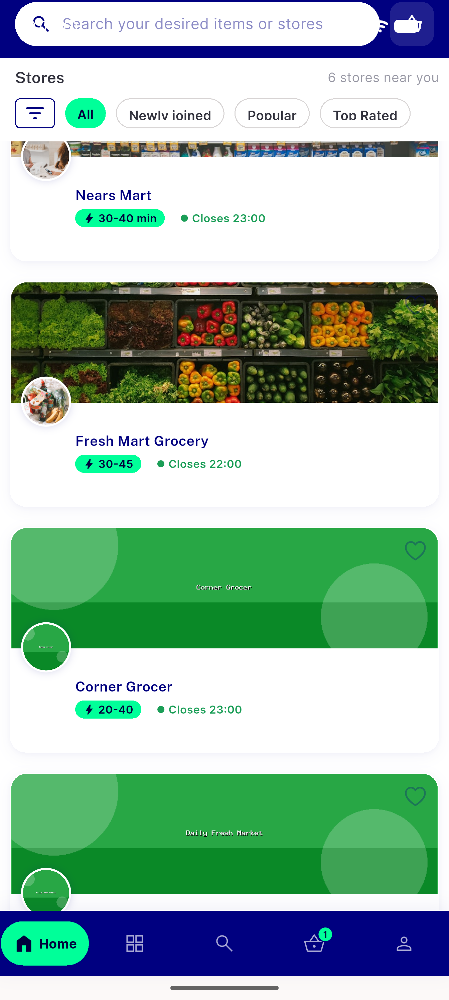</a> allstore list cards</td>
<td align="center" width="33%"> pharmacy closed store</td>
</tr>
<tr>
<td align="center" width="33%"><a href="11-pharmacy-home-banner-chips.png">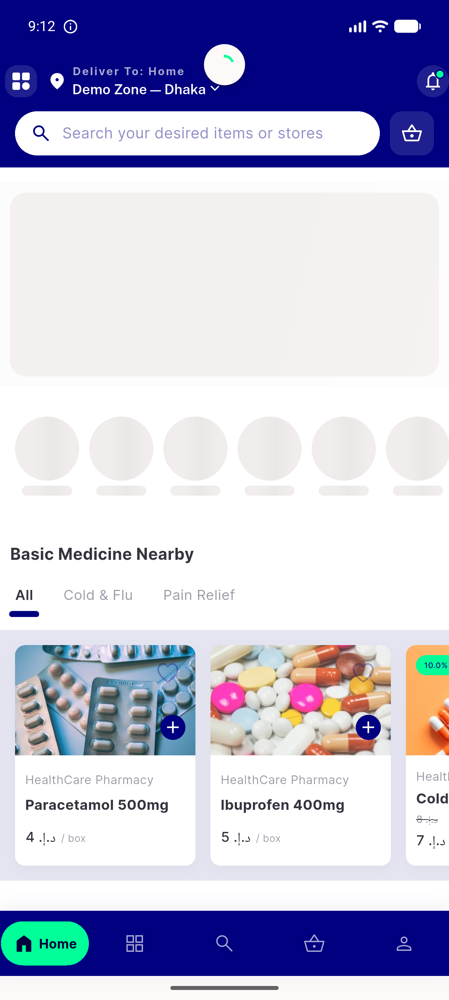</a> pharmacy home banner chips</td>
<td align="center" width="33%"> pharmacy top</td>
<td align="center" width="33%"><a href="12-food-home.png">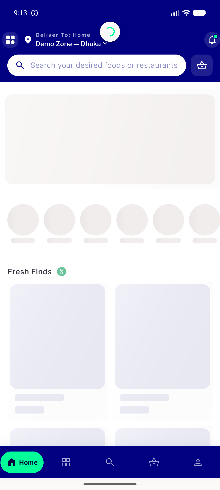</a> food home</td>
</tr>
<tr>
<td align="center" width="33%"> tab categories</td>
<td align="center" width="33%"><a href="13-dark-mode-home.png">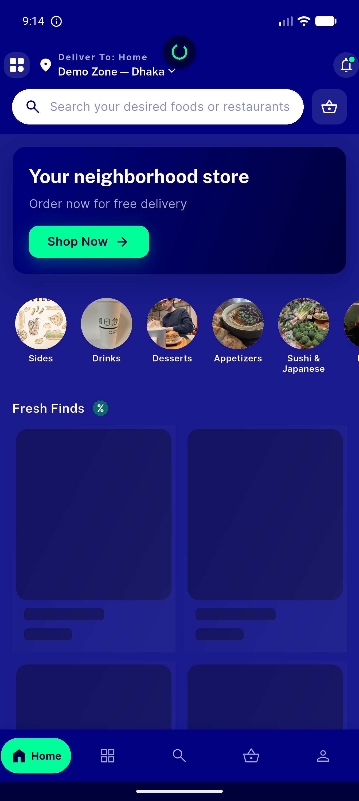</a> dark mode home</td>
<td align="center" width="33%"> tab search</td>
</tr>
<tr>
<td align="center" width="33%"><a href="14-dark-grocery-banner.png">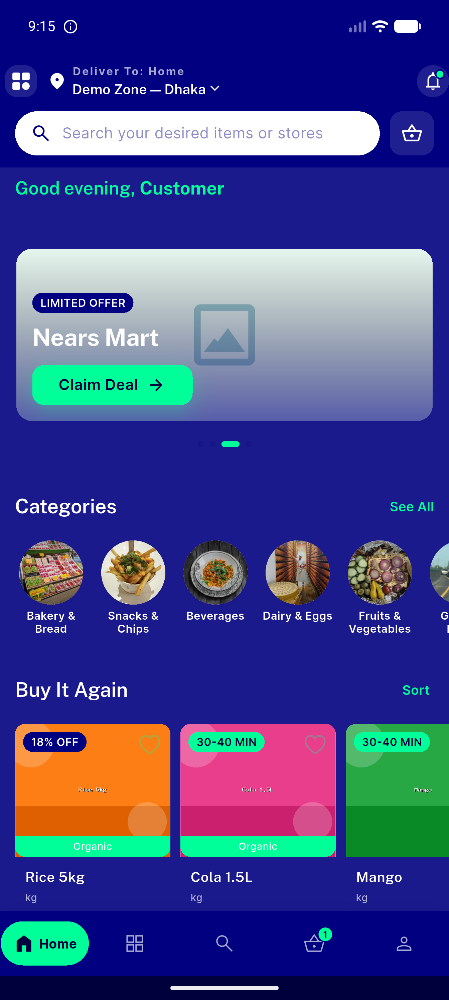</a> dark grocery banner</td>
<td align="center" width="33%"> tab basket</td>
<td align="center" width="33%"><a href="15-dark-grocery-flash-featured.png">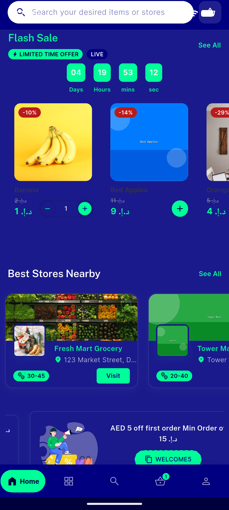</a> dark grocery flash featured</td>
</tr>
<tr>
<td align="center" width="33%"> tab profile</td>
<td align="center" width="33%"><a href="16-rtl-arabic-home-top.png">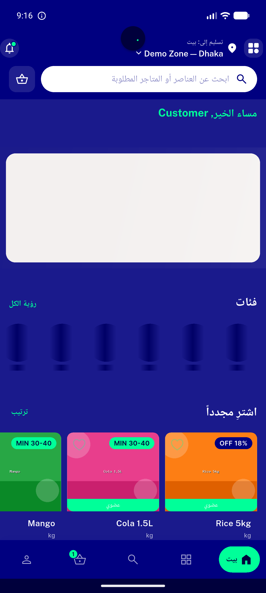</a> rtl arabic home top</td>
<td align="center" width="33%"> store detail</td>
</tr>
<tr>
<td align="center" width="33%"><a href="17-rtl-flash-featured.png">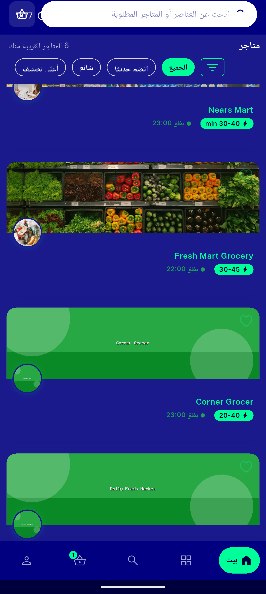</a> rtl flash featured</td>
<td align="center" width="33%"> search results</td>
<td align="center" width="33%"><a href="18-search-and-detail-smoke.png">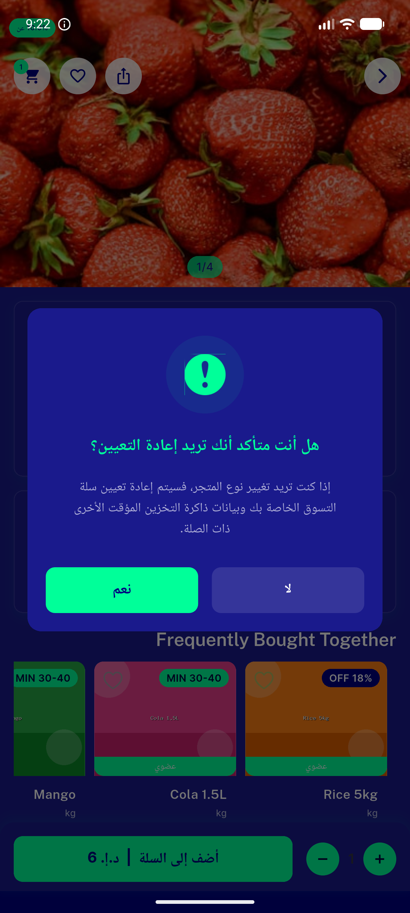</a> search and detail smoke</td>
</tr>
</table>

### Other artifacts
- [`progress.md`](progress.md)

---
*From `nears/docs/qa-evidence/NEARS-397/` · public-repo scrub policy (no live secrets; verified clean).*
