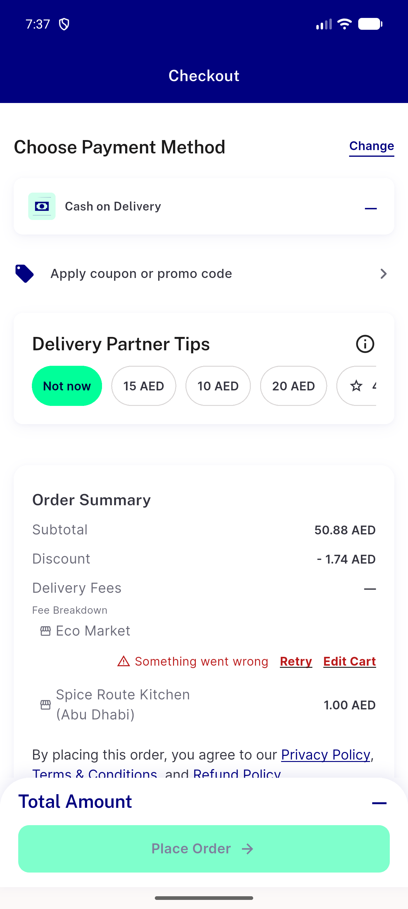
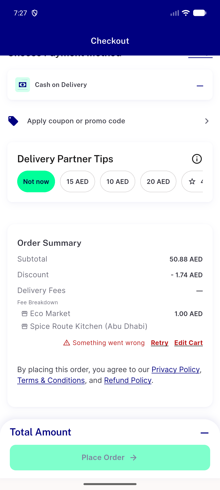
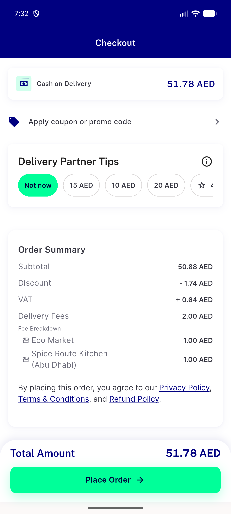
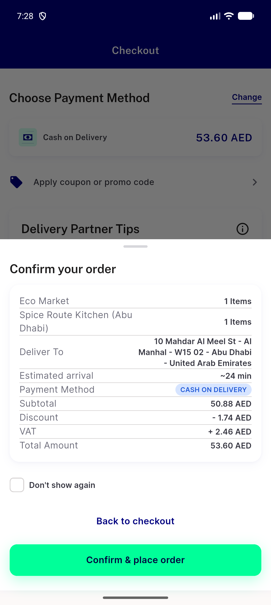
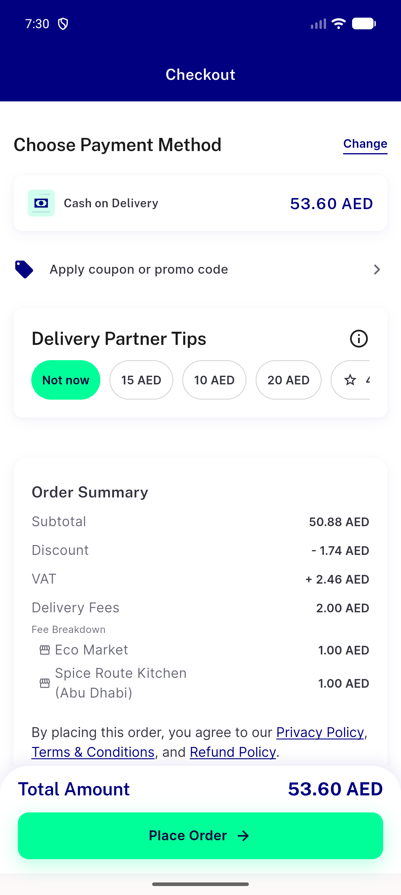
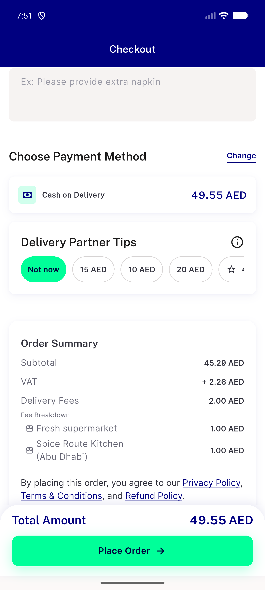
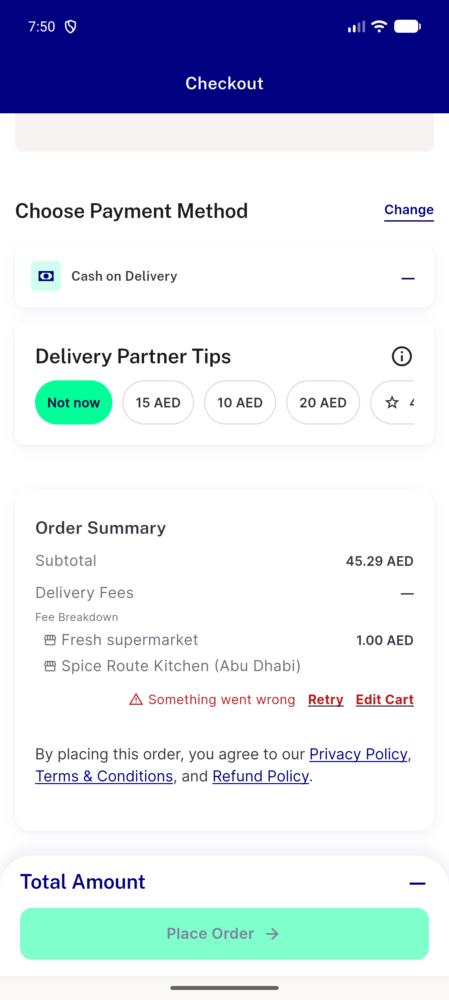
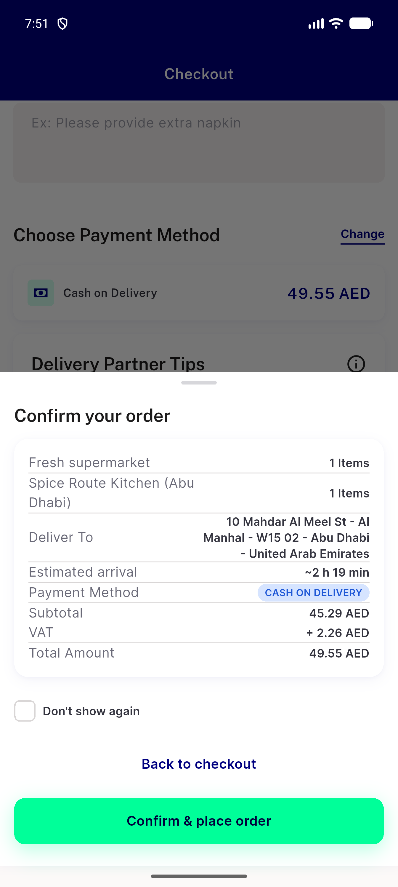
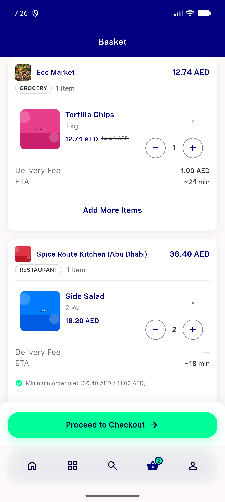
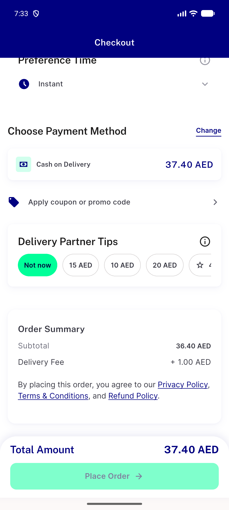

# QA Evidence — NEARS-3970

**PASS - NEARS-3970 group tax fail-closed: 11 cells live on emulator-5600 (lane e6a896aeb) + base control 812800503; orders 91425/91426 (logged-in 53.60) 91441/91442 (guest 49.55)**

**11 screenshot(s).** Click any thumbnail for full resolution.

<table>
<tr>
<td align="center" width="33%"> bug oos store retry only no reason</td>
<td align="center" width="33%"> c1 c2 c3 loggedin b failed bill total dash</td>
<td align="center" width="33%"> c11 base control b failed numeric total place enabled</td>
</tr>
<tr>
<td align="center" width="33%"> c4 loggedin after retry total resolved</td>
<td align="center" width="33%"> c4 loggedin confirm sheet</td>
<td align="center" width="33%"> c4 loggedin home after retry total</td>
</tr>
<tr>
<td align="center" width="33%"> c5 guest after retry total</td>
<td align="center" width="33%"> c5 guest b failed total dash</td>
<td align="center" width="33%"> c5 guest confirm sheet</td>
</tr>
<tr>
<td align="center" width="33%"> c8 cart b tax failing proceed enabled</td>
<td align="center" width="33%"> c9 lane single store tax failing</td>
</tr>
</table>

### Other artifacts
- [`app-base-fail-lines.log`](app-base-fail-lines.log)
- [`app-lane-fail-lines.log`](app-lane-fail-lines.log)
- [`bug-deterministic-4xx-retry-only-no-reason.log`](bug-deterministic-4xx-retry-only-no-reason.log)
- [`bug-guest-dial-code-stale-after-logout.log`](bug-guest-dial-code-stale-after-logout.log)
- [`bug-search-results-semantics-assert.log`](bug-search-results-semantics-assert.log)
- [`c1-checkout-bill-a11y-dump.xml`](c1-checkout-bill-a11y-dump.xml)
- [`c1-checkout-mid-a11y-dump.xml`](c1-checkout-mid-a11y-dump.xml)
- [`c1-checkout-top-a11y-dump.xml`](c1-checkout-top-a11y-dump.xml)
- [`c10-inflight-address-change-a11y-dump.xml`](c10-inflight-address-change-a11y-dump.xml)
- [`c10-inflight-basket-edit-a11y-dump.xml`](c10-inflight-basket-edit-a11y-dump.xml)
- [`c10-inflight-basket-edit-qty-a11y-dump.xml`](c10-inflight-basket-edit-qty-a11y-dump.xml)
- [`c10-loggedin-address-change-b-failing-a11y-dump.xml`](c10-loggedin-address-change-b-failing-a11y-dump.xml)
- [`c10a-location-switch-no-rerun.txt`](c10a-location-switch-no-rerun.txt)
- [`c11-base-control-b-failed-a11y-dump.xml`](c11-base-control-b-failed-a11y-dump.xml)
- [`c11-base-control-confirm-sheet-a11y-dump.xml`](c11-base-control-confirm-sheet-a11y-dump.xml)
- [`c4-loggedin-after-retry-a11y-dump.xml`](c4-loggedin-after-retry-a11y-dump.xml)
- [`c4-loggedin-after-retry-settled-a11y-dump.xml`](c4-loggedin-after-retry-settled-a11y-dump.xml)
- [`c4-loggedin-confirm-sheet-a11y-dump.xml`](c4-loggedin-confirm-sheet-a11y-dump.xml)
- [`c4-loggedin-home-after-retry-a11y-dump.xml`](c4-loggedin-home-after-retry-a11y-dump.xml)
- [`c4-loggedin-home-confirm-sheet-a11y-dump.xml`](c4-loggedin-home-confirm-sheet-a11y-dump.xml)
- [`c5-guest-after-retry-a11y-dump.xml`](c5-guest-after-retry-a11y-dump.xml)
- [`c5-guest-b-failed-bill-a11y-dump.xml`](c5-guest-b-failed-bill-a11y-dump.xml)
- [`c5-guest-confirm-sheet-2-a11y-dump.xml`](c5-guest-confirm-sheet-2-a11y-dump.xml)
- [`c5-guest-confirm-sheet-a11y-dump.xml`](c5-guest-confirm-sheet-a11y-dump.xml)
- [`c6-retry-still-failing-a11y-dump.xml`](c6-retry-still-failing-a11y-dump.xml)
- [`c7-out-of-stock-store-a-a11y-dump.xml`](c7-out-of-stock-store-a-a11y-dump.xml)
- [`c8-cart-b-failing-a11y-dump.xml`](c8-cart-b-failing-a11y-dump.xml)
- [`c8-guest-cart-b-failing-a11y-dump.xml`](c8-guest-cart-b-failing-a11y-dump.xml)
- [`c9-base-single-store-tax-failing-a11y-dump.xml`](c9-base-single-store-tax-failing-a11y-dump.xml)
- [`c9-lane-single-store-tax-failing-a11y-dump.xml`](c9-lane-single-store-tax-failing-a11y-dump.xml)
- [`progress.md`](progress.md)
- [`proxy-requests.log`](proxy-requests.log)

---
*From `nears/docs/qa-evidence/NEARS-3970/` · public-repo scrub policy (no live secrets; verified clean).*
