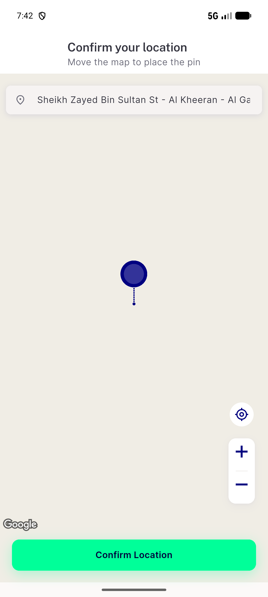

# QA Evidence — NEARS-3971

**NEARS-3971 [8] cycle 1 re-QA PASS on c9a834487 (emulator-5610, nears_qa_3971)**

**2 screenshot(s).** Click any thumbnail for full resolution.

<table>
<tr>
<td align="center" width="33%"> bug di confirm location stuck</td>
<td align="center" width="33%"> bug di nullable pricing find splash hang</td>
</tr>
</table>

### Other artifacts
- [`base-dd7606671`](base-dd7606671)
- [`bug-ac7-group-fee-pipeline-refetch-on-store-landing.log`](bug-ac7-group-fee-pipeline-refetch-on-store-landing.log)
- [`bug-di-nullable-pricing-find-splash-hang.log`](bug-di-nullable-pricing-find-splash-hang.log)
- [`bug-group-coupon-basket-min-purchase-accept-then-refuse.log`](bug-group-coupon-basket-min-purchase-accept-then-refuse.log)
- [`bug-view-cart-cold-entry-legacy-value.log`](bug-view-cart-cold-entry-legacy-value.log)
- [`bug-view-cart-single-store-cold-entry-legacy.log`](bug-view-cart-single-store-cold-entry-legacy.log)
- [`c1`](c1)
- [`progress.md`](progress.md)
- [`provisional-scratch`](provisional-scratch)
- [`seed-nears_qa_3971.sql`](seed-nears_qa_3971.sql)
- [`server-coupon-apply-gate.txt`](server-coupon-apply-gate.txt)

---
*From `nears/docs/qa-evidence/NEARS-3971/` · public-repo scrub policy (no live secrets; verified clean).*
