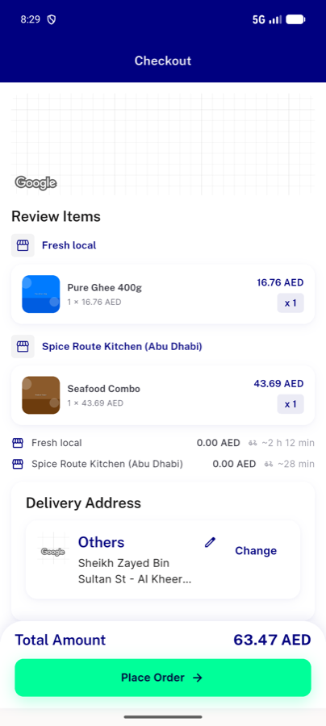
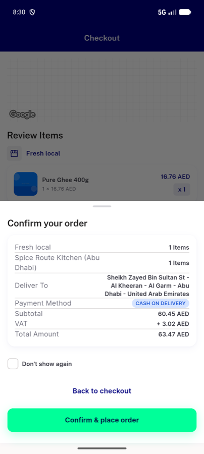

# QA Evidence — NEARS-3973

**NEARS-3973 QA [8] PASS - mixed-basket ETA pill/sheet row hidden; sha 0f9c900a1**

**2 screenshot(s).** Click any thumbnail for full resolution.

<table>
<tr>
<td align="center" width="33%"> ac1 mobile mixed hero</td>
<td align="center" width="33%"> ac2 sheet mixed</td>
</tr>
</table>

### Other artifacts
- [`ac1-mobile-mixed-slowfirst.xml`](ac1-mobile-mixed-slowfirst.xml)
- [`ac2-sheet-mixed.xml`](ac2-sheet-mixed.xml)
- [`ac3-mobile-mixed-fastfirst.xml`](ac3-mobile-mixed-fastfirst.xml)
- [`bug-buynow-cod-cap-tax-components-missing.log`](bug-buynow-cod-cap-tax-components-missing.log)
- [`bug-confirm-sheet-1-items-plural.log`](bug-confirm-sheet-1-items-plural.log)
- [`bug-hero-map-raw-i18n-key.log`](bug-hero-map-raw-i18n-key.log)
- [`progress.md`](progress.md)
- [`reg-buynow-checkout.xml`](reg-buynow-checkout.xml)
- [`reg-buynow-sheet.xml`](reg-buynow-sheet.xml)
- [`reg-flagoff-basket.xml`](reg-flagoff-basket.xml)
- [`reg-flagoff-checkout.xml`](reg-flagoff-checkout.xml)
- [`reg-flagoff-sheet.xml`](reg-flagoff-sheet.xml)
- [`reg-samemodule-checkout.xml`](reg-samemodule-checkout.xml)
- [`reg-samemodule-sheet.xml`](reg-samemodule-sheet.xml)
- [`reg-single-checkout.xml`](reg-single-checkout.xml)
- [`reg-single-sheet.xml`](reg-single-sheet.xml)
- [`s10-before-place.xml`](s10-before-place.xml)
- [`s10-sheet-open.xml`](s10-sheet-open.xml)

---
*From `nears/docs/qa-evidence/NEARS-3973/` · public-repo scrub policy (no live secrets; verified clean).*
