# QA Evidence — NEARS-3974

**NEARS-3974 QA [8] PASS - group stock/quantity item card + no futile Retry (ee31c8c50, emulator-5640)**

**15 screenshot(s).** Click any thumbnail for full resolution.

<table>
<tr>
<td align="center" width="33%"><a href="q1-quantity-item-card.png">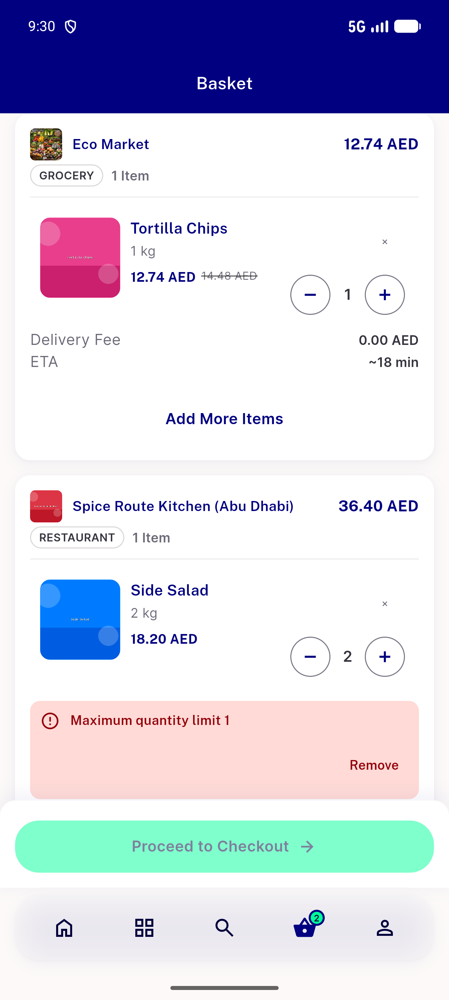</a> q1 quantity item card</td>
<td align="center" width="33%"><a href="q11-single-store-checkout.png">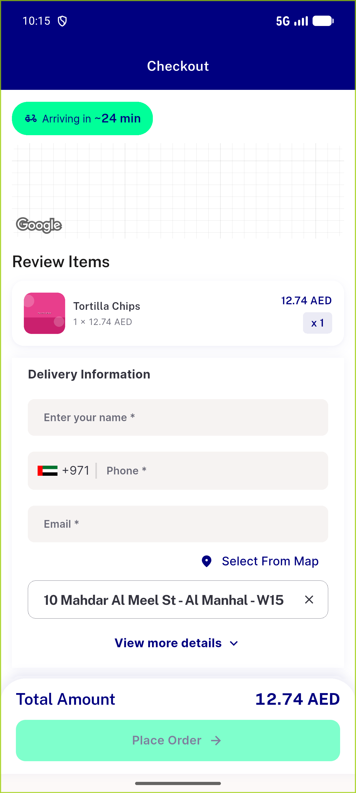</a> q11 single store checkout</td>
<td align="center" width="33%"><a href="q2-out-of-stock-item-card.png">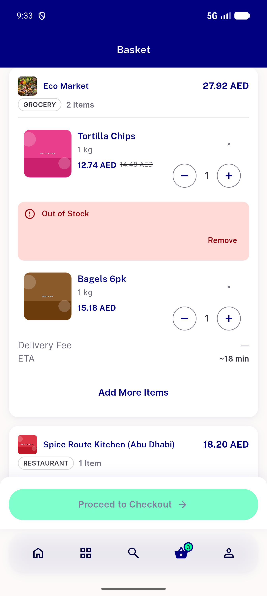</a> q2 out of stock item card</td>
</tr>
<tr>
<td align="center" width="33%"><a href="q3-only-n-available-ar.png">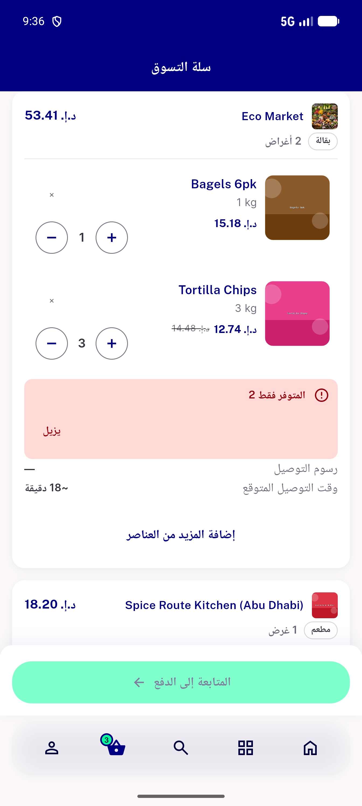</a> q3 only n available ar</td>
<td align="center" width="33%"><a href="q3-only-n-available-en.png">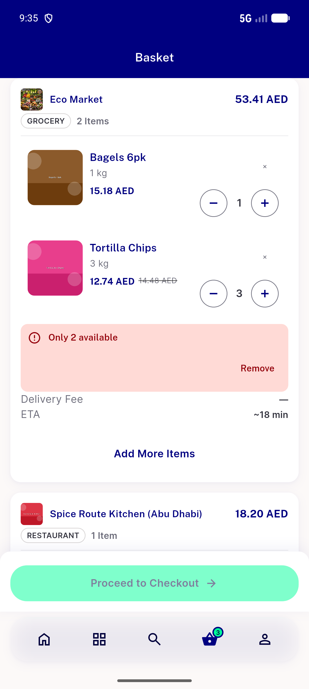</a> q3 only n available en</td>
<td align="center" width="33%"><a href="q5-two-item-cards.png">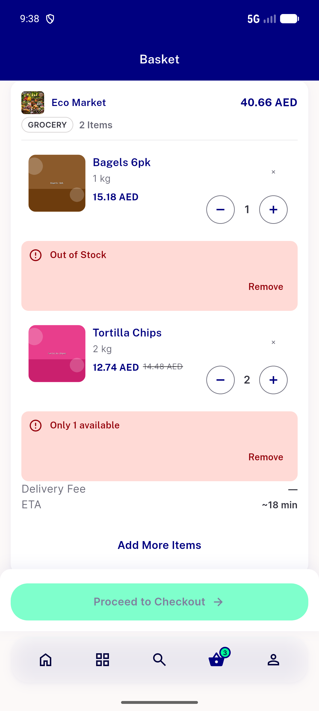</a> q5 two item cards</td>
</tr>
<tr>
<td align="center" width="33%"><a href="q6-variation-row-card.png">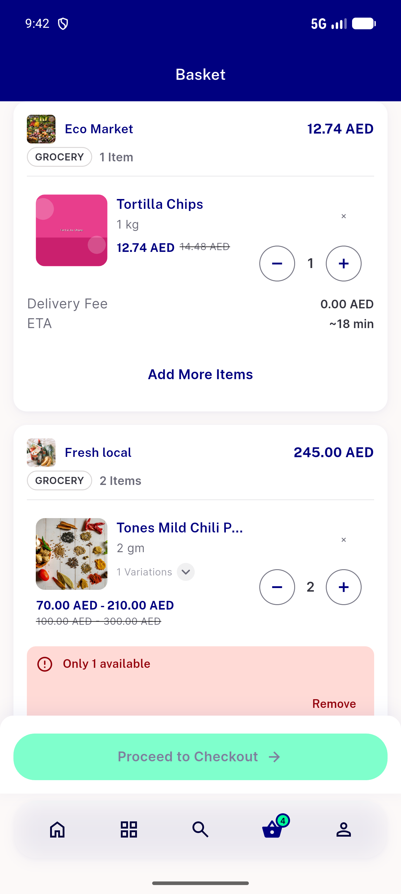</a> q6 variation row card</td>
<td align="center" width="33%"><a href="q7-row-card-after-refetch.png">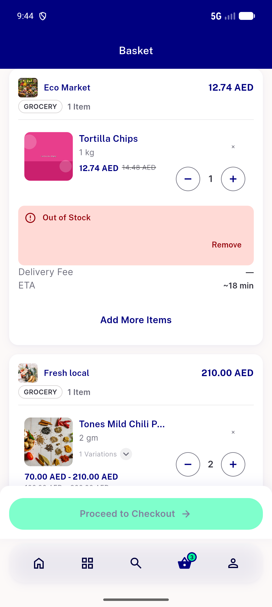</a> q7 row card after refetch</td>
<td align="center" width="33%"><a href="q7b-store-fallback-card.png">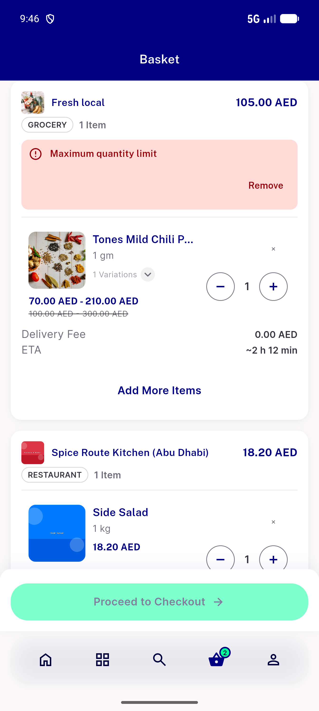</a> q7b store fallback card</td>
</tr>
<tr>
<td align="center" width="33%"><a href="q8-guest-bounce-row-card.png">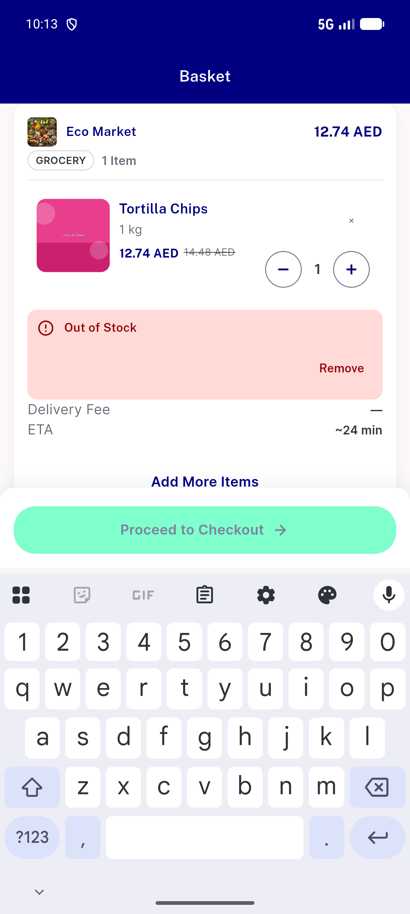</a> q8 guest bounce row card</td>
<td align="center" width="33%"><a href="q8-guest-checkout-blocked-row.png">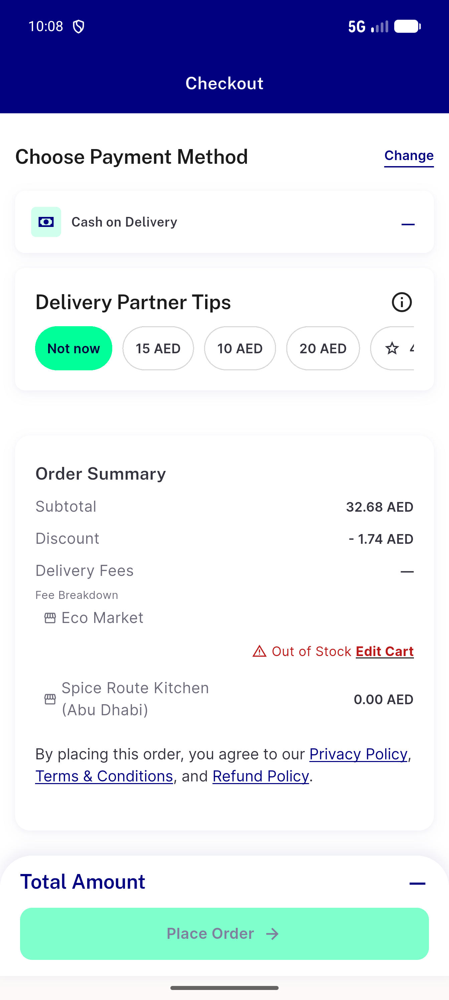</a> q8 guest checkout blocked row</td>
<td align="center" width="33%"><a href="q9-mixed-fee-rows.png">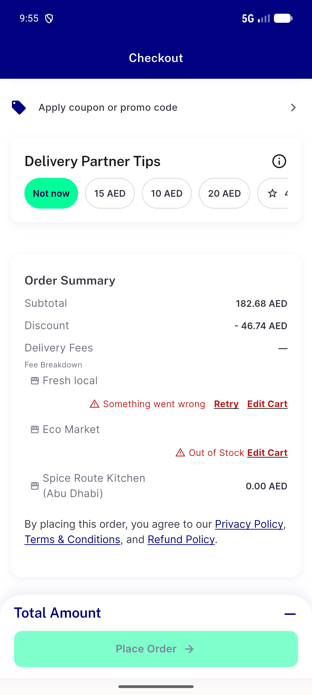</a> q9 mixed fee rows</td>
</tr>
<tr>
<td align="center" width="33%"><a href="q9-mixed-quantity-fee-row.png">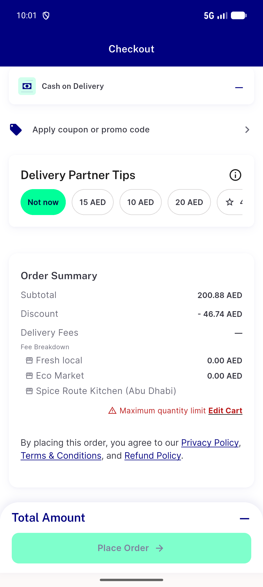</a> q9 mixed quantity fee row</td>
<td align="center" width="33%"><a href="q9-same-module-fee-rows.png">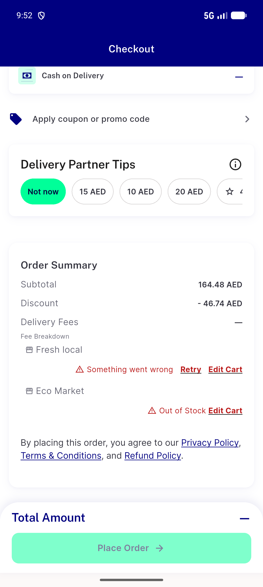</a> q9 same module fee rows</td>
<td align="center" width="33%"><a href="q9mx-loggedin-bounce-row-card.png">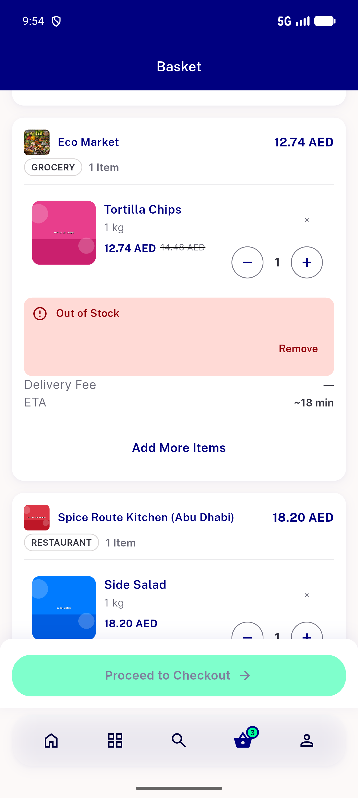</a> q9mx loggedin bounce row card</td>
</tr>
</table>

### Other artifacts
- [`bug-item-sheet-semantics-table-assert.log`](bug-item-sheet-semantics-table-assert.log)
- [`bug-stock-refetch-double-on-fallback.log`](bug-stock-refetch-double-on-fallback.log)
- [`progress.md`](progress.md)
- [`q1-cart.xml`](q1-cart.xml)
- [`q11-cart.xml`](q11-cart.xml)
- [`q11-checkout-t1.xml`](q11-checkout-t1.xml)
- [`q12-flagoff-cart.xml`](q12-flagoff-cart.xml)
- [`q12-flagoff-loggedin-cart.xml`](q12-flagoff-loggedin-cart.xml)
- [`q2-after-remove.xml`](q2-after-remove.xml)
- [`q2-cart.xml`](q2-cart.xml)
- [`q3-after-stepdown.xml`](q3-after-stepdown.xml)
- [`q3-cart-ar.xml`](q3-cart-ar.xml)
- [`q3-cart-en.xml`](q3-cart-en.xml)
- [`q3970-mixed-clean.xml`](q3970-mixed-clean.xml)
- [`q4-after-stepdown.xml`](q4-after-stepdown.xml)
- [`q5-after.xml`](q5-after.xml)
- [`q5-cart.xml`](q5-cart.xml)
- [`q5-mid.xml`](q5-mid.xml)
- [`q6-after.xml`](q6-after.xml)
- [`q6-cart.xml`](q6-cart.xml)
- [`q7-proxy-sequence.log`](q7-proxy-sequence.log)
- [`q7-settled.xml`](q7-settled.xml)
- [`q7-t1.xml`](q7-t1.xml)
- [`q7b-forced-fallback.xml`](q7b-forced-fallback.xml)
- [`q8-guest-cart-before.xml`](q8-guest-cart-before.xml)
- [`q8-guest-checkout-mid.xml`](q8-guest-checkout-mid.xml)
- [`q8-guest-feerows.xml`](q8-guest-feerows.xml)
- [`q8-residual-cart.xml`](q8-residual-cart.xml)
- [`q8-t1.xml`](q8-t1.xml)
- [`q8-t2.xml`](q8-t2.xml)
- [`q8-t3.xml`](q8-t3.xml)
- [`q8b-t1.xml`](q8b-t1.xml)
- [`q8b-t2.xml`](q8b-t2.xml)
- [`q8b-t3.xml`](q8b-t3.xml)
- [`q9mx-after-retry.xml`](q9mx-after-retry.xml)
- [`q9mx-checkout.xml`](q9mx-checkout.xml)
- [`q9mx-loggedin-bounce-proxy.log`](q9mx-loggedin-bounce-proxy.log)
- [`q9mx-quantity.xml`](q9mx-quantity.xml)
- [`q9mx-t1.xml`](q9mx-t1.xml)
- [`q9mx-t2.xml`](q9mx-t2.xml)
- [`q9mx-t3.xml`](q9mx-t3.xml)
- [`q9mx-t4.xml`](q9mx-t4.xml)
- [`q9sm-baseline.xml`](q9sm-baseline.xml)
- [`q9sm-both.xml`](q9sm-both.xml)
- [`q9sm-checkout-bill.xml`](q9sm-checkout-bill.xml)
- [`q9sm-checkout.xml`](q9sm-checkout.xml)

---
*From `nears/docs/qa-evidence/NEARS-3974/` · public-repo scrub policy (no live secrets; verified clean).*
