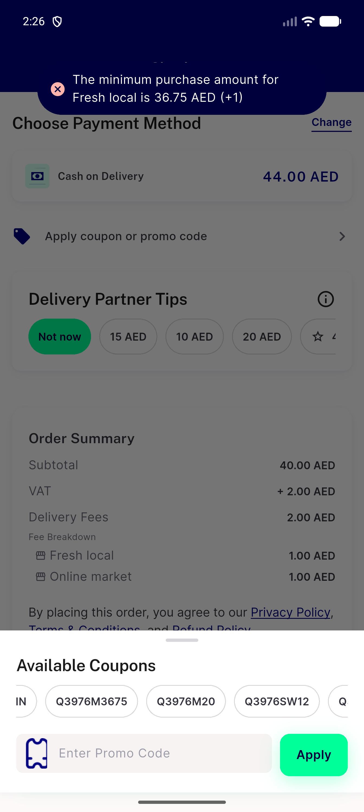
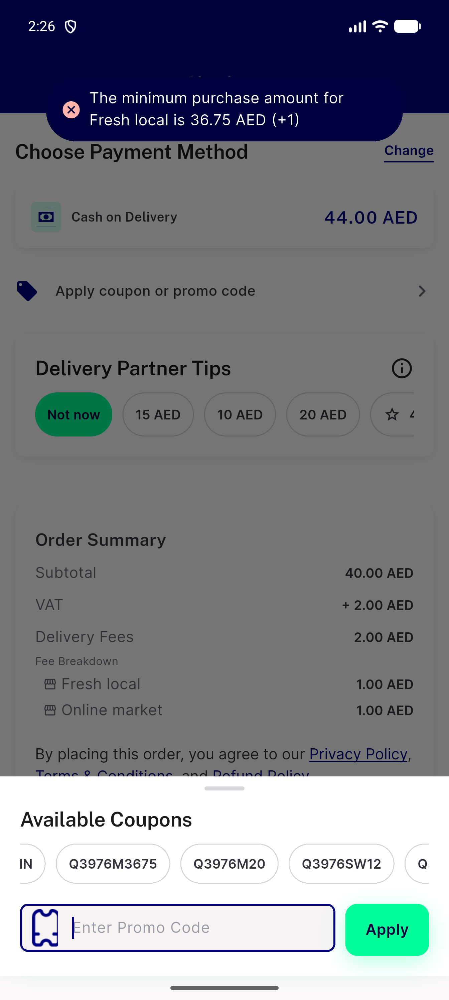
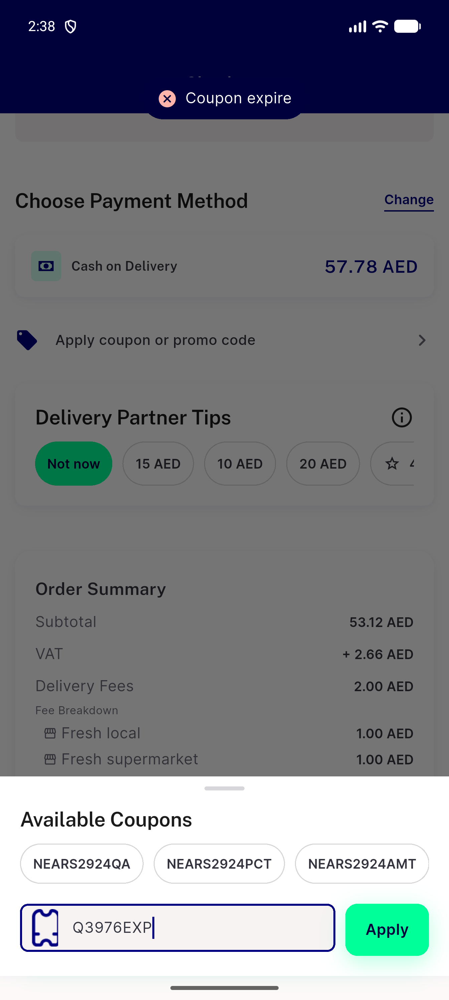
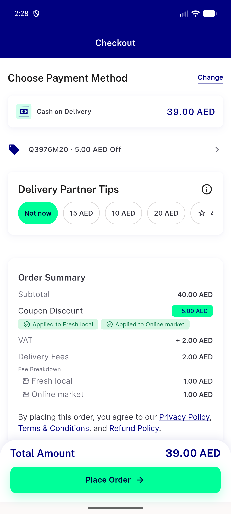
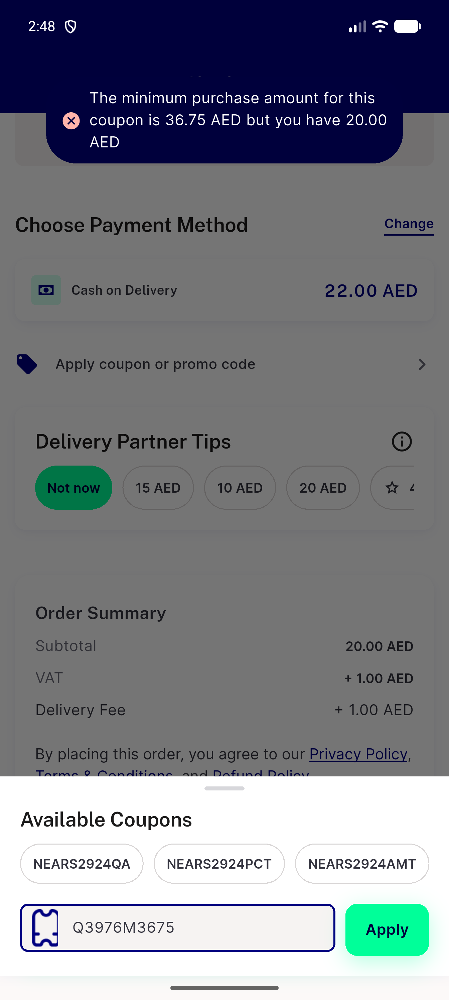
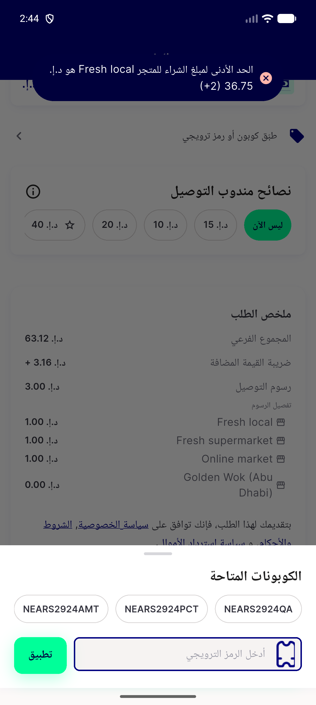
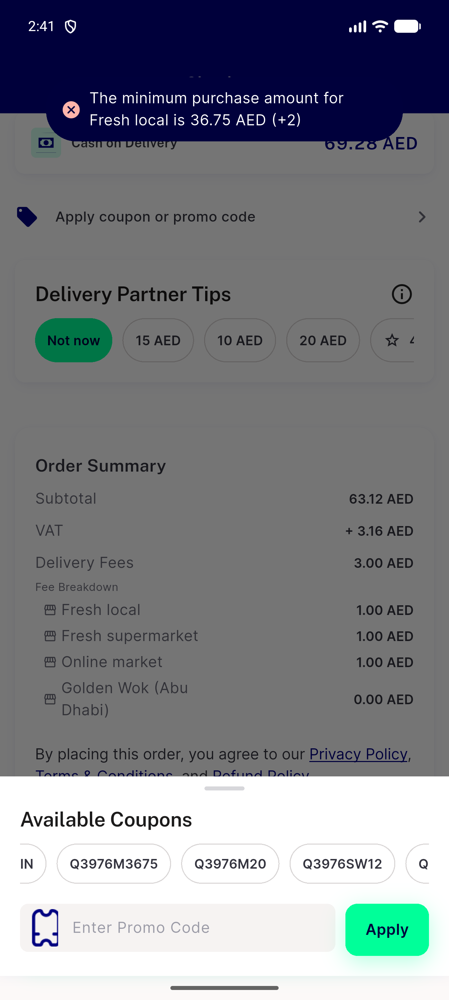
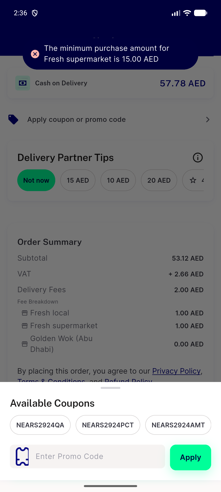
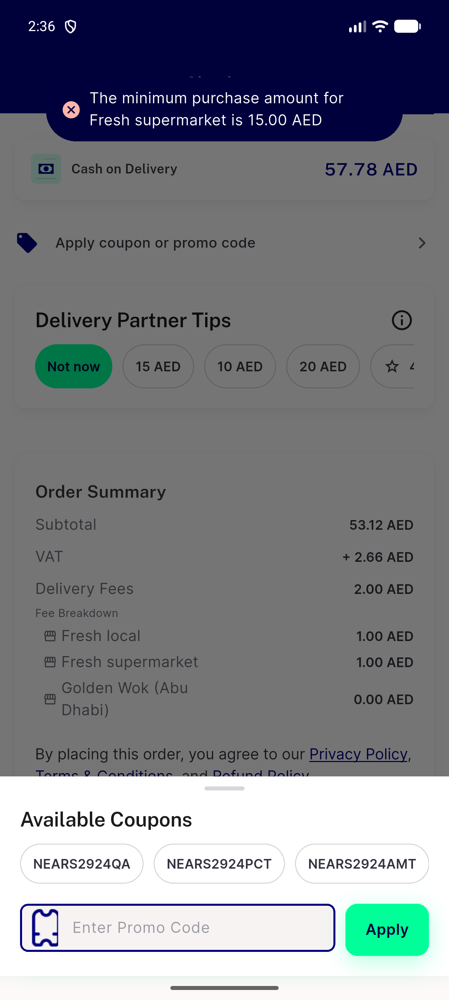

# QA Evidence — NEARS-3976

**QA PASS 1 (apply-time cells; place_order cells pending) — PASS**

**11 screenshot(s).** Click any thumbnail for full resolution.

<table>
<tr>
<td align="center" width="33%"> c1 list refusal toast en</td>
<td align="center" width="33%"> c1 typed refusal toast en</td>
<td align="center" width="33%"> c13 unknown code toast en</td>
</tr>
<tr>
<td align="center" width="33%"> c14 expired code toast en</td>
<td align="center" width="33%"> c16 fd none over toast en</td>
<td align="center" width="33%"> c2 applied summary en</td>
</tr>
<tr>
<td align="center" width="33%"> c7 single store min toast en</td>
<td align="center" width="33%"> c8 plus2 refusal toast ar</td>
<td align="center" width="33%"> c8 plus2 refusal toast en</td>
</tr>
<tr>
<td align="center" width="33%"> f1 list refusal toast en</td>
<td align="center" width="33%"> f1 typed refusal toast en</td>
</tr>
</table>

### Other artifacts
- [`app-log-coupon-excerpt.log`](app-log-coupon-excerpt.log)
- [`bug-group-tax-preview-ignores-coupon-shown-ne-charged.log`](bug-group-tax-preview-ignores-coupon-shown-ne-charged.log)
- [`c6-coupons-page-4store-dump.xml`](c6-coupons-page-4store-dump.xml)
- [`c6-coupons-page-single-store-dump.xml`](c6-coupons-page-single-store-dump.xml)
- [`progress.md`](progress.md)
- [`proxy-coupon-ledger.log`](proxy-coupon-ledger.log)

---
*From `nears/docs/qa-evidence/NEARS-3976/` · public-repo scrub policy (no live secrets; verified clean).*
