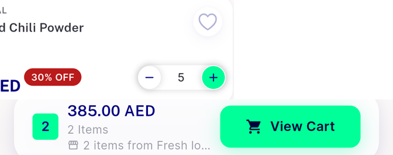
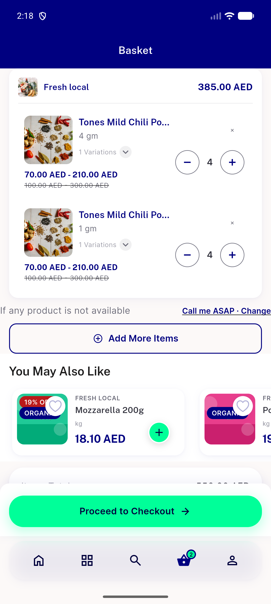
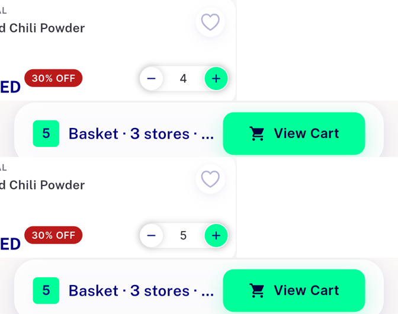
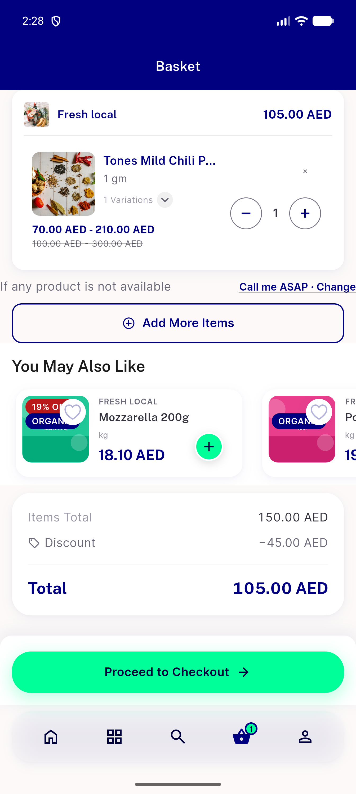
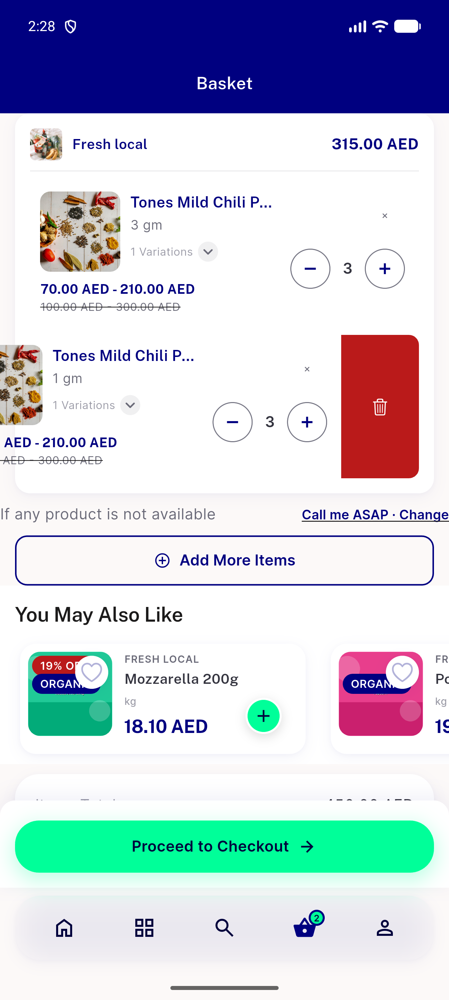
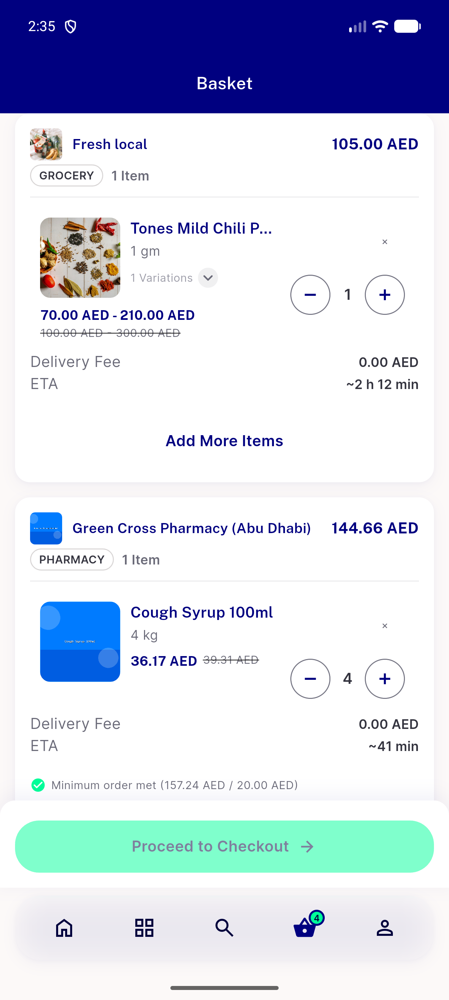

# QA Evidence — NEARS-3977/baseline

**NEARS-3977 BASELINE (pre-change, base 35c570766) - B1/B2/B3/B4 captured, flag OFF+ON**

**7 screenshot(s).** Click any thumbnail for full resolution.

<table>
<tr>
<td align="center" width="33%"> b1 after add crop</td>
<td align="center" width="33%"> b1 basket after restart</td>
<td align="center" width="33%"> b1 basket after tabswitch</td>
</tr>
<tr>
<td align="center" width="33%"> b1 on before after crop</td>
<td align="center" width="33%"> b3 off after</td>
<td align="center" width="33%"> b3 off revealed</td>
</tr>
<tr>
<td align="center" width="33%"> b3 on after</td>
</tr>
</table>

### Other artifacts
- [`app-log-cart-excerpt.log`](app-log-cart-excerpt.log)
- [`bug-search-semantics-assertion.log`](bug-search-semantics-assertion.log)
- [`cart-requests-raw.jsonl`](cart-requests-raw.jsonl)
- [`db-readback.txt`](db-readback.txt)
- [`observations.txt`](observations.txt)
- [`observe.sh`](observe.sh)
- [`reseed.sh`](reseed.sh)
- [`router.php`](router.php)
- [`rowtap.py`](rowtap.py)
- [`run-info.txt`](run-info.txt)
- [`swipe_delete.py`](swipe_delete.py)

---
*From `nears/docs/qa-evidence/NEARS-3977/baseline/` · public-repo scrub policy (no live secrets; verified clean).*
