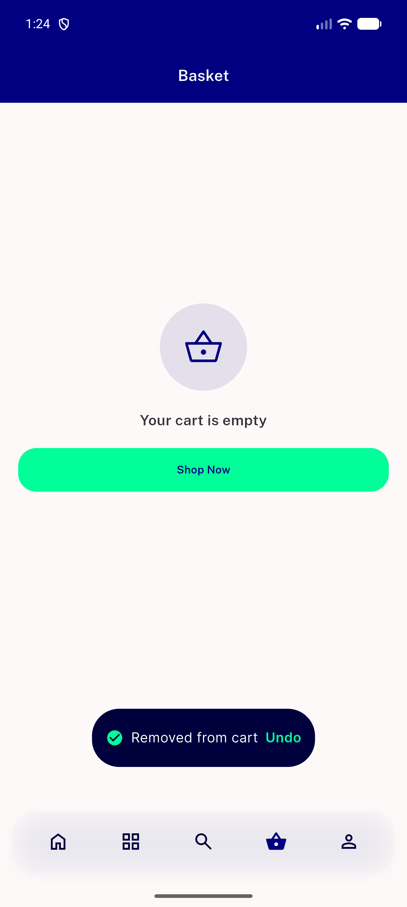
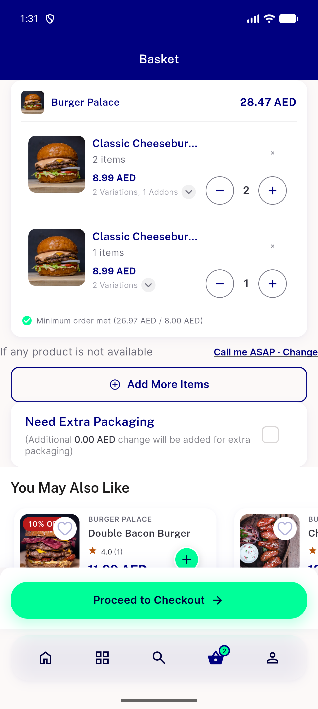
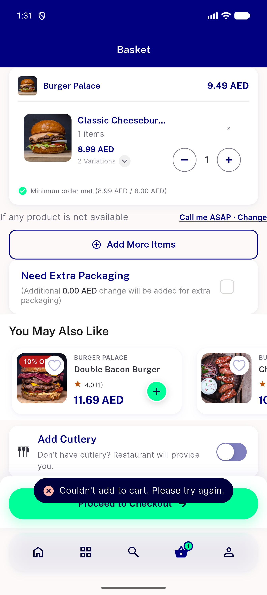
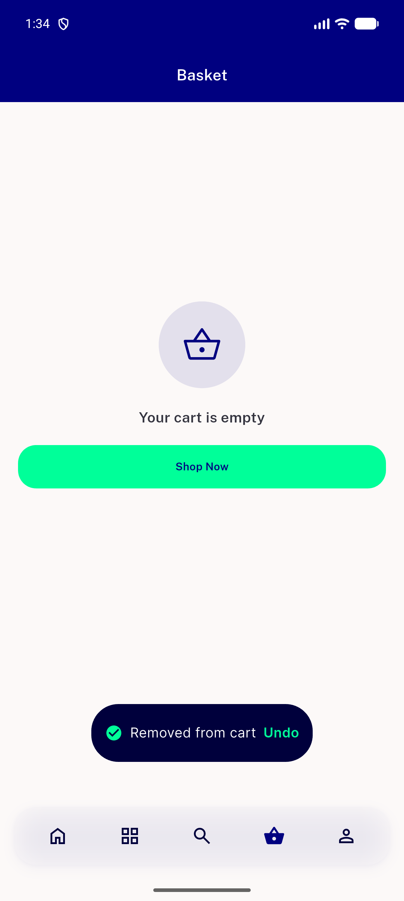
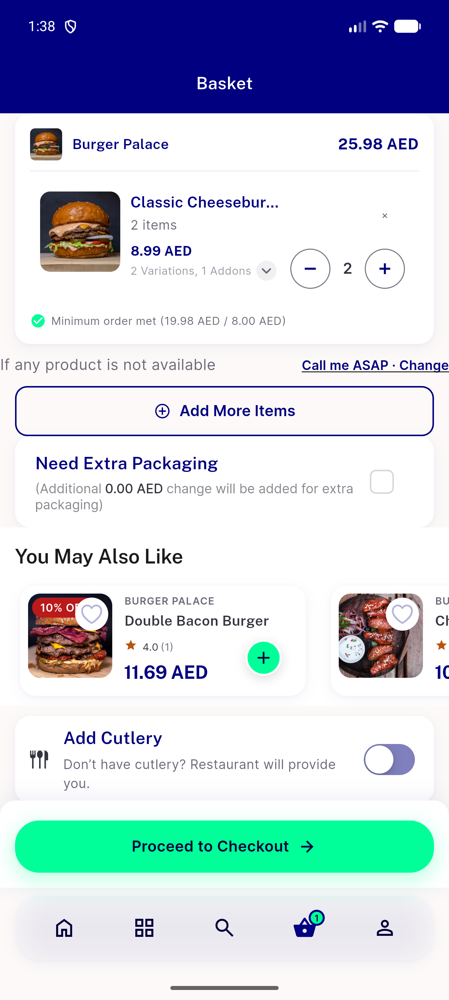
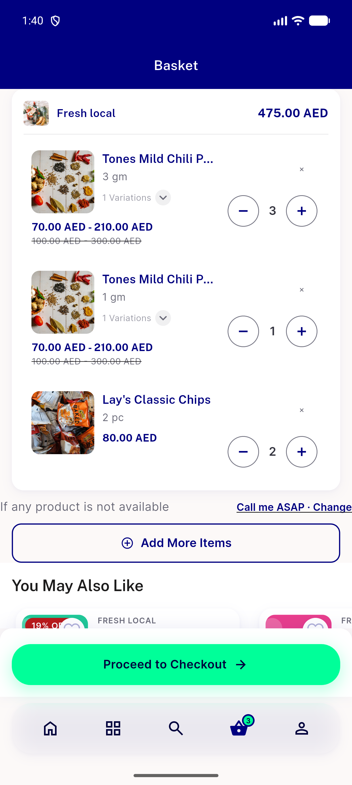
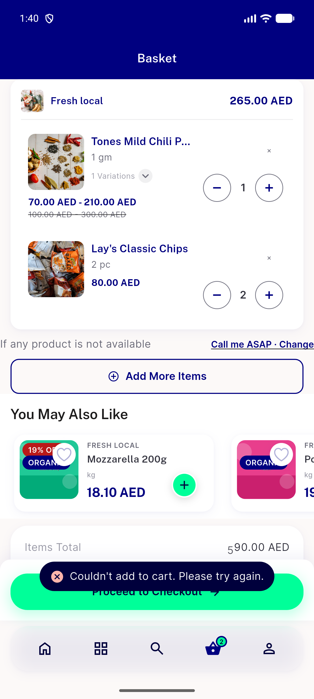
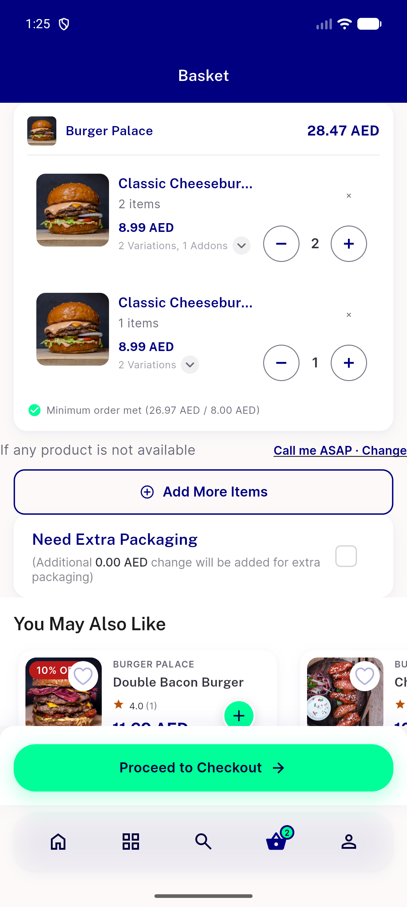
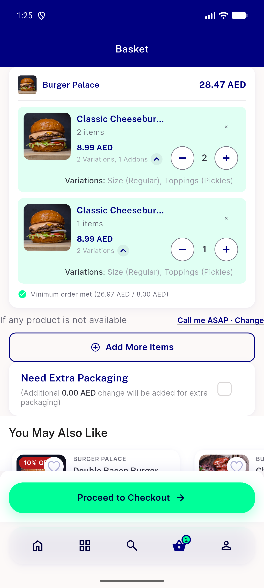

# QA Evidence — NEARS-3978-delta

**NEARS-3978 delta QA (food sibling rows, build 0b3275a36)**

**15 screenshot(s).** Click any thumbnail for full resolution.

<table>
<tr>
<td align="center" width="33%"> d3b repro toast</td>
<td align="center" width="33%"> f d1 00 before</td>
<td align="center" width="33%"> f d1 01 toast</td>
</tr>
<tr>
<td align="center" width="33%"> f d2 00 before</td>
<td align="center" width="33%"> f d2 01 toast</td>
<td align="center" width="33%"> f d3b toast</td>
</tr>
<tr>
<td align="center" width="33%"> f d4a 00 lone B</td>
<td align="center" width="33%"> f d4a 01 after undo</td>
<td align="center" width="33%"> f d5 00 before</td>
</tr>
<tr>
<td align="center" width="33%"> f d5 01 after undo</td>
<td align="center" width="33%"> f d6 00 before</td>
<td align="center" width="33%"> f d6 01 after</td>
</tr>
<tr>
<td align="center" width="33%"> f d8b toast</td>
<td align="center" width="33%"> r1 00 basket collapsed</td>
<td align="center" width="33%"> r1 01 basket expanded</td>
</tr>
</table>

### Other artifacts
- [`README-delta.txt`](README-delta.txt)
- [`cell-timeline.txt`](cell-timeline.txt)
- [`d3b-carts-before.txt`](d3b-carts-before.txt)
- [`d3b-repro-defect.log`](d3b-repro-defect.log)
- [`f-d1-carts-before.txt`](f-d1-carts-before.txt)
- [`f-d1-report.txt`](f-d1-report.txt)
- [`f-d2-report.txt`](f-d2-report.txt)
- [`f-d3-report.txt`](f-d3-report.txt)
- [`f-d3b-report.txt`](f-d3b-report.txt)
- [`f-d4a-report.txt`](f-d4a-report.txt)
- [`f-d5-report.txt`](f-d5-report.txt)
- [`f-d6a-report.txt`](f-d6a-report.txt)
- [`f-d6b-report.txt`](f-d6b-report.txt)
- [`f-d6c-report.txt`](f-d6c-report.txt)
- [`f-d7-report.txt`](f-d7-report.txt)
- [`f-d8a-report.txt`](f-d8a-report.txt)
- [`f-d8b-report.txt`](f-d8b-report.txt)
- [`logcat-filtered-fa-and-fail.txt`](logcat-filtered-fa-and-fail.txt)
- [`r1-carts-seed.txt`](r1-carts-seed.txt)
- [`r1-observation.txt`](r1-observation.txt)
- [`server-cart-requests-proxy-log.txt`](server-cart-requests-proxy-log.txt)

---
*From `nears/docs/qa-evidence/NEARS-3978-delta/` · public-repo scrub policy (no live secrets; verified clean).*
