# QA Evidence — NEARS-3978-guard

**NEARS-3978 guard re-QA (build 4de9cc259)**

**16 screenshot(s).** Click any thumbnail for full resolution.

<table>
<tr>
<td align="center" width="33%"><a href="g1-00-before.png">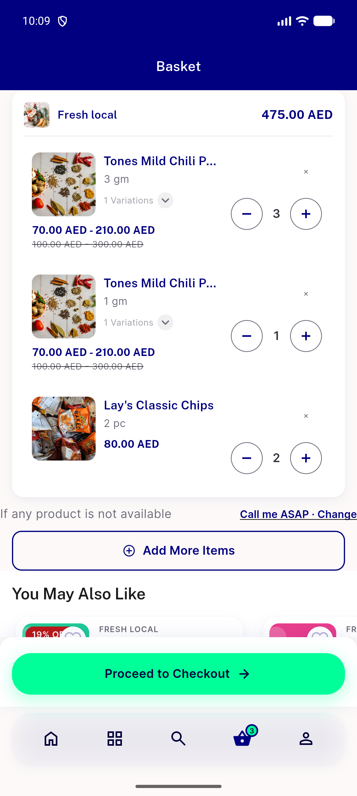</a> g1 00 before</td>
<td align="center" width="33%"><a href="g1-01-after-switch.png">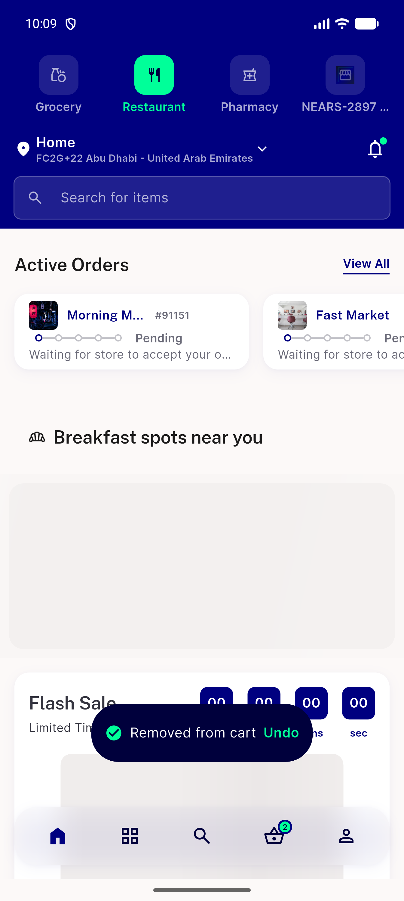</a> g1 01 after switch</td>
<td align="center" width="33%"><a href="g1-02-after-undo-tap.png">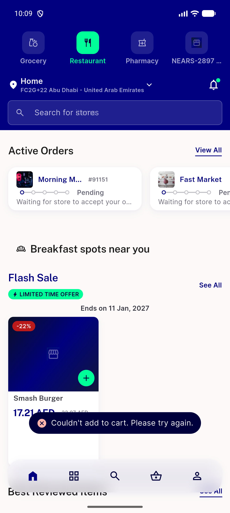</a> g1 02 after undo tap</td>
</tr>
<tr>
<td align="center" width="33%"><a href="g1s-01-after-undo-tap.png">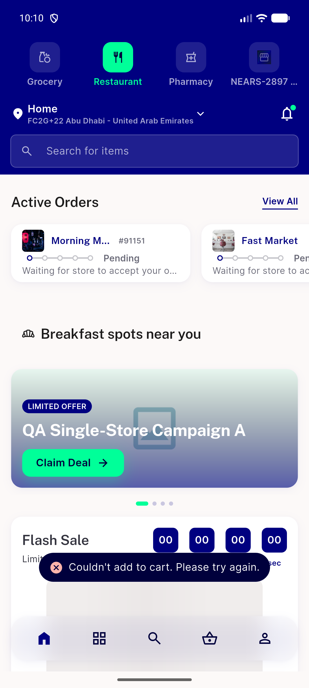</a> g1s 01 after undo tap</td>
<td align="center" width="33%"><a href="g2-00-before.png">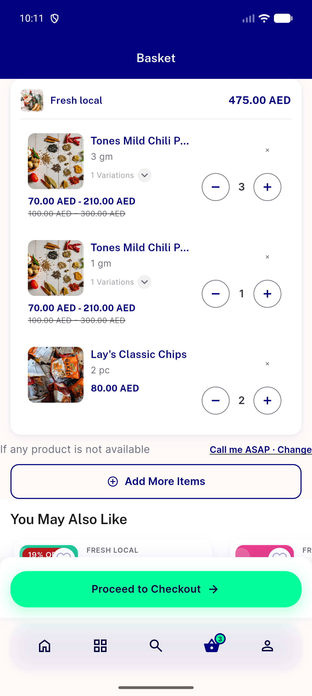</a> g2 00 before</td>
<td align="center" width="33%"><a href="g2-01-after-undo-tap.png">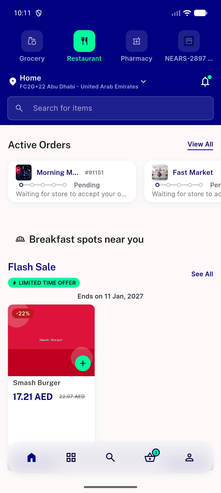</a> g2 01 after undo tap</td>
</tr>
<tr>
<td align="center" width="33%"><a href="g3-01-after-settle.png">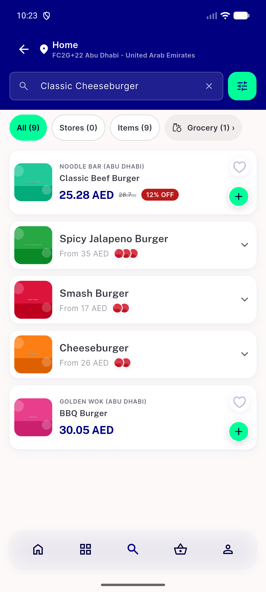</a> g3 01 after settle</td>
<td align="center" width="33%"><a href="g4-00-before.png">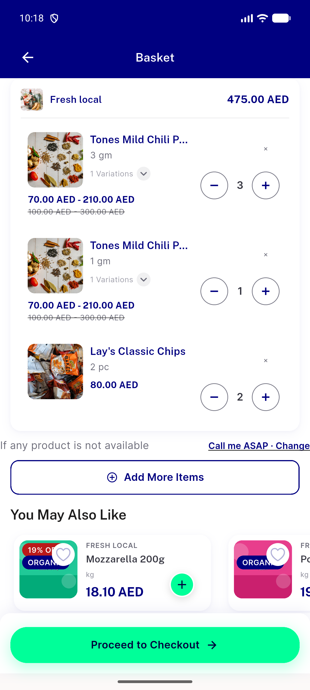</a> g4 00 before</td>
<td align="center" width="33%"><a href="g4-01-after-undo-tap.png">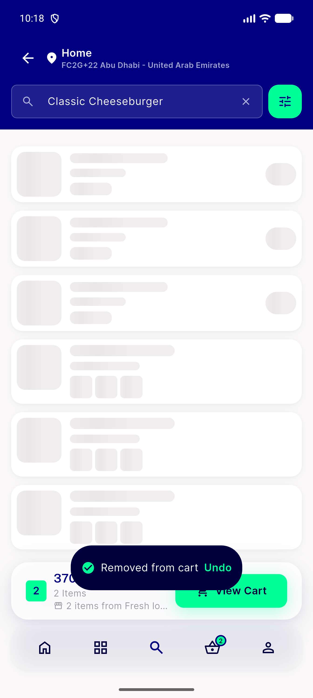</a> g4 01 after undo tap</td>
</tr>
<tr>
<td align="center" width="33%"><a href="g5-00-before-undo.png">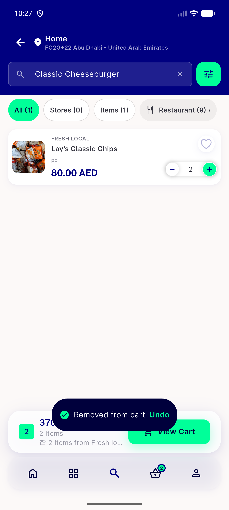</a> g5 00 before undo</td>
<td align="center" width="33%"><a href="g5-01-after.png">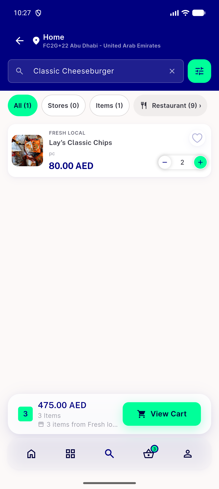</a> g5 01 after</td>
<td align="center" width="33%"> g6 01 after settle</td>
</tr>
<tr>
<td align="center" width="33%"><a href="g7-00-before.png">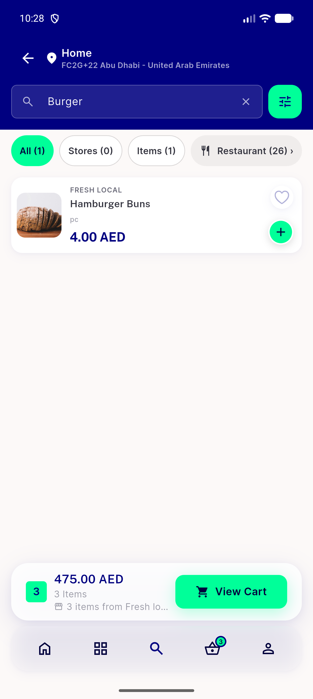</a> g7 00 before</td>
<td align="center" width="33%"><a href="g7-01-after-settle.png">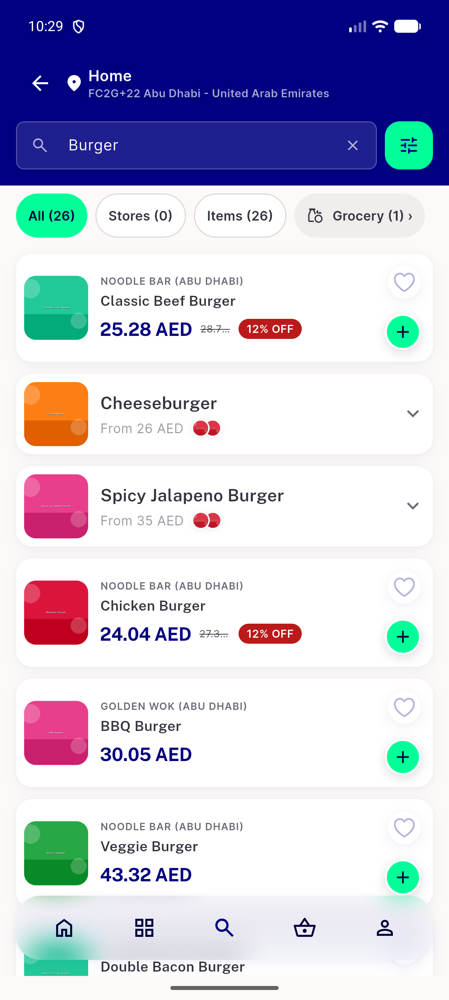</a> g7 01 after settle</td>
<td align="center" width="33%"> g9 00 before</td>
</tr>
<tr>
<td align="center" width="33%"><a href="g9-01-after-settle.png">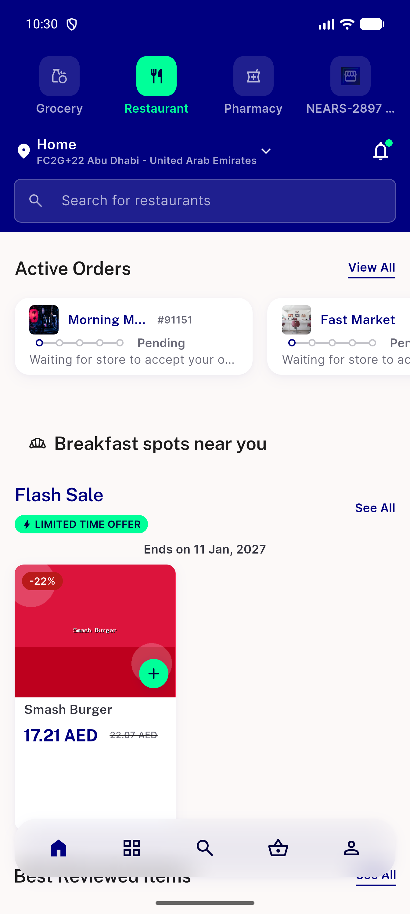</a> g9 01 after settle</td>
</tr>
</table>

### Other artifacts
- [`README-guard.txt`](README-guard.txt)
- [`cell-timeline.txt`](cell-timeline.txt)
- [`g1-report.txt`](g1-report.txt)
- [`g1s-report.txt`](g1s-report.txt)
- [`g2-report.txt`](g2-report.txt)
- [`g3-report.txt`](g3-report.txt)
- [`g4-report.txt`](g4-report.txt)
- [`g5-report.txt`](g5-report.txt)
- [`g6-report.txt`](g6-report.txt)
- [`g7-report.txt`](g7-report.txt)
- [`g8-add503-report.txt`](g8-add503-report.txt)
- [`g8-caseA-X-report.txt`](g8-caseA-X-report.txt)
- [`g8-caseA-swipe-report.txt`](g8-caseA-swipe-report.txt)
- [`g8-caseB-X-report.txt`](g8-caseB-X-report.txt)
- [`g8-doubletap-report.txt`](g8-doubletap-report.txt)
- [`g8-food-siblings-d1-report.txt`](g8-food-siblings-d1-report.txt)
- [`g8-food-siblings-d3b-report.txt`](g8-food-siblings-d3b-report.txt)
- [`g8-food-sole-report.txt`](g8-food-sole-report.txt)
- [`g8-item538-report.txt`](g8-item538-report.txt)
- [`g8-plain92-report.txt`](g8-plain92-report.txt)
- [`g9-report.txt`](g9-report.txt)
- [`logcat-filtered.txt`](logcat-filtered.txt)
- [`server-cart-requests-proxy-log.txt`](server-cart-requests-proxy-log.txt)

---
*From `nears/docs/qa-evidence/NEARS-3978-guard/` · public-repo scrub policy (no live secrets; verified clean).*
