# QA Evidence — NEARS-3978

**NEARS-3978 QA: Undo restores exact variation/add-on rows live; food sibling-variation limitation**

**33 screenshot(s).** Click any thumbnail for full resolution.

<table>
<tr>
<td align="center" width="33%"><a href="c1-00-before.png">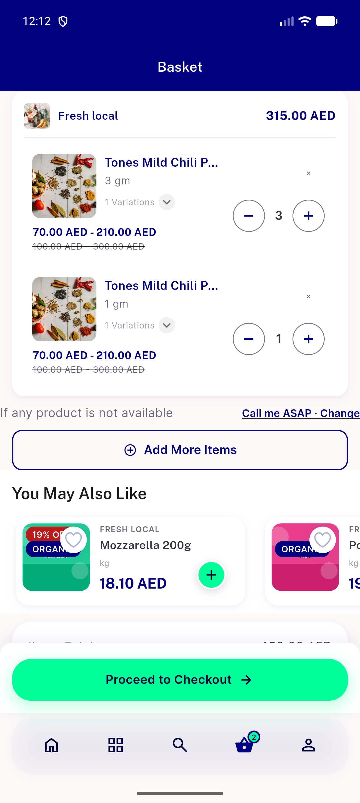</a> c1 00 before</td>
<td align="center" width="33%"> c1 01 after undo</td>
<td align="center" width="33%"><a href="c1-02-after-refresh.png">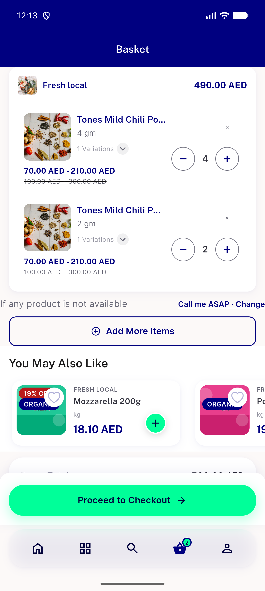</a> c1 02 after refresh</td>
</tr>
<tr>
<td align="center" width="33%"><a href="c10-00-before.png">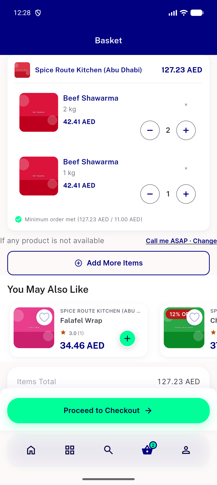</a> c10 00 before</td>
<td align="center" width="33%"> c10 01 after undo tap</td>
<td align="center" width="33%"><a href="c11-00-before.png">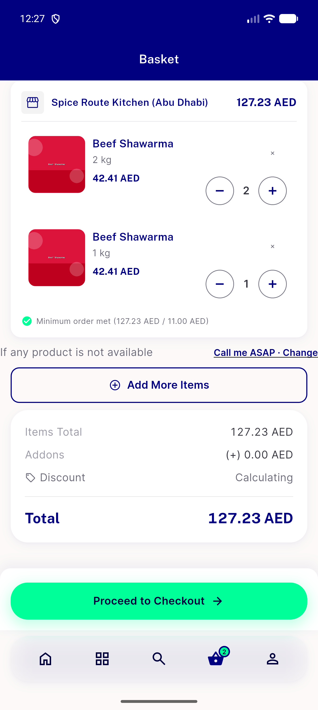</a> c11 00 before</td>
</tr>
<tr>
<td align="center" width="33%"><a href="c11-01-error-toast.png">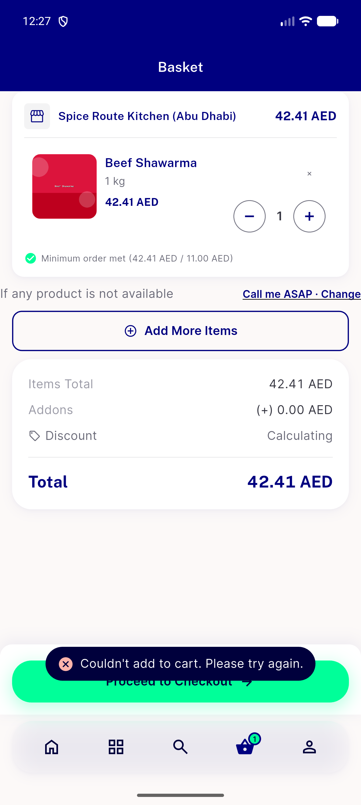</a> c11 01 error toast</td>
<td align="center" width="33%"> c13b 01 after undo delete failed</td>
<td align="center" width="33%"><a href="c15-01-add-failed-toast.png">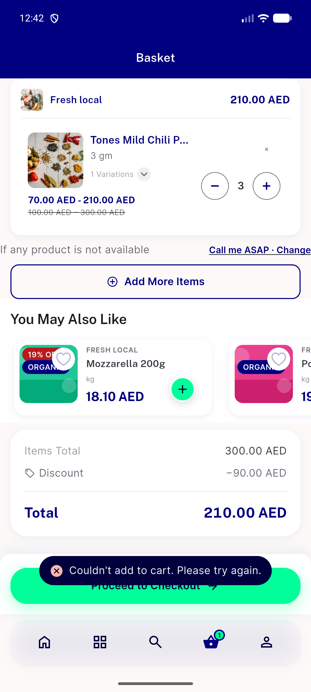</a> c15 01 add failed toast</td>
</tr>
<tr>
<td align="center" width="33%"> c16 00 restored optimistic</td>
<td align="center" width="33%"> c17 01 after settle</td>
<td align="center" width="33%"> c1b 01 after undo</td>
</tr>
<tr>
<td align="center" width="33%"> c2 00 before</td>
<td align="center" width="33%"> c2 01 after undo</td>
<td align="center" width="33%"> c2 02 after refresh</td>
</tr>
<tr>
<td align="center" width="33%"> c2b 01 after undo</td>
<td align="center" width="33%"> c3 00 before flagON</td>
<td align="center" width="33%"> c3 01 after flagON</td>
</tr>
<tr>
<td align="center" width="33%"> c6a 00 before</td>
<td align="center" width="33%"><a href="c6a-01-after-undo.png">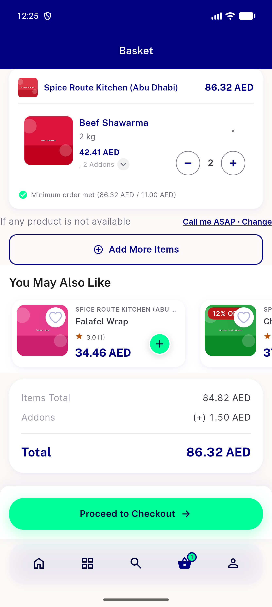</a> c6a 01 after undo</td>
<td align="center" width="33%"><a href="c6b-00-before.png">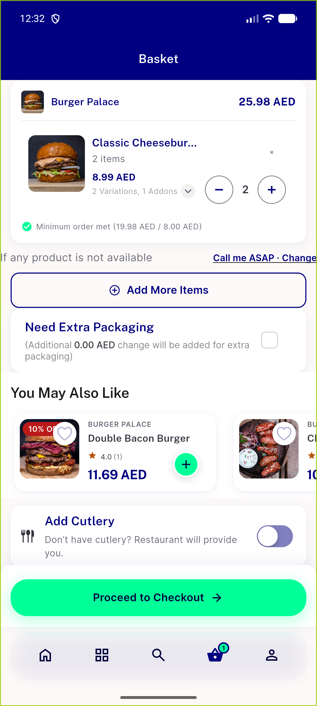</a> c6b 00 before</td>
</tr>
<tr>
<td align="center" width="33%"> c6b 01 after undo</td>
<td align="center" width="33%"><a href="c6c-00-before.png">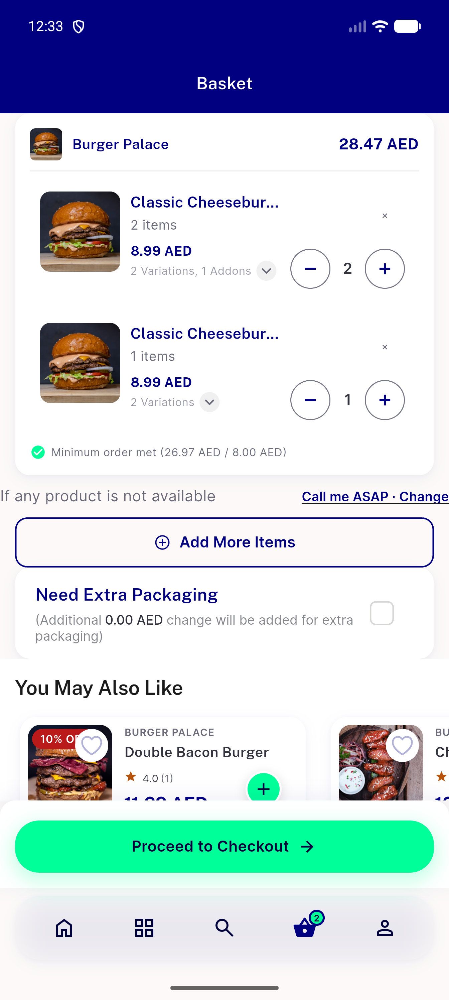</a> c6c 00 before</td>
<td align="center" width="33%"> c6c 01 after undo</td>
</tr>
<tr>
<td align="center" width="33%"> c6d 00 before</td>
<td align="center" width="33%"><a href="c6d-01-after-undo.png">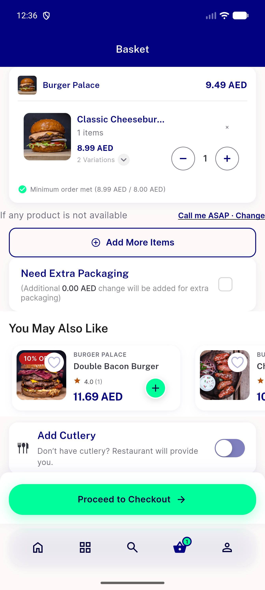</a> c6d 01 after undo</td>
<td align="center" width="33%"><a href="c7-01-after-undo.png">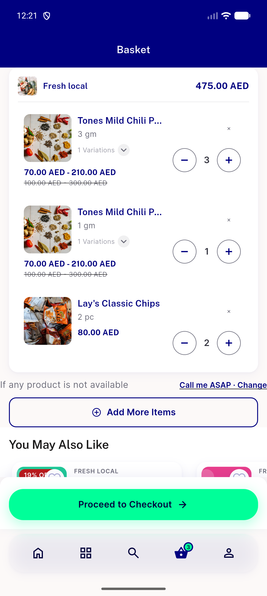</a> c7 01 after undo</td>
</tr>
<tr>
<td align="center" width="33%"><a href="c8-01-toast-window.png">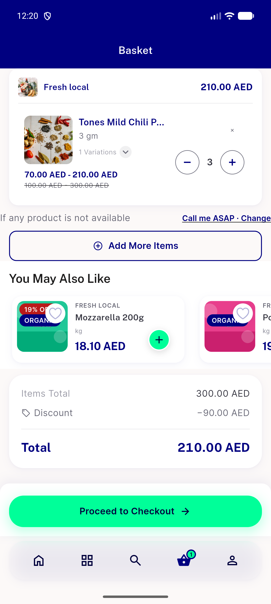</a> c8 01 toast window</td>
<td align="center" width="33%"> guest 00 before</td>
<td align="center" width="33%"> guest 01 after undo</td>
</tr>
<tr>
<td align="center" width="33%"> negctl base caseA after undo</td>
<td align="center" width="33%"> negctl base caseB after undo</td>
<td align="center" width="33%"><a href="rtl-01-after-undo.png">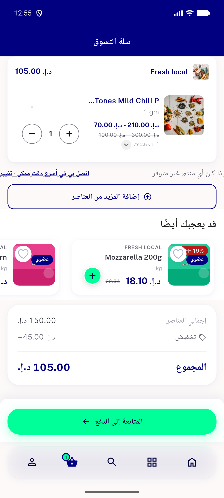</a> rtl 01 after undo</td>
</tr>
</table>

### Other artifacts
- [`bug-food-cartlist-isselected-shared.json`](bug-food-cartlist-isselected-shared.json)
- [`bug-food-sibling-undo-refused.log`](bug-food-sibling-undo-refused.log)
- [`cell-timeline.txt`](cell-timeline.txt)
- [`logcat-filtered-fa-and-fail.txt`](logcat-filtered-fa-and-fail.txt)
- [`server-cart-requests-proxy-log.txt`](server-cart-requests-proxy-log.txt)

---
*From `nears/docs/qa-evidence/NEARS-3978/` · public-repo scrub policy (no live secrets; verified clean).*
