# QA Evidence — NEARS-3979

**PASS - AC8-12,15 live on 946fd2f36 (private DB copy nears_qa_3979)**

**13 screenshot(s).** Click any thumbnail for full resolution.

<table>
<tr>
<td align="center" width="33%"> ac10 preview percent 39.80</td>
<td align="center" width="33%"><a href="ac11-free-delivery-preview.png">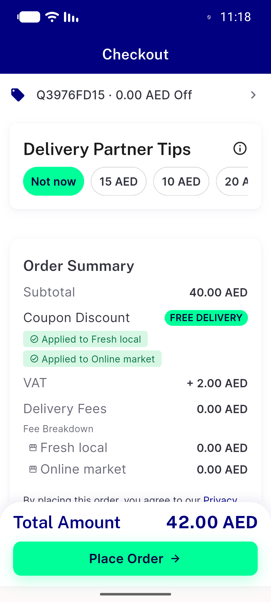</a> ac11 free delivery preview</td>
<td align="center" width="33%"><a href="ac11-nocoupon-preview.png">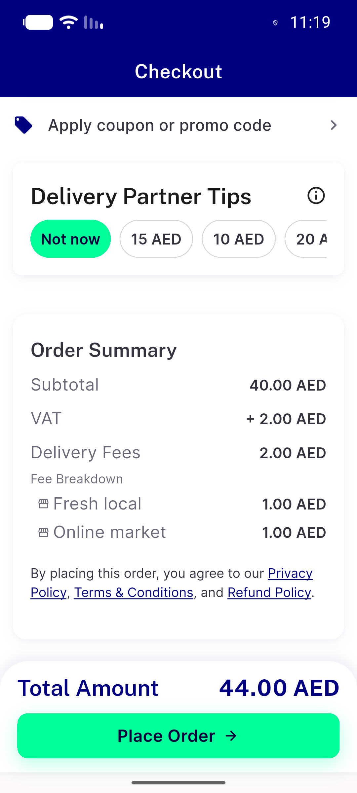</a> ac11 nocoupon preview</td>
</tr>
<tr>
<td align="center" width="33%"><a href="ac12-mixed-basket-coupon-code-less.png">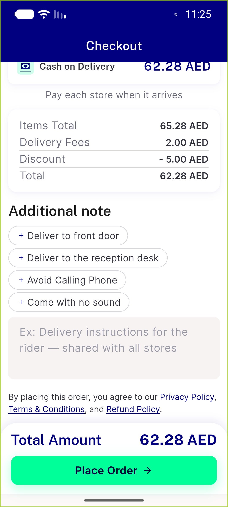</a> ac12 mixed basket coupon code less</td>
<td align="center" width="33%"><a href="ac12-single-store-coupon.png">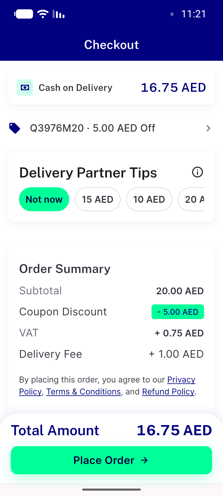</a> ac12 single store coupon</td>
<td align="center" width="33%"><a href="ac15-after-forced-403-total-shown.png">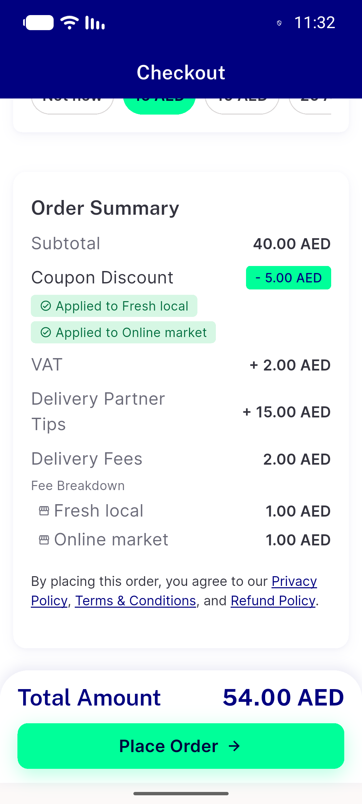</a> ac15 after forced 403 total shown</td>
</tr>
<tr>
<td align="center" width="33%"><a href="ac8-confirm-sheet.png">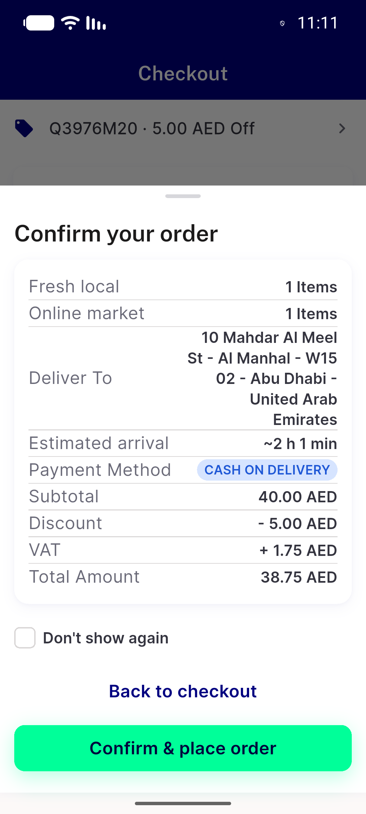</a> ac8 confirm sheet</td>
<td align="center" width="33%"><a href="ac8-placed-order-success.png">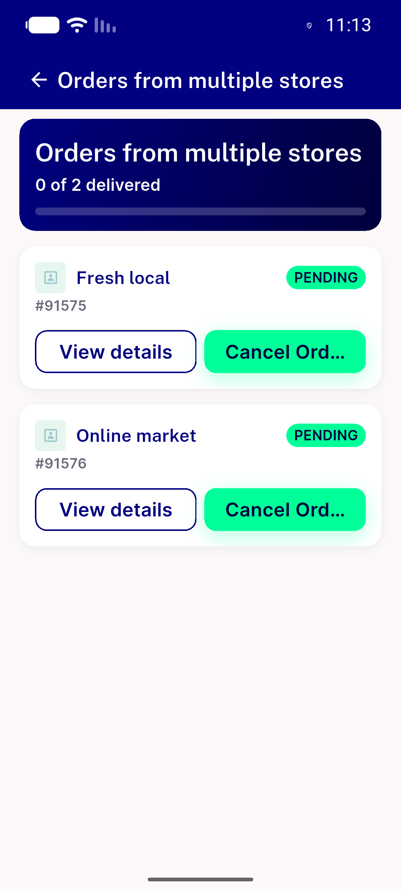</a> ac8 placed order success</td>
<td align="center" width="33%"><a href="ac8-preview-coupon-applied-38.75.png">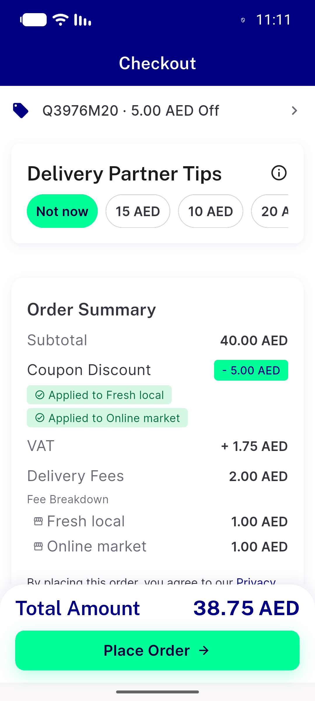</a> ac8 preview coupon applied 38.75</td>
</tr>
<tr>
<td align="center" width="33%"><a href="ac9-coupon-removed.png">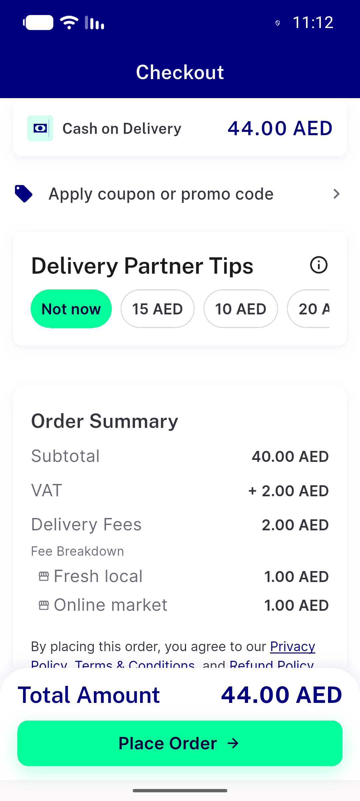</a> ac9 coupon removed</td>
<td align="center" width="33%"><a href="sw12-preview-27.20.png">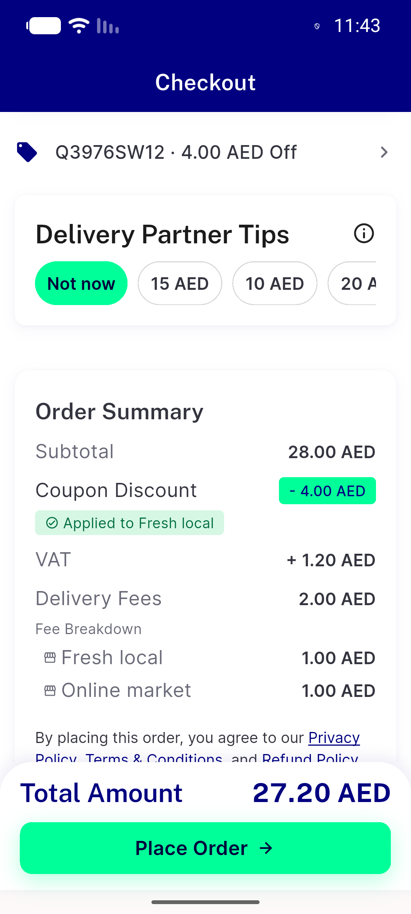</a> sw12 preview 27.20</td>
<td align="center" width="33%"> truncated CAP8 preview 35.60</td>
</tr>
<tr>
<td align="center" width="33%"><a href="truncated-F25-preview-18.00.png">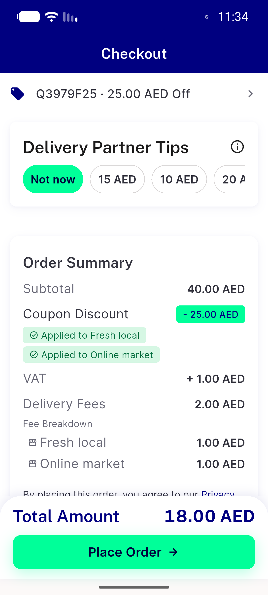</a> truncated F25 preview 18.00</td>
</tr>
</table>

### Other artifacts
- [`Nears3979GroupTaxCouponFixtureSeeder.php`](Nears3979GroupTaxCouponFixtureSeeder.php)
- [`ac15-fail-line.log`](ac15-fail-line.log)
- [`get-tax-group-place-bodies.log`](get-tax-group-place-bodies.log)
- [`progress.md`](progress.md)

---
*From `nears/docs/qa-evidence/NEARS-3979/` · public-repo scrub policy (no live secrets; verified clean).*
