# QA Evidence — NEARS-398

**PASS — single-store/tower reskin: suppression matrix (single-store/multi-store/non-tower) verified live; hero navy+mint+navyGlass-skeleton; neutral badges; flash-sale null-safe on tower+marketplace; C1 one-per-zone; dark+RTL; analyze clean; 879 tests green**

**13 screenshot(s).** Click any thumbnail for full resolution.

<table>
<tr>
<td align="center" width="33%"><a href="01-marketplace-home-397-intact.png">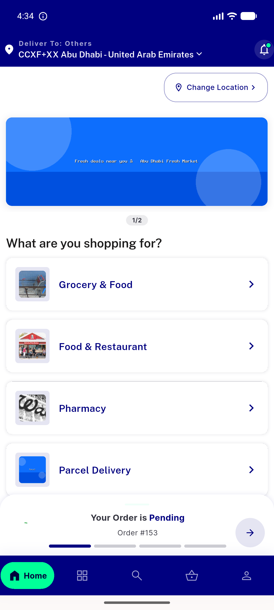</a> marketplace home 397 intact</td>
<td align="center" width="33%"><a href="02-grocery-marketplace-flashsale.png">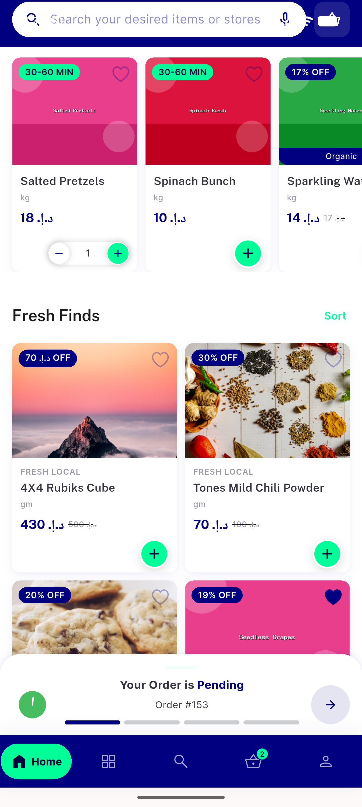</a> grocery marketplace flashsale</td>
<td align="center" width="33%"><a href="03-grocery-flashsale-items-discount-tags.png">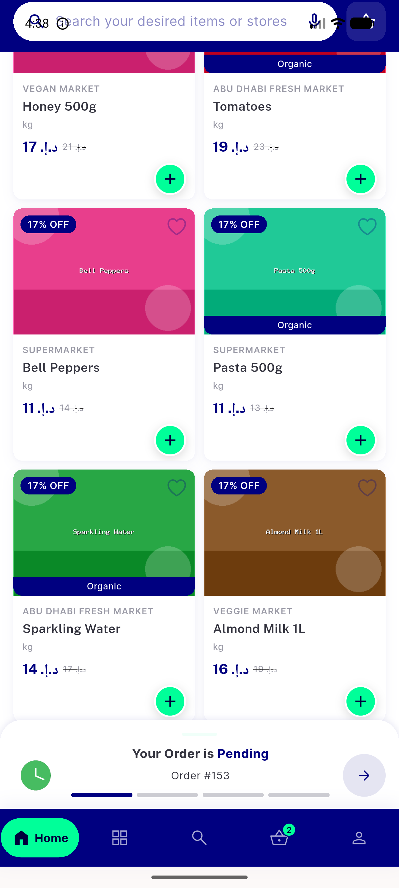</a> grocery flashsale items discount tags</td>
</tr>
<tr>
<td align="center" width="33%"><a href="04-saved-addresses-screen.png">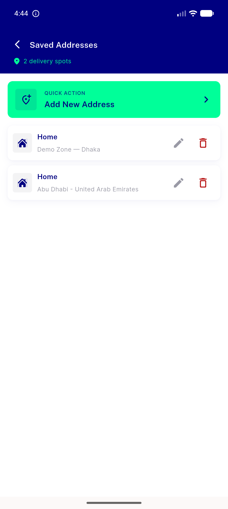</a> saved addresses screen</td>
<td align="center" width="33%"><a href="05-singlestore-hero-light-chips-suppressed-rails.png">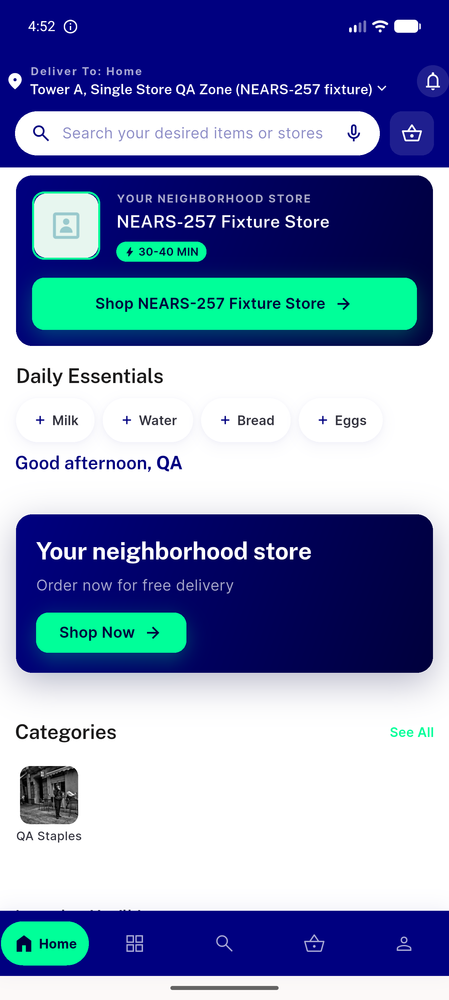</a> singlestore hero light chips suppressed rails</td>
<td align="center" width="33%"><a href="06-daily-essential-chip-prefilled-search.png">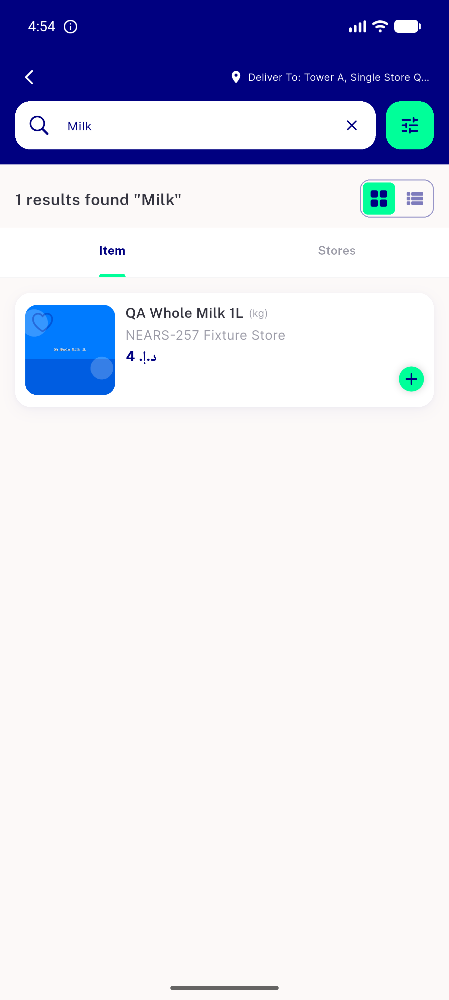</a> daily essential chip prefilled search</td>
</tr>
<tr>
<td align="center" width="33%"><a href="07-hero-tap-opens-store.png">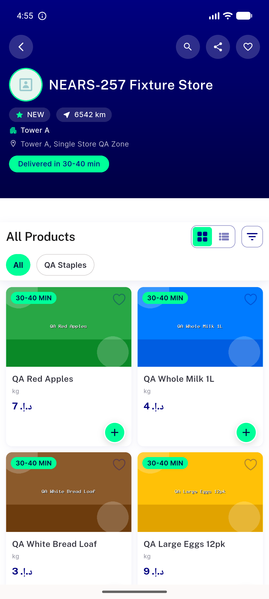</a> hero tap opens store</td>
<td align="center" width="33%"><a href="08-singlestore-hero-DARK.png">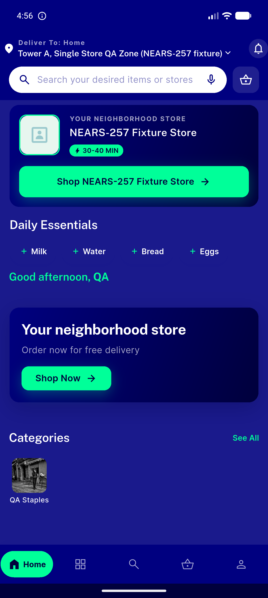</a> singlestore hero DARK</td>
<td align="center" width="33%"><a href="09-arabic-profile-rtl.png">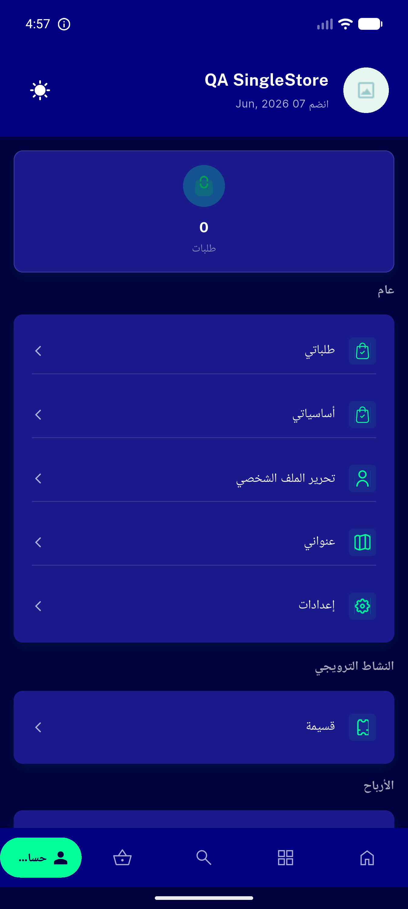</a> arabic profile rtl</td>
</tr>
<tr>
<td align="center" width="33%"><a href="10-singlestore-hero-RTL-arabic-bidi.png">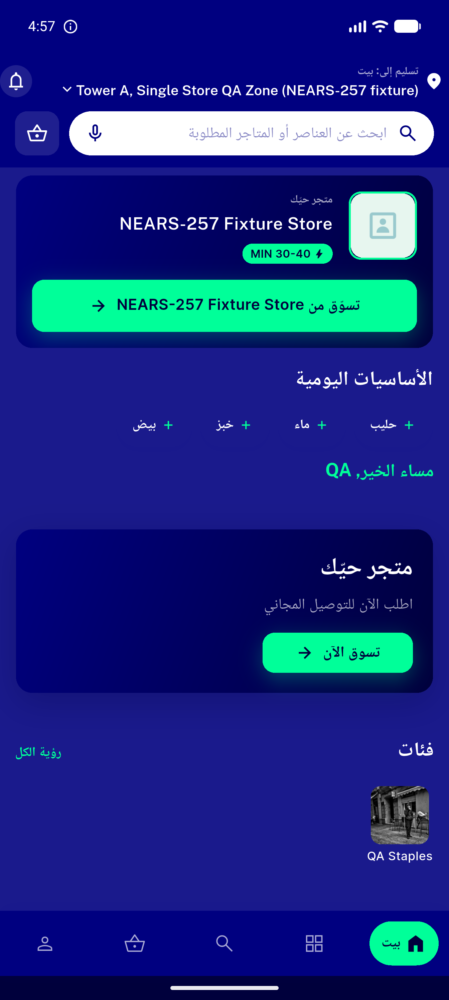</a> singlestore hero RTL arabic bidi</td>
<td align="center" width="33%"><a href="11-multistore-tower-rails-neutral-badges.png">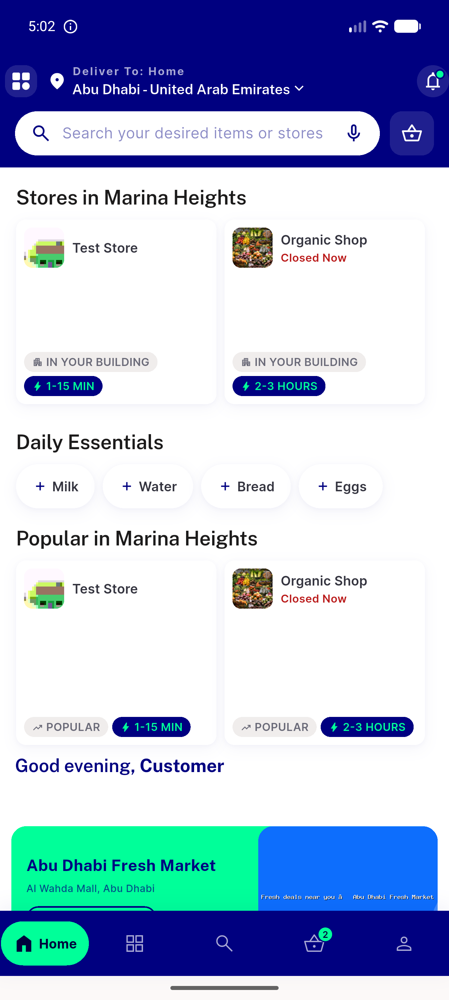</a> multistore tower rails neutral badges</td>
<td align="center" width="33%"><a href="12-nontower-address-towerviews-selfhidden.png">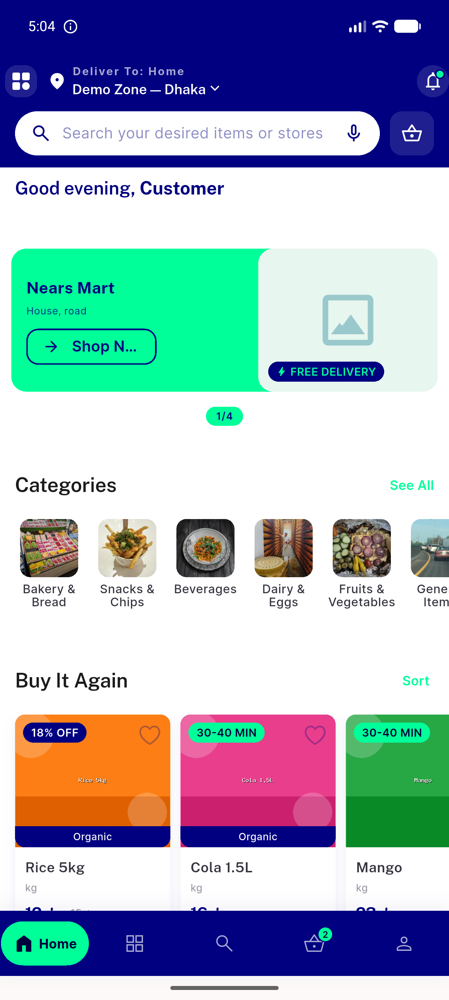</a> nontower address towerviews selfhidden</td>
</tr>
<tr>
<td align="center" width="33%"><a href="13-flashsale-additem-cart-guard.png">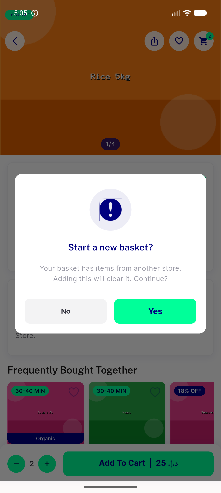</a> flashsale additem cart guard</td>
</tr>
</table>

### Other artifacts
- [`progress.md`](progress.md)

---
*From `nears/docs/qa-evidence/NEARS-398/` · public-repo scrub policy (no live secrets; verified clean).*
