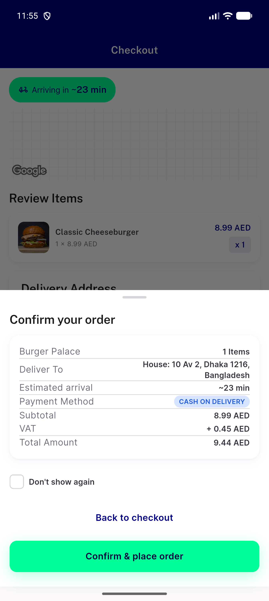
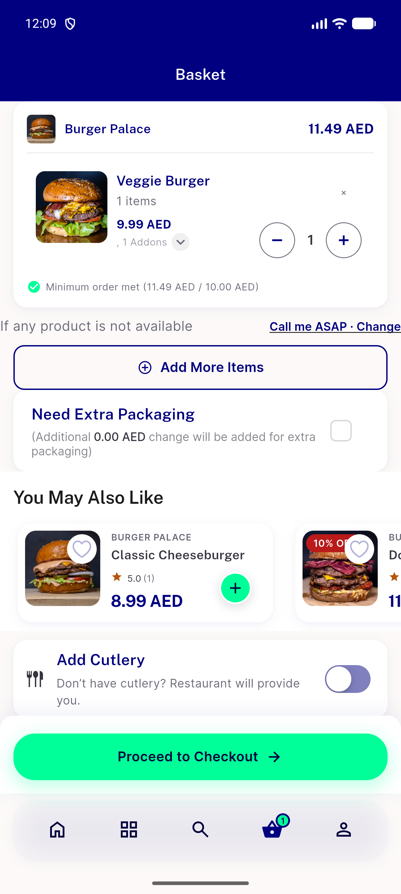
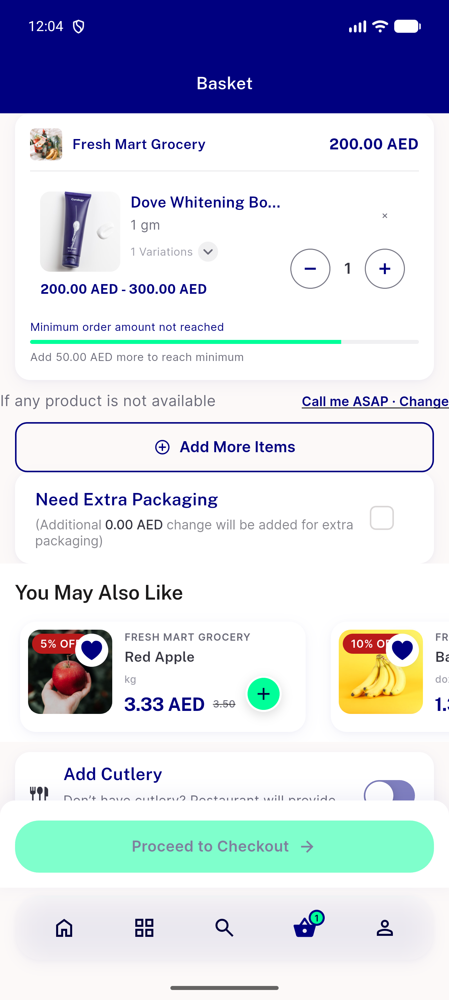
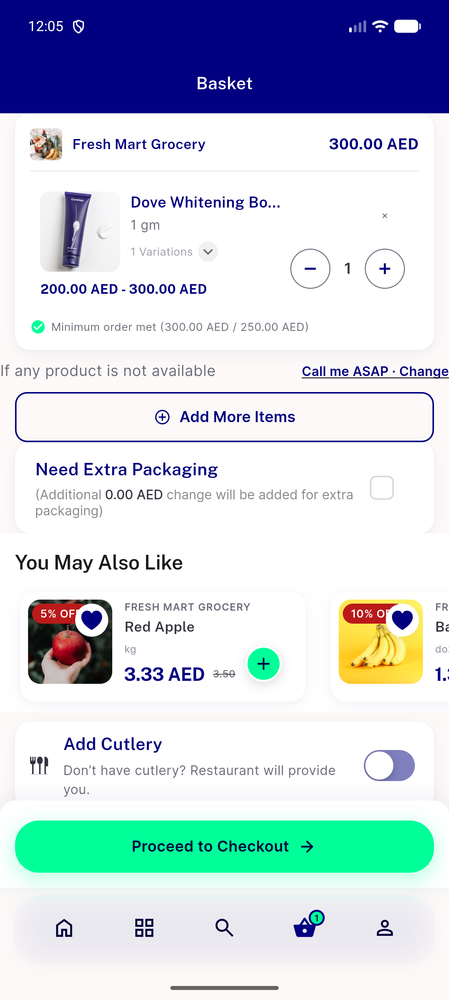
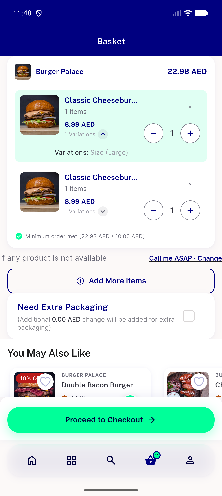
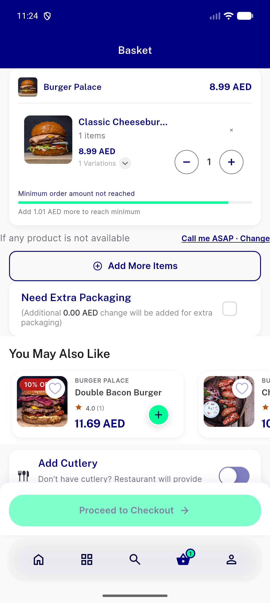
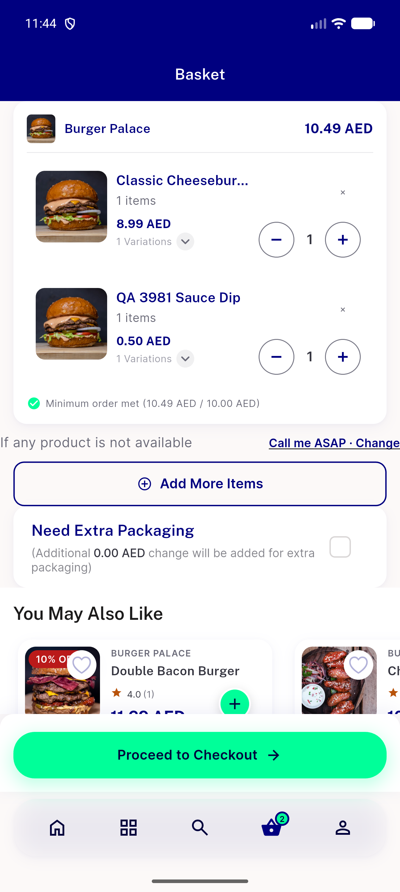
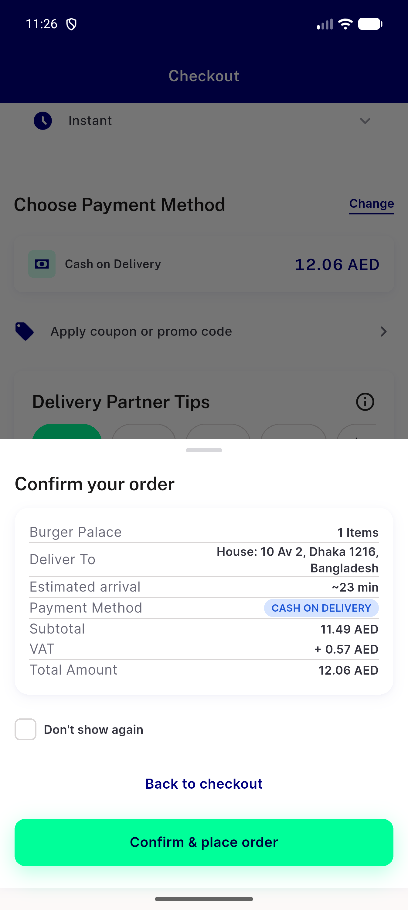
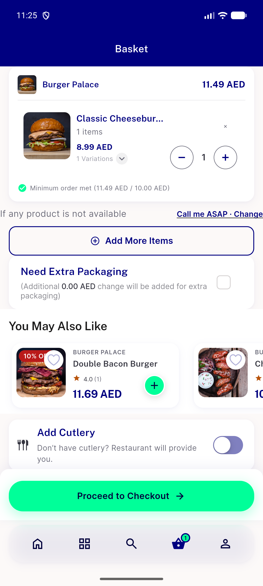
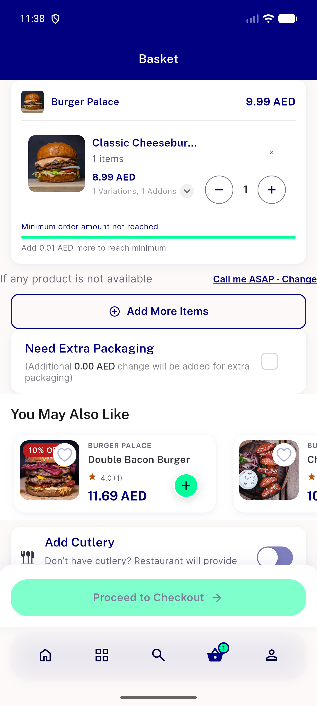

# QA Evidence — NEARS-3981

**QA PASS: food option prices count toward the min-order check (live, emulator-5662)**

**17 screenshot(s).** Click any thumbnail for full resolution.

<table>
<tr>
<td align="center" width="33%"> A3 forced 406 in app</td>
<td align="center" width="33%"> A4a food addon no option met</td>
<td align="center" width="33%"> A4b nonfood 250ml below min</td>
</tr>
<tr>
<td align="center" width="33%"> A4b nonfood 500ml met</td>
<td align="center" width="33%"> A4c discounted large met</td>
<td align="center" width="33%"> A5 local pair bar</td>
</tr>
<tr>
<td align="center" width="33%"> A5 local pair rows show large</td>
<td align="center" width="33%"> A5 reload bar</td>
<td align="center" width="33%"> C1 regular below min</td>
</tr>
<tr>
<td align="center" width="33%"> C12 two items met</td>
<td align="center" width="33%"> C2 confirm sheet</td>
<td align="center" width="33%"> C2 large met</td>
</tr>
<tr>
<td align="center" width="33%"> C3 regular tomato below min</td>
<td align="center" width="33%"> C4 regular egg met</td>
<td align="center" width="33%"> C6 regular addon cheese met</td>
</tr>
<tr>
<td align="center" width="33%"> C7 regular jalapeno below min</td>
<td align="center" width="33%"> C8 large x2 met</td>
</tr>
</table>

### Other artifacts
- [`A5-reload-order-91417-sent.txt`](A5-reload-order-91417-sent.txt)
- [`bug-checkout-local-min-gate-post-discount.log`](bug-checkout-local-min-gate-post-discount.log)
- [`bug-search-results-semantics-assertion.log`](bug-search-results-semantics-assertion.log)
- [`progress.md`](progress.md)

---
*From `nears/docs/qa-evidence/NEARS-3981/` · public-repo scrub policy (no live secrets; verified clean).*
