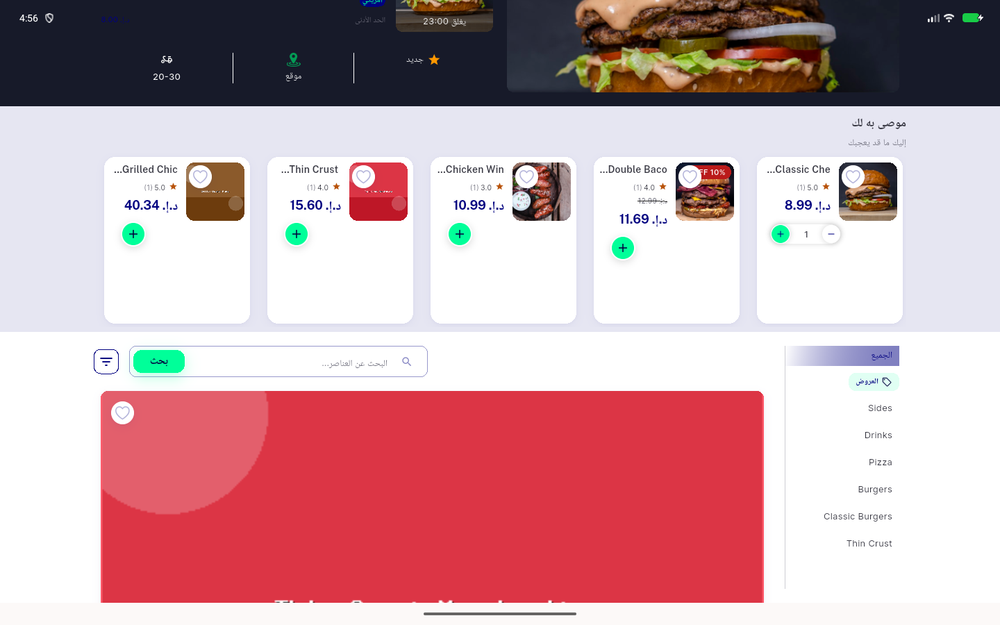
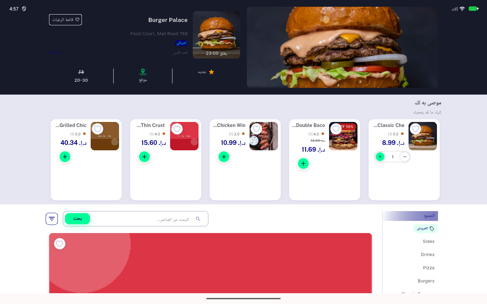
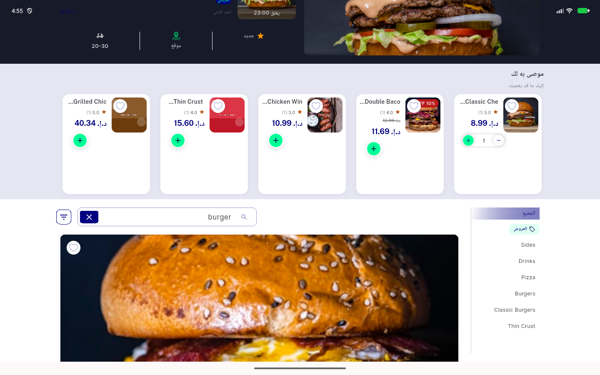

# QA Evidence — NEARS-3992-step4

**NEARS-3992 step4 QA PASS (3b desktop-width live, 3a phone live)**

**5 screenshot(s).** Click any thumbnail for full resolution.

<table>
<tr>
<td align="center" width="33%"> 3a 360x800 ar store after filter close</td>
<td align="center" width="33%"> 3a 412x915 ar store reentry</td>
<td align="center" width="33%"> 3b 1440x900 after close</td>
</tr>
<tr>
<td align="center" width="33%"> 3b 1440x900 reentry after back while searching</td>
<td align="center" width="33%"> 3b 1440x900 search results</td>
</tr>
</table>

### Other artifacts
- [`ac1-test.log`](ac1-test.log)
- [`ac4-analyze.log`](ac4-analyze.log)
- [`ac5-smart_management_only_builder_test.log`](ac5-smart_management_only_builder_test.log)
- [`ac5-store_item_search_overflow_test.log`](ac5-store_item_search_overflow_test.log)
- [`ac5-store_screen_cart_bar_test.log`](ac5-store_screen_cart_bar_test.log)
- [`ac5-store_screen_fab_scoped_rebuild_test.log`](ac5-store_screen_fab_scoped_rebuild_test.log)
- [`ac5-store_screen_null_config_fab_test.log`](ac5-store_screen_null_config_fab_test.log)
- [`ac5-store_screen_slug_forwarding_test.log`](ac5-store_screen_slug_forwarding_test.log)
- [`ac5-store_search_states_test.log`](ac5-store_search_states_test.log)
- [`logcat-flutter-live.log`](logcat-flutter-live.log)
- [`logcat-flutter-startup.log`](logcat-flutter-startup.log)
- [`vmservice-streams.filtered.log`](vmservice-streams.filtered.log)

---
*From `nears/docs/qa-evidence/NEARS-3992-step4/` · public-repo scrub policy (no live secrets; verified clean).*
