# QA Evidence — NEARS-3992-step5

**NEARS-3992 step5 UA-010 independent QA: PASS**

**17 screenshot(s).** Click any thumbnail for full resolution.

<table>
<tr>
<td align="center" width="33%"><a href="BASE-360x800-fs1.3-en-latest-default.png">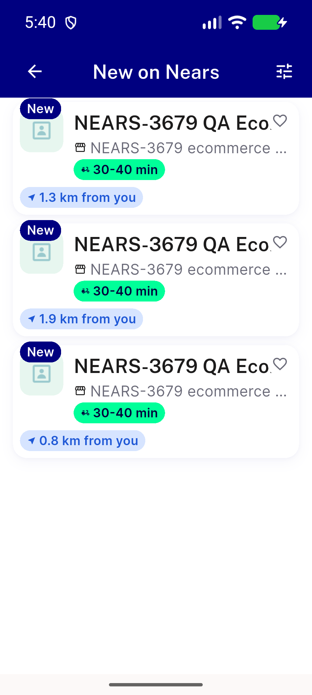</a> BASE 360x800 fs1.3 en latest default</td>
<td align="center" width="33%"><a href="BASE-360x800-fs1.3-en-latest-nearest.png">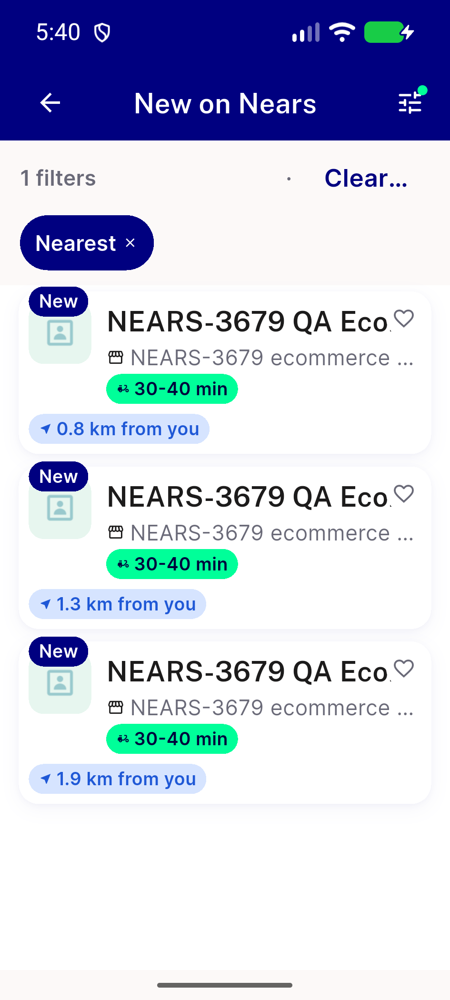</a> BASE 360x800 fs1.3 en latest nearest</td>
<td align="center" width="33%"><a href="BASE-360x800-fs1.3-en-zero-store-chip-hidden.png">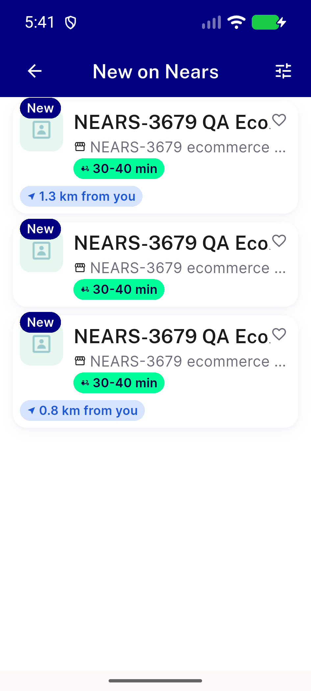</a> BASE 360x800 fs1.3 en zero store chip hidden</td>
</tr>
<tr>
<td align="center" width="33%"><a href="ac6-360x800-fs1.3-ar-latest-nearest.png">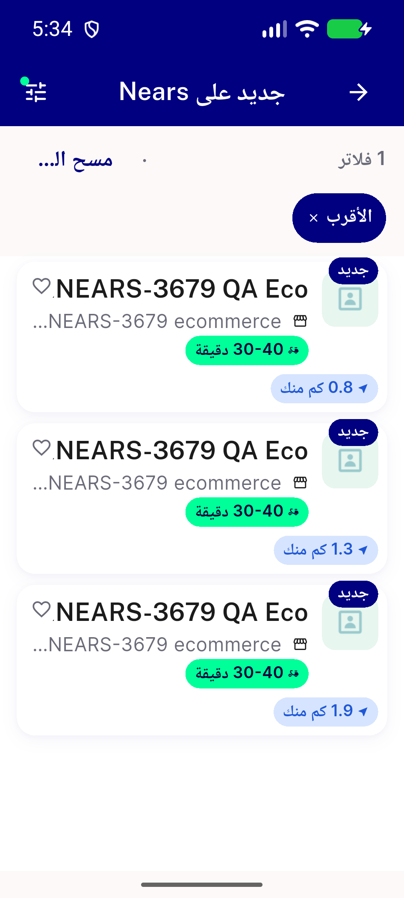</a> ac6 360x800 fs1.3 ar latest nearest</td>
<td align="center" width="33%"><a href="ac6-360x800-fs1.3-ar-zero-store-chip-hidden.png">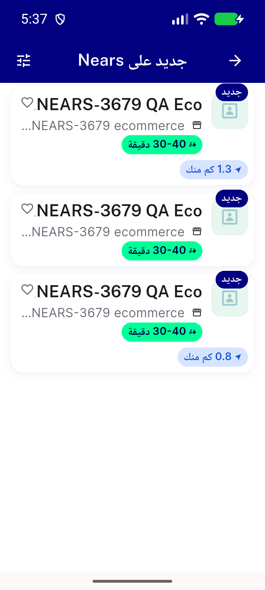</a> ac6 360x800 fs1.3 ar zero store chip hidden</td>
<td align="center" width="33%"> ac6 360x800 fs1.3 ar zero store nearest</td>
</tr>
<tr>
<td align="center" width="33%"><a href="ac6-360x800-fs1.3-en-latest-default-addr60.png">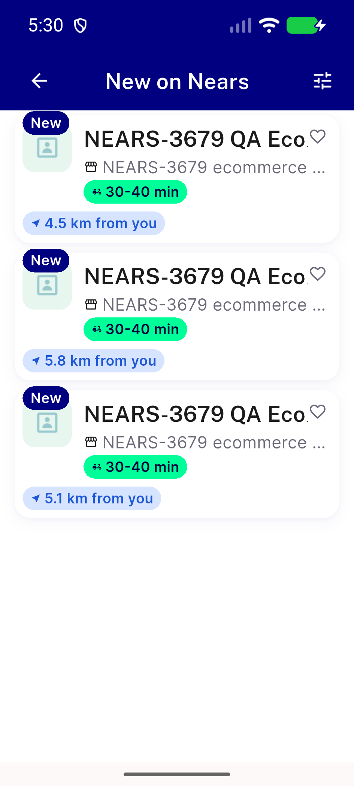</a> ac6 360x800 fs1.3 en latest default addr60</td>
<td align="center" width="33%"> ac6 360x800 fs1.3 en latest nearest addr60</td>
<td align="center" width="33%"><a href="ac6-360x800-fs1.3-en-popular-default-addr60.png">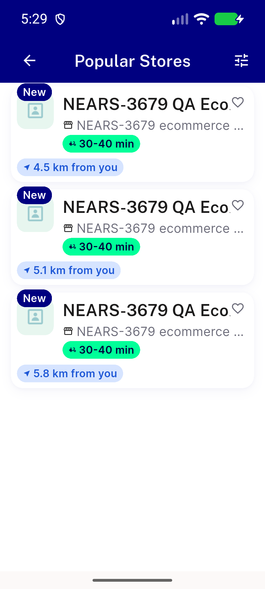</a> ac6 360x800 fs1.3 en popular default addr60</td>
</tr>
<tr>
<td align="center" width="33%"><a href="ac6-360x800-fs1.3-en-popular-default.png">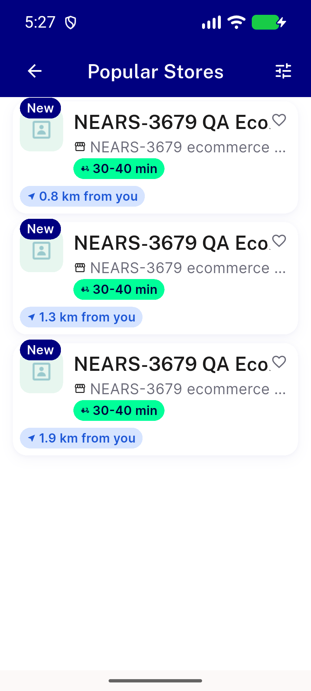</a> ac6 360x800 fs1.3 en popular default</td>
<td align="center" width="33%"> ac6 360x800 fs1.3 en popular nearest</td>
<td align="center" width="33%"><a href="ac6-412x915-fs1.3-ar-latest-default.png">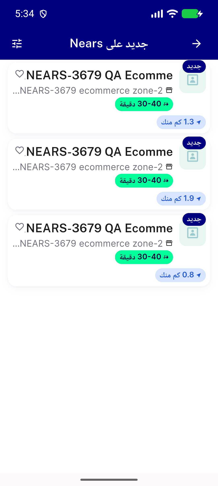</a> ac6 412x915 fs1.3 ar latest default</td>
</tr>
<tr>
<td align="center" width="33%"><a href="ac6-412x915-fs1.3-ar-latest-nearest-carried.png">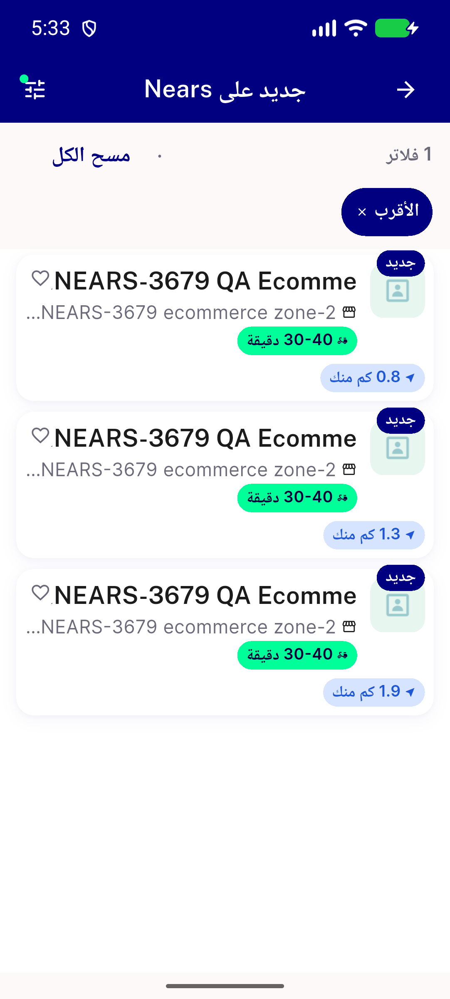</a> ac6 412x915 fs1.3 ar latest nearest carried</td>
<td align="center" width="33%"><a href="ac6-412x915-fs1.3-ar-latest-nearest.png">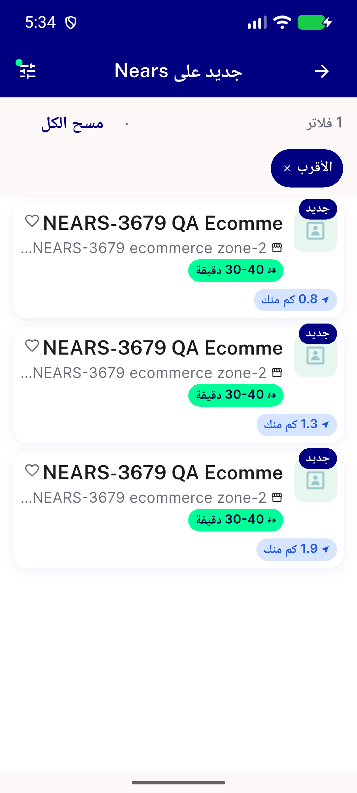</a> ac6 412x915 fs1.3 ar latest nearest</td>
<td align="center" width="33%"><a href="ac6-412x915-fs1.3-en-latest-default-addr60.png">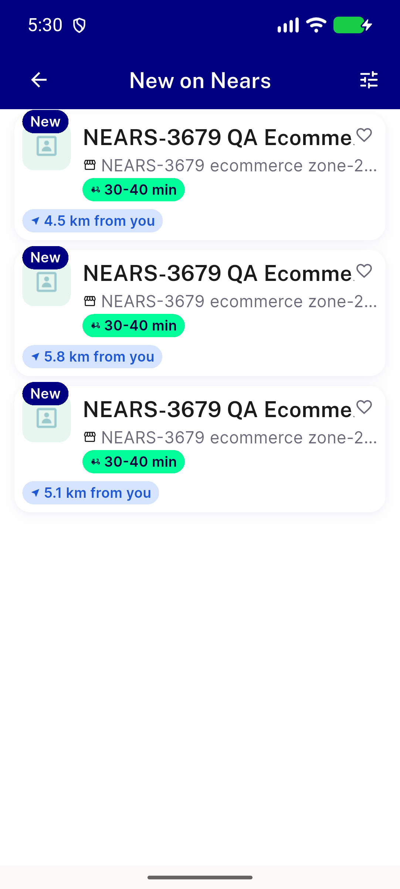</a> ac6 412x915 fs1.3 en latest default addr60</td>
</tr>
<tr>
<td align="center" width="33%"><a href="ac6-412x915-fs1.3-en-latest-nearest-addr60.png">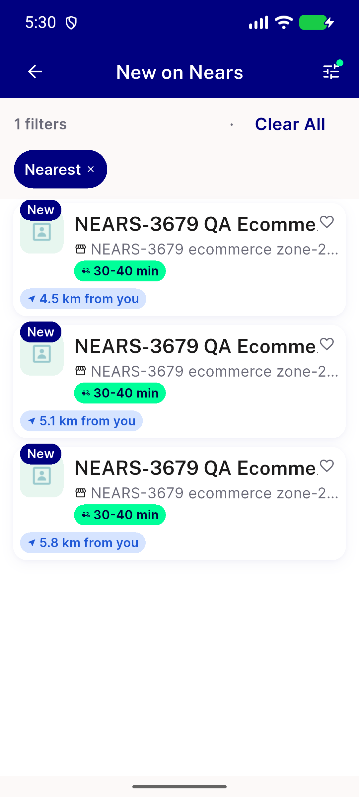</a> ac6 412x915 fs1.3 en latest nearest addr60</td>
<td align="center" width="33%"> ac6 zero address service unavailable</td>
</tr>
</table>

### Other artifacts
- [`BASE-order-latest-default-360-en-guestaddr.txt`](BASE-order-latest-default-360-en-guestaddr.txt)
- [`BASE-order-latest-nearest-360-en-guestaddr.txt`](BASE-order-latest-nearest-360-en-guestaddr.txt)
- [`BASE-order-latest-nearest-412-en-guestaddr.txt`](BASE-order-latest-nearest-412-en-guestaddr.txt)
- [`BASE-order-latest-zero-store-360-en.txt`](BASE-order-latest-zero-store-360-en.txt)
- [`BASE-order-latest-zero-store-nearest-360-en.txt`](BASE-order-latest-zero-store-nearest-360-en.txt)
- [`INDEX.txt`](INDEX.txt)
- [`ac1-new-test-11of11.log`](ac1-new-test-11of11.log)
- [`ac2-diff-stat.txt`](ac2-diff-stat.txt)
- [`ac2-lib-diff.patch`](ac2-lib-diff.patch)
- [`ac4-analyze-scoped.log`](ac4-analyze-scoped.log)
- [`ac5-existing-suites.log`](ac5-existing-suites.log)
- [`ac6-360x800-en-popular-default.a11y.txt`](ac6-360x800-en-popular-default.a11y.txt)
- [`ac6-360x800-en-popular-nearest.a11y.txt`](ac6-360x800-en-popular-nearest.a11y.txt)
- [`ac6-log-windows.txt`](ac6-log-windows.txt)
- [`db-processlist-during-traffic.txt`](db-processlist-during-traffic.txt)
- [`expected-distance-formula.py`](expected-distance-formula.py)
- [`expected-distances-addr45-24.453884_54.3773438.txt`](expected-distances-addr45-24.453884_54.3773438.txt)
- [`expected-distances-addr60-24.45_54.425.txt`](expected-distances-addr60-24.45_54.425.txt)
- [`expected-distances-guestaddr-24.4538833_54.3773433.txt`](expected-distances-guestaddr-24.4538833_54.3773433.txt)
- [`order-default-360-en-addr60.txt`](order-default-360-en-addr60.txt)
- [`order-default-360-en.txt`](order-default-360-en.txt)
- [`order-latest-default-360-en-addr60.txt`](order-latest-default-360-en-addr60.txt)
- [`order-latest-default-412-ar-guestaddr.txt`](order-latest-default-412-ar-guestaddr.txt)
- [`order-latest-default-412-en-addr60.txt`](order-latest-default-412-en-addr60.txt)
- [`order-latest-nearest-360-ar-guestaddr.txt`](order-latest-nearest-360-ar-guestaddr.txt)
- [`order-latest-nearest-360-en-addr60.txt`](order-latest-nearest-360-en-addr60.txt)
- [`order-latest-nearest-412-ar-guestaddr.txt`](order-latest-nearest-412-ar-guestaddr.txt)
- [`order-latest-nearest-412-en-addr60.txt`](order-latest-nearest-412-en-addr60.txt)
- [`order-latest-nearest-carried-412-ar-guestaddr.txt`](order-latest-nearest-carried-412-ar-guestaddr.txt)
- [`order-latest-nearest2-412-en-addr60.txt`](order-latest-nearest2-412-en-addr60.txt)
- [`order-latest-zero-store-360-ar.txt`](order-latest-zero-store-360-ar.txt)
- [`order-latest-zero-store-nearest-360-ar.txt`](order-latest-zero-store-nearest-360-ar.txt)
- [`order-nearest-360-en.txt`](order-nearest-360-en.txt)

---
*From `nears/docs/qa-evidence/NEARS-3992-step5/` · public-repo scrub policy (no live secrets; verified clean).*
