# QA Evidence — NEARS-3992

**step 7 composer id: device-free PASS, live PASS**

**21 screenshot(s).** Click any thumbnail for full resolution.

<table>
<tr>
<td align="center" width="33%"><a href="live-01-thread-idle.png">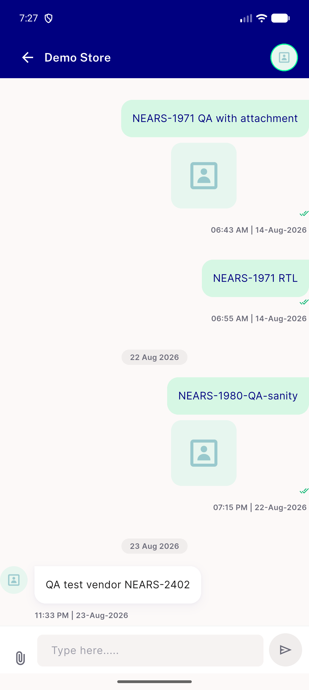</a> live 01 thread idle</td>
<td align="center" width="33%"><a href="live-02-one-char.png">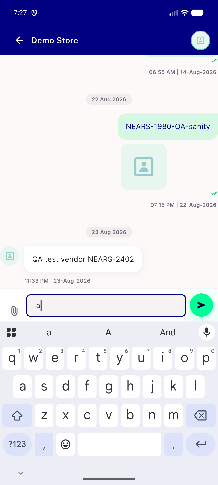</a> live 02 one char</td>
<td align="center" width="33%"><a href="live-03-cleared.png">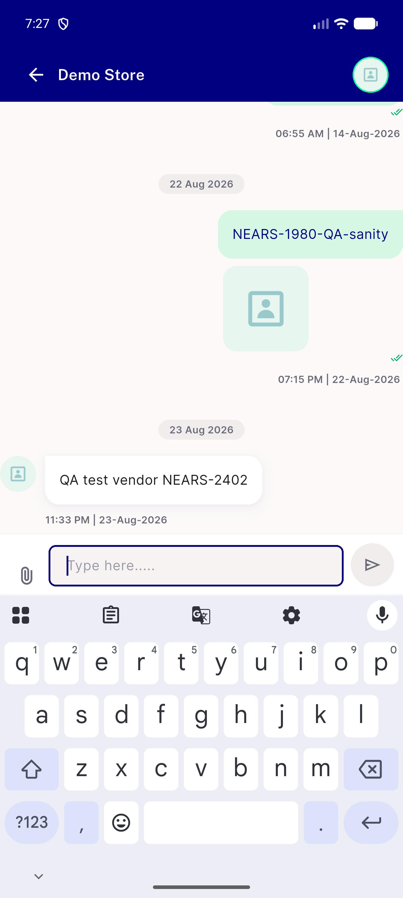</a> live 03 cleared</td>
</tr>
<tr>
<td align="center" width="33%"><a href="live-04-image-staged.png">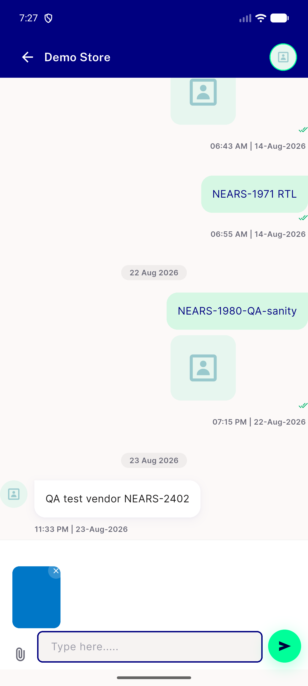</a> live 04 image staged</td>
<td align="center" width="33%"><a href="live-05-image-removed.png">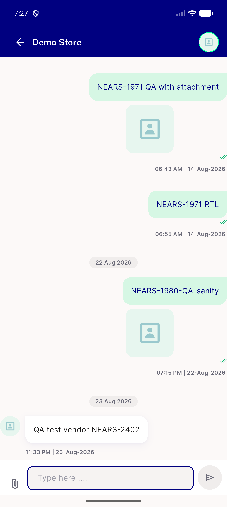</a> live 05 image removed</td>
<td align="center" width="33%"><a href="live-06-load-failed.png">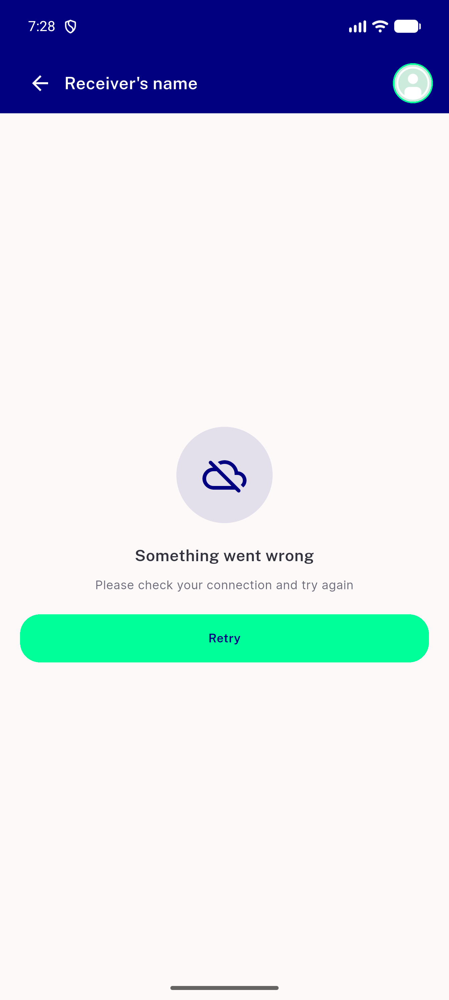</a> live 06 load failed</td>
</tr>
<tr>
<td align="center" width="33%"> live 07 retry ok</td>
<td align="center" width="33%"> live 08 text typed</td>
<td align="center" width="33%"><a href="live-09-sending-spinner.png">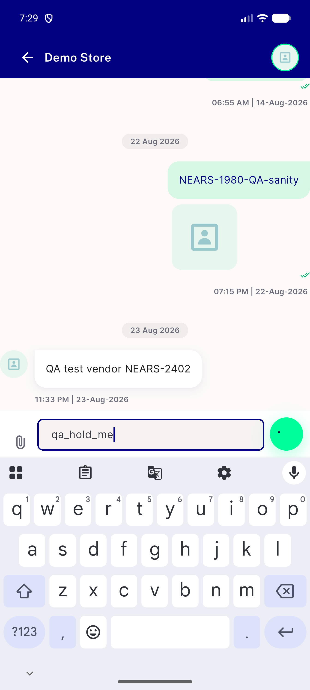</a> live 09 sending spinner</td>
</tr>
<tr>
<td align="center" width="33%"><a href="live-10-failed-send-spinner-cleared.png">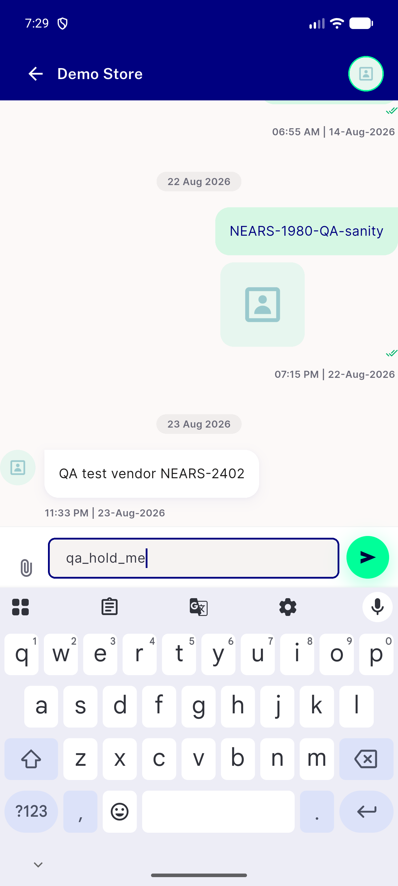</a> live 10 failed send spinner cleared</td>
<td align="center" width="33%"><a href="live-12-send-done.png">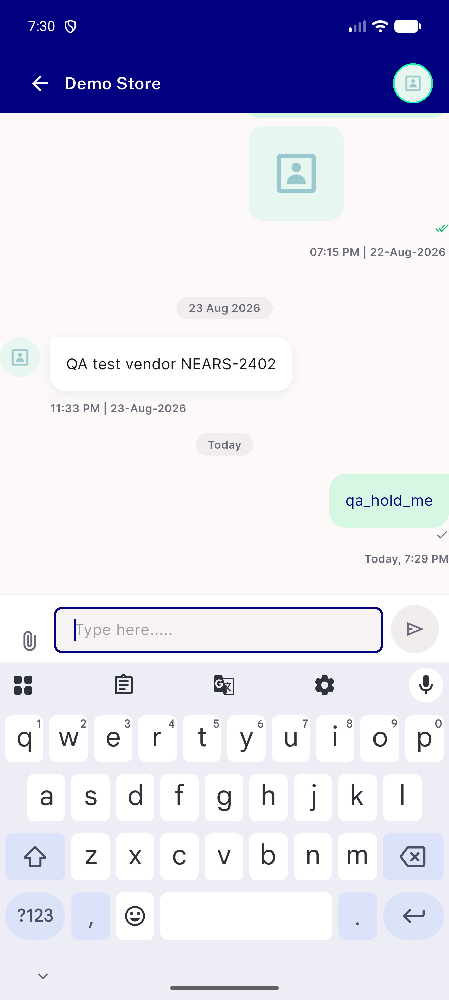</a> live 12 send done</td>
<td align="center" width="33%"><a href="live-13-refresh-failed-text-typed.png">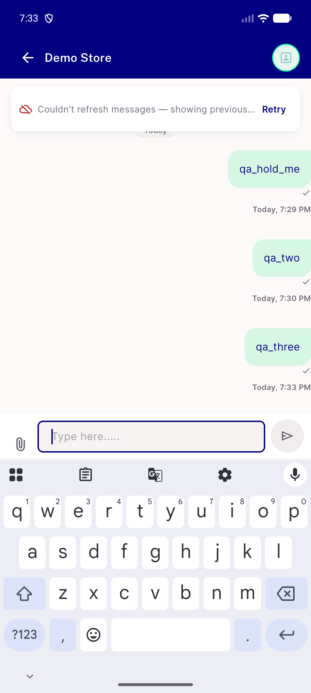</a> live 13 refresh failed text typed</td>
</tr>
<tr>
<td align="center" width="33%"><a href="live-15-retry-still-failing-b.png">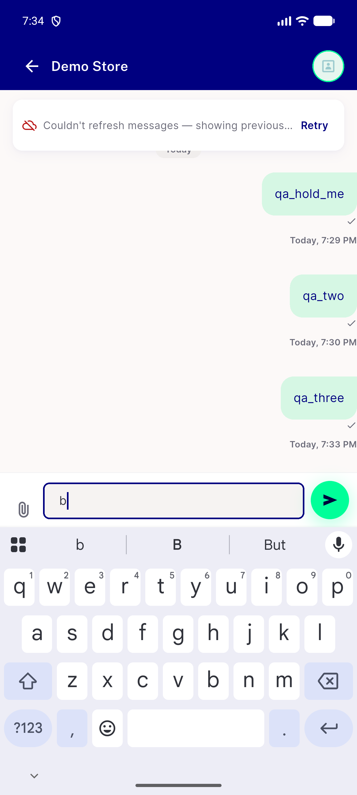</a> live 15 retry still failing b</td>
<td align="center" width="33%"><a href="live-16-retry-ok-b.png">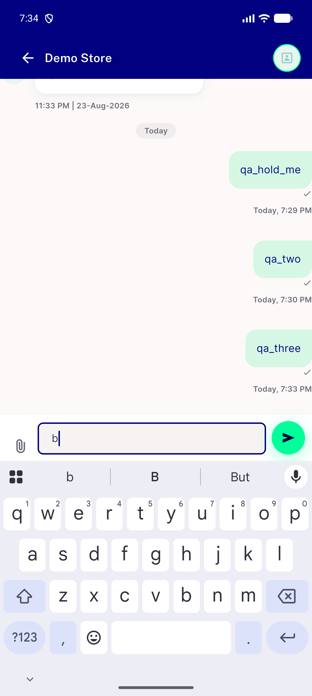</a> live 16 retry ok b</td>
<td align="center" width="33%"><a href="live-ar-01-idle.png">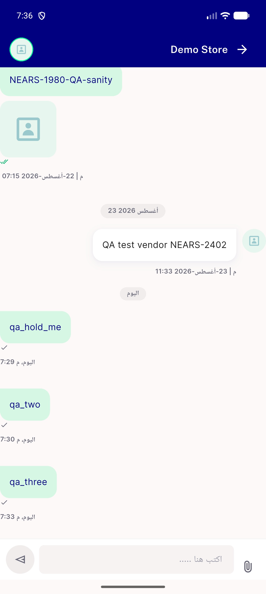</a> live ar 01 idle</td>
</tr>
<tr>
<td align="center" width="33%"><a href="live-ar-02-one-char.png">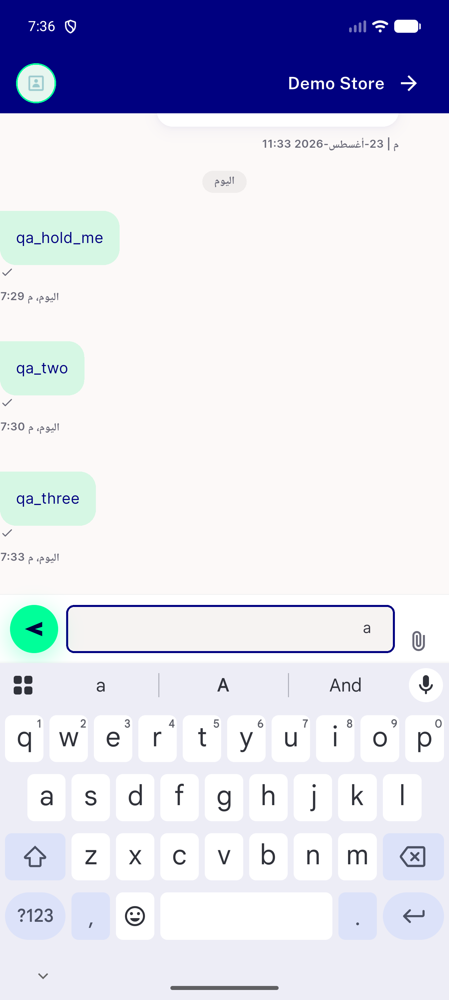</a> live ar 02 one char</td>
<td align="center" width="33%"><a href="live-ar-03-cleared.png">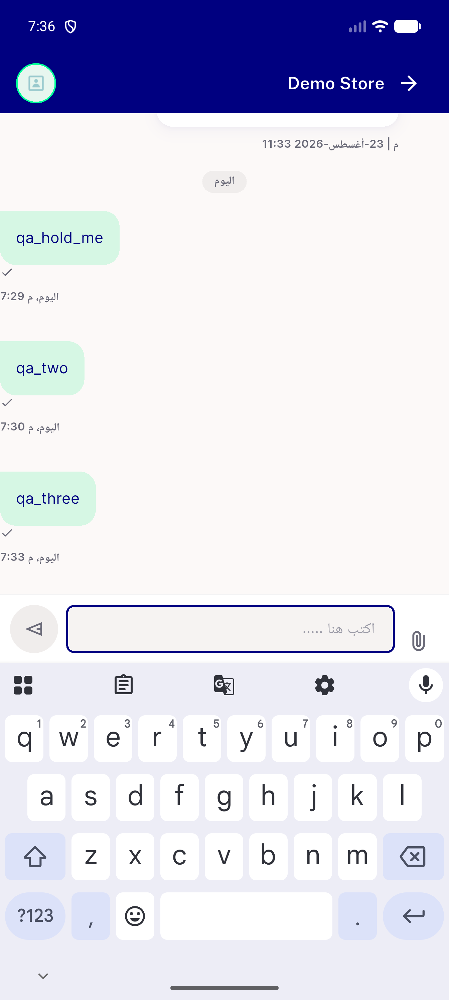</a> live ar 03 cleared</td>
<td align="center" width="33%"><a href="live-ar-05-order-help-one-char.png">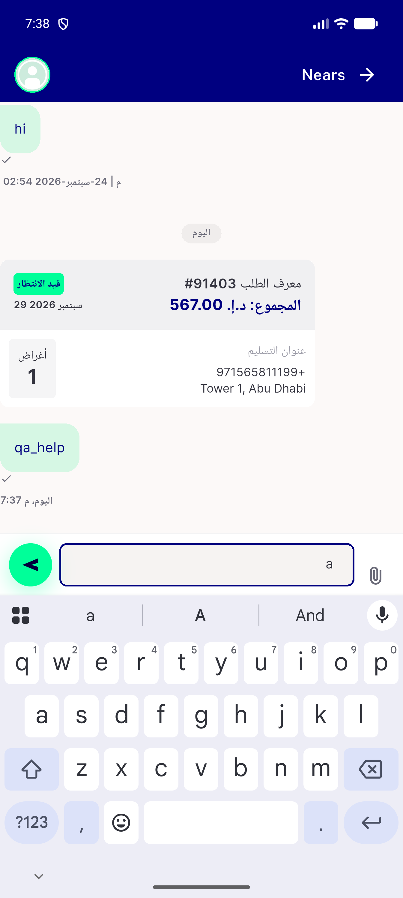</a> live ar 05 order help one char</td>
</tr>
<tr>
<td align="center" width="33%"><a href="live-ar-06-order-help-cleared.png">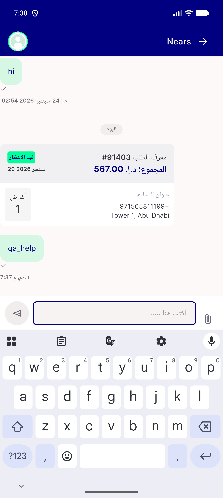</a> live ar 06 order help cleared</td>
<td align="center" width="33%"><a href="live-ar-07-admin-thread-empty.png">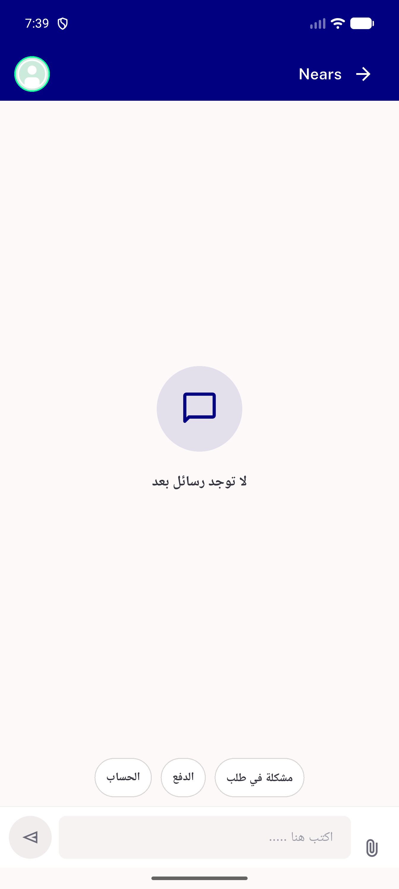</a> live ar 07 admin thread empty</td>
<td align="center" width="33%"><a href="live-ar-08-quick-topic-prefilled.png">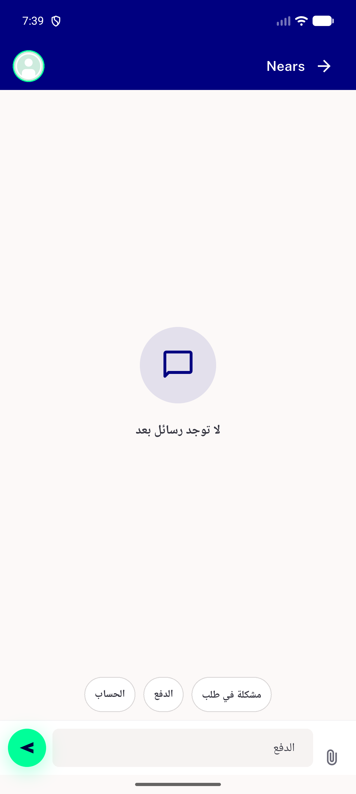</a> live ar 08 quick topic prefilled</td>
</tr>
</table>

### Other artifacts
- [`ac1-base-red.log`](ac1-base-red.log)
- [`ac1-tip-green.log`](ac1-tip-green.log)
- [`ac11-analyze.log`](ac11-analyze.log)
- [`ac3-m2-red.log`](ac3-m2-red.log)
- [`ac3-m3-red.log`](ac3-m3-red.log)
- [`ac3-m4-red.log`](ac3-m4-red.log)
- [`ac9-suite-summary.txt`](ac9-suite-summary.txt)
- [`bug-conversation-list-null-lastmessage.log`](bug-conversation-list-null-lastmessage.log)
- [`live-09-sending-spinner.xml`](live-09-sending-spinner.xml)
- [`live-10-failed-send-spinner-cleared.xml`](live-10-failed-send-spinner-cleared.xml)
- [`live-13-refresh-failed-text-typed.xml`](live-13-refresh-failed-text-typed.xml)

---
*From `nears/docs/qa-evidence/NEARS-3992/` · public-repo scrub policy (no live secrets; verified clean).*
