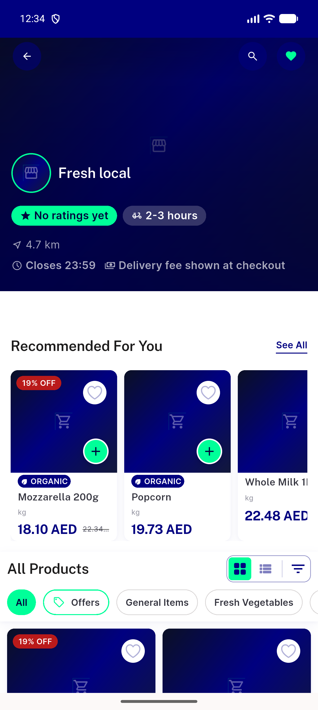
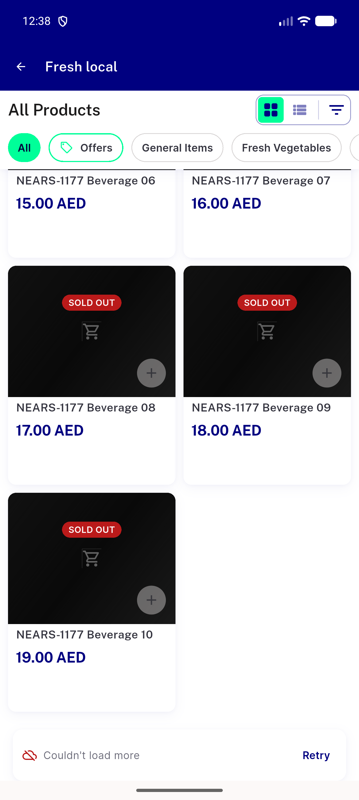
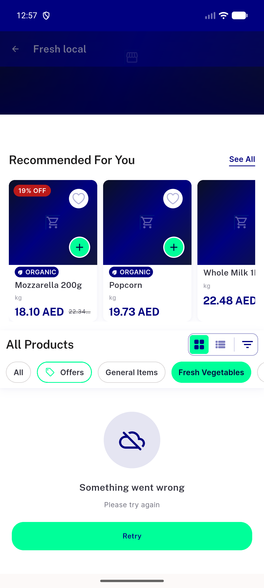
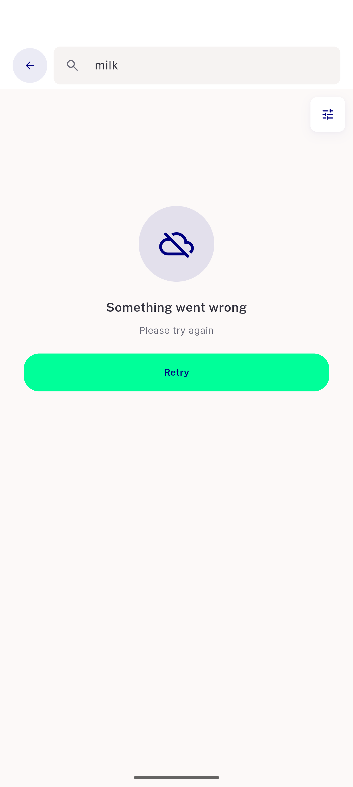

# QA Evidence — NEARS-3996-step5

**NEARS-3996 step 5 catalog-family extraction: PASS (FULL route walk base vs tip, EN + light; AR/RTL/dark DEFERRED; perf UNVERIFIED)**

**8 screenshot(s).** Click any thumbnail for full resolution.

<table>
<tr>
<td align="center" width="33%"> base A01</td>
<td align="center" width="33%"> base A17</td>
<td align="center" width="33%"> base A21</td>
</tr>
<tr>
<td align="center" width="33%"> base A29</td>
<td align="center" width="33%"> tip A01</td>
<td align="center" width="33%"> tip A17</td>
</tr>
<tr>
<td align="center" width="33%"> tip A21</td>
<td align="center" width="33%"> tip A29</td>
</tr>
</table>

### Other artifacts
- [`ac1_surface.txt`](ac1_surface.txt)
- [`ac2_verbatim.txt`](ac2_verbatim.txt)
- [`analyze.md`](analyze.md)
- [`bug-facebook-sdk-app-deleted.log`](bug-facebook-sdk-app-deleted.log)
- [`bug-semantics-assertion-render-table.log`](bug-semantics-assertion-render-table.log)
- [`build_identity.txt`](build_identity.txt)
- [`compare.py`](compare.py)
- [`d_helpers.sh`](d_helpers.sh)
- [`failure_and_retry_trials.md`](failure_and_retry_trials.md)
- [`mutation_list_mut.py`](mutation_list_mut.py)
- [`mutation_results.jsonl`](mutation_results.jsonl)
- [`mutations.md`](mutations.md)
- [`nets.md`](nets.md)
- [`progress.md`](progress.md)
- [`proxy.py`](proxy.py)
- [`rendered_parity.md`](rendered_parity.md)
- [`walk_recipe.sh`](walk_recipe.sh)
- [`wire_counts.md`](wire_counts.md)

---
*From `nears/docs/qa-evidence/NEARS-3996-step5/` · public-repo scrub policy (no live secrets; verified clean).*
