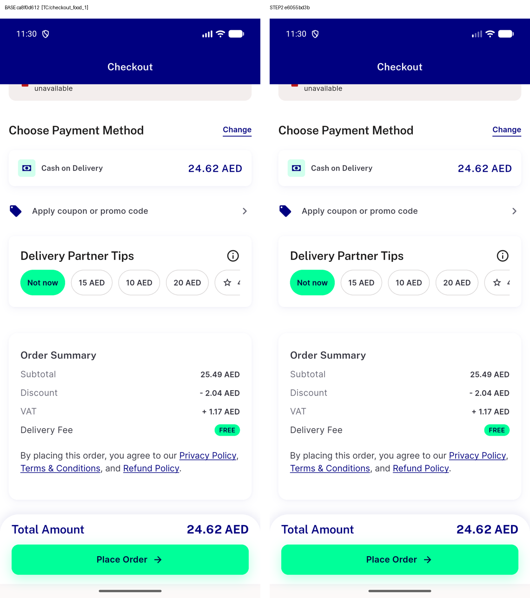
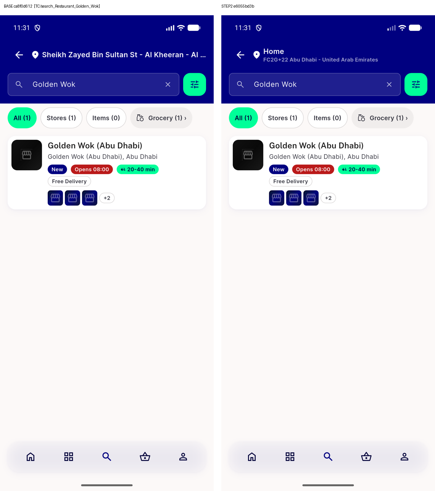
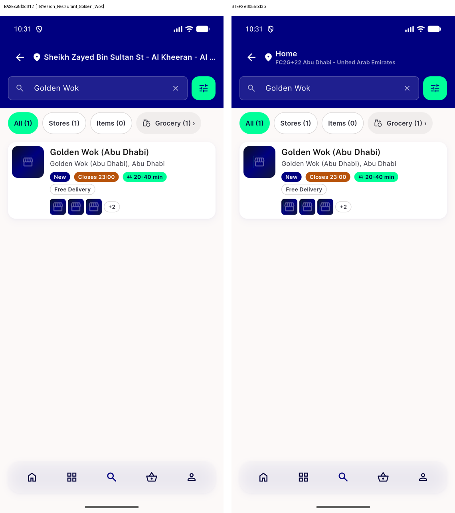
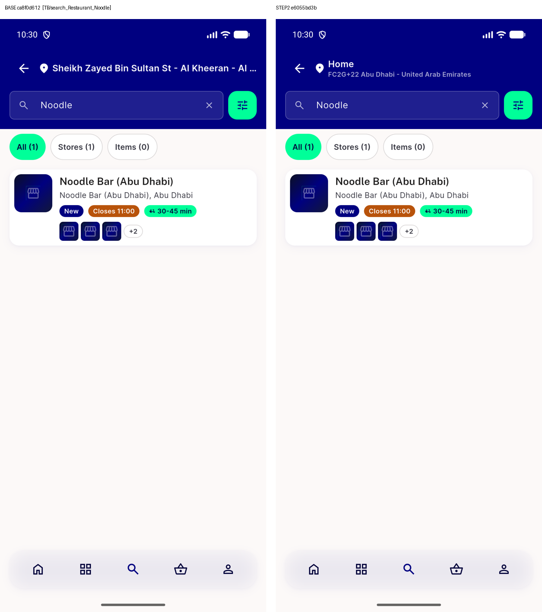
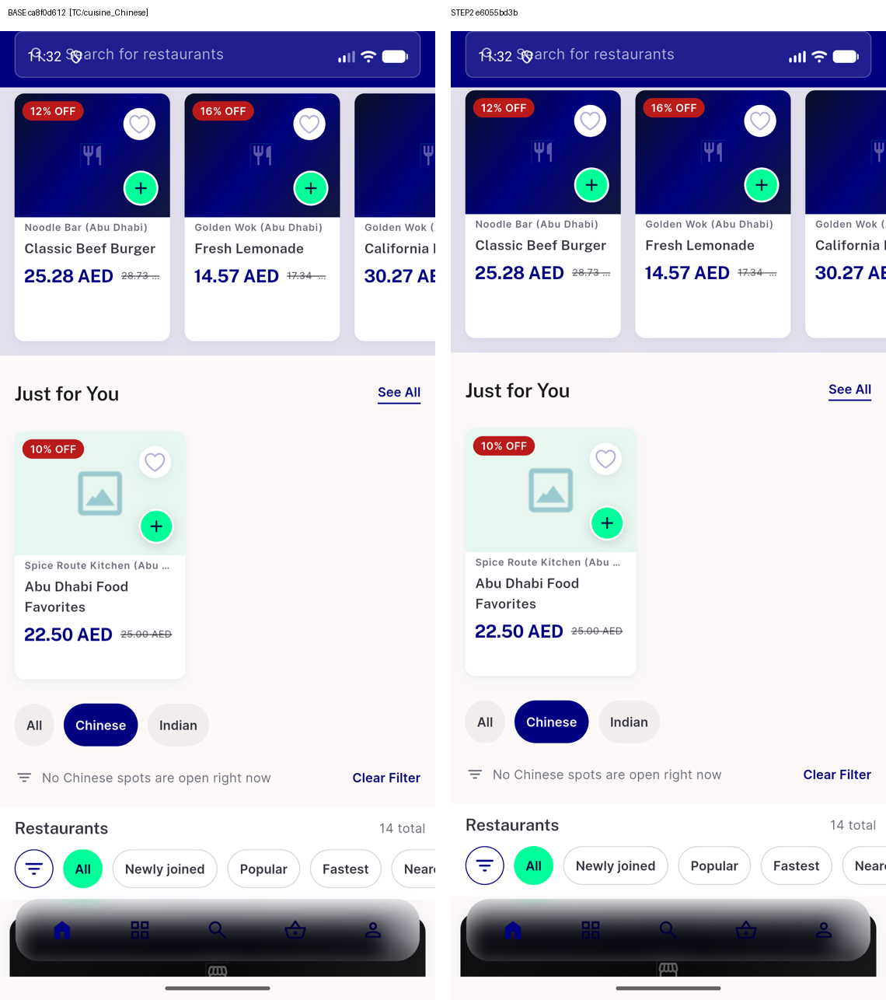
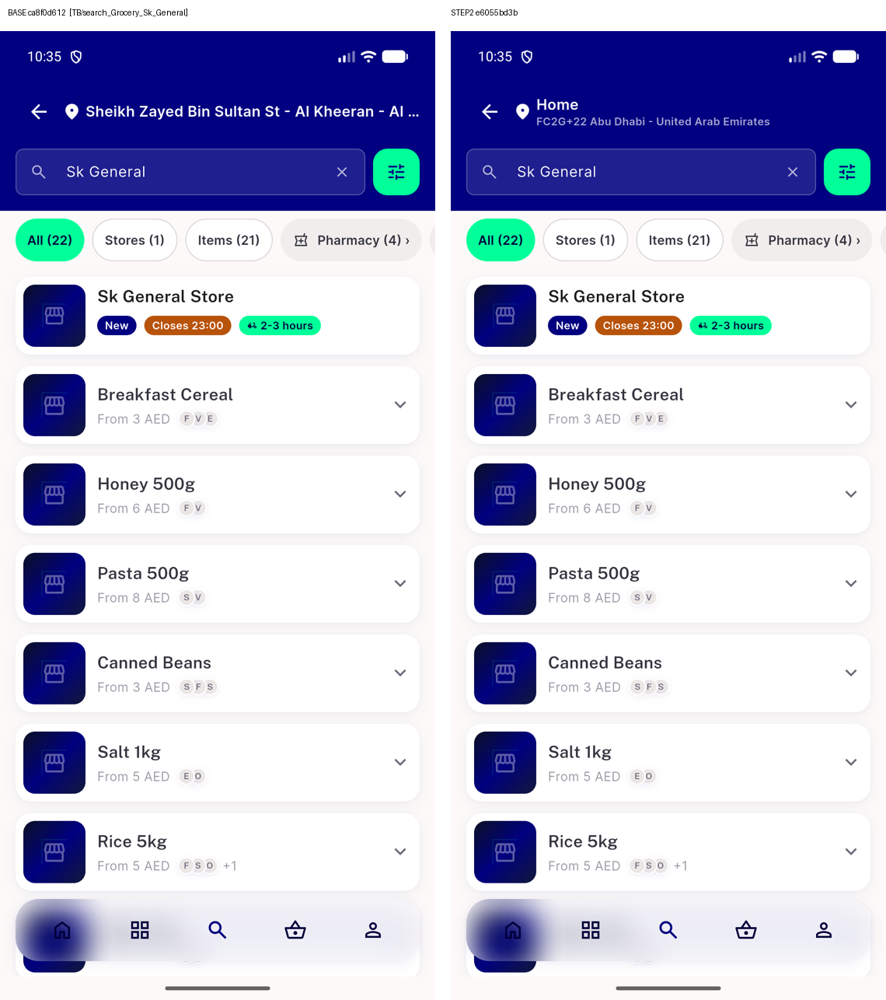
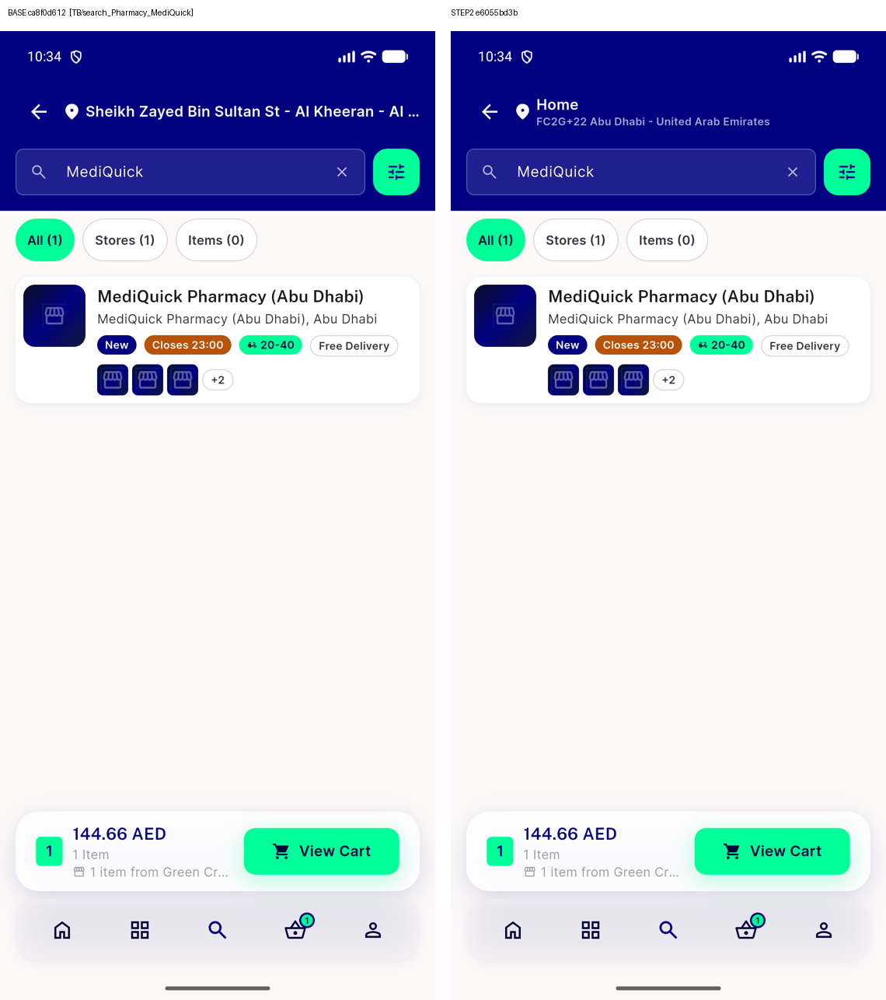
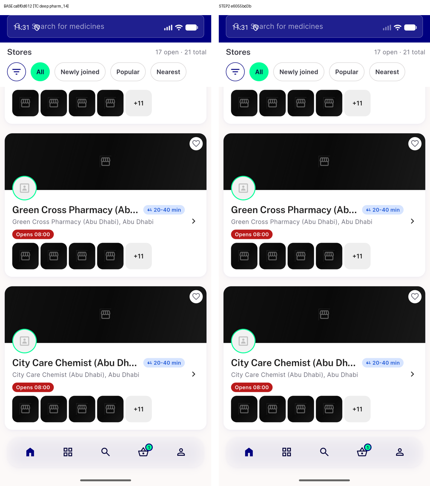
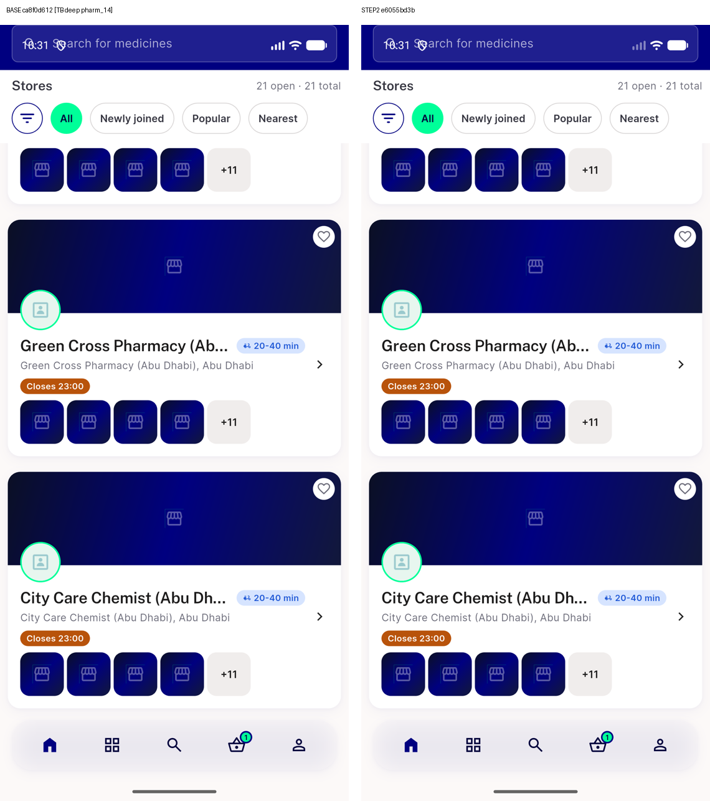
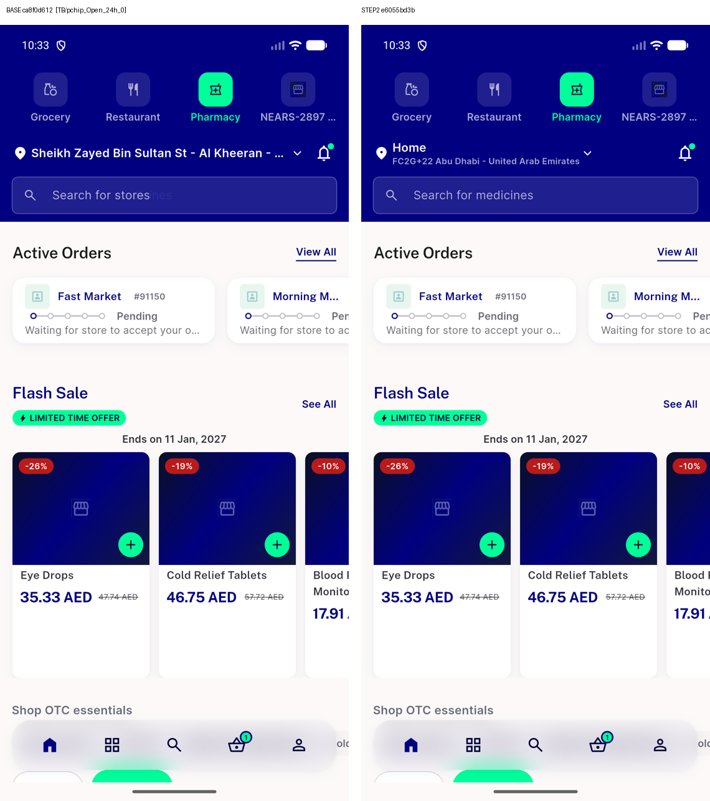

# QA Evidence — NEARS-3996

**fix-cycle-2 delta: S01/S02/S11 killed; N18/N19 Medium survivors**

**11 screenshot(s).** Click any thumbnail for full resolution.

<table>
<tr>
<td align="center" width="33%"> ac10 checkout closed store notice 2330</td>
<td align="center" width="33%"> ac10 closed opens 0800 2330</td>
<td align="center" width="33%"> ac10 closes 2300 2230</td>
</tr>
<tr>
<td align="center" width="33%"> ac10 closing soon first window 1330</td>
<td align="center" width="33%"> ac10 closing soon split window 2230</td>
<td align="center" width="33%"> ac10 food open now no chinese 2330</td>
</tr>
<tr>
<td align="center" width="33%"> ac10 grocery card 2230</td>
<td align="center" width="33%"> ac10 pharmacy card 2230</td>
<td align="center" width="33%"> ac10 pharmacy home card closed 2330</td>
</tr>
<tr>
<td align="center" width="33%"> ac10 pharmacy home card closing soon 2230</td>
<td align="center" width="33%"> ac10 pharmacy open24h chip 2230</td>
</tr>
</table>

### Other artifacts
- [`analyze-base-norm.txt`](analyze-base-norm.txt)
- [`analyze-step2-norm.txt`](analyze-step2-norm.txt)
- [`bug-grocery-search-semantics-assertion.log`](bug-grocery-search-semantics-assertion.log)
- [`bug-item-view-closed-now-divider-test-fails-on-base.log`](bug-item-view-closed-now-divider-test-fails-on-base.log)
- [`bug-vacuous-pins-minuteofday-null-and-separator.log`](bug-vacuous-pins-minuteofday-null-and-separator.log)
- [`bug-vacuous-pins-minuteofday.log`](bug-vacuous-pins-minuteofday.log)
- [`compare-deep-TB.txt`](compare-deep-TB.txt)
- [`compare-deep-TC.txt`](compare-deep-TC.txt)
- [`compare-walk-TA.txt`](compare-walk-TA.txt)
- [`compare-walk-TB.txt`](compare-walk-TB.txt)
- [`compare-walk-TC.txt`](compare-walk-TC.txt)
- [`mutations-qa.md`](mutations-qa.md)
- [`mutations-qa2-run-N.log`](mutations-qa2-run-N.log)
- [`mutations-qa2-run-S.log`](mutations-qa2-run-S.log)
- [`mutations-qa2.md`](mutations-qa2.md)
- [`progress.md`](progress.md)
- [`tests-extra-consumers-summary.txt`](tests-extra-consumers-summary.txt)
- [`tests-net-summary.txt`](tests-net-summary.txt)

---
*From `nears/docs/qa-evidence/NEARS-3996/` · public-repo scrub policy (no live secrets; verified clean).*
