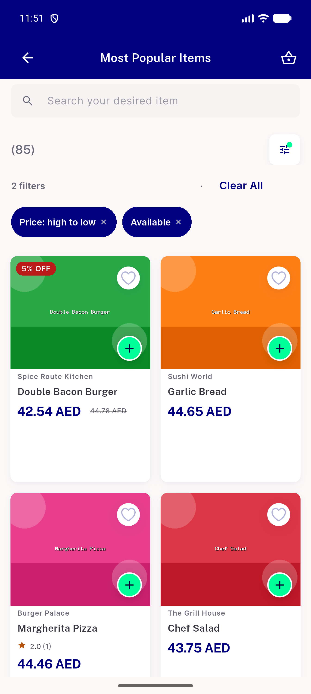
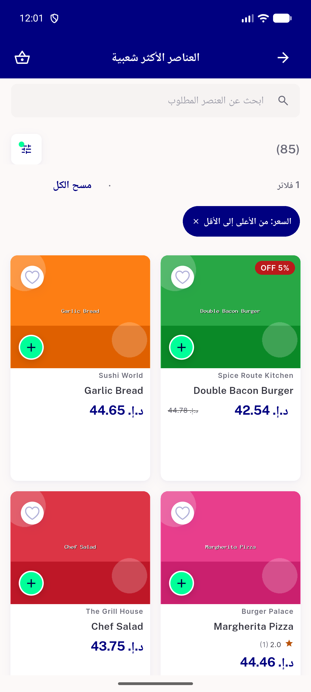
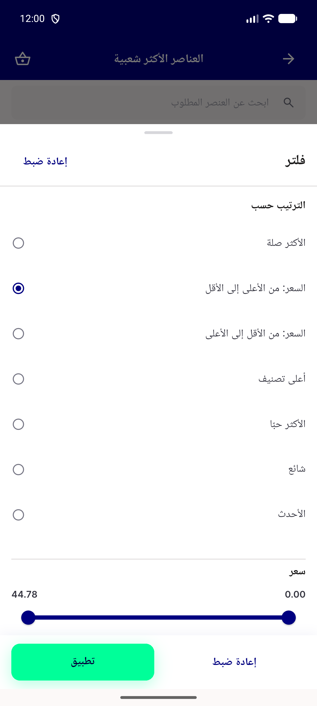
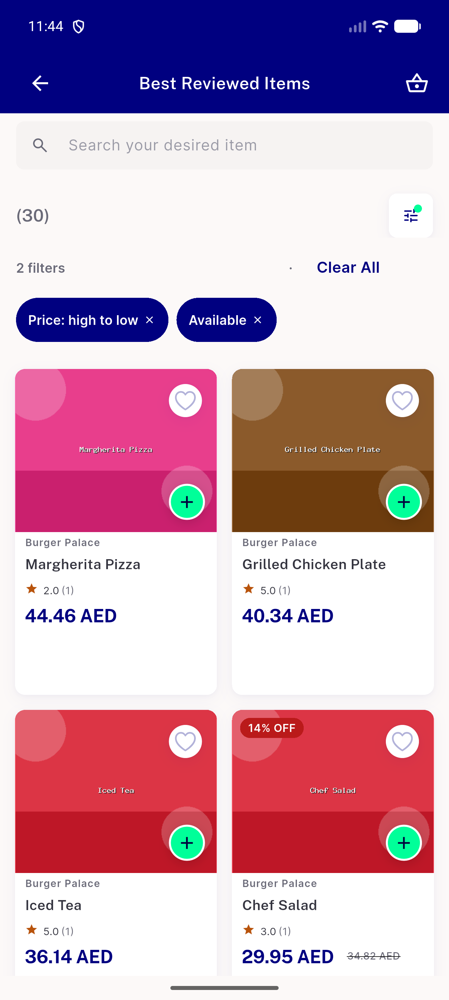
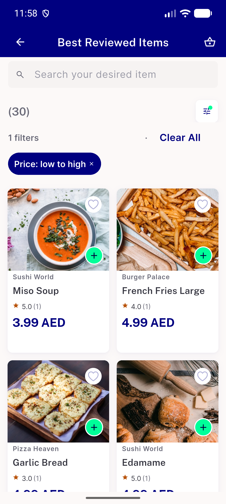
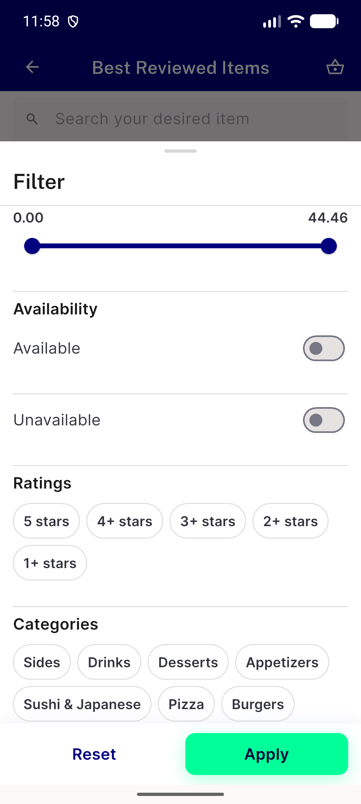

# QA Evidence — NEARS-3997

**step 2 delta QA: FAIL (survivors R13 R15 R22 R27-R31 R34)**

**7 screenshot(s).** Click any thumbnail for full resolution.

<table>
<tr>
<td align="center" width="33%"> popular 2 sort available pills</td>
<td align="center" width="33%"> popular arabic rtl open</td>
<td align="center" width="33%"> popular arabic rtl pills</td>
</tr>
<tr>
<td align="center" width="33%"> popular arabic rtl sheet</td>
<td align="center" width="33%"> reviewed 2 sort available pills</td>
<td align="center" width="33%"> reviewed textscale1.3 pills</td>
</tr>
<tr>
<td align="center" width="33%"> reviewed textscale1.3 sheet</td>
</tr>
</table>

### Other artifacts
- [`delta-gate-and-seed-results.jsonl`](delta-gate-and-seed-results.jsonl)
- [`gate-results.jsonl`](gate-results.jsonl)
- [`mutation-control-results.jsonl`](mutation-control-results.jsonl)
- [`qa-delta-mutations.md`](qa-delta-mutations.md)
- [`qa-mutations.md`](qa-mutations.md)
- [`shop-home-bottom-dump.xml`](shop-home-bottom-dump.xml)
- [`shop-home-top-dump.xml`](shop-home-top-dump.xml)
- [`walk-item-feed-requests.log`](walk-item-feed-requests.log)
- [`walk-logcat-flutter-tag.log`](walk-logcat-flutter-tag.log)
- [`walk-notes.md`](walk-notes.md)
- [`walk-vm-service-stream.log`](walk-vm-service-stream.log)

---
*From `nears/docs/qa-evidence/NEARS-3997/` · public-repo scrub policy (no live secrets; verified clean).*
