# QA Evidence — NEARS-3998

**Step 4 (zone resolution extraction) QA evidence added to the NEARS-3998 gallery; step-3 files kept**

**44 screenshot(s).** Click any thumbnail for full resolution.

<table>
<tr>
<td align="center" width="33%"> step3 tip s1 1 rationale</td>
<td align="center" width="33%"> step3 tip s1 2 osdialog</td>
<td align="center" width="33%"> step3 tip s1 3 after allow</td>
</tr>
<tr>
<td align="center" width="33%"> step3 tip s1b 2 after notnow</td>
<td align="center" width="33%"> step3 tip s2 2 after deny1</td>
<td align="center" width="33%"> step3 tip s2 5 after deny2</td>
</tr>
<tr>
<td align="center" width="33%"> step3 tip s2 6 fab df</td>
<td align="center" width="33%"> step3 tip s3 1 granted coldstart</td>
<td align="center" width="33%"> step3 tip s4 3 after deny</td>
</tr>
<tr>
<td align="center" width="33%"> step3 tip s5 1 service off</td>
<td align="center" width="33%"> step3 tip s5c after fast nothanks</td>
<td align="center" width="33%"> step3 tip s6 4 access usecurrent</td>
</tr>
<tr>
<td align="center" width="33%"> step4 base3 R11a chip sheet</td>
<td align="center" width="33%"> step4 base3 R1 cold fresh</td>
<td align="center" width="33%"><a href="step4-base3-R2a_drag_inzone.png">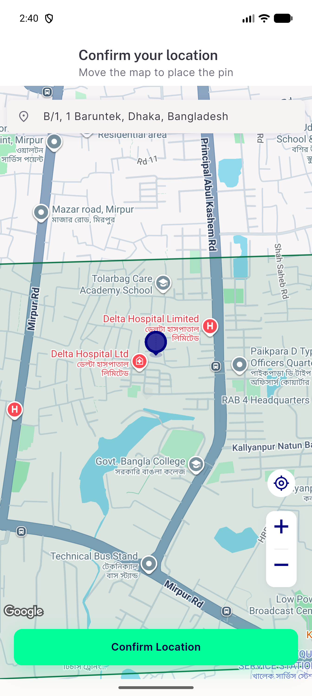</a> step4 base3 R2a drag inzone</td>
</tr>
<tr>
<td align="center" width="33%"><a href="step4-base3-R2b_drag_out_of_zone.png">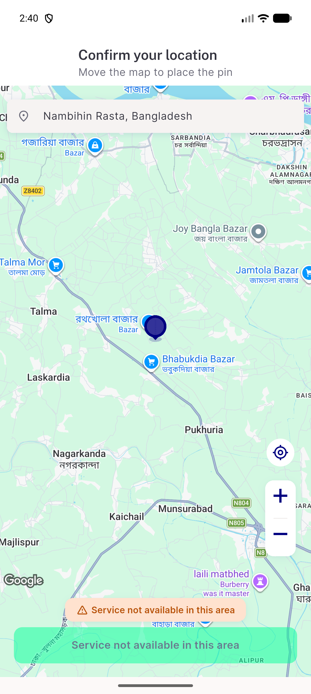</a> step4 base3 R2b drag out of zone</td>
<td align="center" width="33%"><a href="step4-base3-R2c_fab_back_in_zone.png">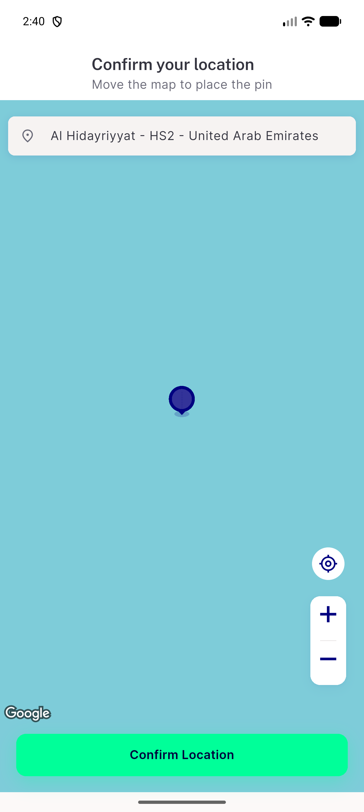</a> step4 base3 R2c fab back in zone</td>
<td align="center" width="33%"> step4 base3 R3 confirm to home</td>
</tr>
<tr>
<td align="center" width="33%"><a href="step4-base3-R4_kill_relaunch_saved_addr.png">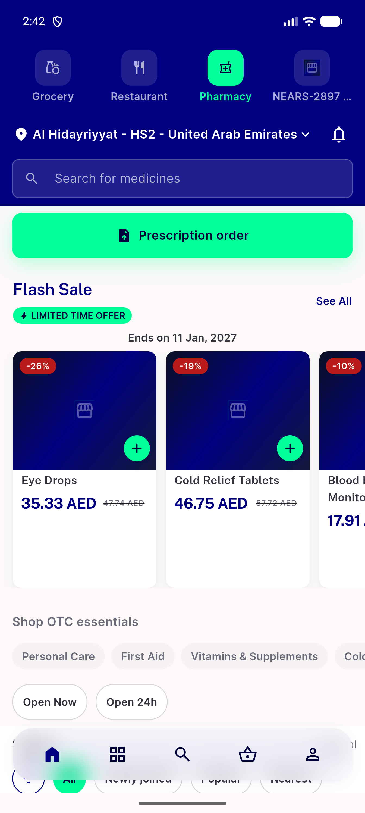</a> step4 base3 R4 kill relaunch saved addr</td>
<td align="center" width="33%"> step4 base3 R6 chip to pickmap</td>
<td align="center" width="33%"><a href="step4-base3-R7a_zone500_drag.png">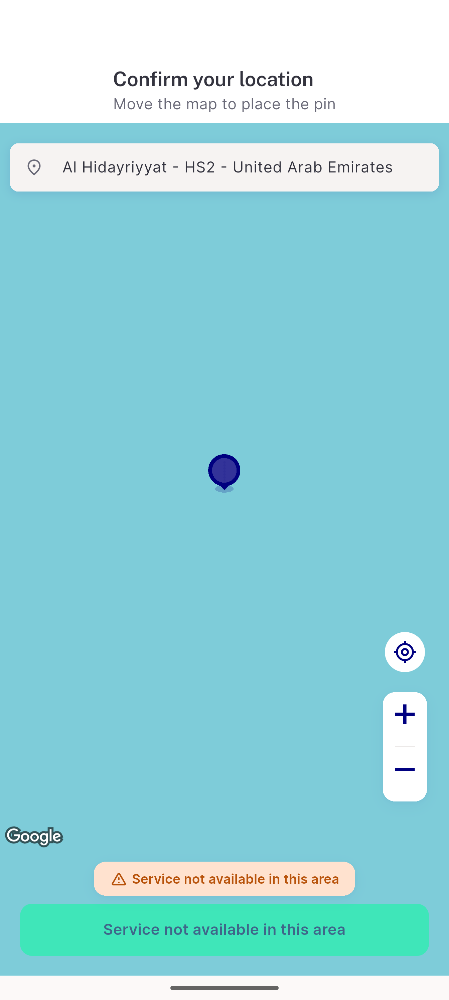</a> step4 base3 R7a zone500 drag</td>
</tr>
<tr>
<td align="center" width="33%"><a href="step4-base3-R7b_zone_restored_drag.png">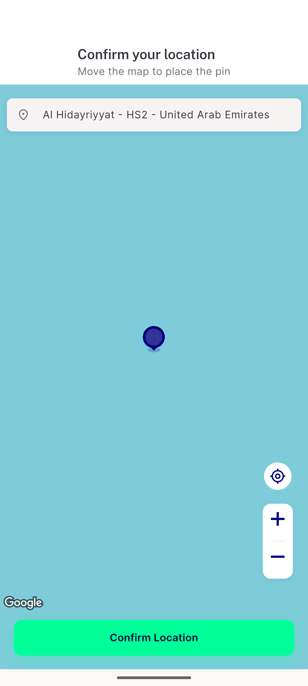</a> step4 base3 R7b zone restored drag</td>
<td align="center" width="33%"> step4 base3 R8a airplane home refresh</td>
<td align="center" width="33%"><a href="step4-pbase1-P1_stale200_then_out_of_zone.png">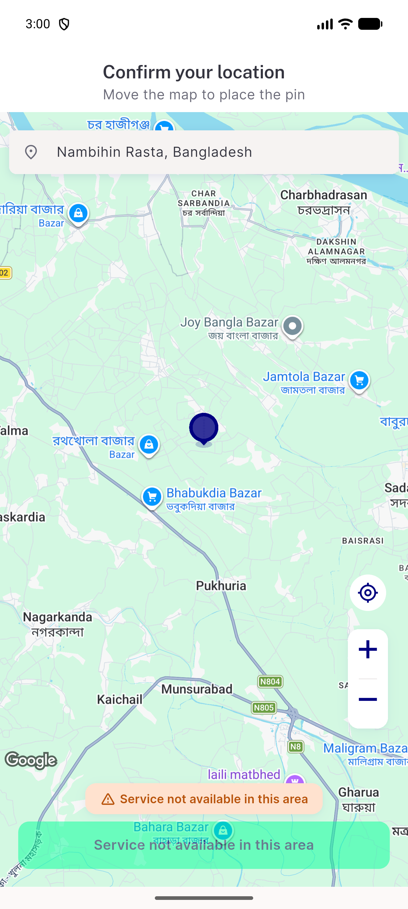</a> step4 pbase1 P1 stale200 then out of zone</td>
</tr>
<tr>
<td align="center" width="33%"><a href="step4-pbase1-P2b_plain_sync_overtaken_by_marker.png">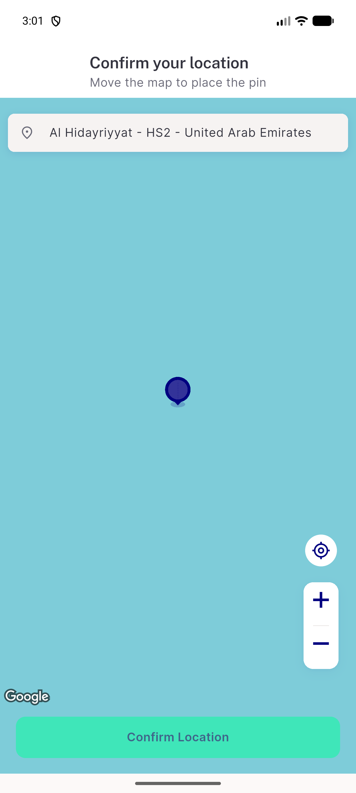</a> step4 pbase1 P2b plain sync overtaken by marker</td>
<td align="center" width="33%"> step4 pbase1 P2c drag inzone after</td>
<td align="center" width="33%"> step4 pbase1 P2d back home pull</td>
</tr>
<tr>
<td align="center" width="33%"> step4 pbase1 Q0 cold fresh</td>
<td align="center" width="33%"><a href="step4-ptip1-P1_stale200_then_out_of_zone.png">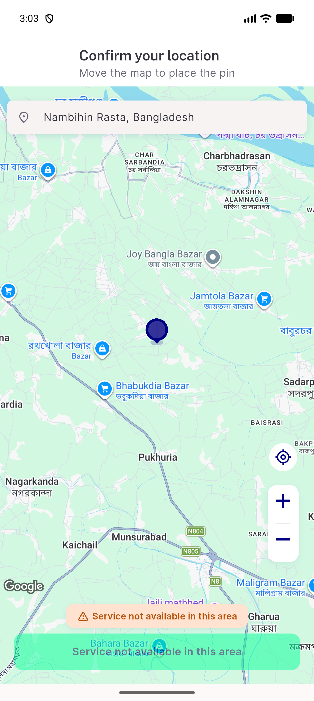</a> step4 ptip1 P1 stale200 then out of zone</td>
<td align="center" width="33%"> step4 ptip1 P2b plain sync overtaken by marker</td>
</tr>
<tr>
<td align="center" width="33%"> step4 ptip1 P2c drag inzone after</td>
<td align="center" width="33%"> step4 ptip1 P2d back home pull</td>
<td align="center" width="33%"> step4 ptip1 Q0 cold fresh</td>
</tr>
<tr>
<td align="center" width="33%"><a href="step4-tip3-R11a_chip_sheet.png">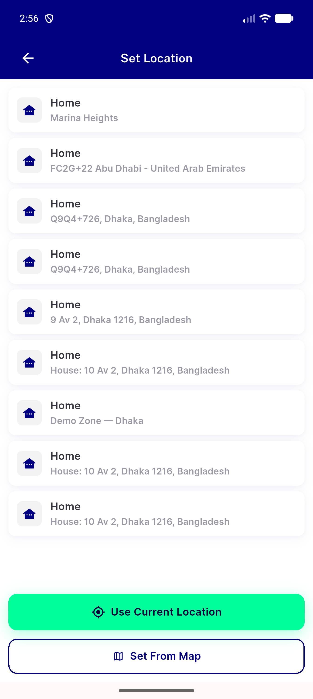</a> step4 tip3 R11a chip sheet</td>
<td align="center" width="33%"> step4 tip3 R1 cold fresh</td>
<td align="center" width="33%"><a href="step4-tip3-R2a_drag_inzone.png">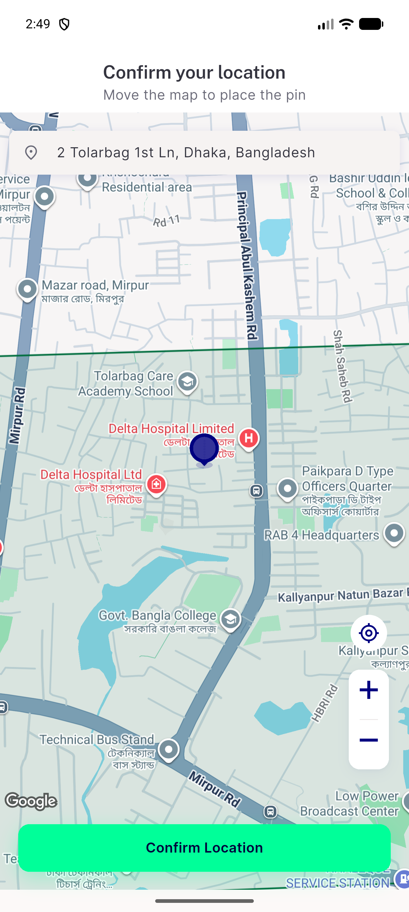</a> step4 tip3 R2a drag inzone</td>
</tr>
<tr>
<td align="center" width="33%"><a href="step4-tip3-R2b_drag_out_of_zone.png">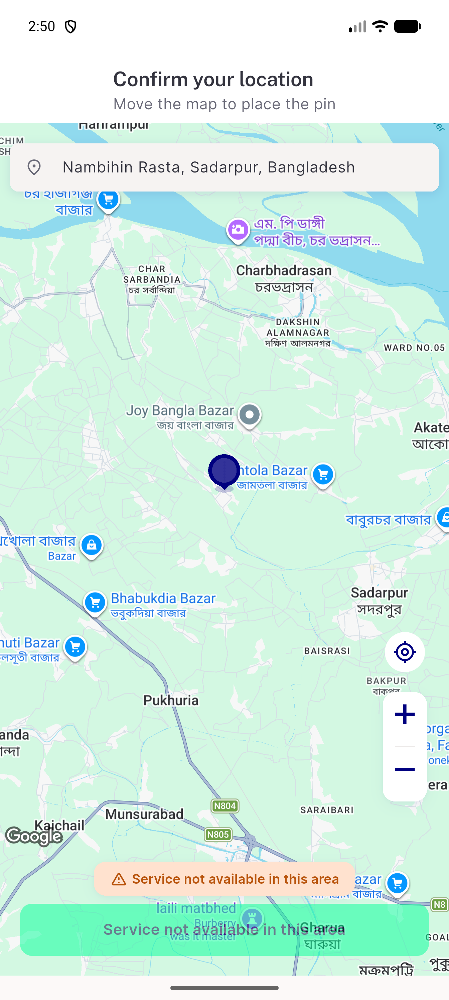</a> step4 tip3 R2b drag out of zone</td>
<td align="center" width="33%"> step4 tip3 R2c fab back in zone</td>
<td align="center" width="33%"><a href="step4-tip3-R3_confirm_to_home.png">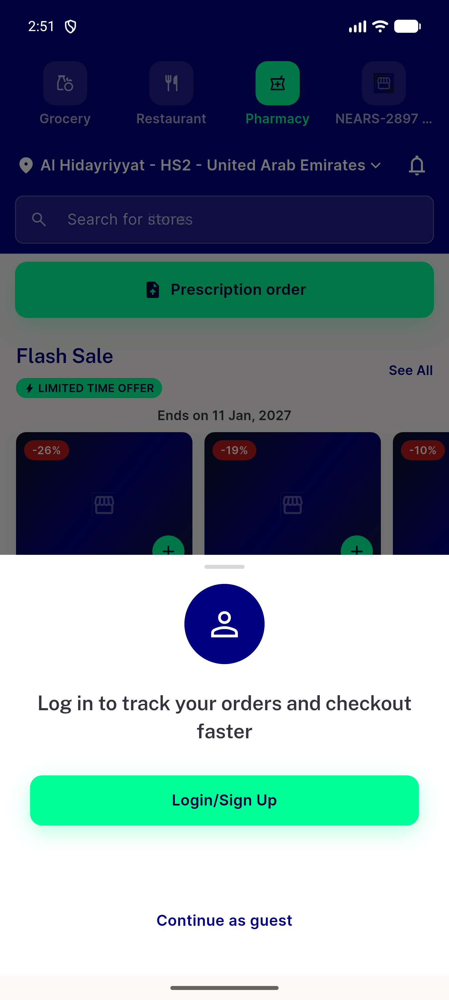</a> step4 tip3 R3 confirm to home</td>
</tr>
<tr>
<td align="center" width="33%"> step4 tip3 R4 kill relaunch saved addr</td>
<td align="center" width="33%"> step4 tip3 R6 chip to pickmap</td>
<td align="center" width="33%"> step4 tip3 R7a zone500 drag</td>
</tr>
<tr>
<td align="center" width="33%"> step4 tip3 R7b zone restored drag</td>
<td align="center" width="33%"><a href="step4-tip3-R8a_airplane_home_refresh.png">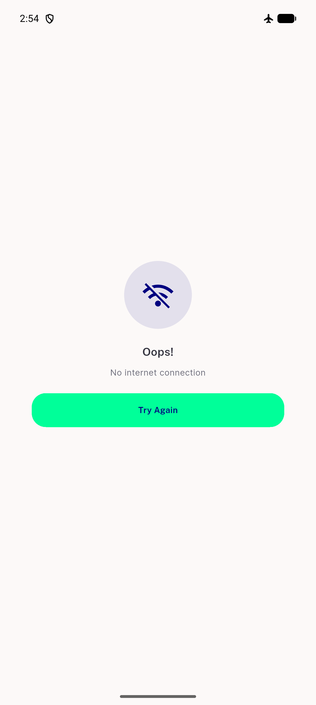</a> step4 tip3 R8a airplane home refresh</td>
</tr>
</table>

### Other artifacts
- [`step3-fa-base.txt`](step3-fa-base.txt)
- [`step3-fa-tip.txt`](step3-fa-tip.txt)
- [`step3-faillog-base.txt`](step3-faillog-base.txt)
- [`step3-faillog-tip.txt`](step3-faillog-tip.txt)
- [`step3-mutation-results.jsonl`](step3-mutation-results.jsonl)
- [`step3-mutation-table.md`](step3-mutation-table.md)
- [`step3-nets-tip.tsv`](step3-nets-tip.tsv)
- [`step3-qa-mut.py`](step3-qa-mut.py)
- [`step3-qa-surface.py`](step3-qa-surface.py)
- [`step3-qa-verbatim.py`](step3-qa-verbatim.py)
- [`step3-surface-base.txt`](step3-surface-base.txt)
- [`step3-surface-tip.txt`](step3-surface-tip.txt)
- [`step3-uidump-base.txt`](step3-uidump-base.txt)
- [`step3-uidump-tip.txt`](step3-uidump-tip.txt)
- [`step3-verbatim-output.txt`](step3-verbatim-output.txt)
- [`step3-walk-compare.md`](step3-walk-compare.md)
- [`step4-analyze-tip.txt`](step4-analyze-tip.txt)
- [`step4-faillog-base1.txt`](step4-faillog-base1.txt)
- [`step4-faillog-base2.txt`](step4-faillog-base2.txt)
- [`step4-faillog-base3.txt`](step4-faillog-base3.txt)
- [`step4-faillog-tip1.txt`](step4-faillog-tip1.txt)
- [`step4-faillog-tip2.txt`](step4-faillog-tip2.txt)
- [`step4-faillog-tip3.txt`](step4-faillog-tip3.txt)
- [`step4-kernel-proof.txt`](step4-kernel-proof.txt)
- [`step4-mutation-landed-diffs.txt`](step4-mutation-landed-diffs.txt)
- [`step4-mutation-nets-only-results.jsonl`](step4-mutation-nets-only-results.jsonl)
- [`step4-mutation-results.jsonl`](step4-mutation-results.jsonl)
- [`step4-mutation-table.md`](step4-mutation-table.md)
- [`step4-nav-guide-patch.md`](step4-nav-guide-patch.md)
- [`step4-nets-base.tsv`](step4-nets-base.tsv)
- [`step4-nets-table.md`](step4-nets-table.md)
- [`step4-nets-tip.tsv`](step4-nets-tip.tsv)
- [`step4-observation-O2-module-switch-home-placeholder.txt`](step4-observation-O2-module-switch-home-placeholder.txt)
- [`step4-pd-s4-1-and-overtaken-probe.md`](step4-pd-s4-1-and-overtaken-probe.md)
- [`step4-proxy-zoneid.jsonl`](step4-proxy-zoneid.jsonl)
- [`step4-public-members-base.txt`](step4-public-members-base.txt)
- [`step4-public-members-tip.txt`](step4-public-members-tip.txt)
- [`step4-scanners-output.txt`](step4-scanners-output.txt)
- [`step4-scripts`](step4-scripts)
- [`step4-uidump-base3.txt`](step4-uidump-base3.txt)
- [`step4-uidump-tip3.txt`](step4-uidump-tip3.txt)
- [`step4-walk-compare-pair1.txt`](step4-walk-compare-pair1.txt)
- [`step4-walk-compare-pair2.txt`](step4-walk-compare-pair2.txt)
- [`step4-walk-compare-pair3.txt`](step4-walk-compare-pair3.txt)
- [`step4-walk-table.md`](step4-walk-table.md)

---
*From `nears/docs/qa-evidence/NEARS-3998/` · public-repo scrub policy (no live secrets; verified clean).*
