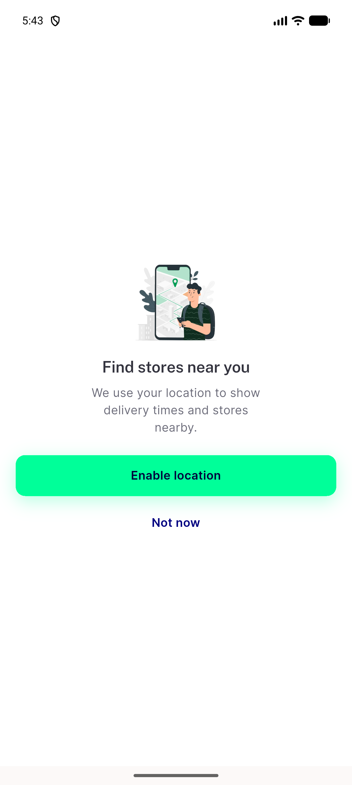
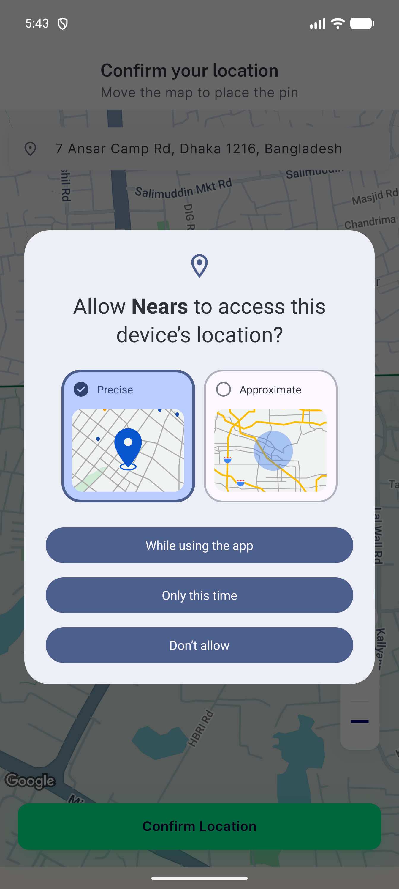
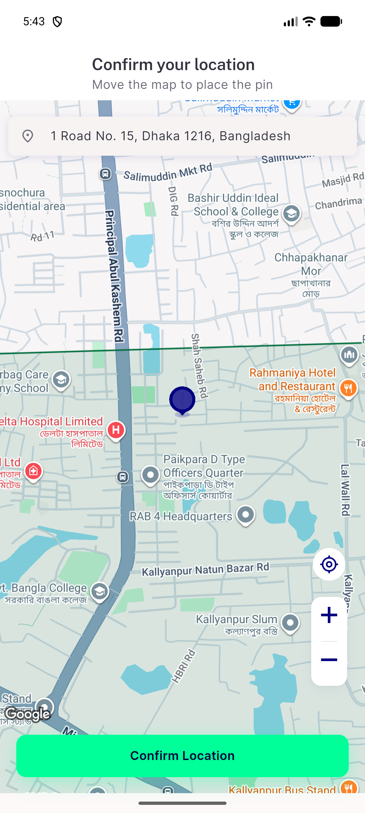
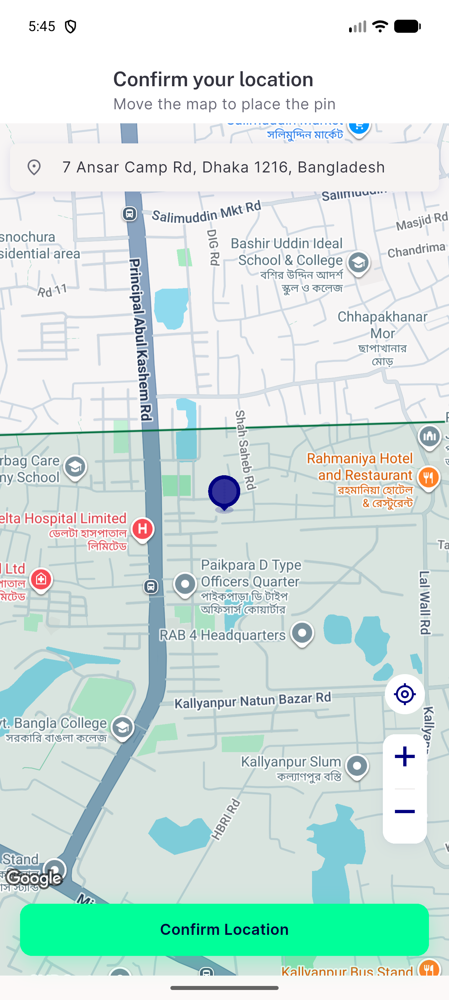
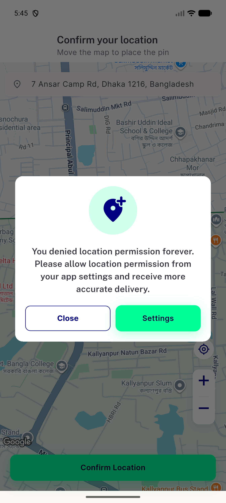
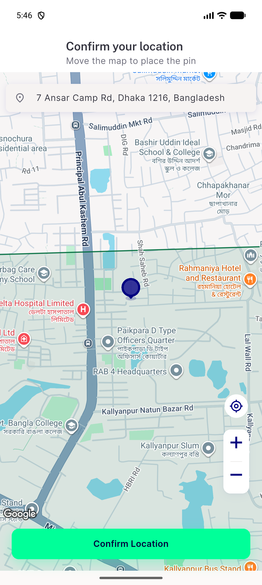
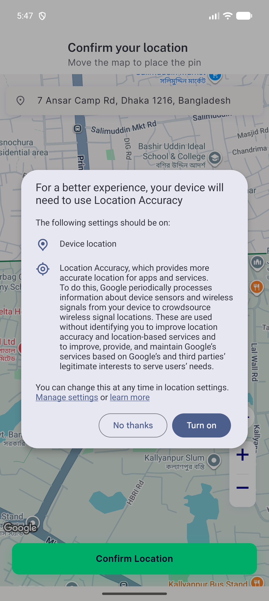
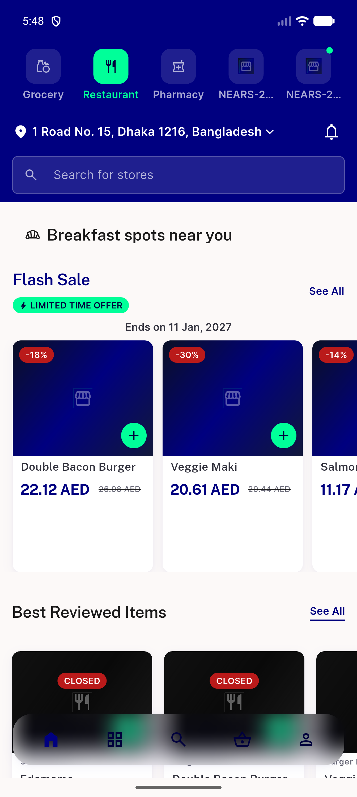

# QA Evidence — NEARS-3998

**step 3 (UA-022 permission flow) QA: emulator walk base vs tip, EN+light**

**12 screenshot(s).** Click any thumbnail for full resolution.

<table>
<tr>
<td align="center" width="33%"> step3 tip s1 1 rationale</td>
<td align="center" width="33%"> step3 tip s1 2 osdialog</td>
<td align="center" width="33%"> step3 tip s1 3 after allow</td>
</tr>
<tr>
<td align="center" width="33%"> step3 tip s1b 2 after notnow</td>
<td align="center" width="33%"> step3 tip s2 2 after deny1</td>
<td align="center" width="33%"> step3 tip s2 5 after deny2</td>
</tr>
<tr>
<td align="center" width="33%"> step3 tip s2 6 fab df</td>
<td align="center" width="33%"> step3 tip s3 1 granted coldstart</td>
<td align="center" width="33%"> step3 tip s4 3 after deny</td>
</tr>
<tr>
<td align="center" width="33%"> step3 tip s5 1 service off</td>
<td align="center" width="33%"> step3 tip s5c after fast nothanks</td>
<td align="center" width="33%"> step3 tip s6 4 access usecurrent</td>
</tr>
</table>

### Other artifacts
- [`step3-fa-base.txt`](step3-fa-base.txt)
- [`step3-fa-tip.txt`](step3-fa-tip.txt)
- [`step3-faillog-base.txt`](step3-faillog-base.txt)
- [`step3-faillog-tip.txt`](step3-faillog-tip.txt)
- [`step3-mutation-results.jsonl`](step3-mutation-results.jsonl)
- [`step3-mutation-table.md`](step3-mutation-table.md)
- [`step3-nets-tip.tsv`](step3-nets-tip.tsv)
- [`step3-qa-mut.py`](step3-qa-mut.py)
- [`step3-qa-surface.py`](step3-qa-surface.py)
- [`step3-qa-verbatim.py`](step3-qa-verbatim.py)
- [`step3-surface-base.txt`](step3-surface-base.txt)
- [`step3-surface-tip.txt`](step3-surface-tip.txt)
- [`step3-uidump-base.txt`](step3-uidump-base.txt)
- [`step3-uidump-tip.txt`](step3-uidump-tip.txt)
- [`step3-verbatim-output.txt`](step3-verbatim-output.txt)
- [`step3-walk-compare.md`](step3-walk-compare.md)

---
*From `nears/docs/qa-evidence/NEARS-3998/` · public-repo scrub policy (no live secrets; verified clean).*
