# QA Evidence — NEARS-3999

**NEARS-3999 step 2 QA: base vs tip walk, PASS (EN+light)**

**27 screenshot(s).** Click any thumbnail for full resolution.

<table>
<tr>
<td align="center" width="33%"> base 08 logged out messages</td>
<td align="center" width="33%"><a href="base-14-after-cancel.png">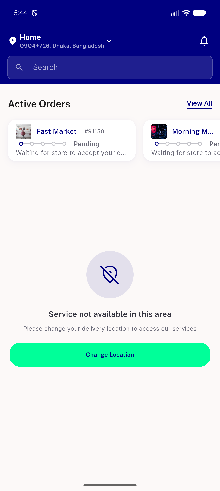</a> base 14 after cancel</td>
<td align="center" width="33%"><a href="base-14-dialog.png">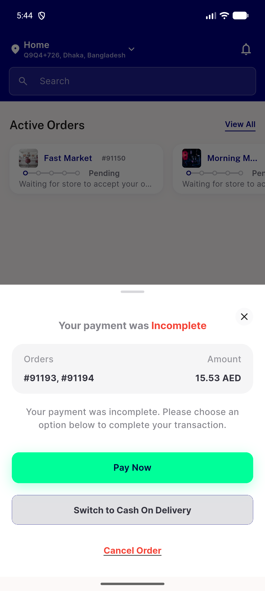</a> base 14 dialog</td>
</tr>
<tr>
<td align="center" width="33%"><a href="base-1a-cold-start-dialog.png">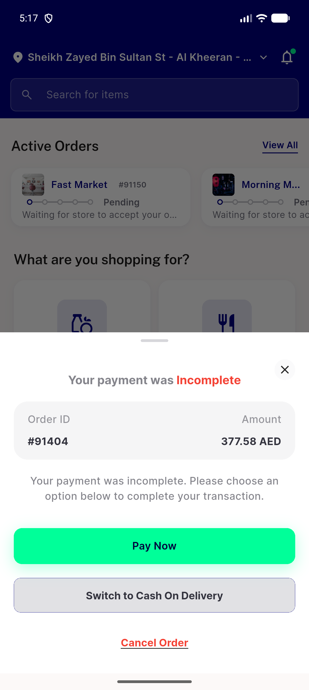</a> base 1a cold start dialog</td>
<td align="center" width="33%"><a href="base-1b-home.png">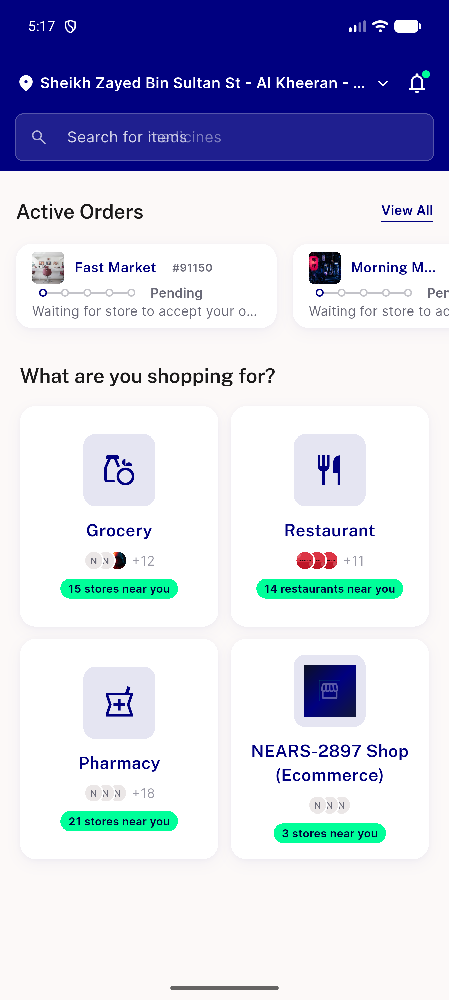</a> base 1b home</td>
<td align="center" width="33%"> base 2 all first</td>
</tr>
<tr>
<td align="center" width="33%"><a href="base-2-ongoing-first.png">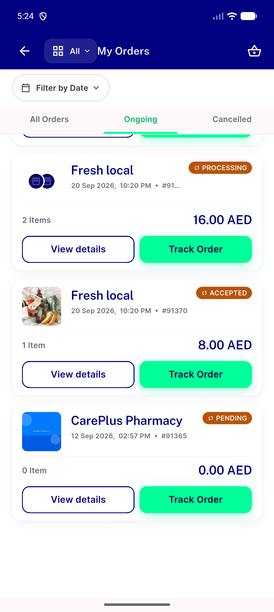</a> base 2 ongoing first</td>
<td align="center" width="33%"> base 2h hub</td>
<td align="center" width="33%"><a href="base-5-page1-fail-all.png">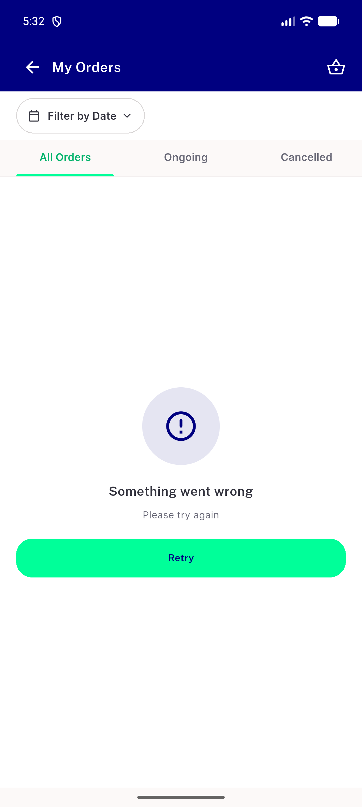</a> base 5 page1 fail all</td>
</tr>
<tr>
<td align="center" width="33%"><a href="base-5-page1-fail-ongoing.png">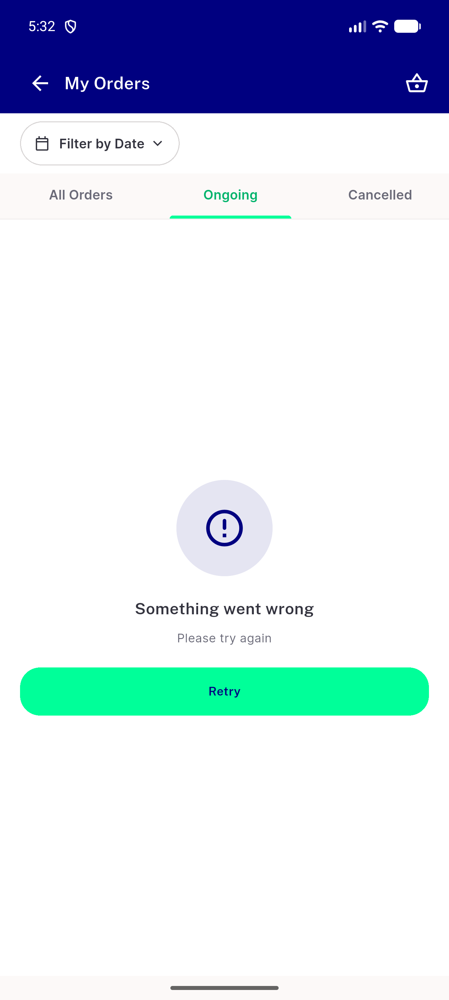</a> base 5 page1 fail ongoing</td>
<td align="center" width="33%"> base 6 page2 fail</td>
<td align="center" width="33%"> base 7 rail hidden</td>
</tr>
<tr>
<td align="center" width="33%"><a href="base-9-picker.png">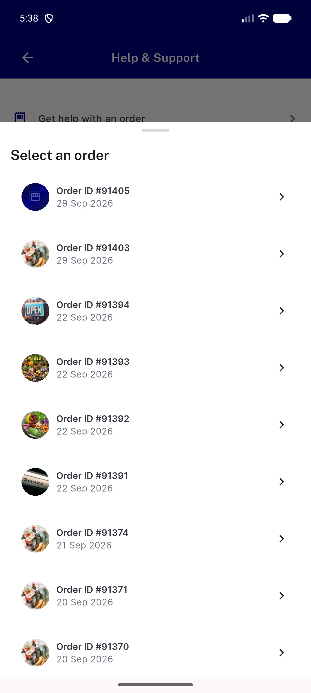</a> base 9 picker</td>
<td align="center" width="33%"><a href="env-php-segfault-tip-14-after-cancel.png">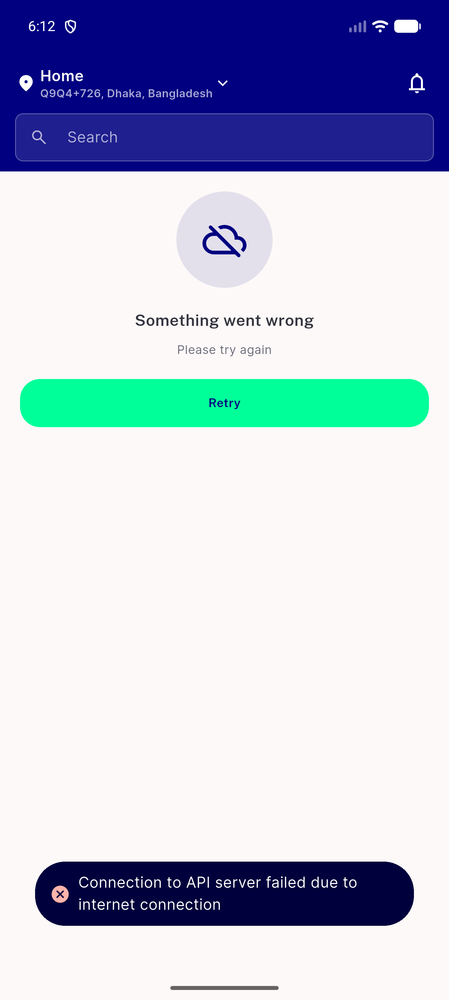</a> env php segfault tip 14 after cancel</td>
<td align="center" width="33%"><a href="tip-08-logged-out-messages.png">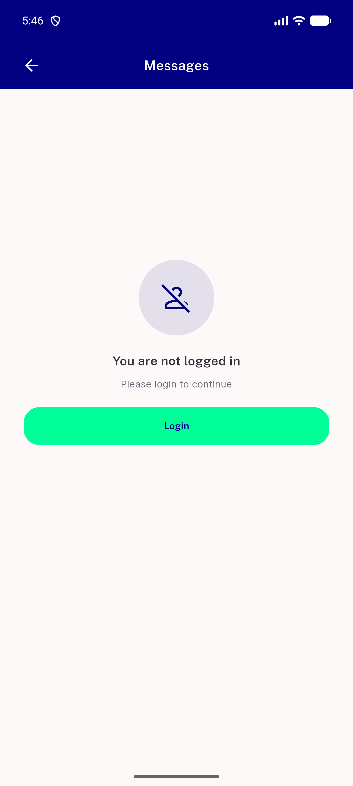</a> tip 08 logged out messages</td>
</tr>
<tr>
<td align="center" width="33%"><a href="tip-14-dialog.png">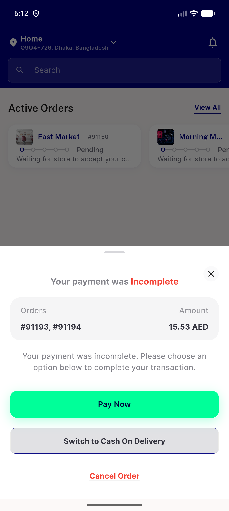</a> tip 14 dialog</td>
<td align="center" width="33%"><a href="tip-14b-after-cancel.png">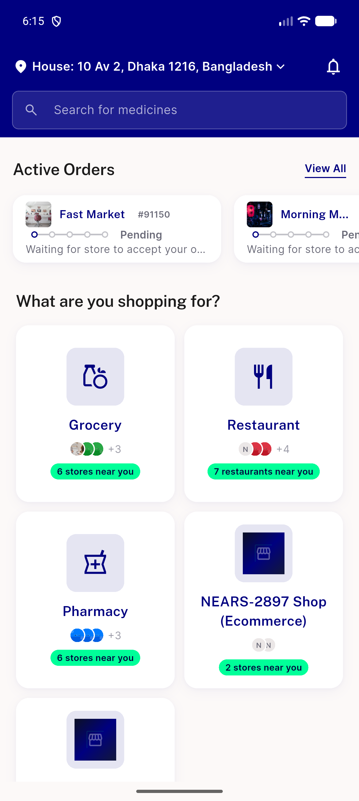</a> tip 14b after cancel</td>
<td align="center" width="33%"><a href="tip-1a-cold-start-dialog.png">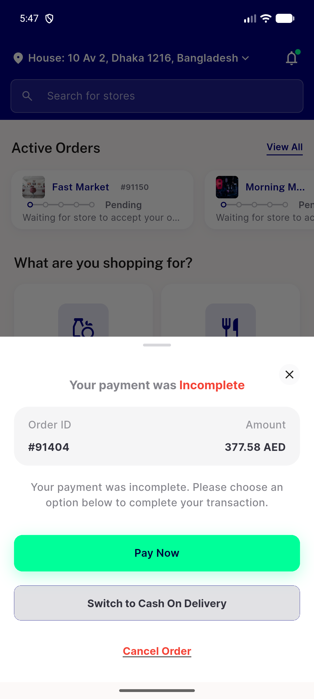</a> tip 1a cold start dialog</td>
</tr>
<tr>
<td align="center" width="33%"> tip 1b home</td>
<td align="center" width="33%"><a href="tip-2-all-first.png">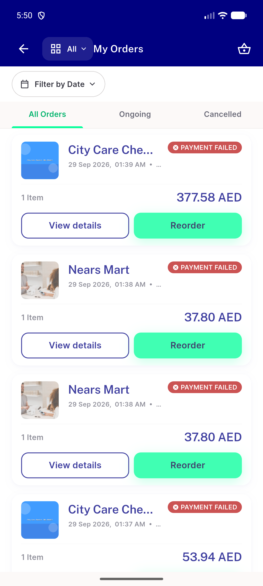</a> tip 2 all first</td>
<td align="center" width="33%"><a href="tip-2-ongoing-first.png">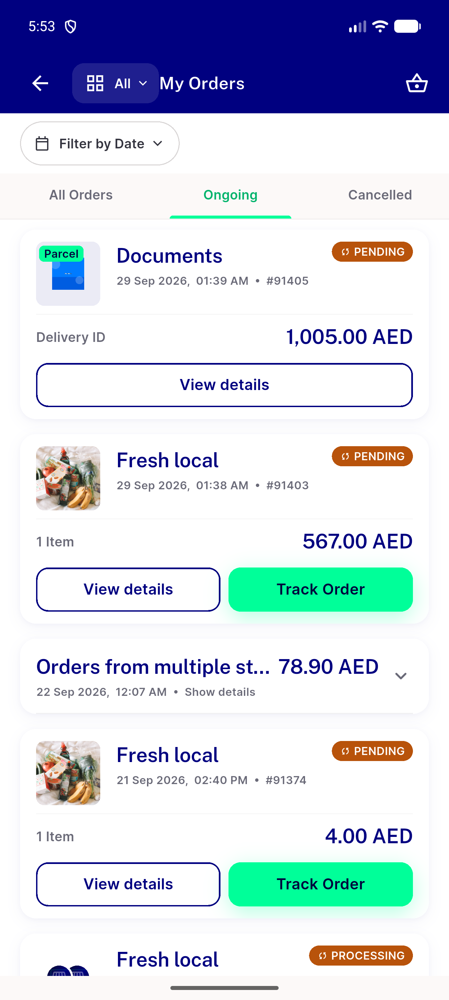</a> tip 2 ongoing first</td>
</tr>
<tr>
<td align="center" width="33%"><a href="tip-2h-hub.png">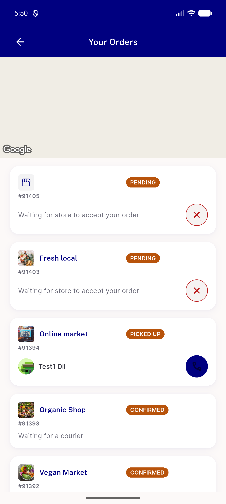</a> tip 2h hub</td>
<td align="center" width="33%"><a href="tip-5-page1-fail-all.png">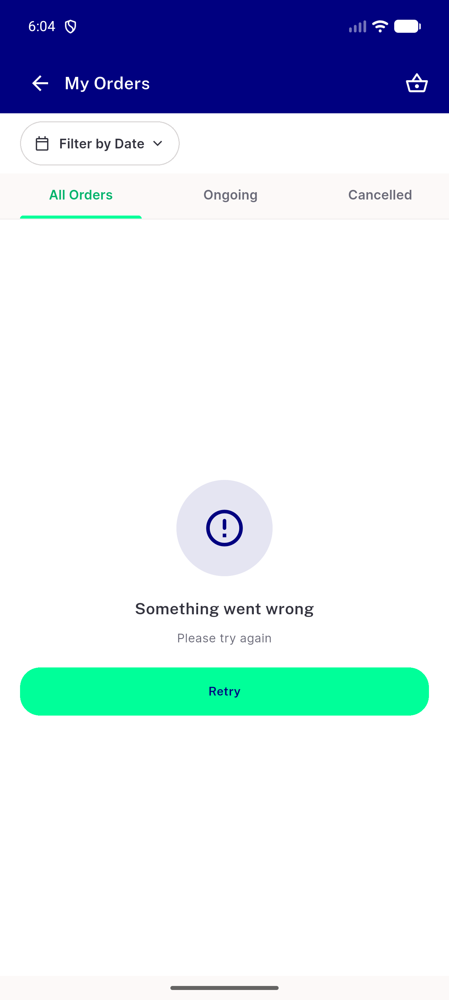</a> tip 5 page1 fail all</td>
<td align="center" width="33%"> tip 5 page1 fail ongoing</td>
</tr>
<tr>
<td align="center" width="33%"><a href="tip-6-page2-fail.png">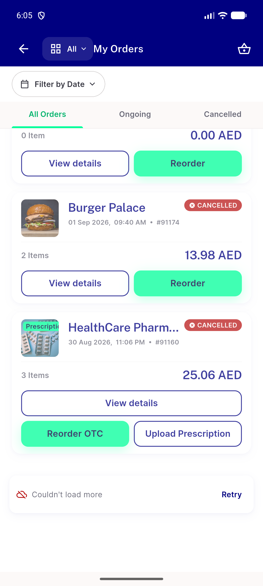</a> tip 6 page2 fail</td>
<td align="center" width="33%"><a href="tip-7-rail-hidden.png">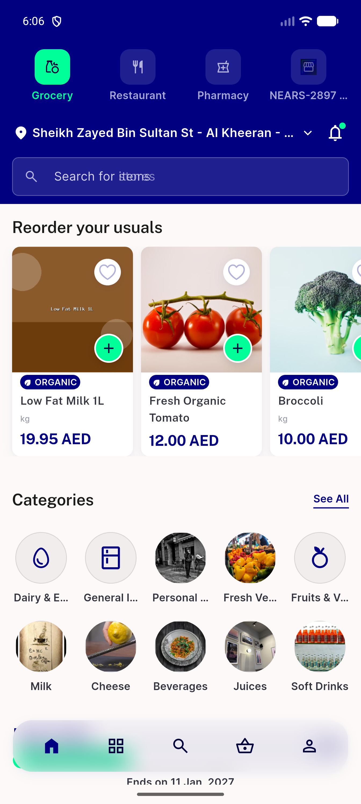</a> tip 7 rail hidden</td>
<td align="center" width="33%"><a href="tip-9-picker.png">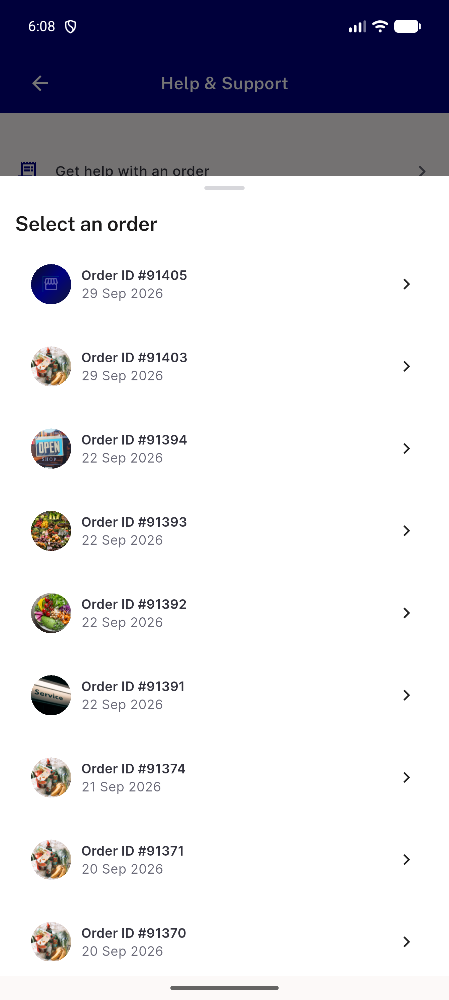</a> tip 9 picker</td>
</tr>
</table>

### Other artifacts
- [`dump-comparison.txt`](dump-comparison.txt)
- [`fail-lines-base.txt`](fail-lines-base.txt)
- [`fail-lines-tip.txt`](fail-lines-tip.txt)
- [`server-requests-per-leg.txt`](server-requests-per-leg.txt)

---
*From `nears/docs/qa-evidence/NEARS-3999/` · public-repo scrub policy (no live secrets; verified clean).*
