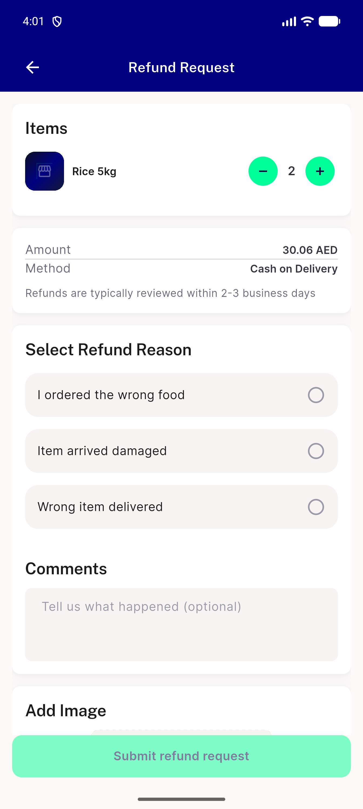
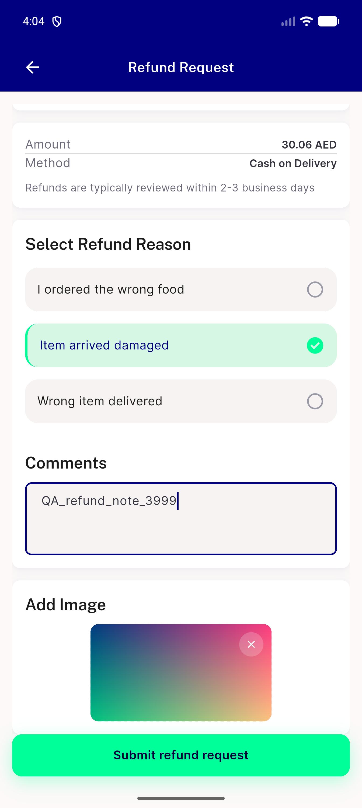
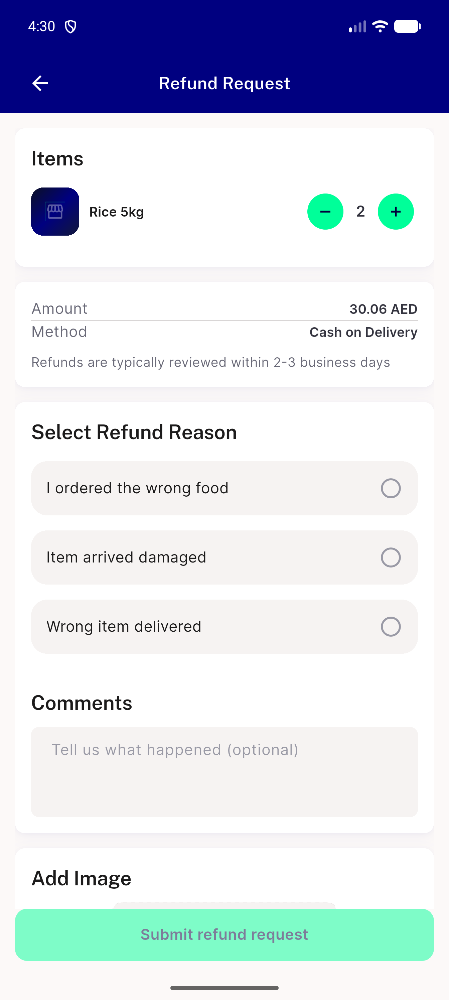
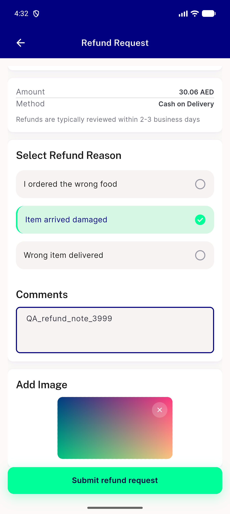

# QA Evidence — NEARS-3999/step3

**Step 3 refund family: base-vs-tip walk, EN+light, 37 dump pairs identical**

**4 screenshot(s).** Click any thumbnail for full resolution.

<table>
<tr>
<td align="center" width="33%"> base R1 refund screen</td>
<td align="center" width="33%"> base R4 image preview</td>
<td align="center" width="33%"> tip R1 refund screen</td>
</tr>
<tr>
<td align="center" width="33%"> tip R4 image preview</td>
</tr>
</table>

### Other artifacts
- [`analyze-base-order_controller.txt`](analyze-base-order_controller.txt)
- [`analyze-tip-order_controller.txt`](analyze-tip-order_controller.txt)
- [`analyze-tip-order_refund_owner.txt`](analyze-tip-order_refund_owner.txt)
- [`automated-backstop-summary.txt`](automated-backstop-summary.txt)
- [`dumps`](dumps)
- [`frames`](frames)
- [`requests`](requests)
- [`step3-walk-summary.md`](step3-walk-summary.md)

---
*From `nears/docs/qa-evidence/NEARS-3999/step3/` · public-repo scrub policy (no live secrets; verified clean).*
