# QA Evidence — NEARS-400

**PASS — Item detail PILOT reskin verified live on Android (emulator-5554, QA SHA 76e6aefd); all ACs demonstrated, 1 pre-existing regression bug (stale slide indicator)**

**21 screenshot(s).** Click any thumbnail for full resolution.

<table>
<tr>
<td align="center" width="33%"><a href="02-item-detail-light.png">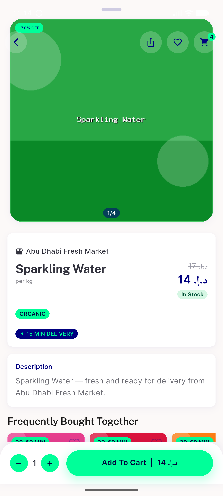</a> item detail light</td>
<td align="center" width="33%"> carousel slide2</td>
<td align="center" width="33%"> gallery light</td>
</tr>
<tr>
<td align="center" width="33%"><a href="05-gallery-page-nav.png">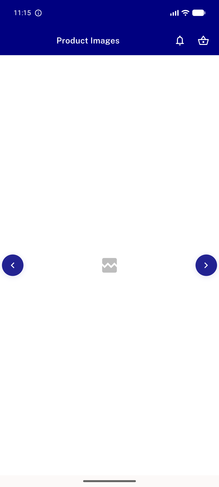</a> gallery page nav</td>
<td align="center" width="33%"><a href="06-gallery-reopen3.png">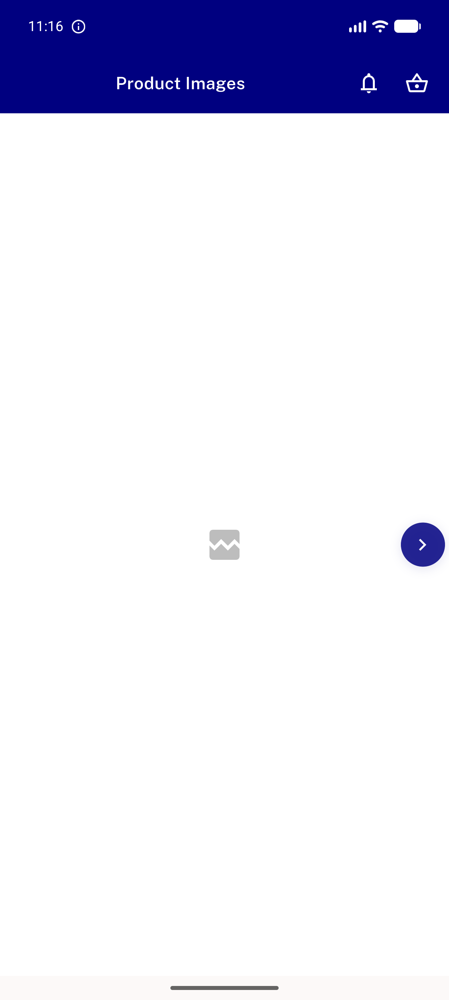</a> gallery reopen3</td>
<td align="center" width="33%"><a href="07-variant-chips.png">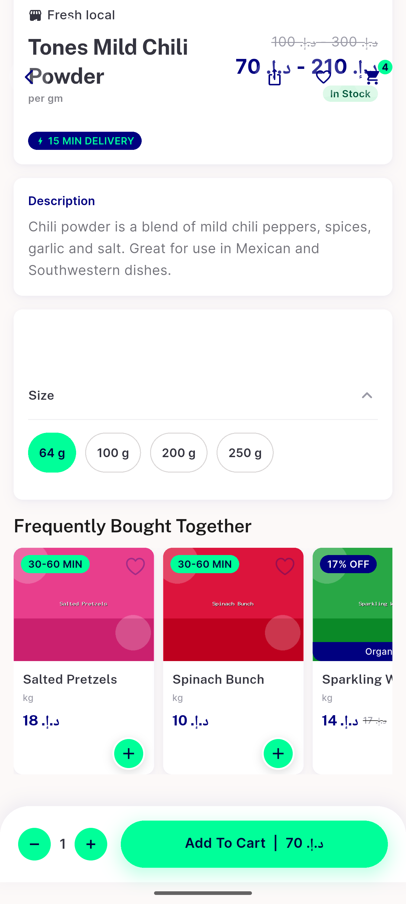</a> variant chips</td>
</tr>
<tr>
<td align="center" width="33%"><a href="08-variant-250g.png">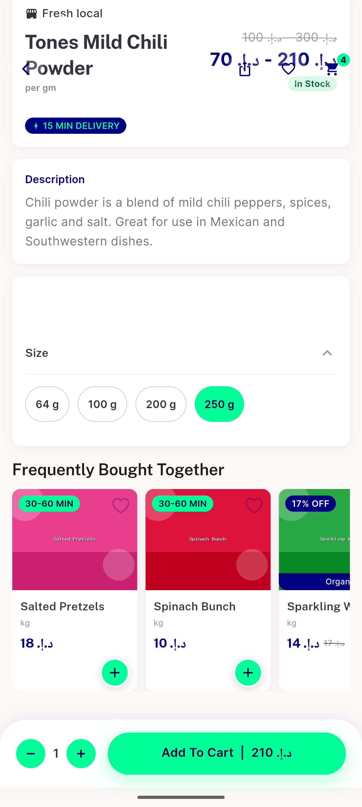</a> variant 250g</td>
<td align="center" width="33%"> add to cart snackbar</td>
<td align="center" width="33%"><a href="10-update-in-cart.png">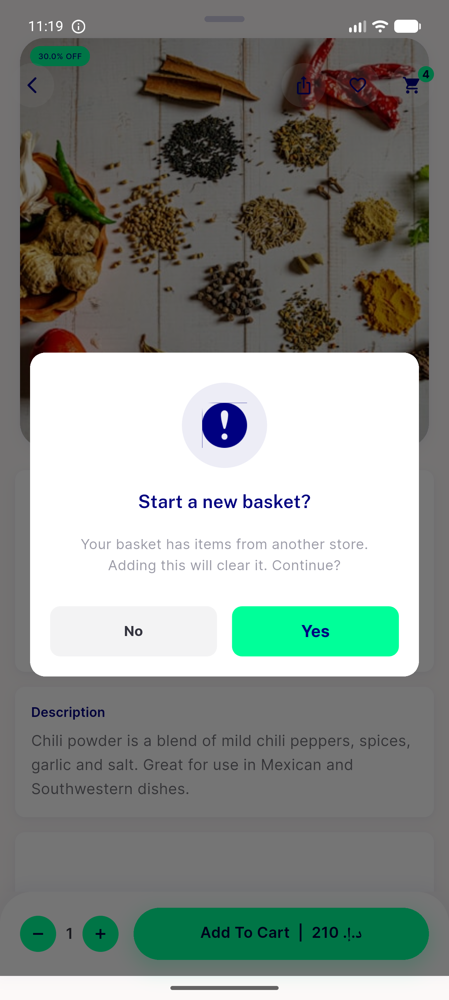</a> update in cart</td>
</tr>
<tr>
<td align="center" width="33%"><a href="11-after-confirm-add.png">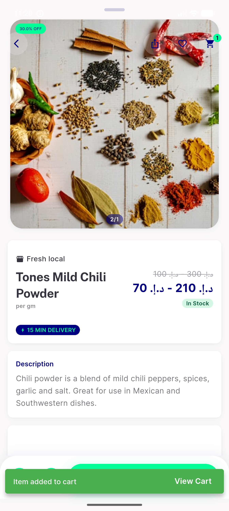</a> after confirm add</td>
<td align="center" width="33%"><a href="15-readmore-collapsed.png">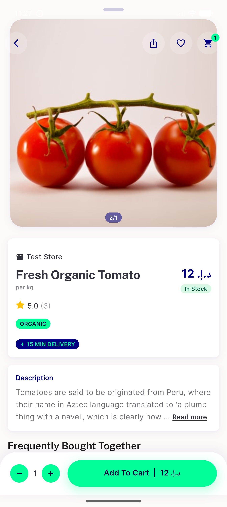</a> readmore collapsed</td>
<td align="center" width="33%"> readmore expanded</td>
</tr>
<tr>
<td align="center" width="33%"><a href="17-share.png">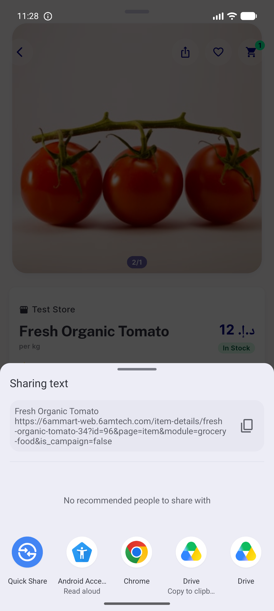</a> share</td>
<td align="center" width="33%"><a href="24-oos-state.png">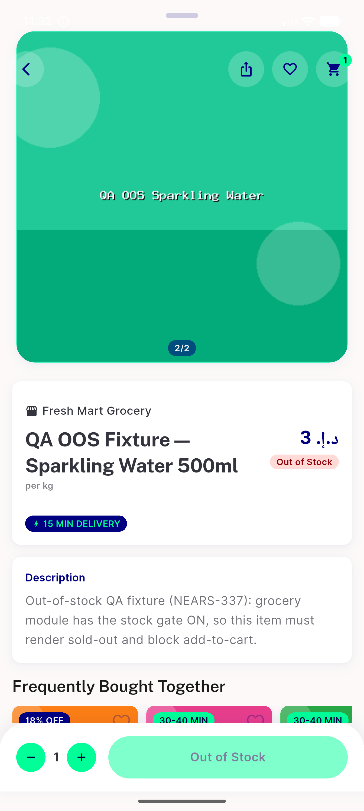</a> oos state</td>
<td align="center" width="33%"><a href="30-dark-item-detail.png">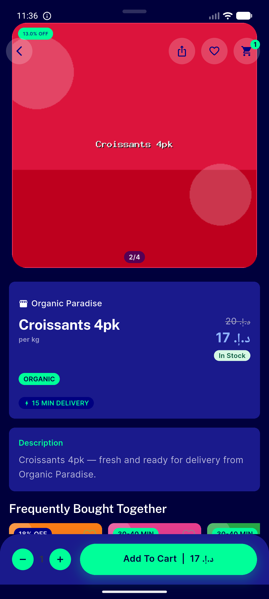</a> dark item detail</td>
</tr>
<tr>
<td align="center" width="33%"><a href="31-dark-gallery.png">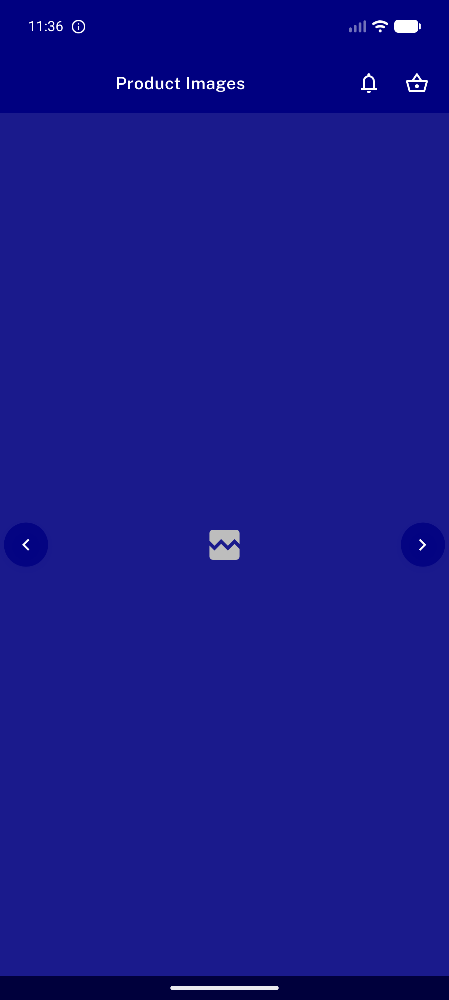</a> dark gallery</td>
<td align="center" width="33%"><a href="33-rtl-item.png">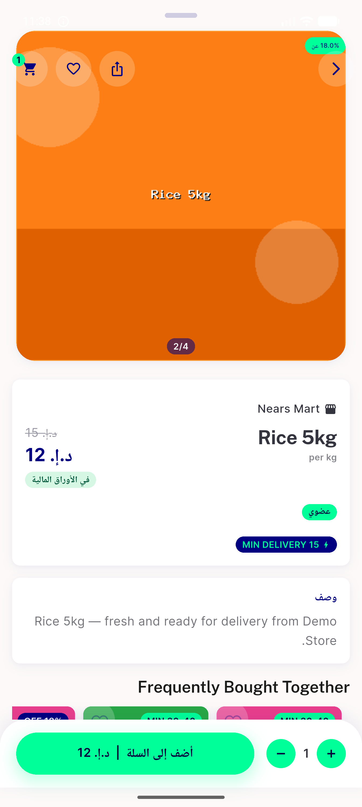</a> rtl item</td>
<td align="center" width="33%"><a href="34-rtl-gallery.png">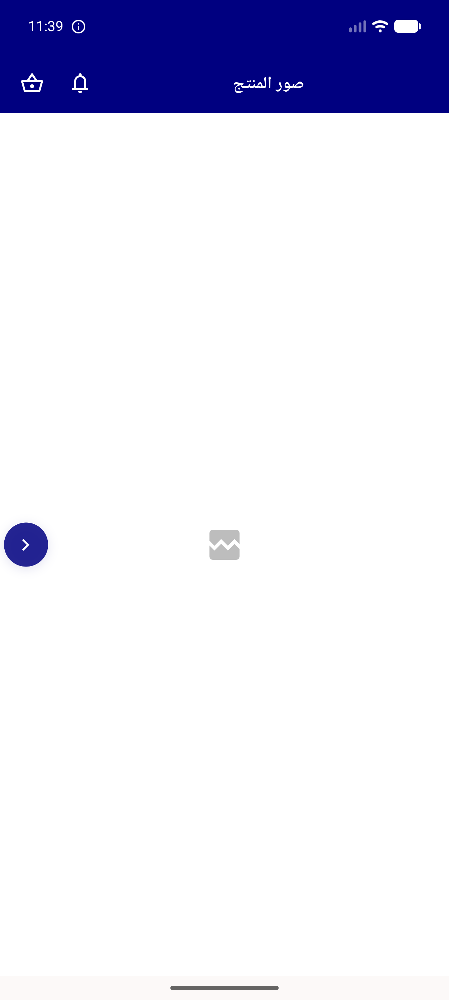</a> rtl gallery</td>
</tr>
<tr>
<td align="center" width="33%"><a href="35-category-grid.png">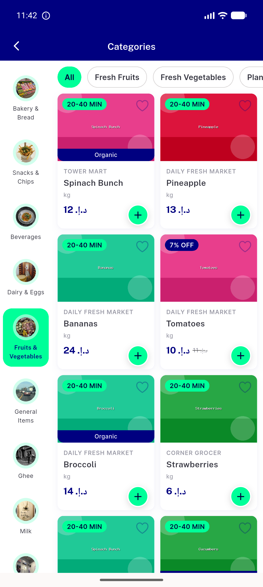</a> category grid</td>
<td align="center" width="33%"><a href="37-bottom-sheet-rendered.png">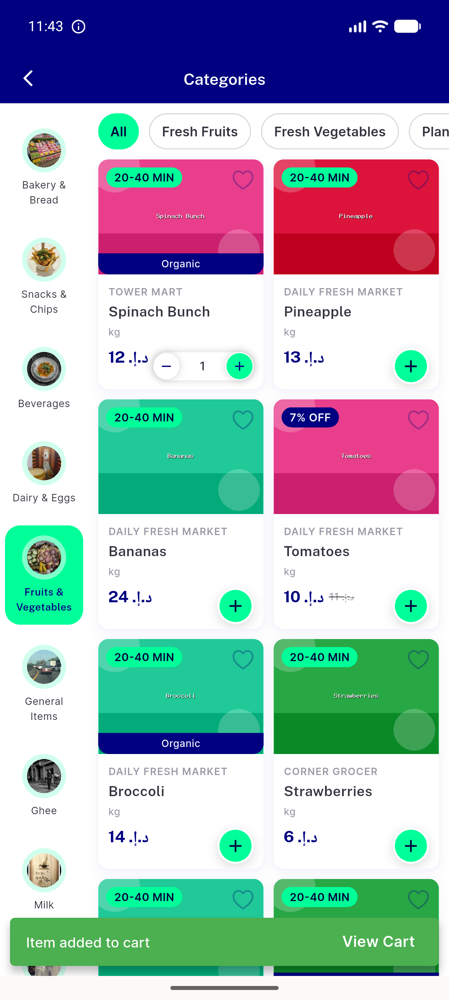</a> bottom sheet rendered</td>
<td align="center" width="33%"><a href="40b-loading-skeleton.png">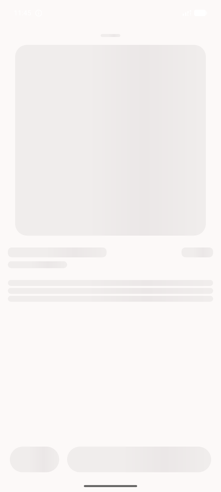</a> 40b loading skeleton</td>
</tr>
</table>

### Other artifacts
- [`progress.md`](progress.md)

---
*From `nears/docs/qa-evidence/NEARS-400/` · public-repo scrub policy (no live secrets; verified clean).*
