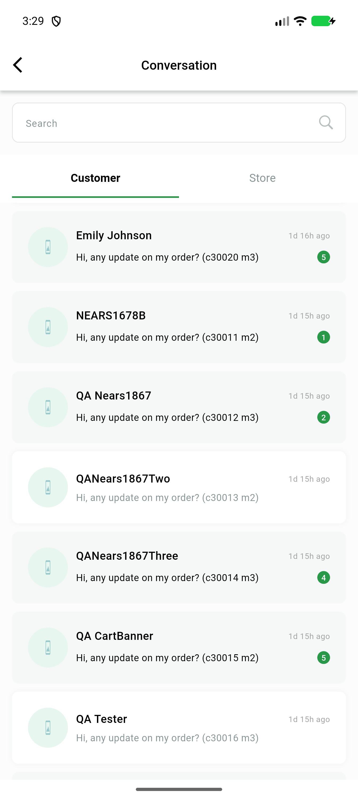

# QA Evidence — NEARS-4005

**FAIL: DA-10 live - same page requested twice on one scroll, appended twice (duplicate rows); 15 live steps otherwise PASS, suite 536/536**

**1 screenshot(s).** Click any thumbnail for full resolution.

<table>
<tr>
<td align="center" width="33%"> bug dup page2 junction</td>
</tr>
</table>

### Other artifacts
- [`analyze-head.txt`](analyze-head.txt)
- [`bug-dup-page-nodes.xml.txt`](bug-dup-page-nodes.xml.txt)
- [`bug-dup-page2.log`](bug-dup-page2.log)
- [`mutation-summary.txt`](mutation-summary.txt)
- [`requests-message-endpoints.log`](requests-message-endpoints.log)
- [`step5-failed-page3-app.log`](step5-failed-page3-app.log)

---
*From `nears/docs/qa-evidence/NEARS-4005/` · public-repo scrub policy (no live secrets; verified clean).*
