# QA Evidence — NEARS-401

**NEARS-401 Basket reskin — PASS (15 shots): 6 gaps closed, substitution persists to checkout, RTL+dark+skeleton verified, 45/45 cart tests green**

**15 screenshot(s).** Click any thumbnail for full resolution.

<table>
<tr>
<td align="center" width="33%"><a href="01-basket-top.png">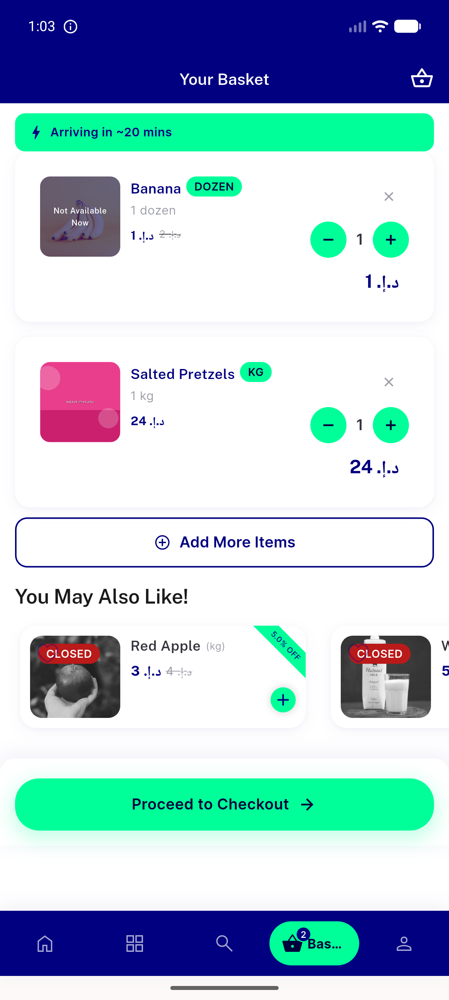</a> basket top</td>
<td align="center" width="33%"> substitution section</td>
<td align="center" width="33%"> substitution reselect</td>
</tr>
<tr>
<td align="center" width="33%"><a href="06-qty-recompute.png">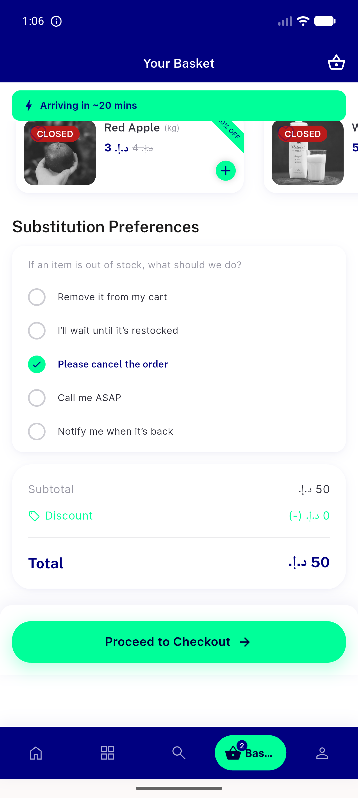</a> qty recompute</td>
<td align="center" width="33%"><a href="07-substitution-persists-checkout.png">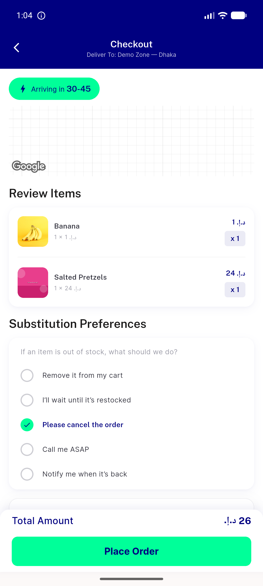</a> substitution persists checkout</td>
<td align="center" width="33%"><a href="08-dec-at-1-removes.png">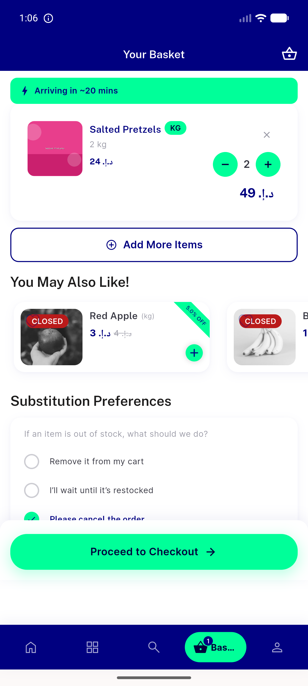</a> dec at 1 removes</td>
</tr>
<tr>
<td align="center" width="33%"> empty cart</td>
<td align="center" width="33%"><a href="11-loading-skeleton.png">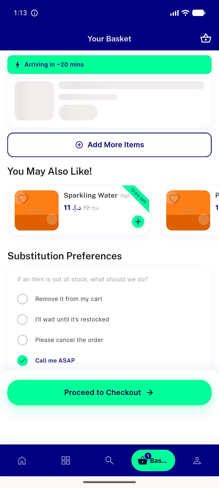</a> loading skeleton</td>
<td align="center" width="33%"><a href="12-cross-store-dialog.png">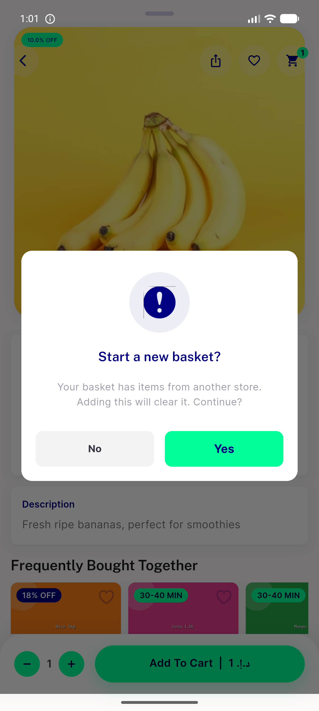</a> cross store dialog</td>
</tr>
<tr>
<td align="center" width="33%"><a href="13-dark-mode-top.png">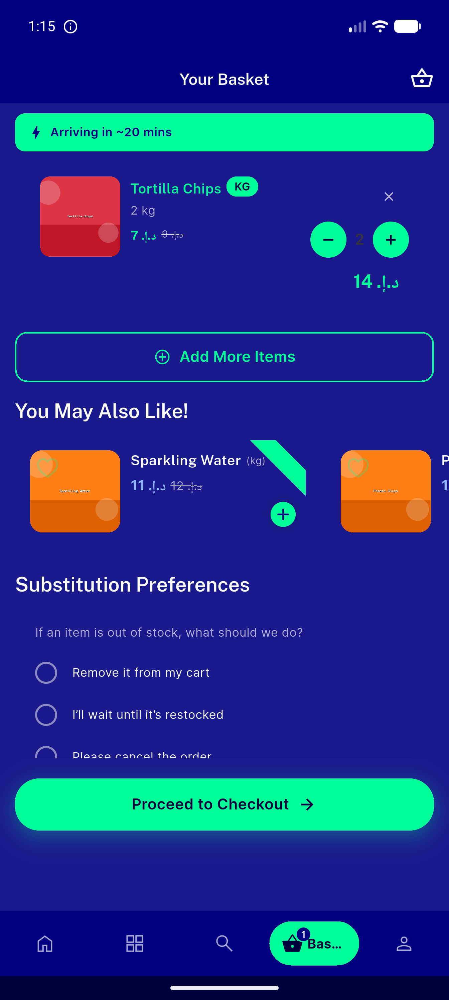</a> dark mode top</td>
<td align="center" width="33%"><a href="14-dark-mode-summary.png">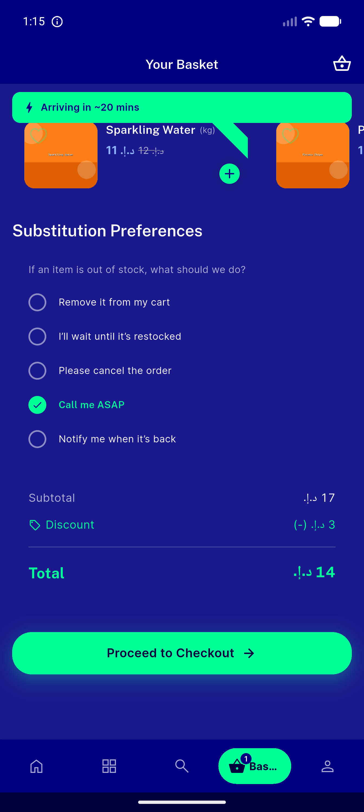</a> dark mode summary</td>
<td align="center" width="33%"><a href="15-rtl-arabic-top.png">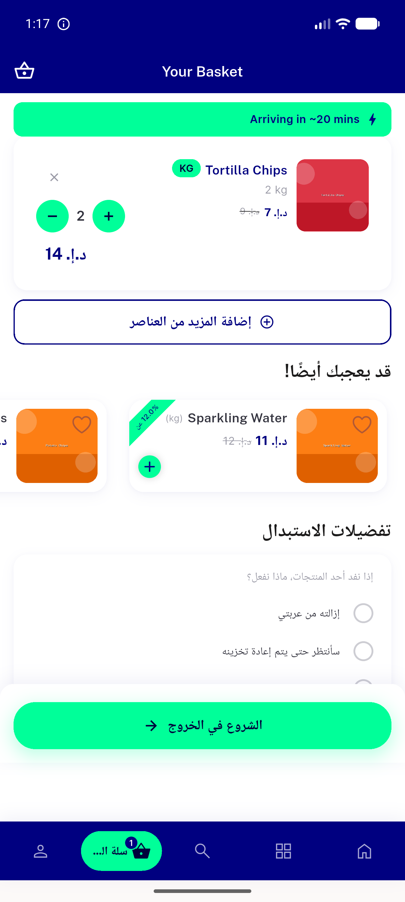</a> rtl arabic top</td>
</tr>
<tr>
<td align="center" width="33%"><a href="16-rtl-summary.png">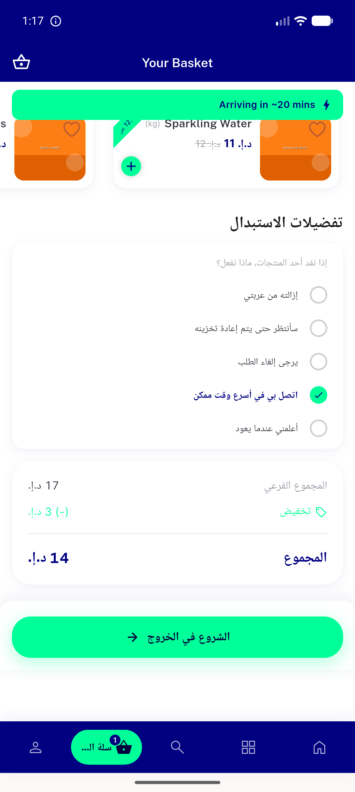</a> rtl summary</td>
<td align="center" width="33%"><a href="17-add-more-store.png">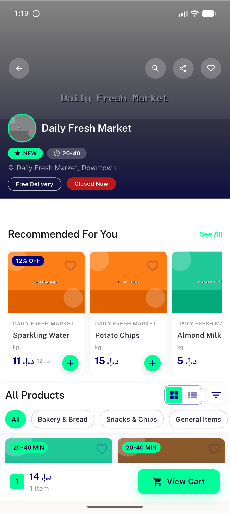</a> add more store</td>
<td align="center" width="33%"><a href="18-guest-login-suggestion.png">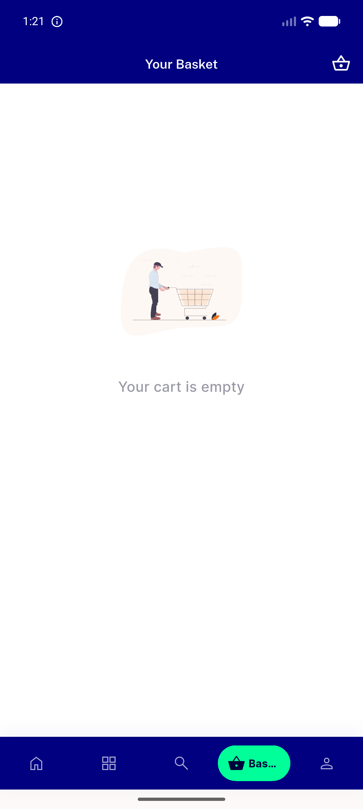</a> guest login suggestion</td>
</tr>
</table>

### Other artifacts
- [`progress.md`](progress.md)

---
*From `nears/docs/qa-evidence/NEARS-401/` · public-repo scrub policy (no live secrets; verified clean).*
