# QA Evidence — NEARS-4010

**step 1 banner pilot: live QA e7650e62e (add/update/delete green toasts, failure paths, Arabic, base comparison)**

**14 screenshot(s).** Click any thumbnail for full resolution.

<table>
<tr>
<td align="center" width="33%"><a href="00-banner-list-empty-before.png">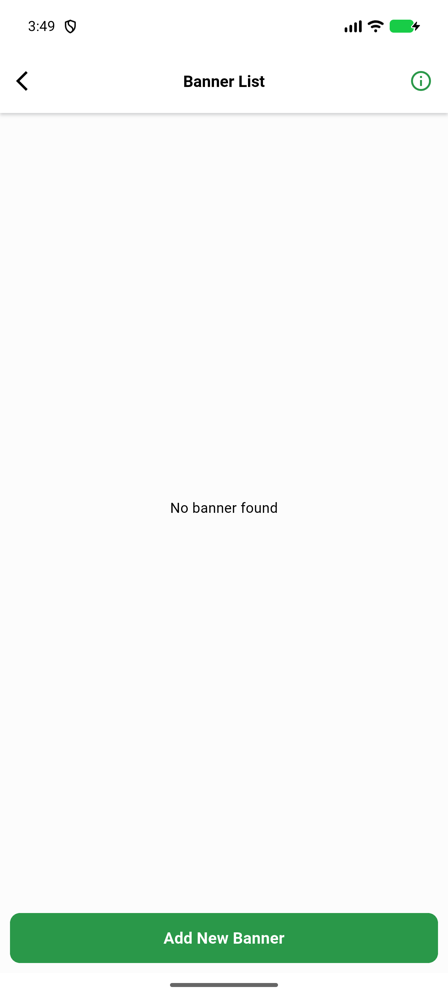</a> banner list empty before</td>
<td align="center" width="33%"><a href="02-val-missing-title-red-toast.png">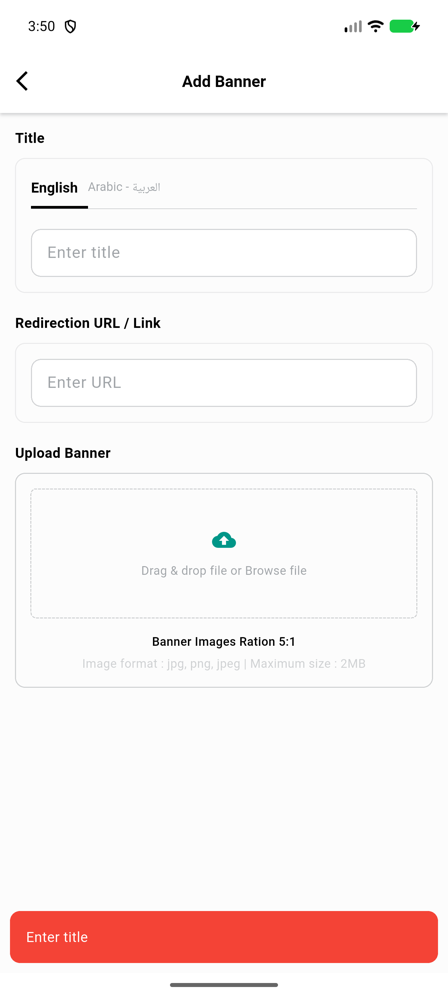</a> val missing title red toast</td>
<td align="center" width="33%"><a href="03-val-missing-image-red-toast.png">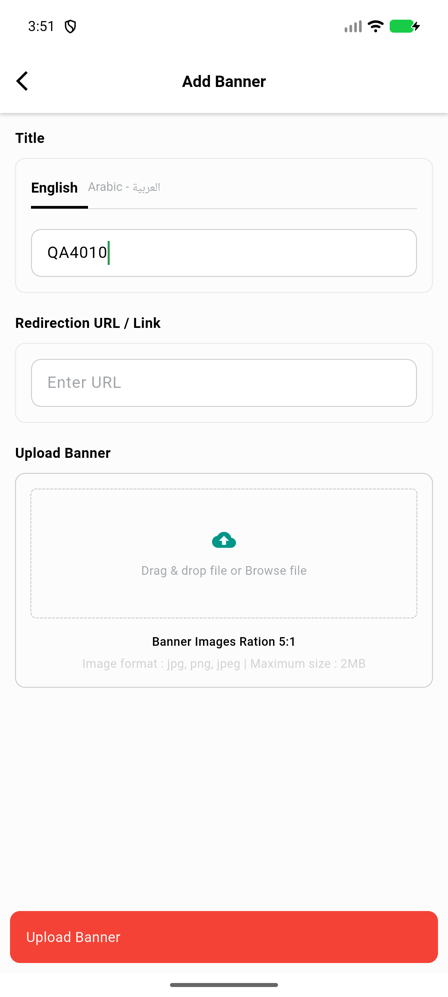</a> val missing image red toast</td>
</tr>
<tr>
<td align="center" width="33%"><a href="04-add-success-green-toast-list-refreshed.png">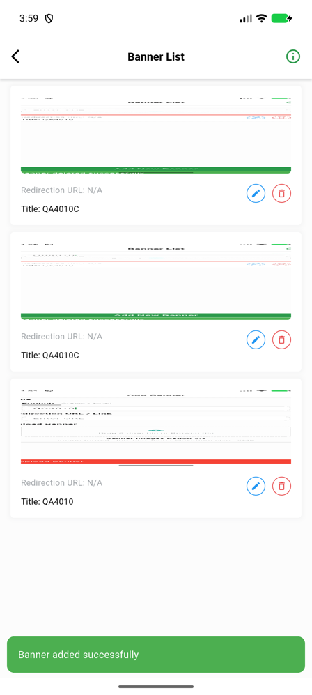</a> add success green toast list refreshed</td>
<td align="center" width="33%"><a href="05-update-success-green-toast-list-refreshed.png">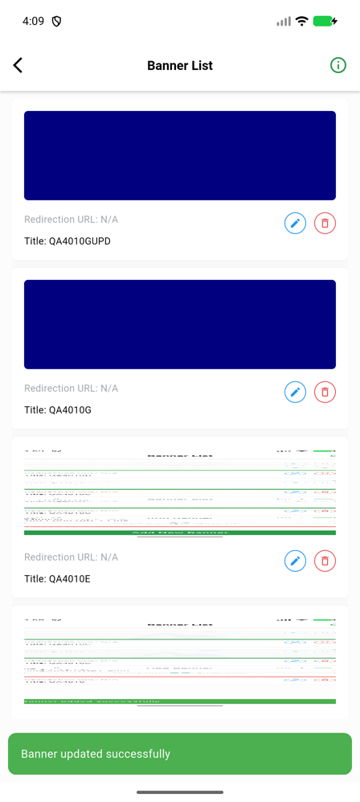</a> update success green toast list refreshed</td>
<td align="center" width="33%"><a href="05b-update-inflight-frames.png">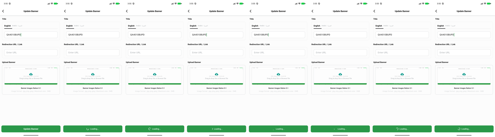</a> 05b update inflight frames</td>
</tr>
<tr>
<td align="center" width="33%"><a href="06-delete-success-dialog-closed-list-stays-green-toast.png">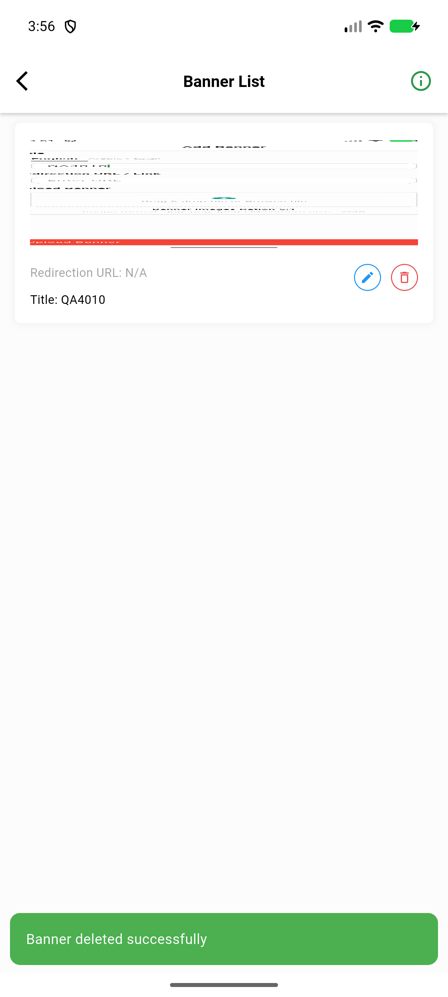</a> delete success dialog closed list stays green toast</td>
<td align="center" width="33%"><a href="06b-delete-success-montage-frames.png">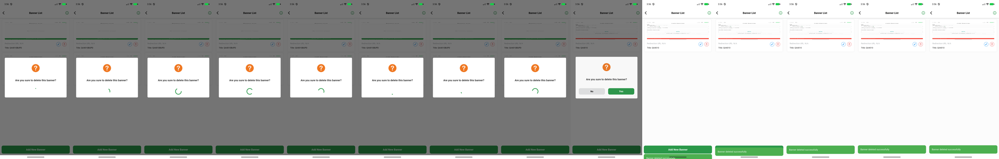</a> 06b delete success montage frames</td>
<td align="center" width="33%"><a href="07-delete-dialog-open.png">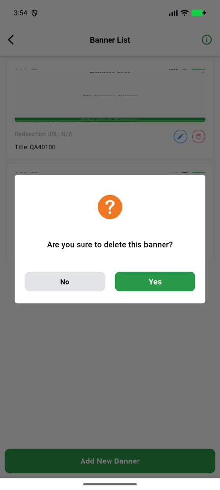</a> delete dialog open</td>
</tr>
<tr>
<td align="center" width="33%"><a href="07-delete-failure-500-dialog-stays-generic-red-toast.png">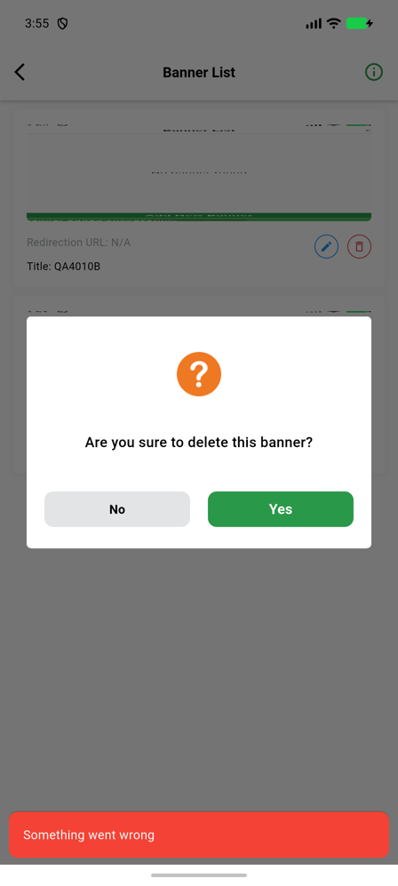</a> delete failure 500 dialog stays generic red toast</td>
<td align="center" width="33%"><a href="08-add-transport-failure-form-stays-no-banner-toast.png">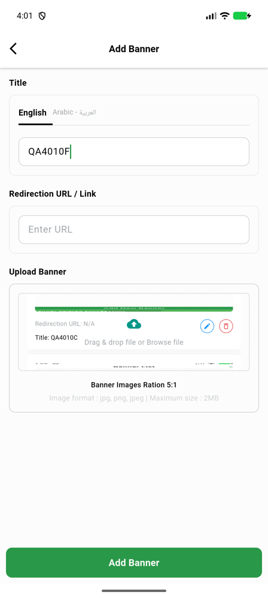</a> add transport failure form stays no banner toast</td>
<td align="center" width="33%"><a href="09-delete-success-arabic-rtl-toast.png">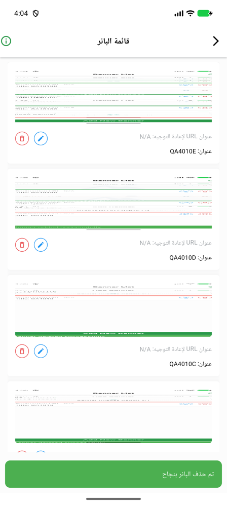</a> delete success arabic rtl toast</td>
</tr>
<tr>
<td align="center" width="33%"><a href="10-HEAD-add-doubletap-two-banners.png">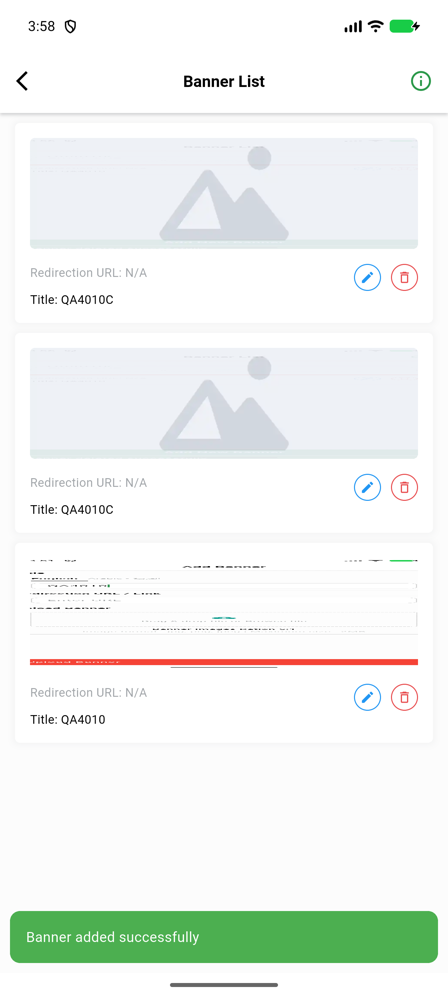</a> HEAD add doubletap two banners</td>
<td align="center" width="33%"><a href="11-BASE-add-doubletap-two-banners.png">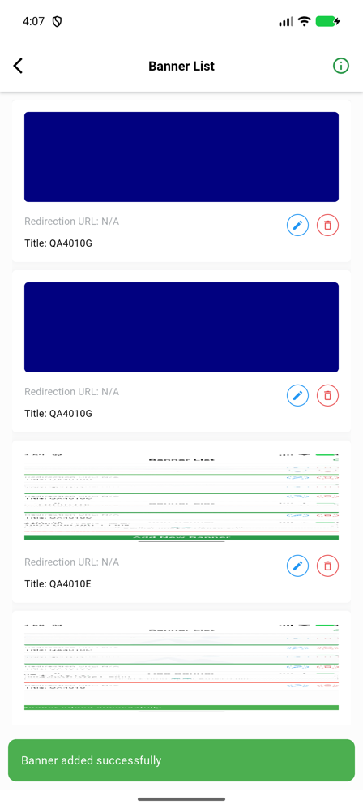</a> BASE add doubletap two banners</td>
</tr>
</table>

### Other artifacts
- [`bug-vendor-banner-store_id-500.log`](bug-vendor-banner-store_id-500.log)
- [`progress.md`](progress.md)
- [`requests-BASE.log`](requests-BASE.log)
- [`requests-HEAD.log`](requests-HEAD.log)

---
*From `nears/docs/qa-evidence/NEARS-4010/` · public-repo scrub policy (no live secrets; verified clean).*
