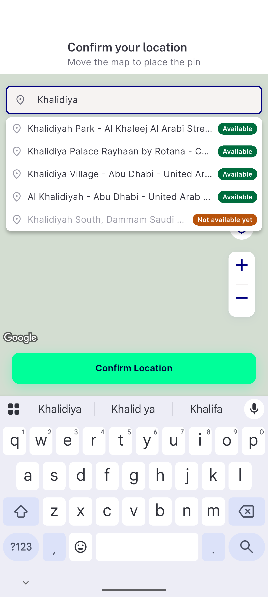
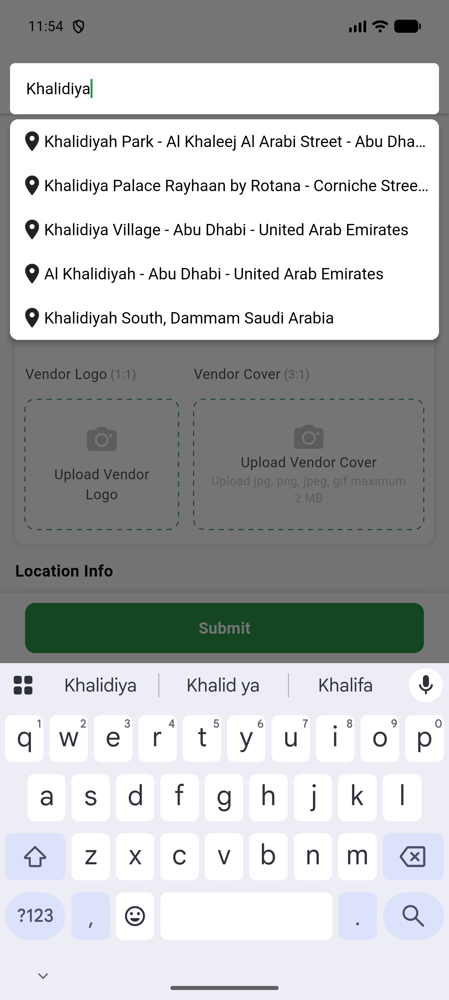

# QA Evidence — NEARS-4012

**step 4 SP-005 PredictionModel move: AC10 real-Google live smoke, UserApp + VendorApp**

**2 screenshot(s).** Click any thumbnail for full resolution.

<table>
<tr>
<td align="center" width="33%"> ac10 userapp real google</td>
<td align="center" width="33%"> ac10 vendorapp real google</td>
</tr>
</table>

### Other artifacts
- [`M2.diff`](M2.diff)
- [`M8.diff`](M8.diff)
- [`MQ1.diff`](MQ1.diff)
- [`ac10-userapp-real-google-a11y.xml`](ac10-userapp-real-google-a11y.xml)
- [`ac10-vendorapp-real-google-a11y.xml`](ac10-vendorapp-real-google-a11y.xml)

---
*From `nears/docs/qa-evidence/NEARS-4012/` · public-repo scrub policy (no live secrets; verified clean).*
