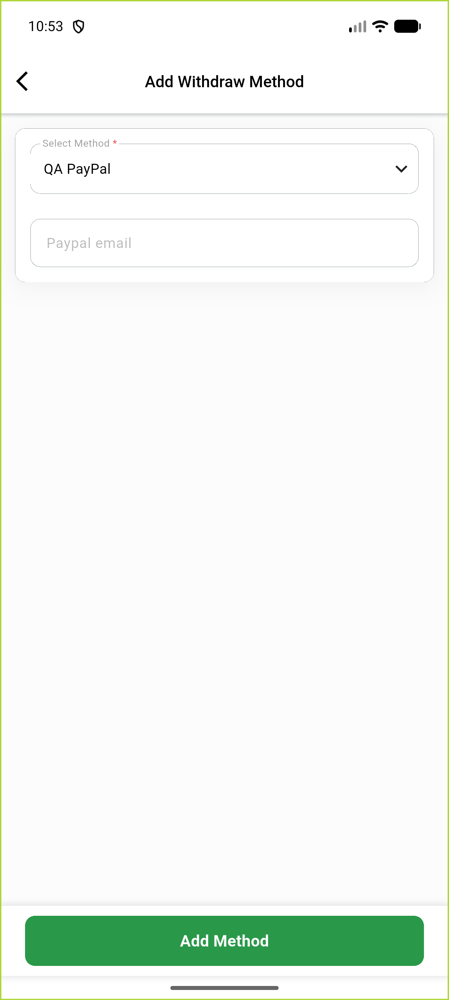
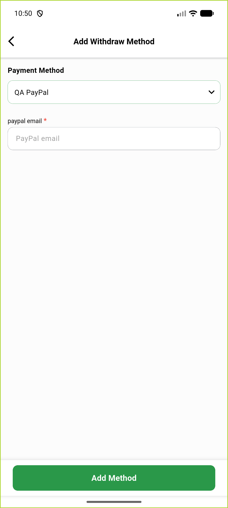

# QA Evidence — NEARS-4012

**step 3 SP-005 withdraw DTO move: QA PASS (AC1-AC12)**

**2 screenshot(s).** Click any thumbnail for full resolution.

<table>
<tr>
<td align="center" width="33%"> delivery add withdraw method paypal</td>
<td align="center" width="33%"> vendor add withdraw method paypal</td>
</tr>
</table>

### Other artifacts
- [`delivery-add-dump-idx0.xml`](delivery-add-dump-idx0.xml)
- [`delivery-add-dump-idx1.xml`](delivery-add-dump-idx1.xml)
- [`delivery-dropdown-open.xml`](delivery-dropdown-open.xml)
- [`delivery-edit-dump.xml`](delivery-edit-dump.xml)
- [`delivery-list-dump.xml`](delivery-list-dump.xml)
- [`delivery-logs-excerpt.log`](delivery-logs-excerpt.log)
- [`m5.diff`](m5.diff)
- [`m7.diff`](m7.diff)
- [`oracle-delivery-get-withdraw-method-list.json`](oracle-delivery-get-withdraw-method-list.json)
- [`oracle-vendor-get-withdraw-method-list.json`](oracle-vendor-get-withdraw-method-list.json)
- [`progress.md`](progress.md)
- [`vendor-add-dump-idx0.xml`](vendor-add-dump-idx0.xml)
- [`vendor-add-dump-idx1.xml`](vendor-add-dump-idx1.xml)
- [`vendor-dropdown-open.xml`](vendor-dropdown-open.xml)
- [`vendor-logs-excerpt.log`](vendor-logs-excerpt.log)

---
*From `nears/docs/qa-evidence/NEARS-4012/` · public-repo scrub policy (no live secrets; verified clean).*
