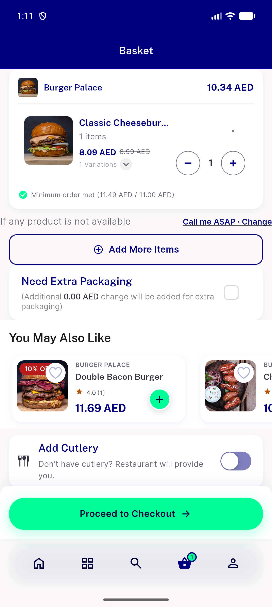
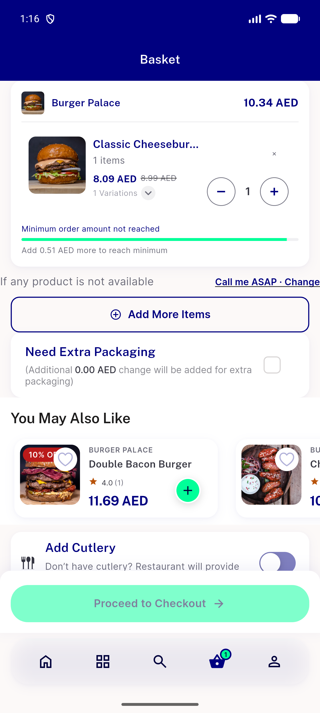
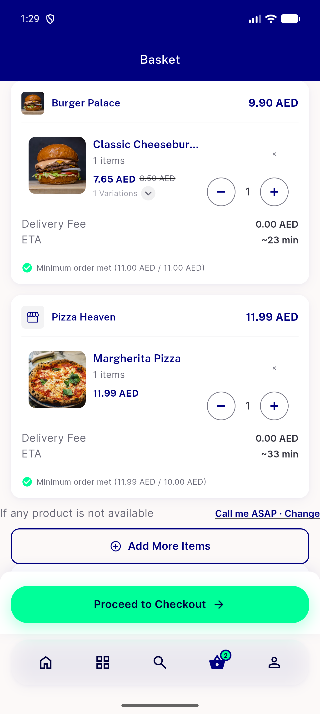
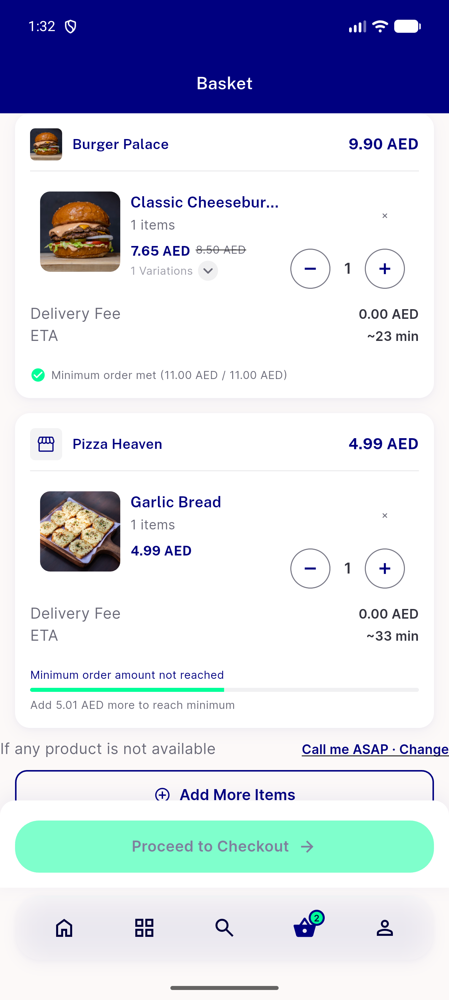

# QA Evidence — NEARS-4026

**PASS - single-store min gate on gross basis; AC1-AC4 live on emulator-5684**

**8 screenshot(s).** Click any thumbnail for full resolution.

<table>
<tr>
<td align="center" width="33%"> AC1 basket bar met</td>
<td align="center" width="33%"> AC1 confirm sheet</td>
<td align="center" width="33%"> AC2 basket bar min12</td>
</tr>
<tr>
<td align="center" width="33%"> AC2 confirm sheet before block</td>
<td align="center" width="33%"> AC4 mixed basket bars</td>
<td align="center" width="33%"> AC4 mixed group card under</td>
</tr>
<tr>
<td align="center" width="33%"> addon basket bar 11 50</td>
<td align="center" width="33%"> boundary basket bar 11 00</td>
</tr>
</table>

### Other artifacts
- [`AC2-basket-min12-dump.xml`](AC2-basket-min12-dump.xml)
- [`AC2-forced-block.log`](AC2-forced-block.log)
- [`AC4-mixed-under-dump.xml`](AC4-mixed-under-dump.xml)
- [`bug-semantics-assertion.log`](bug-semantics-assertion.log)
- [`progress.md`](progress.md)

---
*From `nears/docs/qa-evidence/NEARS-4026/` · public-repo scrub policy (no live secrets; verified clean).*
