# QA Evidence — NEARS-403

**PASS — Order success & tracking reskin (app-only DLS sweep): delivered=mint / canceled=RED chips verified live, F-1 dark price=sky verified, RTL+guest-input clean, +116 tests**

**13 screenshot(s).** Click any thumbnail for full resolution.

<table>
<tr>
<td align="center" width="33%"><a href="01-my-orders-list.png">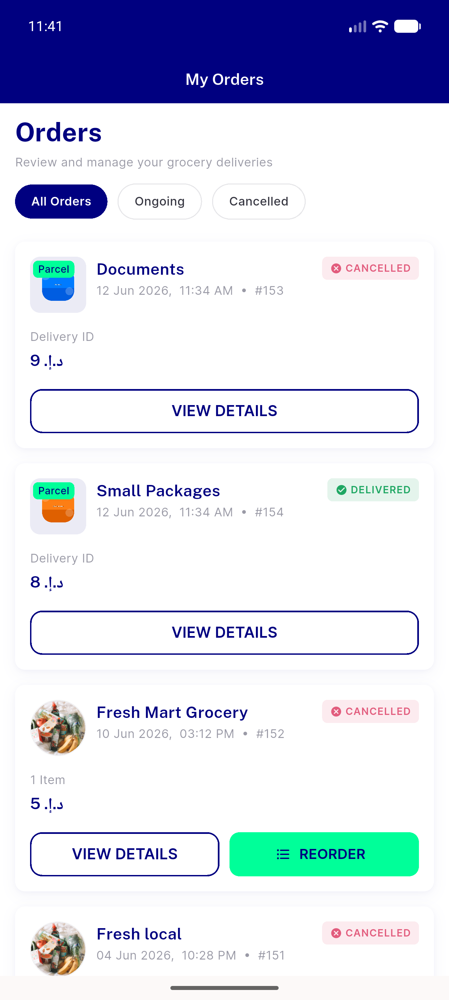</a> my orders list</td>
<td align="center" width="33%"><a href="02-order154-delivered-parcel-details.png">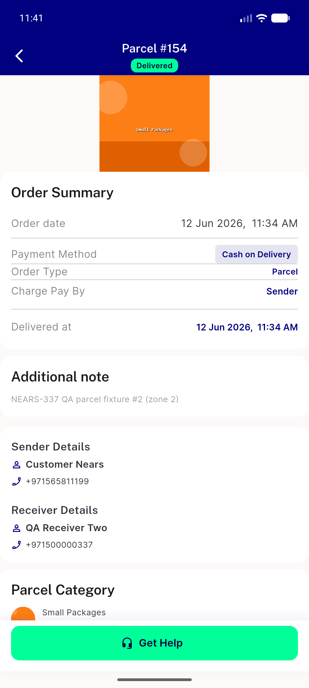</a> order154 delivered parcel details</td>
<td align="center" width="33%"><a href="03-canceled-order-details.png">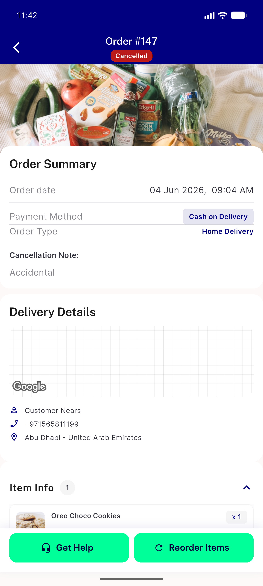</a> canceled order details</td>
</tr>
<tr>
<td align="center" width="33%"><a href="04-canceled-breakdown-terminal.png">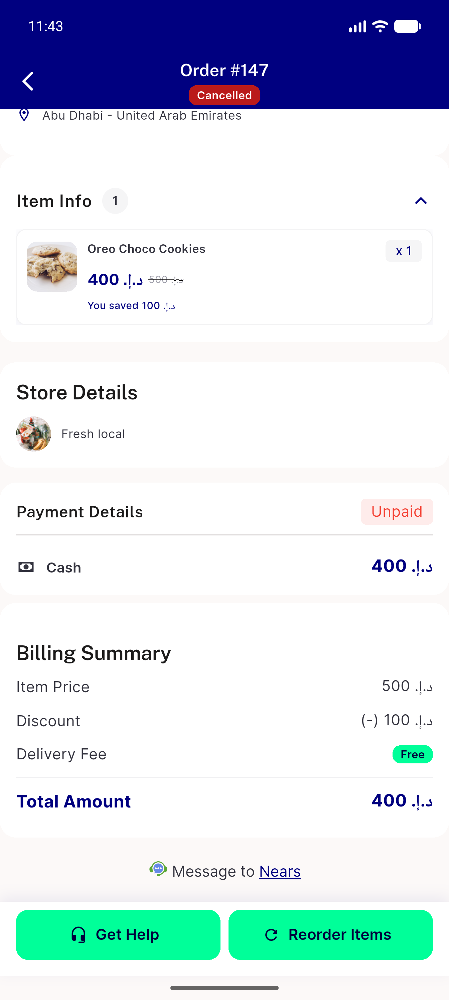</a> canceled breakdown terminal</td>
<td align="center" width="33%"><a href="05-delivered-grocery-hero-stepper.png">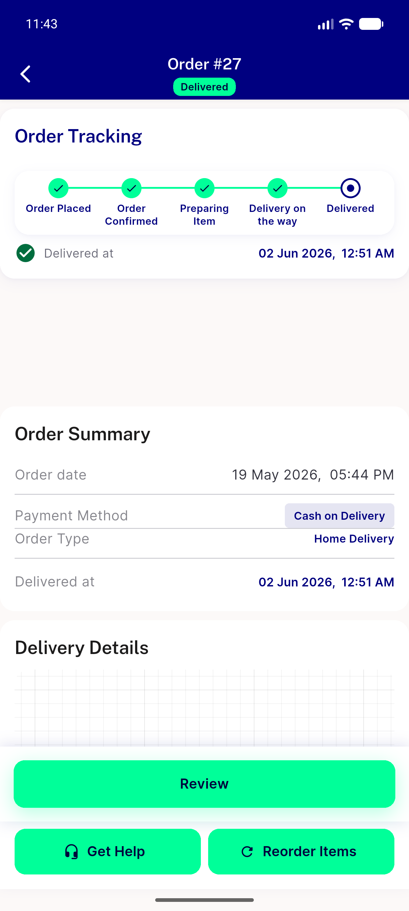</a> delivered grocery hero stepper</td>
<td align="center" width="33%"><a href="06-support-sheet.png">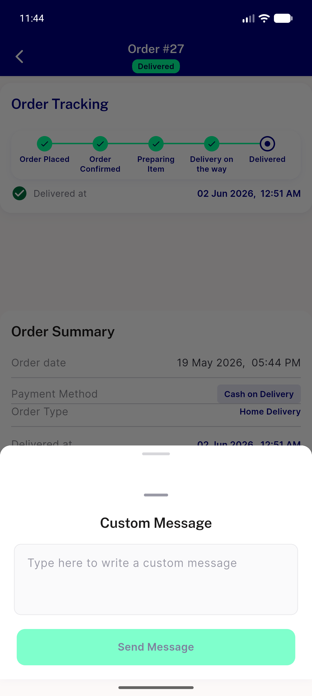</a> support sheet</td>
</tr>
<tr>
<td align="center" width="33%"><a href="07-support-text-entered.png">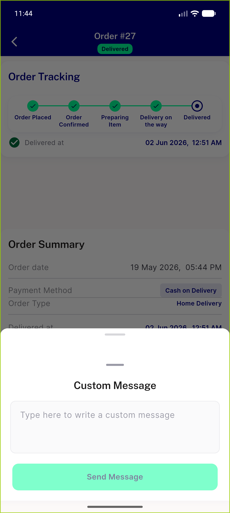</a> support text entered</td>
<td align="center" width="33%"><a href="08-dark-settings.png">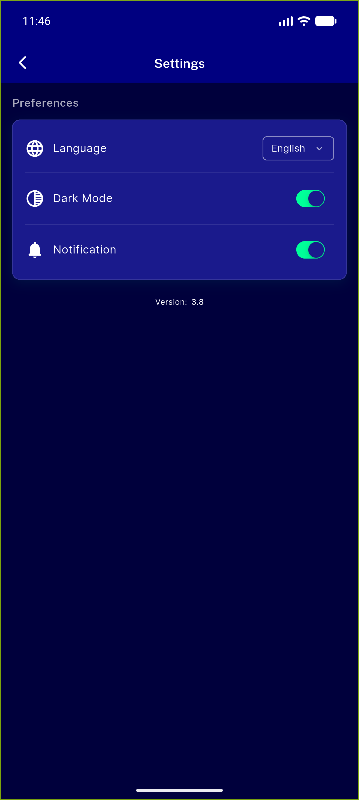</a> dark settings</td>
<td align="center" width="33%"><a href="09-dark-cost-breakdown-F1.png">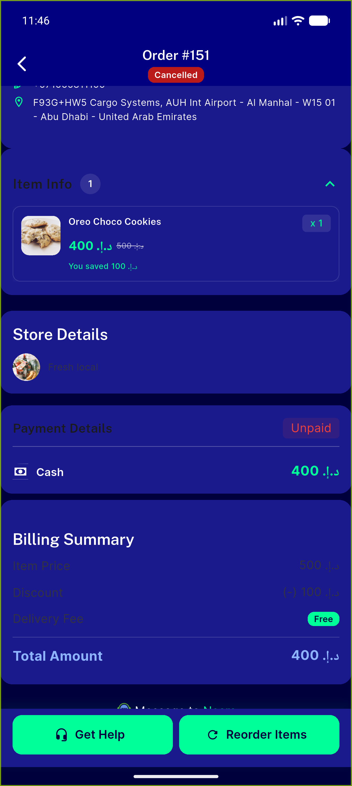</a> dark cost breakdown F1</td>
</tr>
<tr>
<td align="center" width="33%"><a href="10-dark-delivered-hero-stepper.png">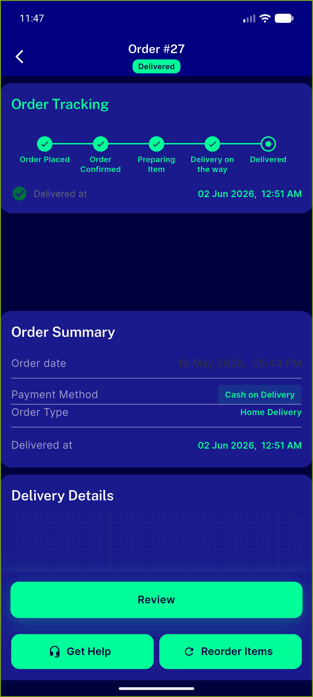</a> dark delivered hero stepper</td>
<td align="center" width="33%"><a href="11-arabic-rtl-set.png">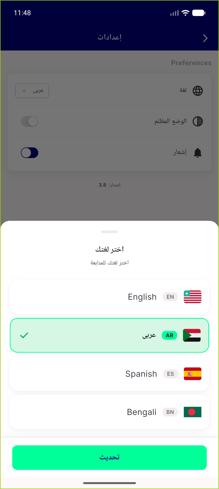</a> arabic rtl set</td>
<td align="center" width="33%"><a href="12-arabic-order-details-rtl.png">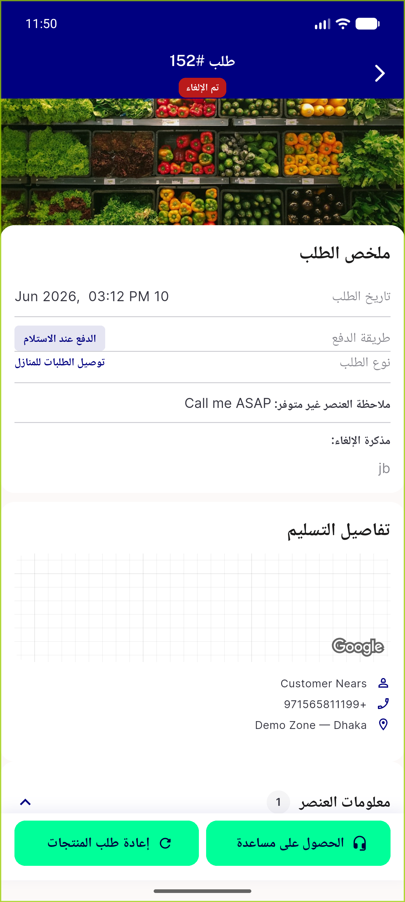</a> arabic order details rtl</td>
</tr>
<tr>
<td align="center" width="33%"><a href="13-guest-track-input.png">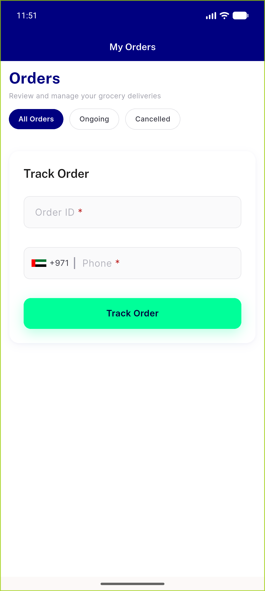</a> guest track input</td>
</tr>
</table>

### Other artifacts
- [`progress.md`](progress.md)

---
*From `nears/docs/qa-evidence/NEARS-403/` · public-repo scrub policy (no live secrets; verified clean).*
