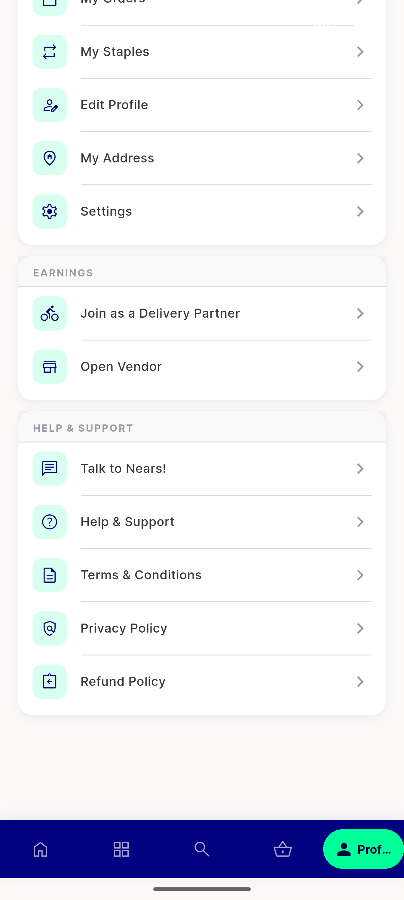
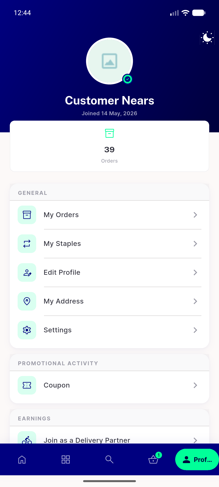
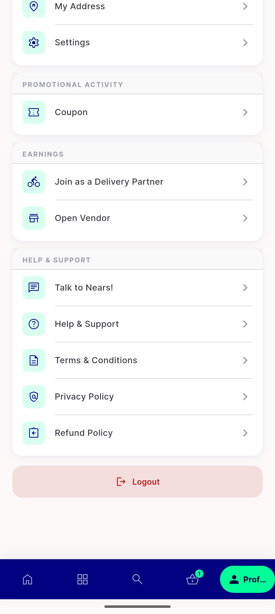
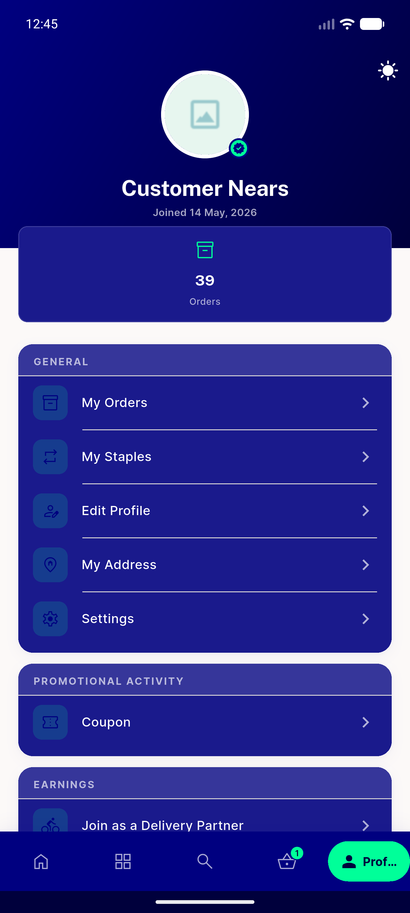
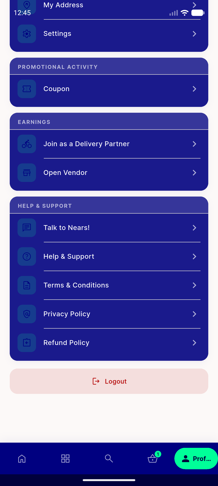
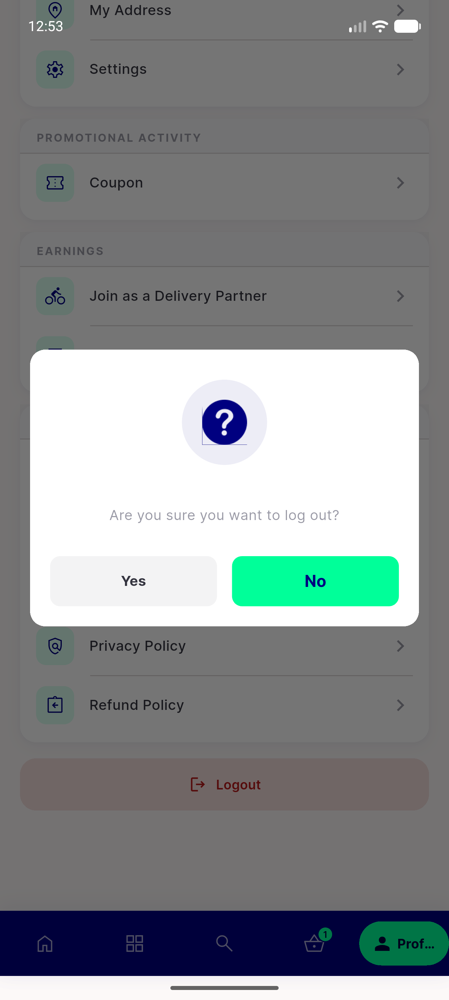
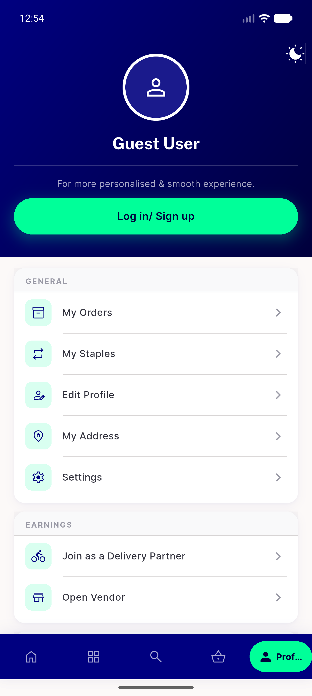
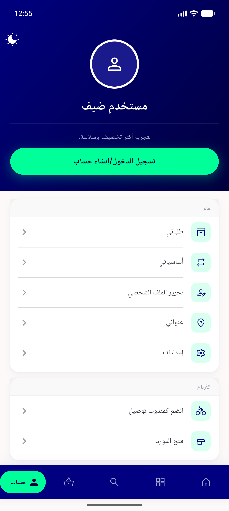

# QA Evidence — NEARS-404

**PASS — Profile/menu hub reskin: navy hero + NEARS-167 guard + F-01 dark logout + config matrix + RTL [cycle 1]**

**9 screenshot(s).** Click any thumbnail for full resolution.

<table>
<tr>
<td align="center" width="33%"> guest hero light</td>
<td align="center" width="33%"> guest support light</td>
<td align="center" width="33%"> loggedin hero light</td>
</tr>
<tr>
<td align="center" width="33%"> loggedin logout light</td>
<td align="center" width="33%"> loggedin hero dark</td>
<td align="center" width="33%"> loggedin logout dark</td>
</tr>
<tr>
<td align="center" width="33%"> logout dialog</td>
<td align="center" width="33%"> guest after logout</td>
<td align="center" width="33%"> guest rtl arabic</td>
</tr>
</table>

### Other artifacts
- [`progress.md`](progress.md)

---
*From `nears/docs/qa-evidence/NEARS-404/` · public-repo scrub policy (no live secrets; verified clean).*
