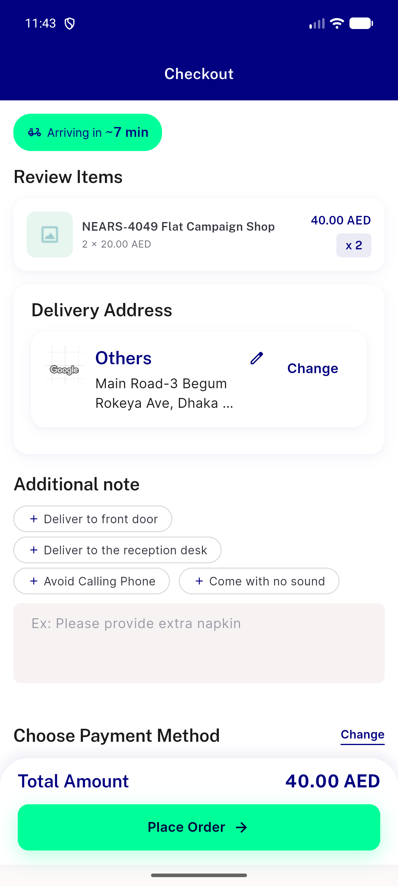
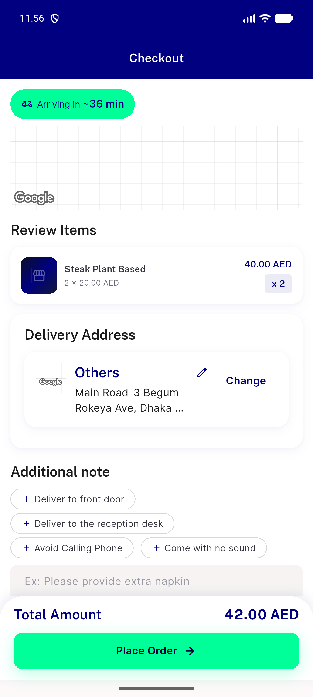
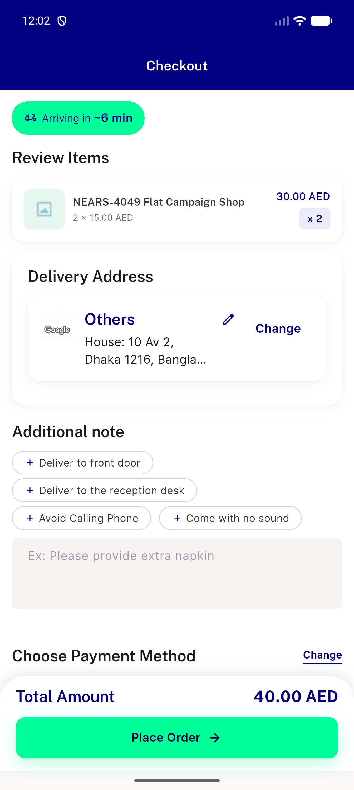
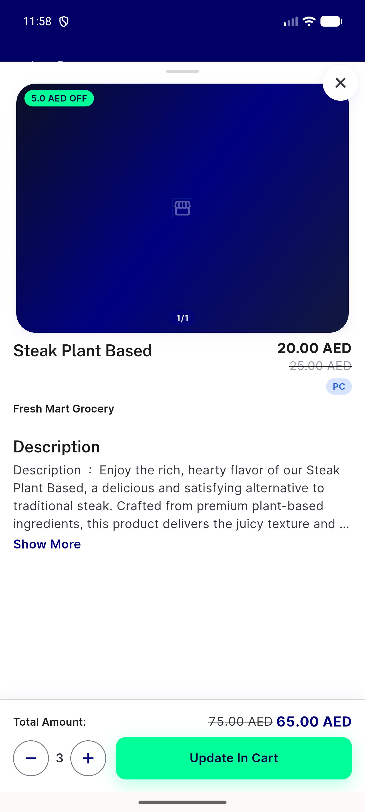

# QA Evidence — NEARS-4049

**QA c22427157: flat-discount footer N x P - N x D live-verified, server-charged matches on all paths; 1 Low test-gap finding**

**6 screenshot(s).** Click any thumbnail for full resolution.

<table>
<tr>
<td align="center" width="33%"> ac campaign ordernow n2 checkout</td>
<td align="center" width="33%"> ac2 item85 inbasket qty2 sheet footer</td>
<td align="center" width="33%"> ac4 item85 basket qty2</td>
</tr>
<tr>
<td align="center" width="33%"> ac4 item85 checkout qty2</td>
<td align="center" width="33%"> base prefix campaign ordernow n2 checkout</td>
<td align="center" width="33%"> base prefix item85 inbasket qty3 sheet</td>
</tr>
</table>

### Other artifacts
- [`ac-campaign-ordernow-n2-checkout.a11y.txt`](ac-campaign-ordernow-n2-checkout.a11y.txt)
- [`ac2-item85-inbasket-qty2-sheet-footer.a11y.txt`](ac2-item85-inbasket-qty2-sheet-footer.a11y.txt)
- [`base-prefix-campaign-ordernow-n2-checkout.a11y.txt`](base-prefix-campaign-ordernow-n2-checkout.a11y.txt)
- [`bug-campaign-checkout-tax-components-missing.log`](bug-campaign-checkout-tax-components-missing.log)
- [`bug-m7-survivor-addon-cartrow-untested.log`](bug-m7-survivor-addon-cartrow-untested.log)
- [`bug-search-results-rendertable-semantics.log`](bug-search-results-rendertable-semantics.log)
- [`bug-variation-flat-checkout-row-quirk.log`](bug-variation-flat-checkout-row-quirk.log)
- [`fixtures.sql`](fixtures.sql)
- [`mutations`](mutations)
- [`progress.md`](progress.md)
- [`server-charged.txt`](server-charged.txt)

---
*From `nears/docs/qa-evidence/NEARS-4049/` · public-repo scrub policy (no live secrets; verified clean).*
