# QA Evidence — NEARS-405

**PASS — Edit Profile reskin: C1 crash-fix verified under throttle (no NPE), +971 split correct, all 9 ACs demonstrated live; 11/11 tests green; regression clean**

**14 screenshot(s).** Click any thumbnail for full resolution.

<table>
<tr>
<td align="center" width="33%"><a href="01-edit-profile-loaded.png">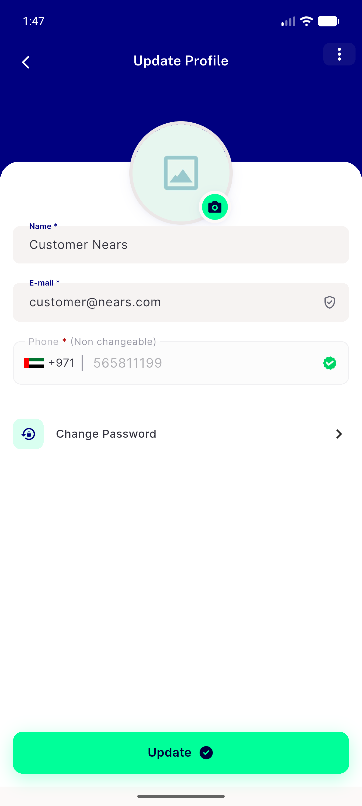</a> edit profile loaded</td>
<td align="center" width="33%"><a href="02-gallery-picker.png">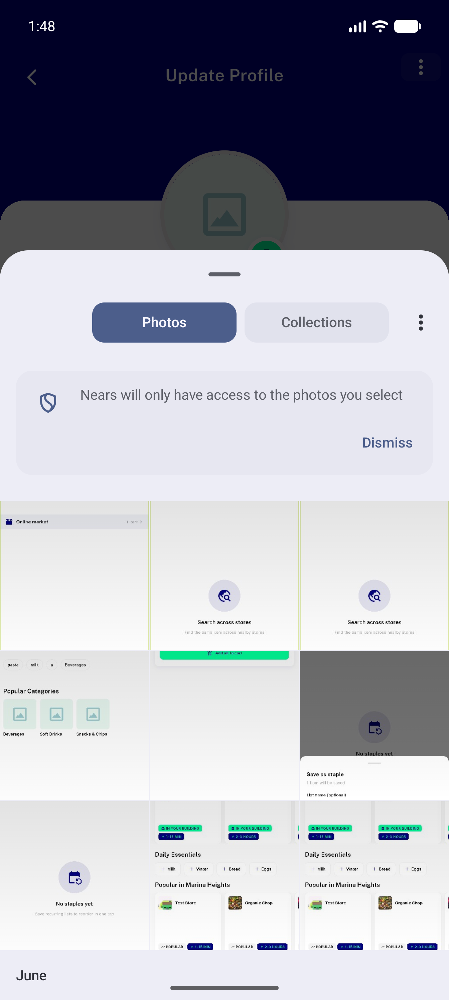</a> gallery picker</td>
<td align="center" width="33%"><a href="03-avatar-picked-preview.png">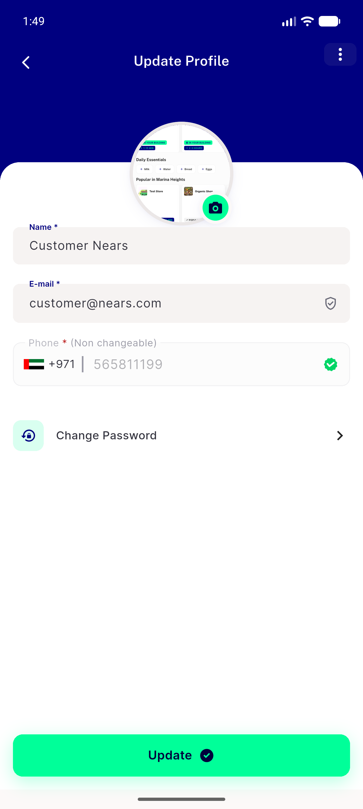</a> avatar picked preview</td>
</tr>
<tr>
<td align="center" width="33%"><a href="04-change-password-route.png">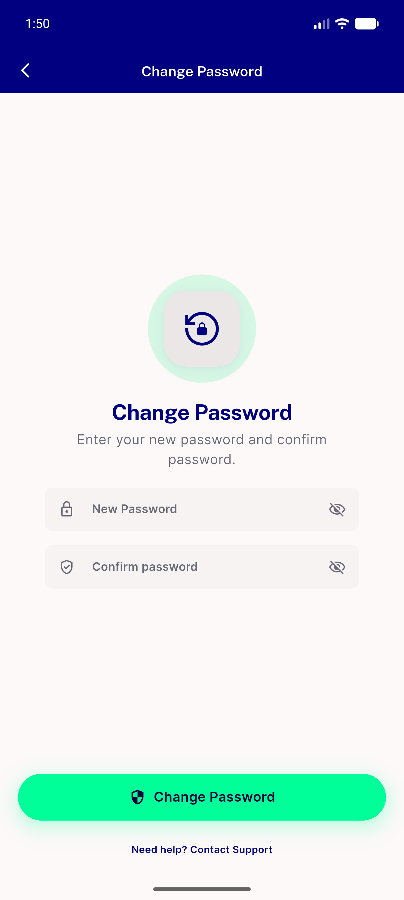</a> change password route</td>
<td align="center" width="33%"><a href="05-validation-empty-name.png">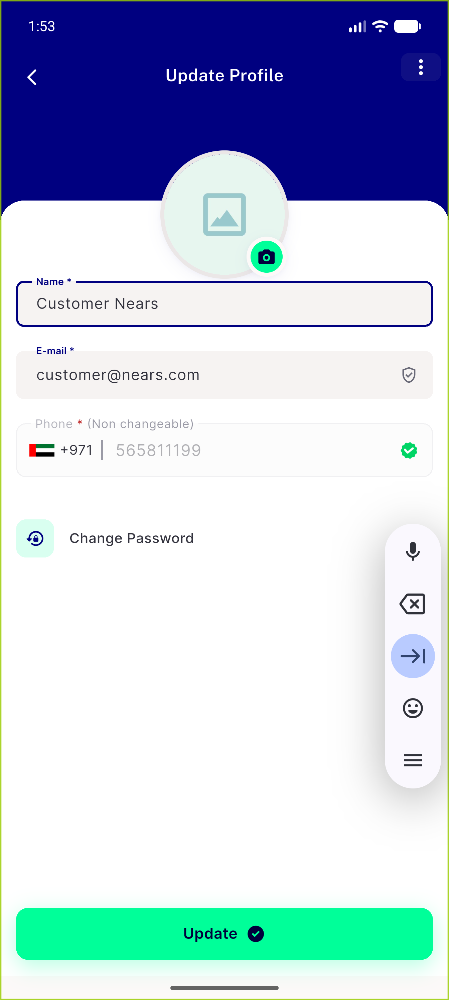</a> validation empty name</td>
<td align="center" width="33%"><a href="06-validation-invalid-email.png">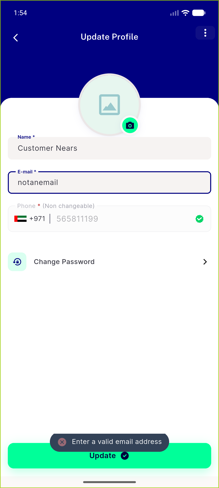</a> validation invalid email</td>
</tr>
<tr>
<td align="center" width="33%"><a href="07-kebab-menu.png">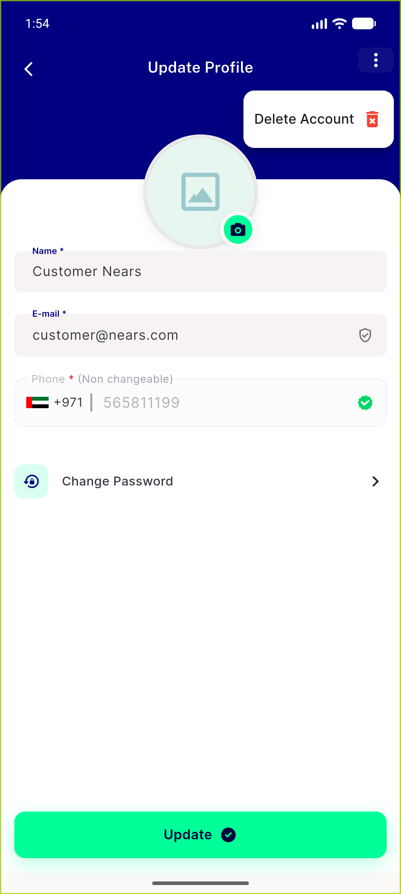</a> kebab menu</td>
<td align="center" width="33%"><a href="08-delete-account-dialog.png">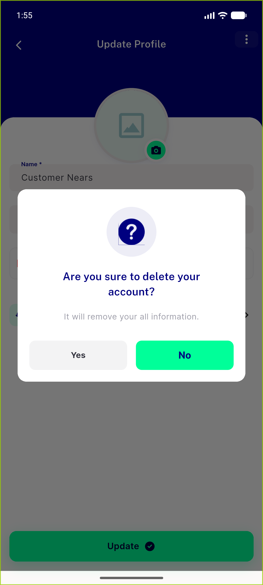</a> delete account dialog</td>
<td align="center" width="33%"><a href="09-dark-mode.png">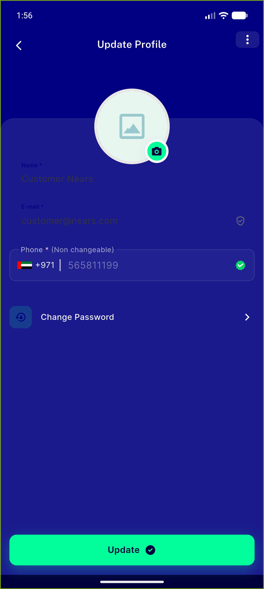</a> dark mode</td>
</tr>
<tr>
<td align="center" width="33%"><a href="10-rtl-arabic.png">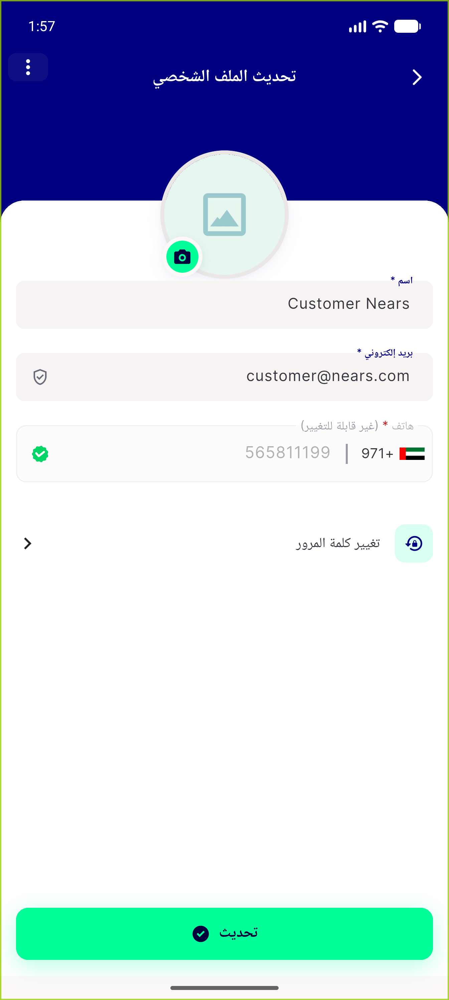</a> rtl arabic</td>
<td align="center" width="33%"><a href="11-cold-build-throttled.png">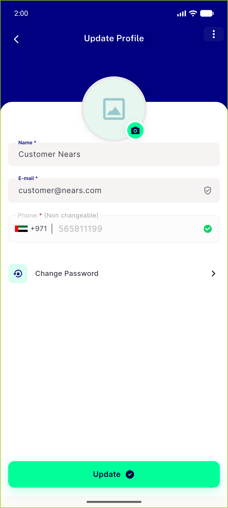</a> cold build throttled</td>
<td align="center" width="33%"><a href="12-guest-notloggedin.png">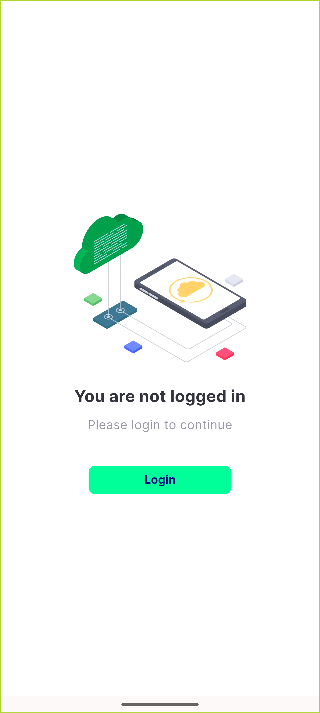</a> guest notloggedin</td>
</tr>
<tr>
<td align="center" width="33%"><a href="13-regression-profile-tab.png">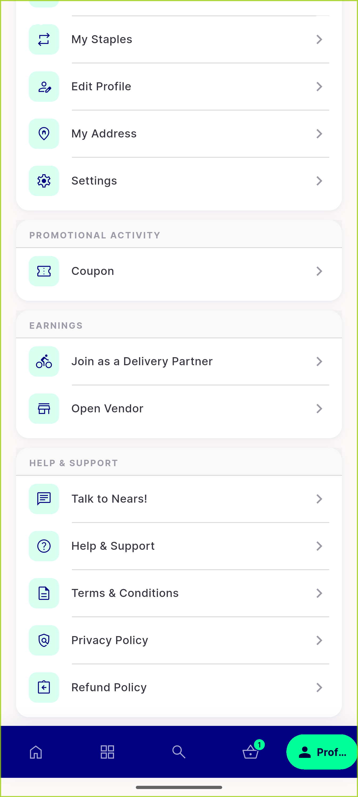</a> regression profile tab</td>
<td align="center" width="33%"><a href="14-regression-my-address.png">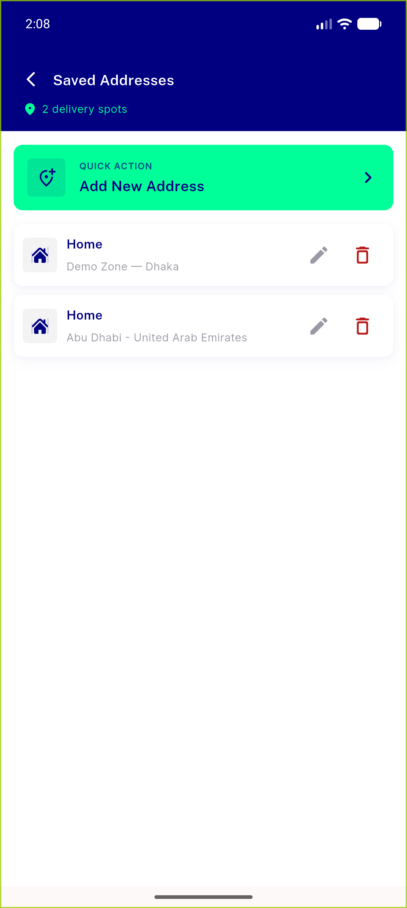</a> regression my address</td>
</tr>
</table>

### Other artifacts
- [`progress.md`](progress.md)

---
*From `nears/docs/qa-evidence/NEARS-405/` · public-repo scrub policy (no live secrets; verified clean).*
