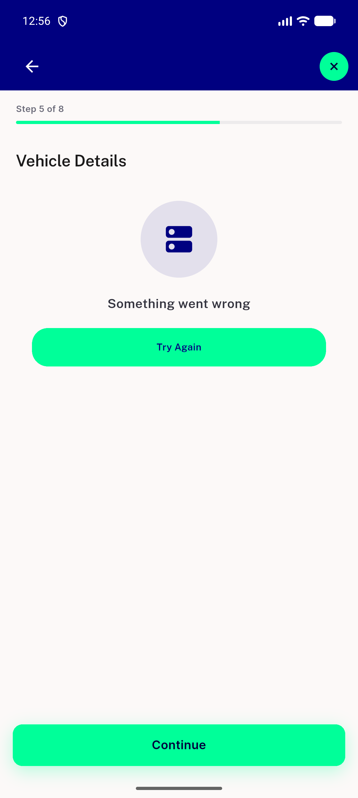
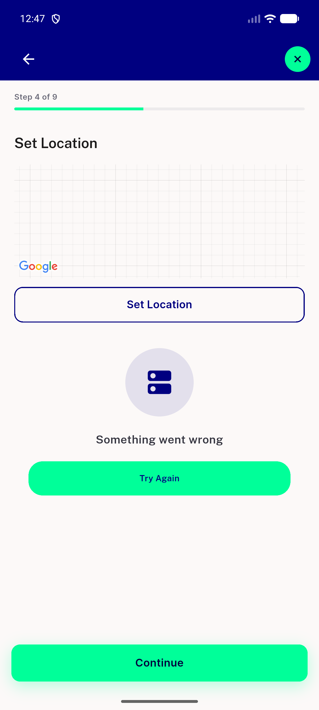
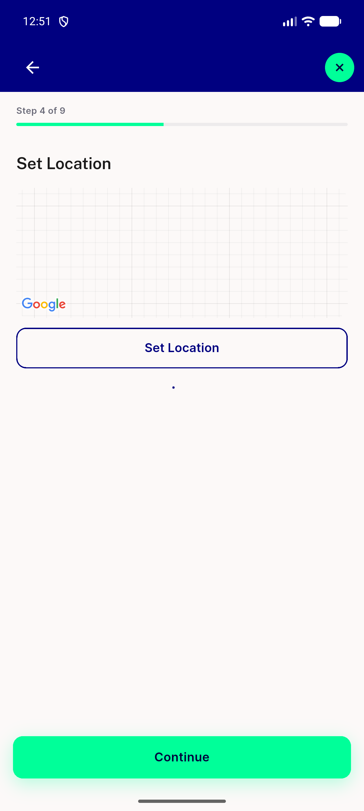
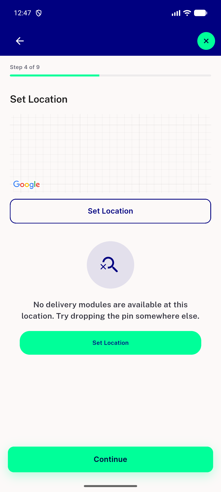
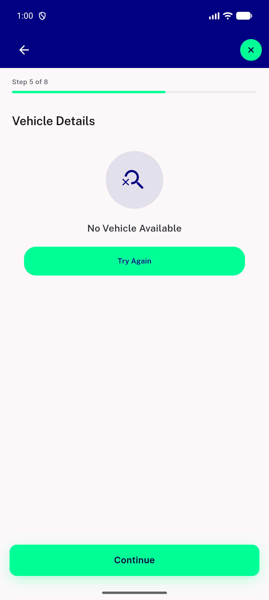
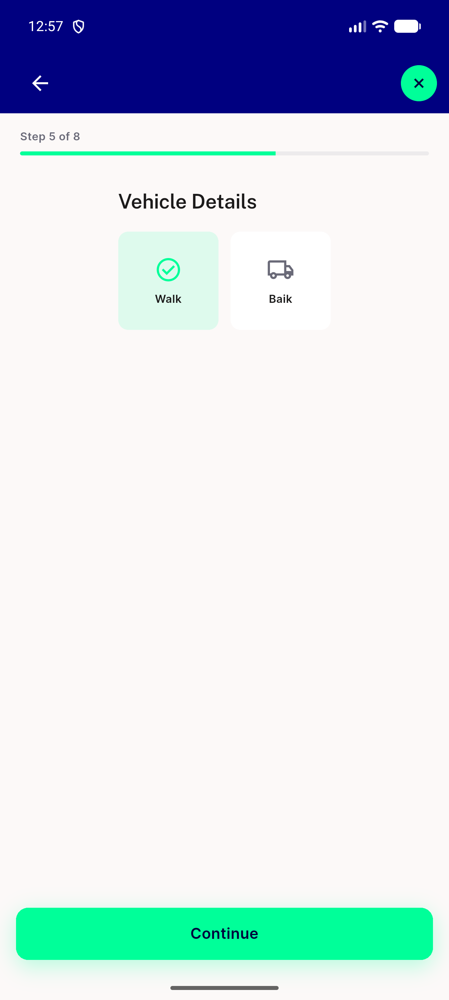

# QA Evidence — NEARS-4050

**NEARS-4050 QA PASS: live vendor+delivery dead-end walk (EN light), 133+227 host tests, 19/20 QA mutations killed**

**6 screenshot(s).** Click any thumbnail for full resolution.

<table>
<tr>
<td align="center" width="33%"> ac4 vehicle failed light en</td>
<td align="center" width="33%"> v1 failed server retry</td>
<td align="center" width="33%"> v1 loading state</td>
</tr>
<tr>
<td align="center" width="33%"> v1 zero modules state</td>
<td align="center" width="33%"> v2 empty 200 state</td>
<td align="center" width="33%"> v2 vehicles loaded</td>
</tr>
</table>

### Other artifacts
- [`logcat-fail-lines.txt`](logcat-fail-lines.txt)
- [`progress.md`](progress.md)
- [`proxy-request-log.txt`](proxy-request-log.txt)
- [`qa-mutations.jsonl`](qa-mutations.jsonl)
- [`qa-mutations.md`](qa-mutations.md)
- [`v1-two-modules-dump.xml`](v1-two-modules-dump.xml)
- [`v1-zero-modules-dump.xml`](v1-zero-modules-dump.xml)

---
*From `nears/docs/qa-evidence/NEARS-4050/` · public-repo scrub policy (no live secrets; verified clean).*
