# QA Evidence — NEARS-4053

**NEARS-4053 QA PASS: campaign Order Now get-Tax re-armed, base repro vs fix**

**31 screenshot(s).** Click any thumbnail for full resolution.

<table>
<tr>
<td align="center" width="33%"><a href="base-s1-campaign-q1-checkout.png">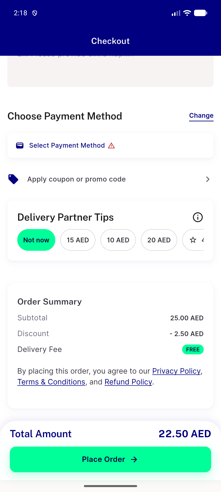</a> base s1 campaign q1 checkout</td>
<td align="center" width="33%"> base s1 campaign q2 checkout</td>
<td align="center" width="33%"><a href="base-s1-cart-checkout.png">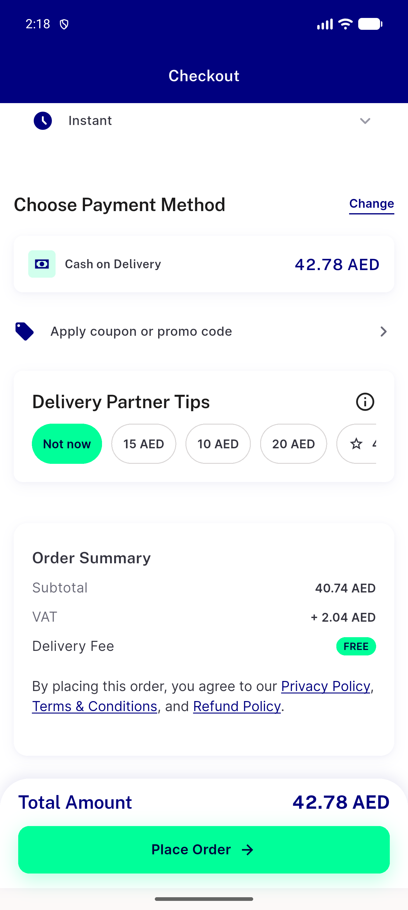</a> base s1 cart checkout</td>
</tr>
<tr>
<td align="center" width="33%"><a href="base-s2-campaign-q1-checkout.png">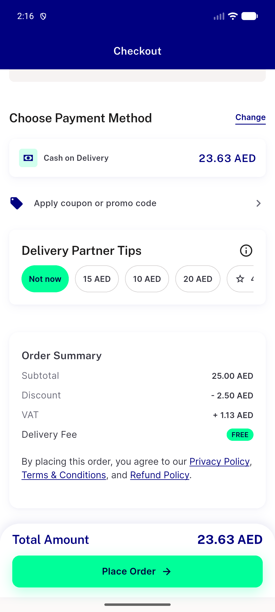</a> base s2 campaign q1 checkout</td>
<td align="center" width="33%"> base s2b campaign q2 after campaign checkout</td>
<td align="center" width="33%"> base s3 cart again checkout</td>
</tr>
<tr>
<td align="center" width="33%"> base s3 group after single checkout</td>
<td align="center" width="33%"><a href="base-s3-group-fresh-checkout.png">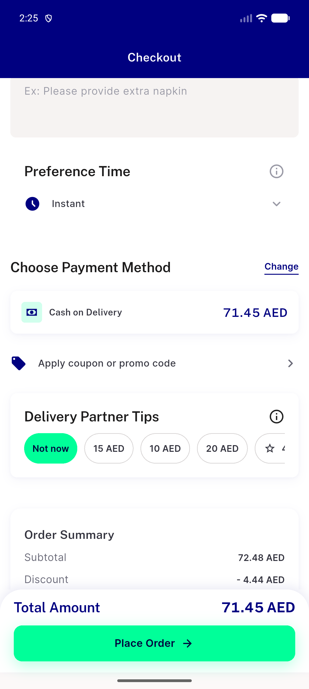</a> base s3 group fresh checkout</td>
<td align="center" width="33%"><a href="base-s4-failclosed-stock0-fresh.png">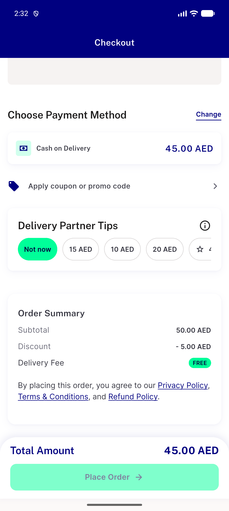</a> base s4 failclosed stock0 fresh</td>
</tr>
<tr>
<td align="center" width="33%"> base s5 campaign q2 cap46 checkout</td>
<td align="center" width="33%"> base s5 cart over cap checkout</td>
<td align="center" width="33%"><a href="bug-campaign-card-quickadd-wrong-item.png">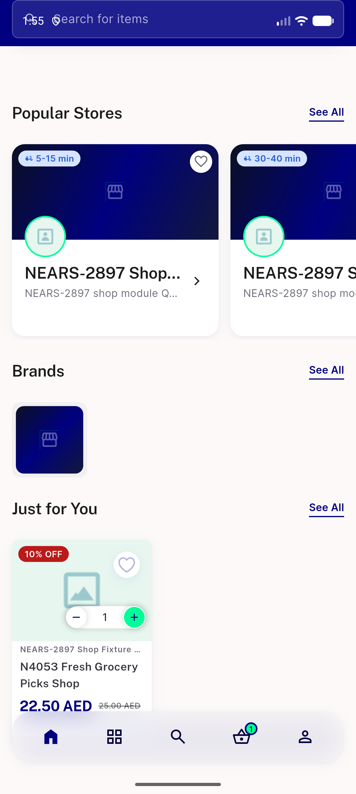</a> bug campaign card quickadd wrong item</td>
</tr>
<tr>
<td align="center" width="33%"> fix ac4 cap500 payment options</td>
<td align="center" width="33%"><a href="fix-s1-campaign-q1-checkout.png">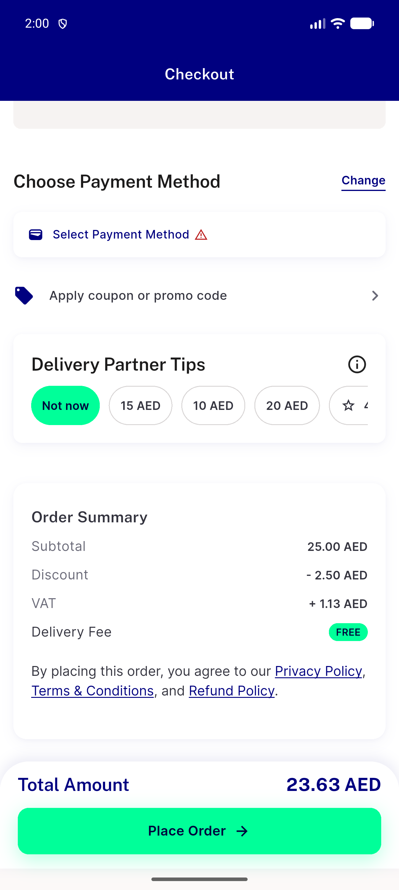</a> fix s1 campaign q1 checkout</td>
<td align="center" width="33%"> fix s1 campaign q2 checkout</td>
</tr>
<tr>
<td align="center" width="33%"> fix s1 cart checkout</td>
<td align="center" width="33%"> fix s1 held during gettax delay</td>
<td align="center" width="33%"> fix s1strict cart checkout</td>
</tr>
<tr>
<td align="center" width="33%"> fix s1strict2 campaign q1 checkout</td>
<td align="center" width="33%"> fix s1strict2 campaign q2 checkout</td>
<td align="center" width="33%"> fix s1strict2 cart checkout</td>
</tr>
<tr>
<td align="center" width="33%"> fix s3 cart again checkout</td>
<td align="center" width="33%"><a href="fix-s3-group-after-single-checkout.png">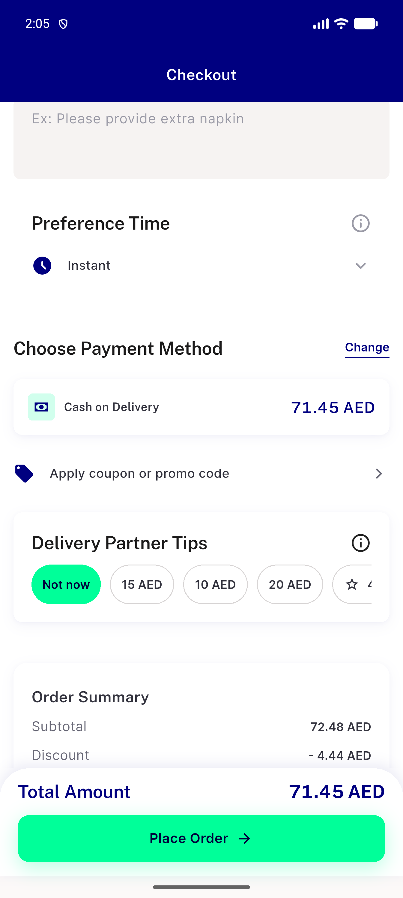</a> fix s3 group after single checkout</td>
<td align="center" width="33%"><a href="fix-s3-pharmacy-cta-checkout.png">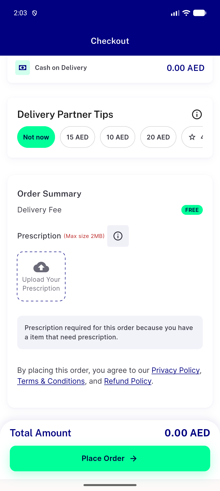</a> fix s3 pharmacy cta checkout</td>
</tr>
<tr>
<td align="center" width="33%"><a href="fix-s3-store-prescription-checkout.png">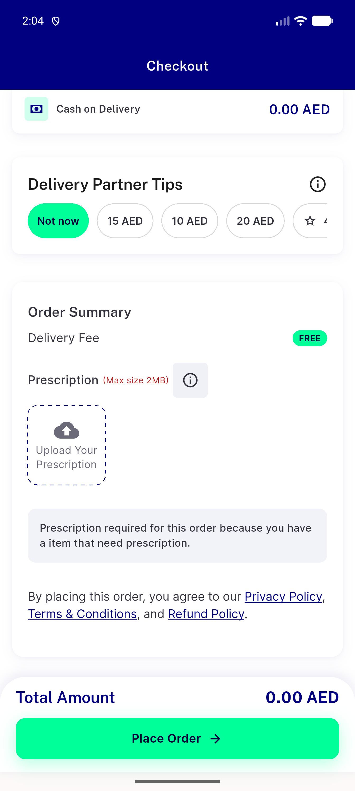</a> fix s3 store prescription checkout</td>
<td align="center" width="33%"><a href="fix-s4-failclosed-stock0-1.png">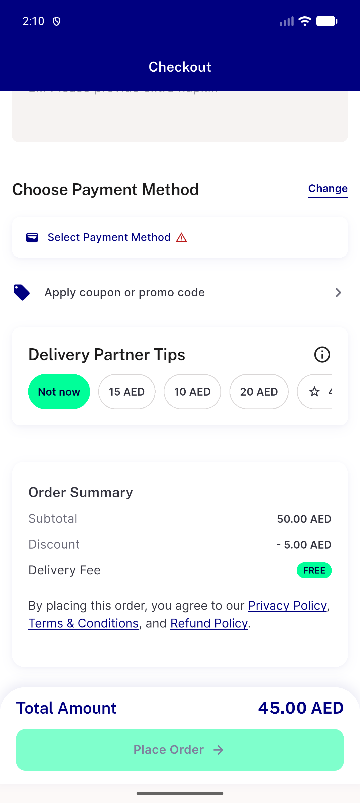</a> fix s4 failclosed stock0 1</td>
<td align="center" width="33%"><a href="fix-s5-campaign-q2-cap46-checkout.png">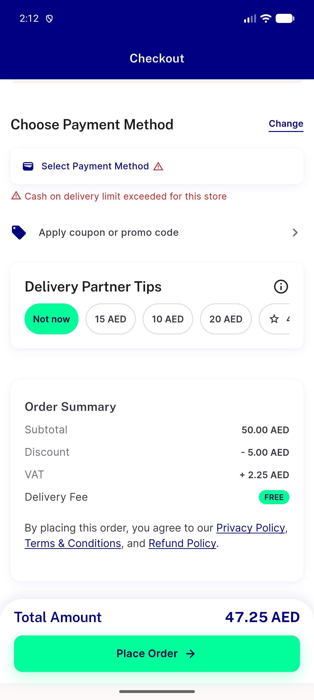</a> fix s5 campaign q2 cap46 checkout</td>
</tr>
<tr>
<td align="center" width="33%"><a href="fix-s5-cart-over-cap-checkout.png">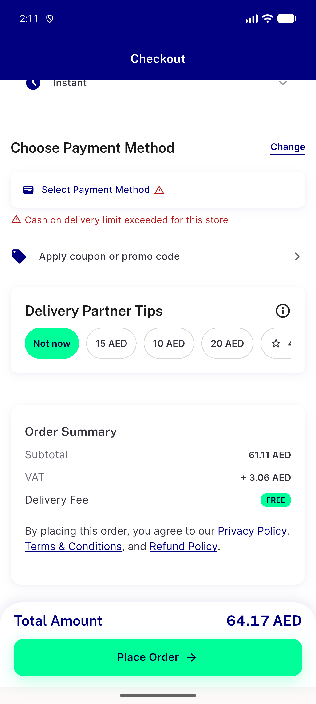</a> fix s5 cart over cap checkout</td>
<td align="center" width="33%"> fix s6 race late</td>
<td align="center" width="33%"> s2 fix campaign n1 checkout bottom</td>
</tr>
<tr>
<td align="center" width="33%"><a href="s2-fix-campaign-n1-checkout-top.png">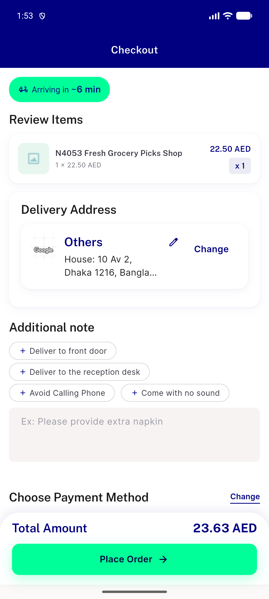</a> s2 fix campaign n1 checkout top</td>
</tr>
</table>

### Other artifacts
- [`base-s1-campaign-q1-checkout.a11y.txt`](base-s1-campaign-q1-checkout.a11y.txt)
- [`base-s1-campaign-q2-checkout.a11y.txt`](base-s1-campaign-q2-checkout.a11y.txt)
- [`base-s1-cart-checkout.a11y.txt`](base-s1-cart-checkout.a11y.txt)
- [`base-s2-campaign-q1-checkout.a11y.txt`](base-s2-campaign-q1-checkout.a11y.txt)
- [`base-s2b-campaign-q2-after-campaign-checkout.a11y.txt`](base-s2b-campaign-q2-after-campaign-checkout.a11y.txt)
- [`base-s3-cart-again-checkout.a11y.txt`](base-s3-cart-again-checkout.a11y.txt)
- [`base-s3-group-after-single-checkout.a11y.txt`](base-s3-group-after-single-checkout.a11y.txt)
- [`base-s3-group-fresh-checkout.a11y.txt`](base-s3-group-fresh-checkout.a11y.txt)
- [`base-s3-group-fresh-r1.a11y.txt`](base-s3-group-fresh-r1.a11y.txt)
- [`base-s3-group-fresh-r2.a11y.txt`](base-s3-group-fresh-r2.a11y.txt)
- [`base-s3-pharmacy-cta-checkout.a11y.txt`](base-s3-pharmacy-cta-checkout.a11y.txt)
- [`base-s3-store-prescription-checkout.a11y.txt`](base-s3-store-prescription-checkout.a11y.txt)
- [`base-s4-failclosed-stock0-fresh.a11y.txt`](base-s4-failclosed-stock0-fresh.a11y.txt)
- [`base-s5-campaign-q2-cap46-checkout.a11y.txt`](base-s5-campaign-q2-cap46-checkout.a11y.txt)
- [`base-s5-cart-over-cap-checkout.a11y.txt`](base-s5-cart-over-cap-checkout.a11y.txt)
- [`bug-campaign-card-quickadd-wrong-item.a11y.txt`](bug-campaign-card-quickadd-wrong-item.a11y.txt)
- [`bug-campaign-card-quickadd-wrong-item.cart.txt`](bug-campaign-card-quickadd-wrong-item.cart.txt)
- [`fix-ac4-cap500-payment-options.a11y.txt`](fix-ac4-cap500-payment-options.a11y.txt)
- [`fix-s1-campaign-q1-checkout.a11y.txt`](fix-s1-campaign-q1-checkout.a11y.txt)
- [`fix-s1-campaign-q2-checkout.a11y.txt`](fix-s1-campaign-q2-checkout.a11y.txt)
- [`fix-s1-cart-checkout.a11y.txt`](fix-s1-cart-checkout.a11y.txt)
- [`fix-s1-held-after-gettax-lands.a11y.txt`](fix-s1-held-after-gettax-lands.a11y.txt)
- [`fix-s1-held-during-gettax-delay.a11y.txt`](fix-s1-held-during-gettax-delay.a11y.txt)
- [`fix-s1strict-cart-checkout.a11y.txt`](fix-s1strict-cart-checkout.a11y.txt)
- [`fix-s1strict2-campaign-q1-checkout.a11y.txt`](fix-s1strict2-campaign-q1-checkout.a11y.txt)
- [`fix-s1strict2-campaign-q2-checkout.a11y.txt`](fix-s1strict2-campaign-q2-checkout.a11y.txt)
- [`fix-s1strict2-cart-checkout.a11y.txt`](fix-s1strict2-cart-checkout.a11y.txt)
- [`fix-s3-cart-again-checkout.a11y.txt`](fix-s3-cart-again-checkout.a11y.txt)
- [`fix-s3-group-after-single-checkout.a11y.txt`](fix-s3-group-after-single-checkout.a11y.txt)
- [`fix-s3-group-fresh-r1.a11y.txt`](fix-s3-group-fresh-r1.a11y.txt)
- [`fix-s3-group-fresh-r2.a11y.txt`](fix-s3-group-fresh-r2.a11y.txt)
- [`fix-s3-pharmacy-cta-checkout.a11y.txt`](fix-s3-pharmacy-cta-checkout.a11y.txt)
- [`fix-s3-store-prescription-checkout.a11y.txt`](fix-s3-store-prescription-checkout.a11y.txt)
- [`fix-s4-failclosed-stock0-1.a11y.txt`](fix-s4-failclosed-stock0-1.a11y.txt)
- [`fix-s5-campaign-q2-cap46-checkout.a11y.txt`](fix-s5-campaign-q2-cap46-checkout.a11y.txt)
- [`fix-s5-cart-over-cap-checkout.a11y.txt`](fix-s5-cart-over-cap-checkout.a11y.txt)
- [`fix-s6-race-early.a11y.txt`](fix-s6-race-early.a11y.txt)
- [`fix-s6-race-late.a11y.txt`](fix-s6-race-late.a11y.txt)
- [`mut-Q1-both.log`](mut-Q1-both.log)
- [`mut-Q1-reset.log`](mut-Q1-reset.log)
- [`mut-Q2-both.log`](mut-Q2-both.log)
- [`mut-Q2-reset.log`](mut-Q2-reset.log)
- [`mut-Q3-both.log`](mut-Q3-both.log)
- [`mut-Q4-both.log`](mut-Q4-both.log)
- [`mut-extra-pristine.log`](mut-extra-pristine.log)
- [`mutation-log.md`](mutation-log.md)
- [`qa-extra-kill-tests.dart.txt`](qa-extra-kill-tests.dart.txt)
- [`qa-fe-log-scoped.log`](qa-fe-log-scoped.log)
- [`qa-fixtures.txt`](qa-fixtures.txt)
- [`qa-mutate.py.txt`](qa-mutate.py.txt)
- [`qa-mutation-log.md`](qa-mutation-log.md)
- [`qa-progress.md`](qa-progress.md)
- [`qa-server-oracle.txt`](qa-server-oracle.txt)
- [`qa-server-proxy-gettax.log`](qa-server-proxy-gettax.log)
- [`s2-fix-campaign-n1-checkout-bottom.a11y.txt`](s2-fix-campaign-n1-checkout-bottom.a11y.txt)
- [`s7-checkout-widget.log`](s7-checkout-widget.log)
- [`s7-reset-rearms.log`](s7-reset-rearms.log)

---
*From `nears/docs/qa-evidence/NEARS-4053/` · public-repo scrub policy (no live secrets; verified clean).*
