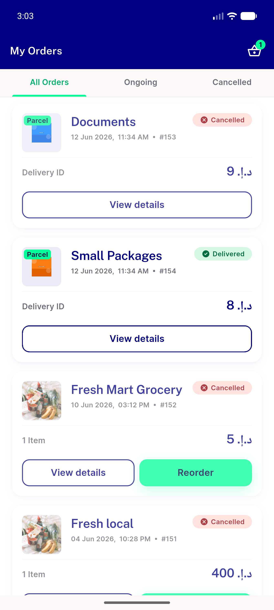
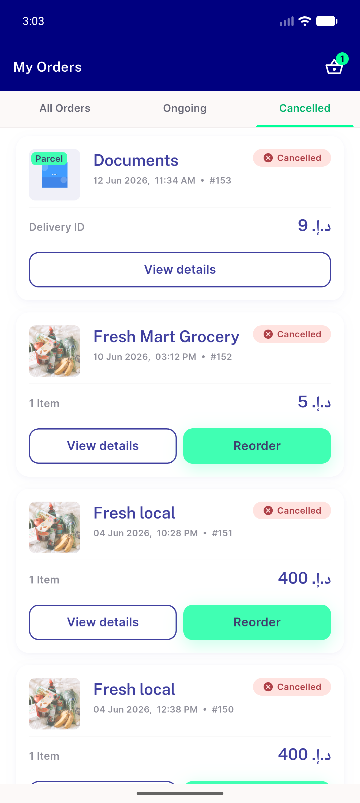
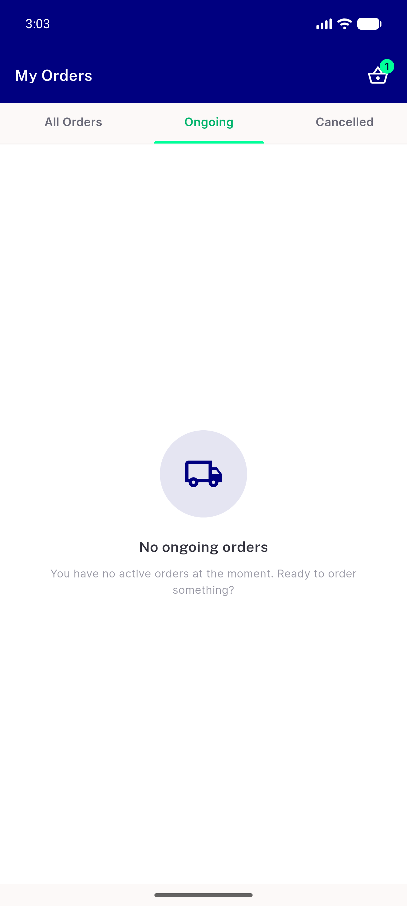
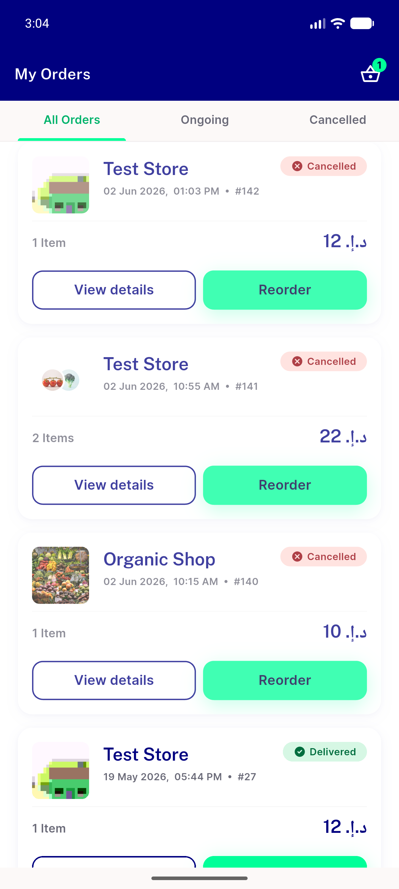
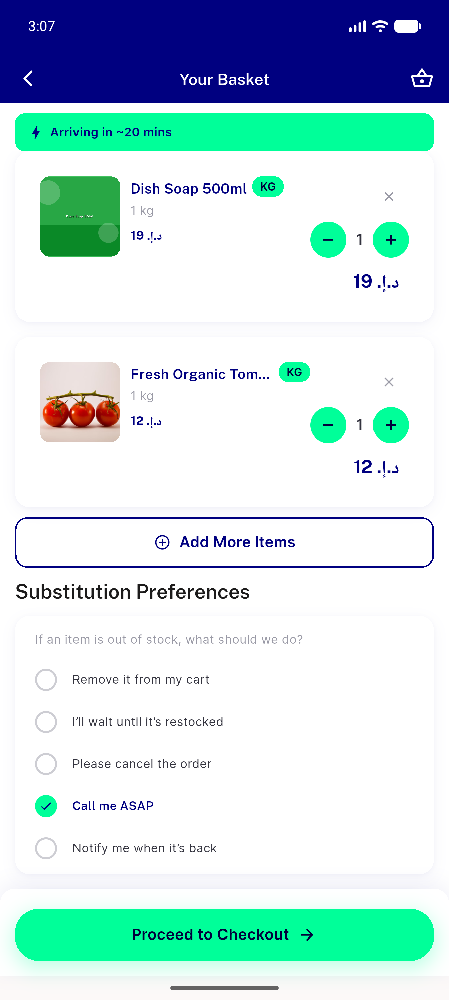
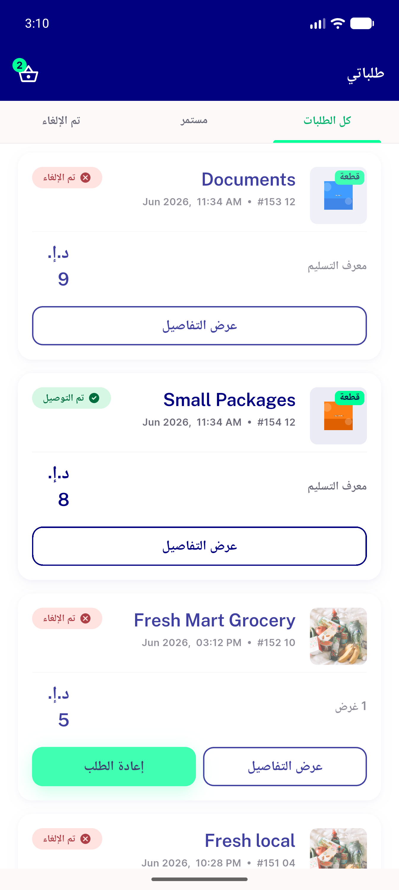
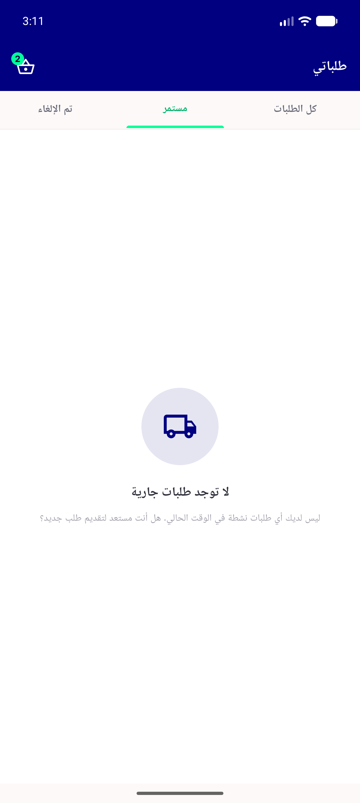
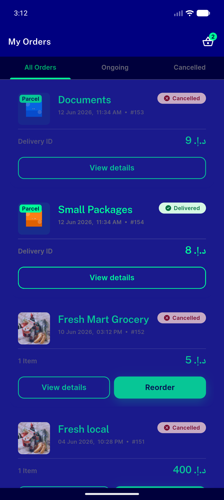
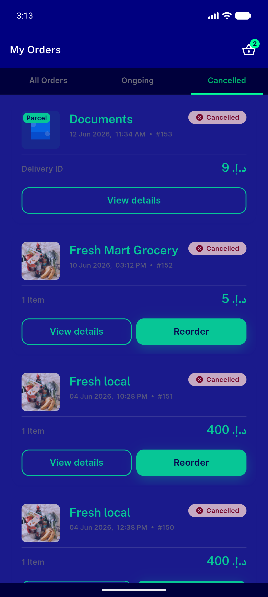

# QA Evidence — NEARS-406

**PASS — My Orders reskin (cycle-1 tab render fix verified): underline tabs, canonical pills, per-tab empty states, RTL+dark; 81 tests green**

**9 screenshot(s).** Click any thumbnail for full resolution.

<table>
<tr>
<td align="center" width="33%"> all tab en light</td>
<td align="center" width="33%"> cancelled tab en light</td>
<td align="center" width="33%"> ongoing empty en light</td>
</tr>
<tr>
<td align="center" width="33%"> all tab paginated multiitem</td>
<td align="center" width="33%"> reorder lands on cart</td>
<td align="center" width="33%"> all tab ar rtl light</td>
</tr>
<tr>
<td align="center" width="33%"> ongoing empty ar rtl</td>
<td align="center" width="33%"> all tab dark en</td>
<td align="center" width="33%"> cancelled dark en</td>
</tr>
</table>

---
*From `nears/docs/qa-evidence/NEARS-406/` · public-repo scrub policy (no live secrets; verified clean).*
