# QA Evidence — NEARS-407

**PASS — Address pair reskin: list deltas + add/edit form DLS verified live on emulator-5554; validation wall holds (no write); RTL FAB fix confirmed; map tiles blocked by dev API key (env). 43 backstop green.**

**20 screenshot(s).** Click any thumbnail for full resolution.

<table>
<tr>
<td align="center" width="33%"><a href="00-boot-location-sheet.png">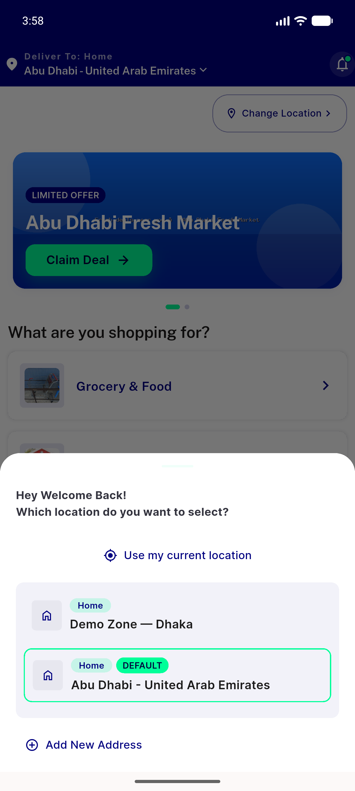</a> boot location sheet</td>
<td align="center" width="33%"><a href="01-address-list.png">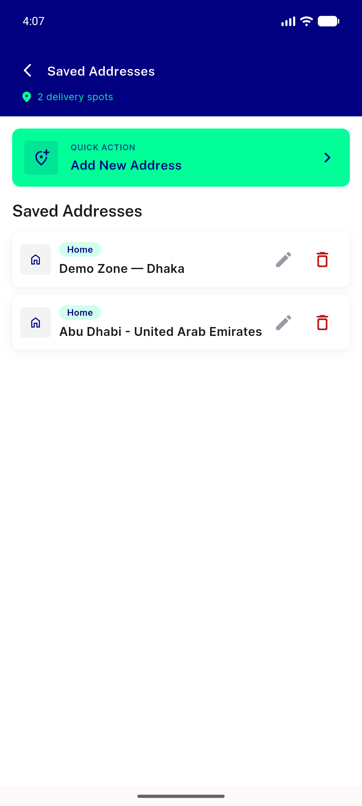</a> address list</td>
<td align="center" width="33%"><a href="02-delete-confirm-dialog.png">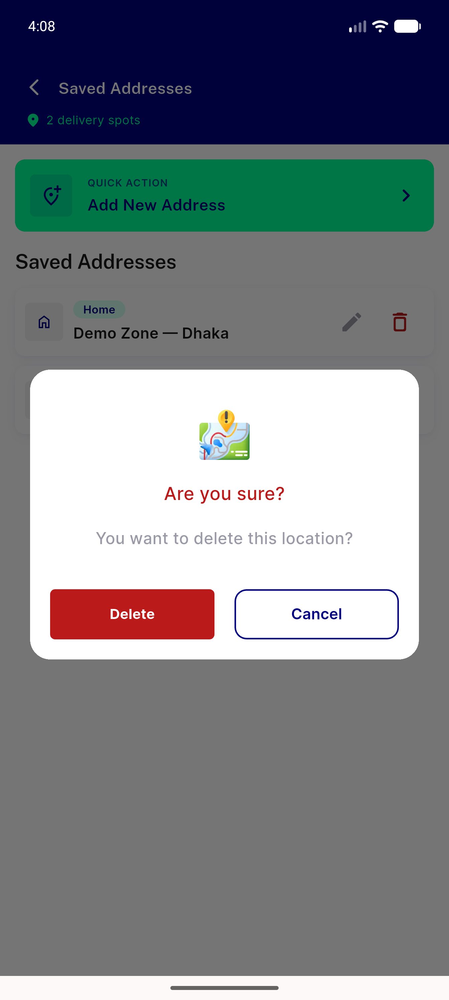</a> delete confirm dialog</td>
</tr>
<tr>
<td align="center" width="33%"><a href="03-edit-form-prefill-top.png">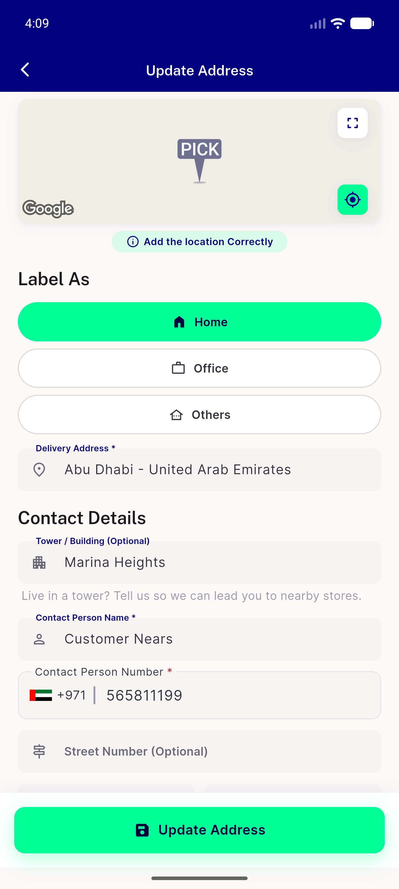</a> edit form prefill top</td>
<td align="center" width="33%"><a href="04-map-after-pan.png">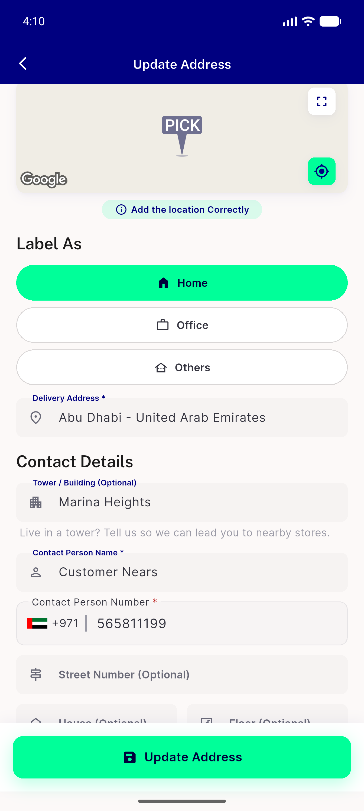</a> map after pan</td>
<td align="center" width="33%"><a href="05-country-code-picker.png">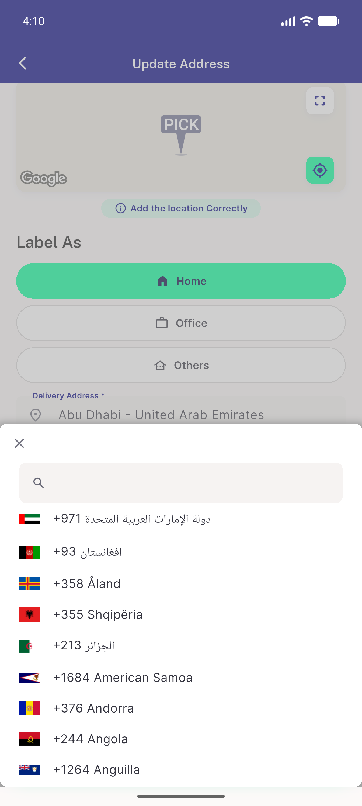</a> country code picker</td>
</tr>
<tr>
<td align="center" width="33%"><a href="06-others-levelname.png">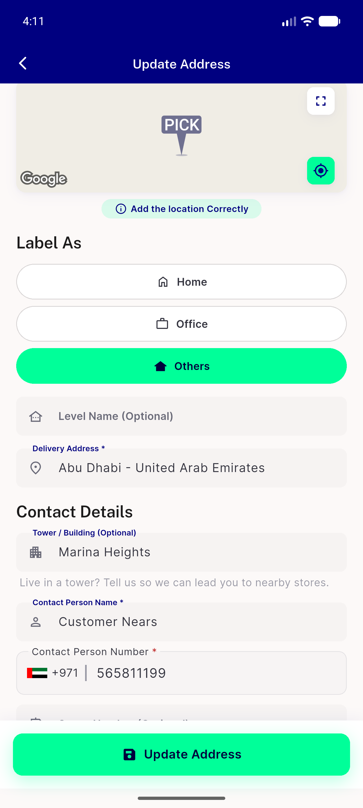</a> others levelname</td>
<td align="center" width="33%"> home levelname gone</td>
<td align="center" width="33%"><a href="08-add-form-blank.png">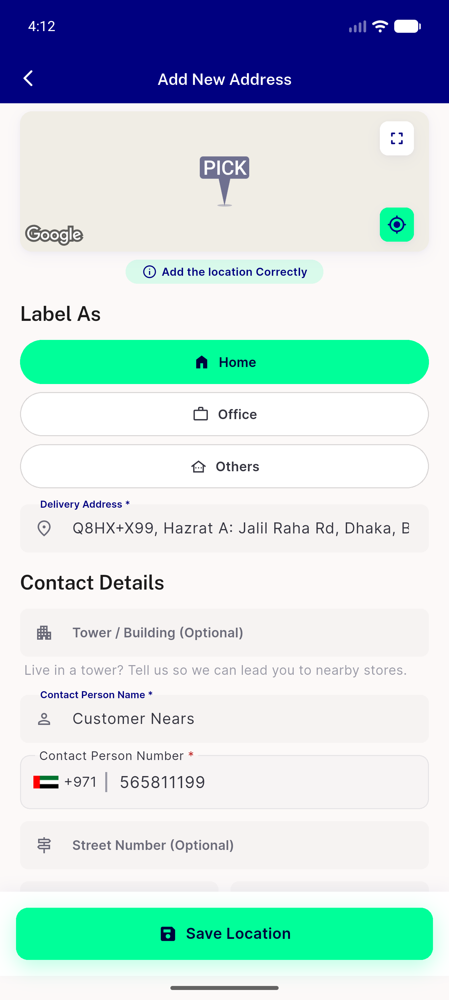</a> add form blank</td>
</tr>
<tr>
<td align="center" width="33%"><a href="09-validation-wall-snackbar.png">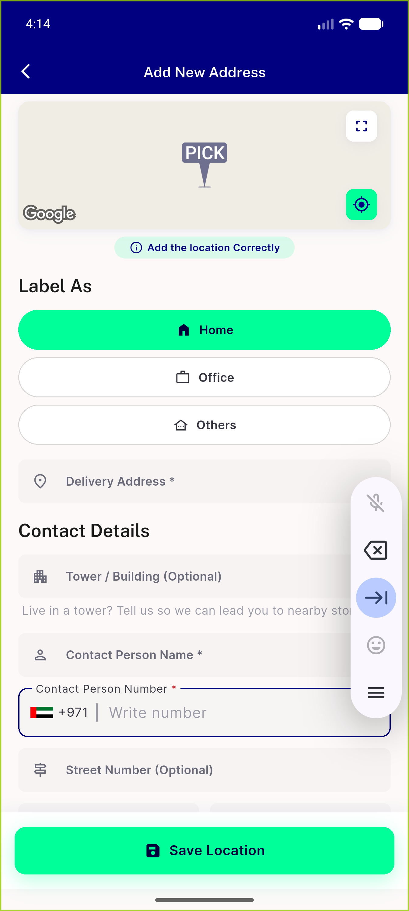</a> validation wall snackbar</td>
<td align="center" width="33%"><a href="10-validation-snackbar2.png">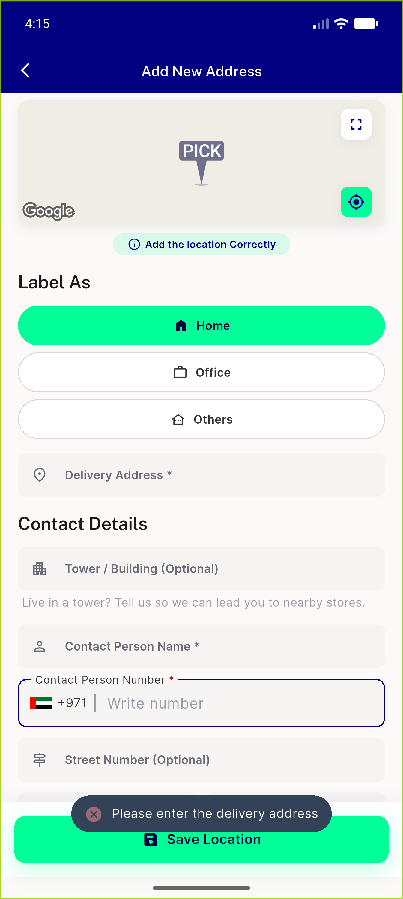</a> validation snackbar2</td>
<td align="center" width="33%"><a href="11-list-dark.png">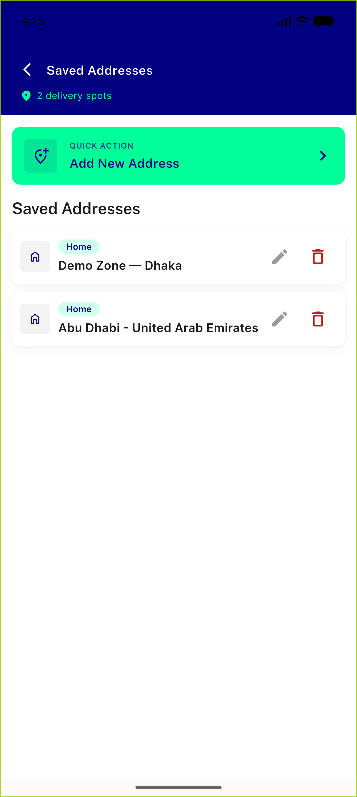</a> list dark</td>
</tr>
<tr>
<td align="center" width="33%"><a href="12-menu-after-toggle.png">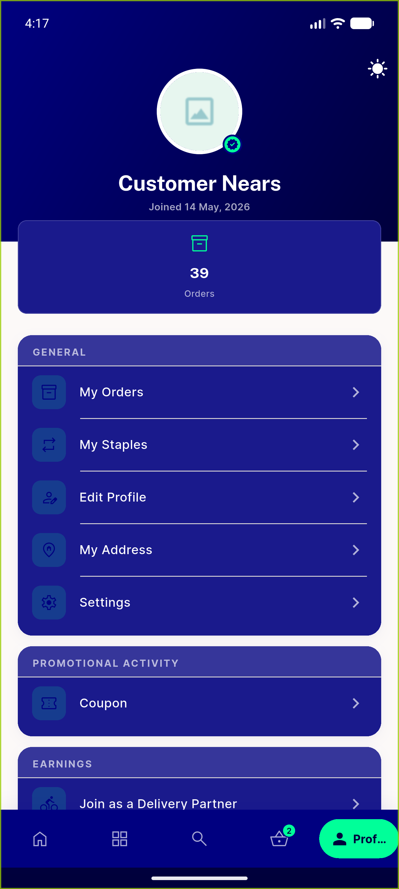</a> menu after toggle</td>
<td align="center" width="33%"><a href="13-list-dark.png">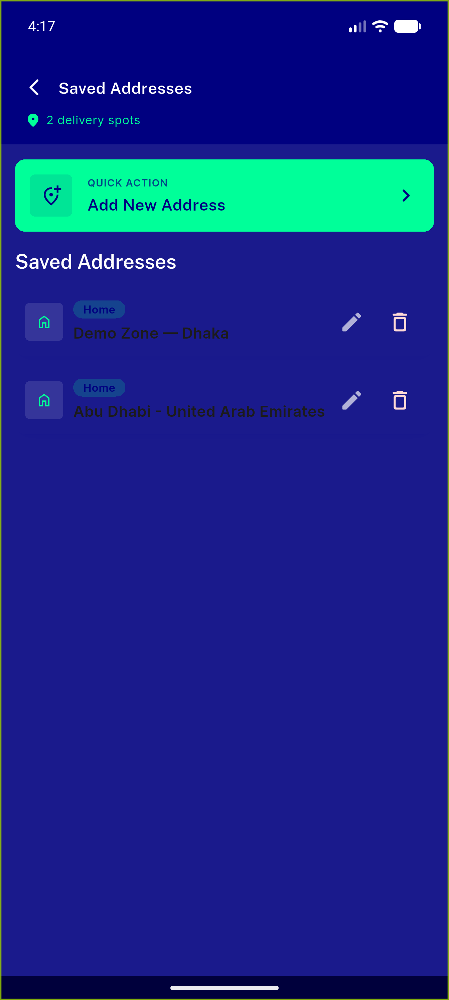</a> list dark</td>
<td align="center" width="33%"><a href="14-edit-form-dark.png">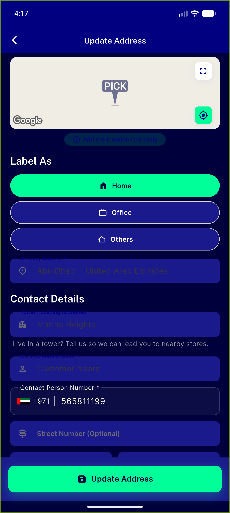</a> edit form dark</td>
</tr>
<tr>
<td align="center" width="33%"><a href="15-list-rtl-arabic.png">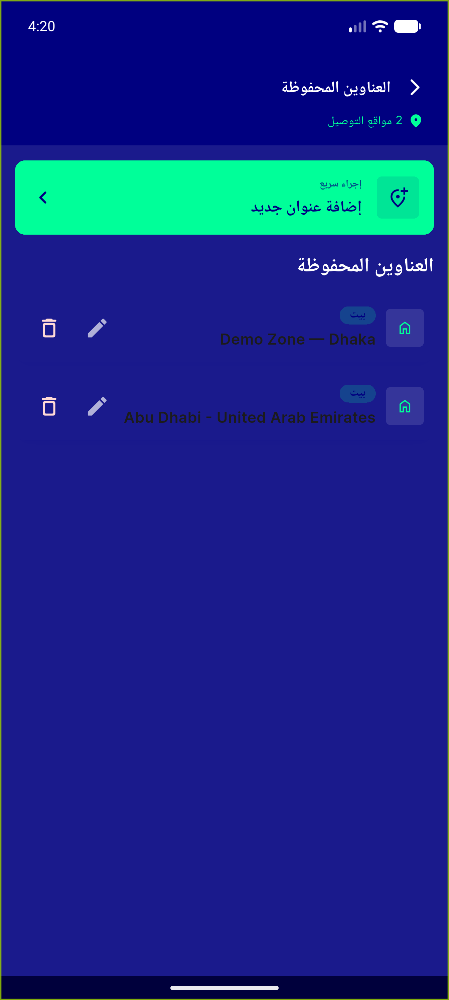</a> list rtl arabic</td>
<td align="center" width="33%"><a href="16-form-rtl-arabic.png">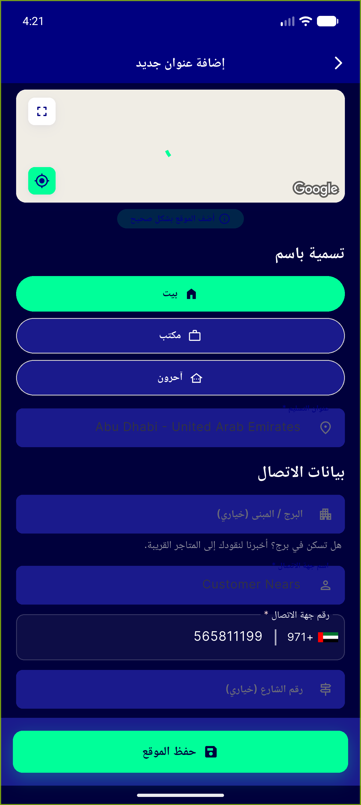</a> form rtl arabic</td>
<td align="center" width="33%"><a href="17-settings-check.png">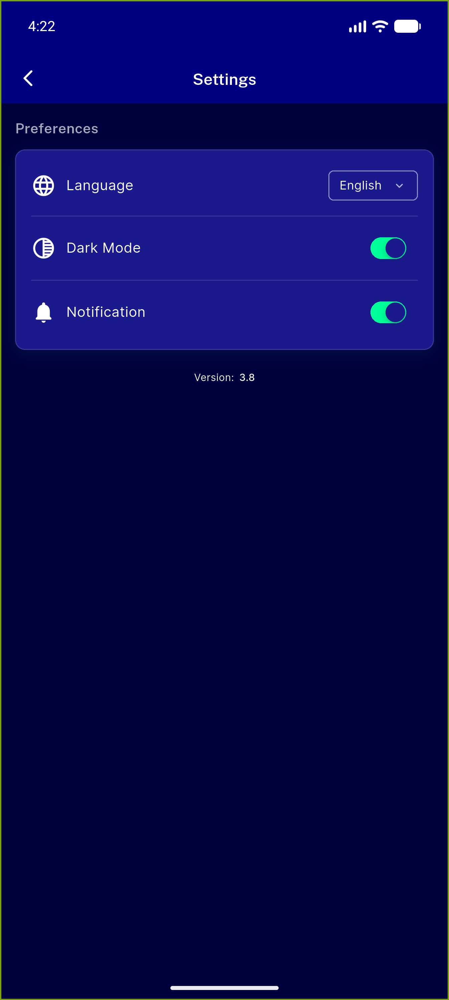</a> settings check</td>
</tr>
<tr>
<td align="center" width="33%"><a href="18-light-restored.png">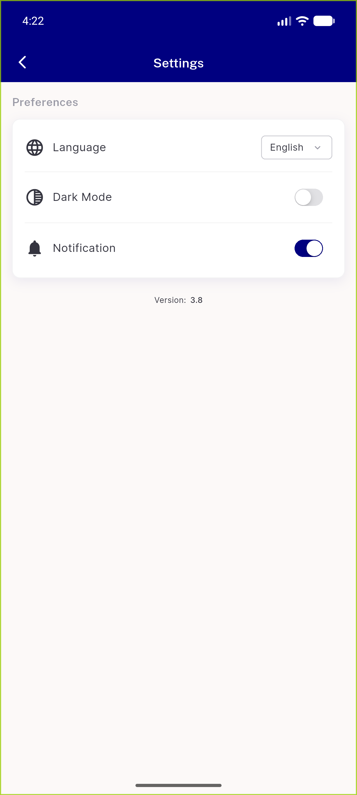</a> light restored</td>
<td align="center" width="33%"><a href="19-not-logged-in.png">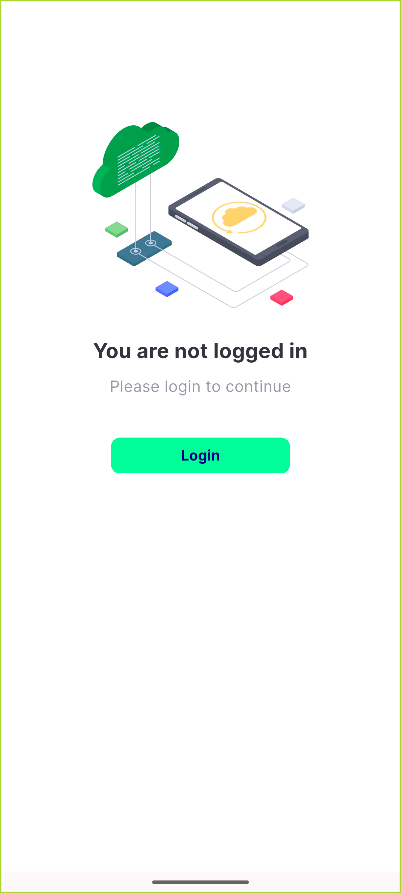</a> not logged in</td>
</tr>
</table>

### Other artifacts
- [`progress.md`](progress.md)

---
*From `nears/docs/qa-evidence/NEARS-407/` · public-repo scrub policy (no live secrets; verified clean).*
