# QA Evidence — NEARS-408

**PASS — Settings & Notifications reskin verified live on Android (dark-mode whole-app re-theme + persistence, notification confirm-sheet + persistence/restored, RTL both screens, DLS NearsAppBar backward-compat intact)**

**23 screenshot(s).** Click any thumbnail for full resolution.

<table>
<tr>
<td align="center" width="33%"><a href="N-01-notifications-dark.png">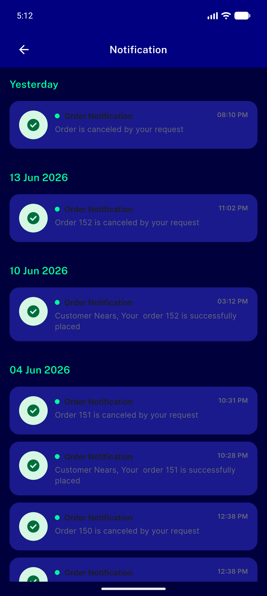</a> N 01 notifications dark</td>
<td align="center" width="33%"><a href="N-06-notif-detail-sheet-dark.png">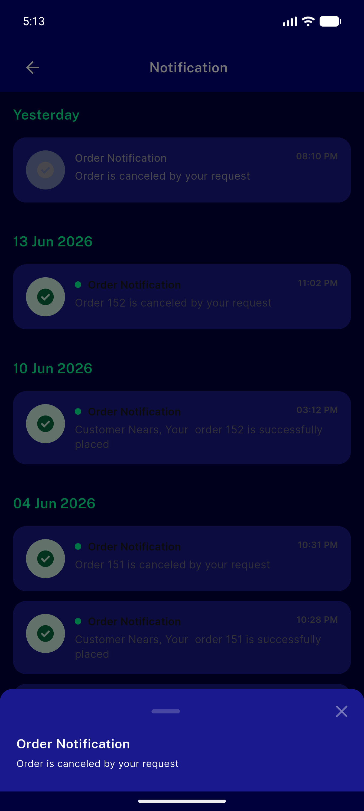</a> N 06 notif detail sheet dark</td>
<td align="center" width="33%"><a href="N-11-pull-refresh-dark.png">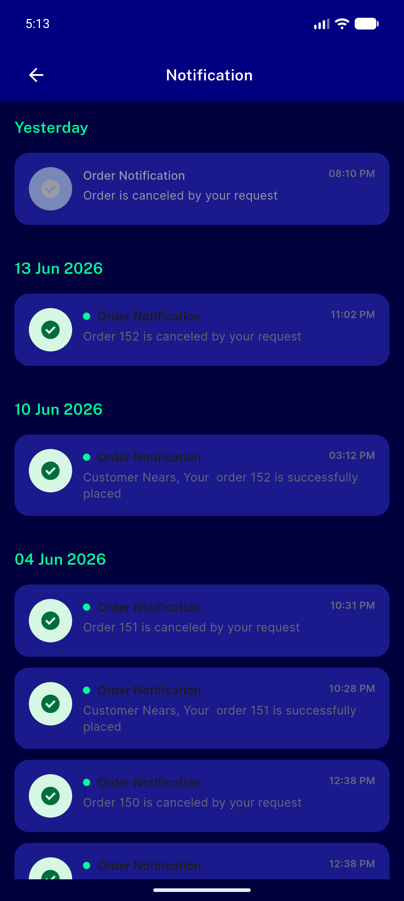</a> N 11 pull refresh dark</td>
</tr>
<tr>
<td align="center" width="33%"><a href="N-13-notifications-arabic-rtl.png">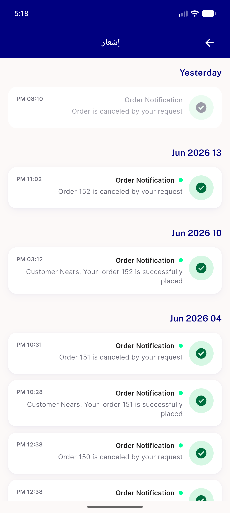</a> N 13 notifications arabic rtl</td>
<td align="center" width="33%"><a href="N-17-refresh-spinner-dark.png">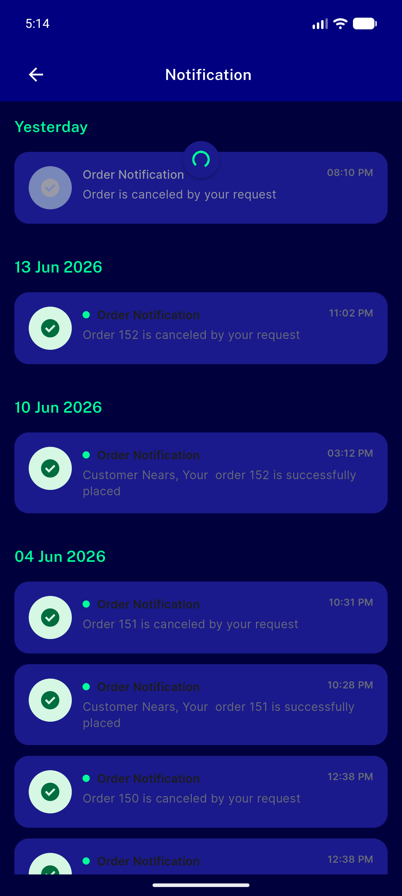</a> N 17 refresh spinner dark</td>
<td align="center" width="33%"><a href="REG-01-home-appbar-light.png">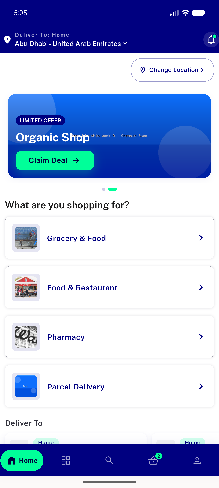</a> REG 01 home appbar light</td>
</tr>
<tr>
<td align="center" width="33%"><a href="REG-cart-appbar.png">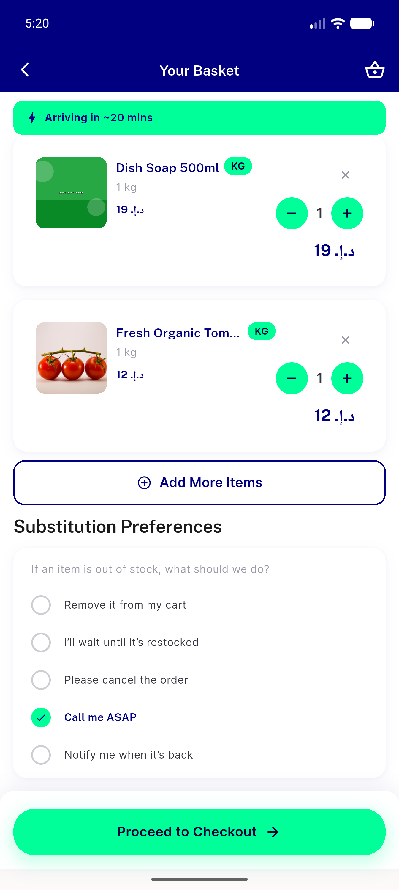</a> REG cart appbar</td>
<td align="center" width="33%"><a href="REG-home-arabic.png">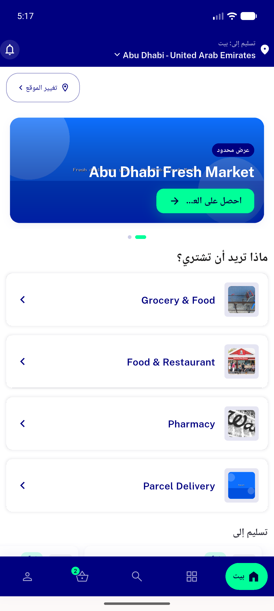</a> REG home arabic</td>
<td align="center" width="33%"><a href="REG-orders-appbar.png">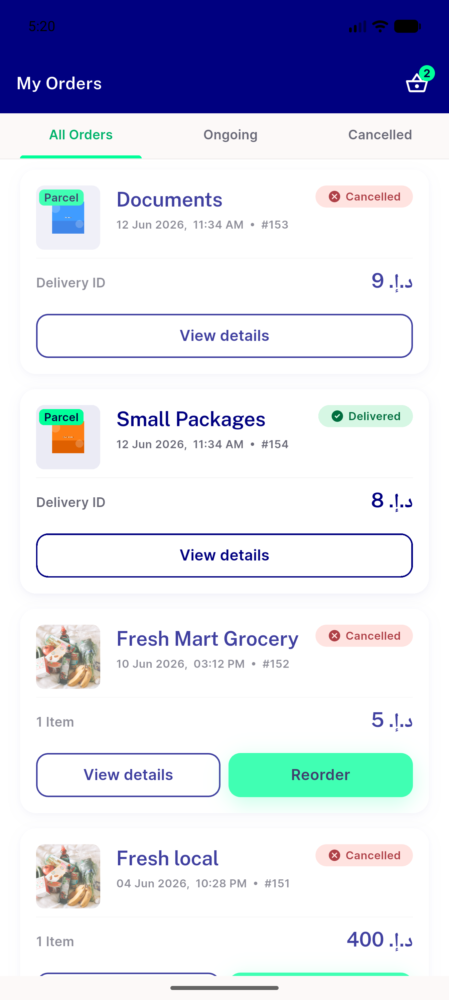</a> REG orders appbar</td>
</tr>
<tr>
<td align="center" width="33%"><a href="S-01-settings-light.png">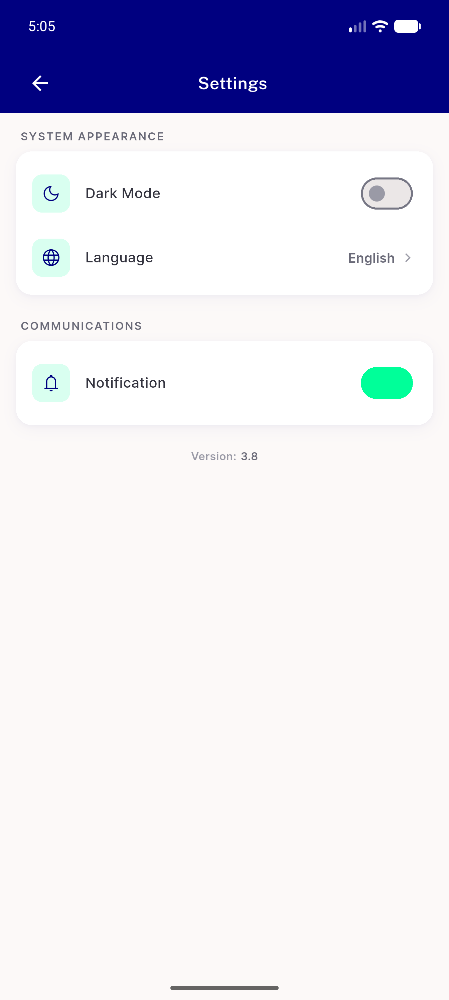</a> S 01 settings light</td>
<td align="center" width="33%"><a href="S-04-settings-dark.png">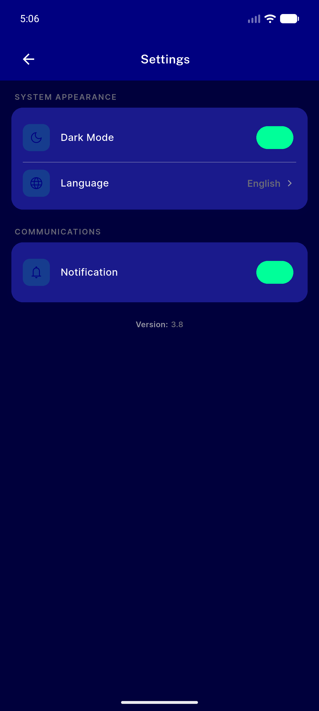</a> S 04 settings dark</td>
<td align="center" width="33%"><a href="S-04b-profile-menu-dark.png">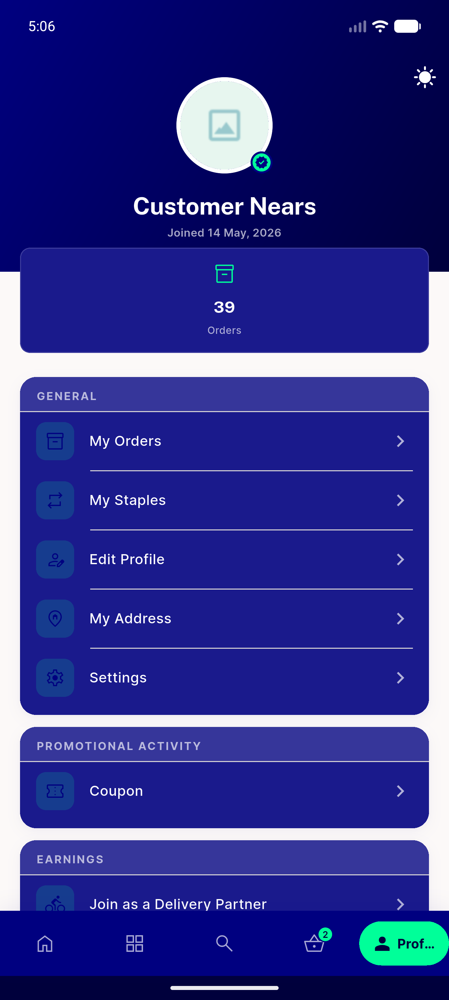</a> S 04b profile menu dark</td>
</tr>
<tr>
<td align="center" width="33%"><a href="S-04c-home-dark.png">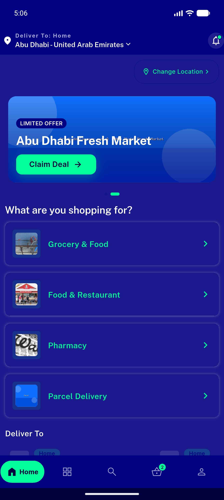</a> S 04c home dark</td>
<td align="center" width="33%"><a href="S-04d-restored-light.png">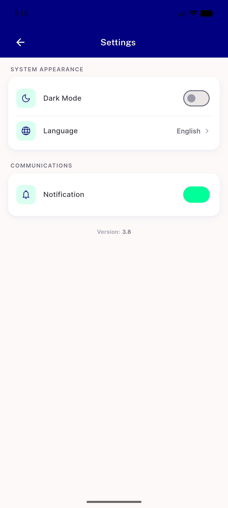</a> S 04d restored light</td>
<td align="center" width="33%"><a href="S-05-home-dark-after-restart.png">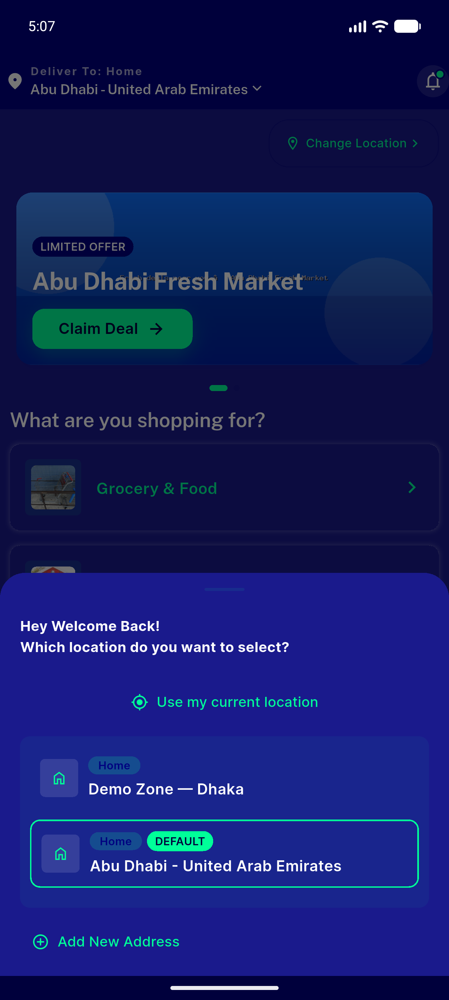</a> S 05 home dark after restart</td>
</tr>
<tr>
<td align="center" width="33%"><a href="S-05b-settings-dark-after-restart.png">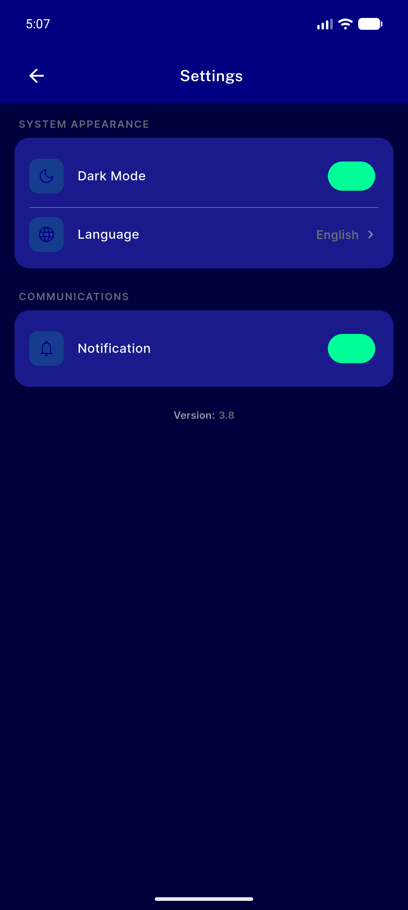</a> S 05b settings dark after restart</td>
<td align="center" width="33%"><a href="S-07-language-picker.png">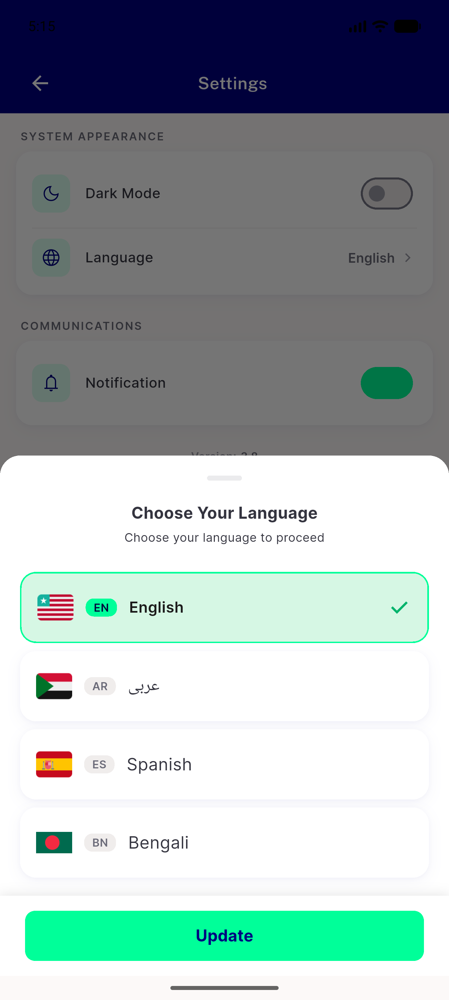</a> S 07 language picker</td>
<td align="center" width="33%"><a href="S-08-settings-arabic-rtl.png">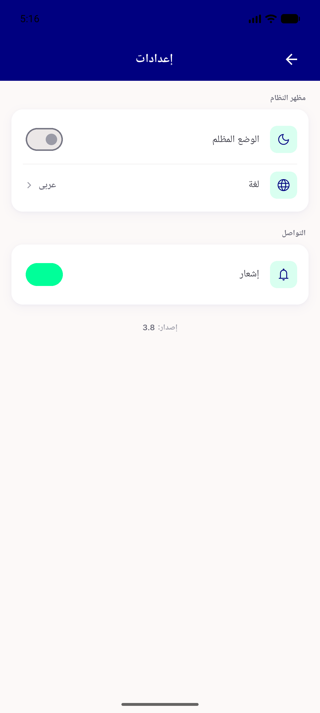</a> S 08 settings arabic rtl</td>
</tr>
<tr>
<td align="center" width="33%"><a href="S-11-notif-confirm-sheet-dark.png">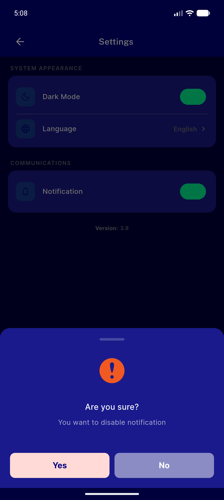</a> S 11 notif confirm sheet dark</td>
<td align="center" width="33%"><a href="S-11b-notif-off-dark.png">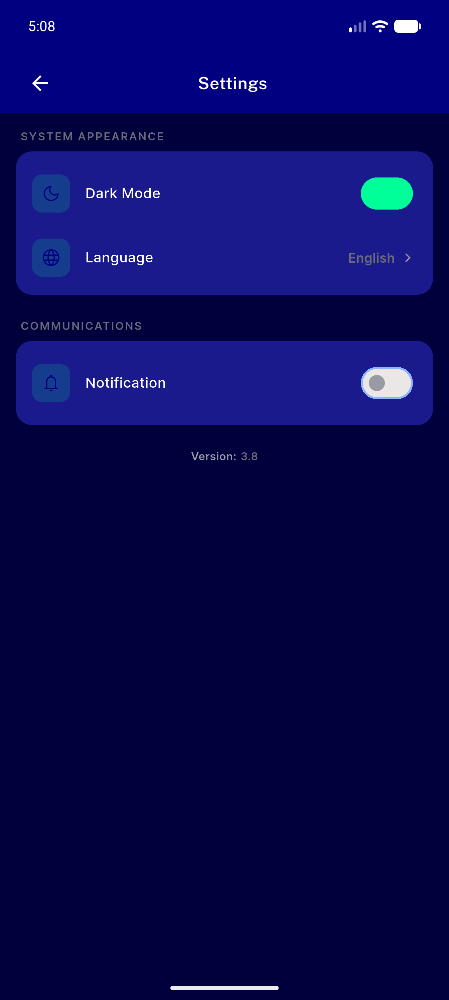</a> S 11b notif off dark</td>
<td align="center" width="33%"> S 12 notif off after restart</td>
</tr>
<tr>
<td align="center" width="33%"><a href="S-12b-notif-restored-on.png">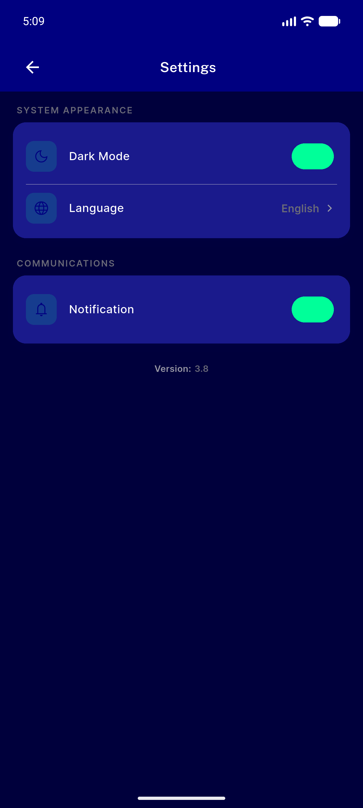</a> S 12b notif restored on</td>
<td align="center" width="33%"><a href="Z-restored-english-light.png">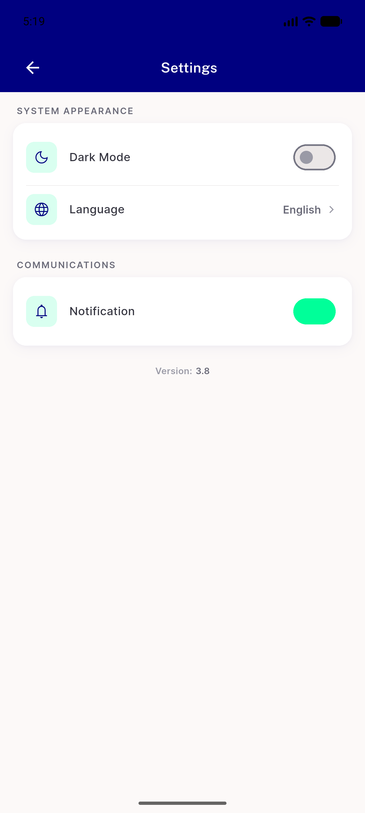</a> Z restored english light</td>
</tr>
</table>

### Other artifacts
- [`progress.md`](progress.md)

---
*From `nears/docs/qa-evidence/NEARS-408/` · public-repo scrub policy (no live secrets; verified clean).*
