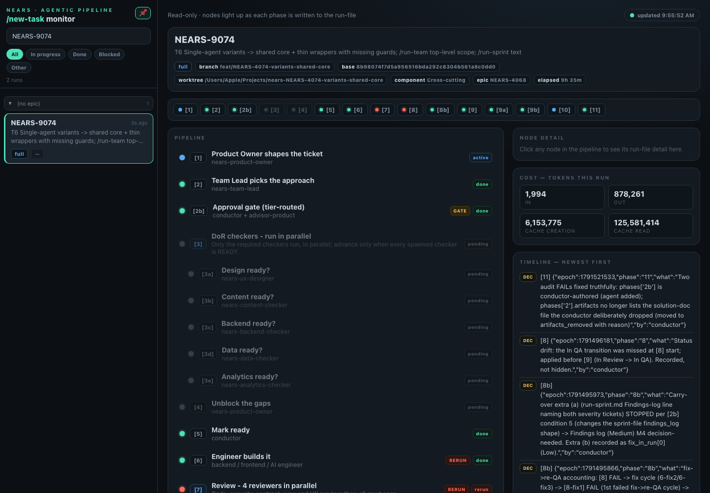

# QA Evidence — NEARS-4081

**NEARS-4081 QA [8] cycle 0: PASS (AC6 pending-gated on NEARS-4080) @ da3737959**

**3 screenshot(s).** Click any thumbnail for full resolution.

<table>
<tr>
<td align="center" width="33%"> ac8 board base 4074 control</td>
<td align="center" width="33%"> ac8 board new 4074</td>
<td align="center" width="33%"> ac8 board new latestFAIL</td>
</tr>
</table>

### Other artifacts
- [`ac1-ac2-live.log`](ac1-ac2-live.log)
- [`ac3-live.log`](ac3-live.log)
- [`ac7-ac9-live.log`](ac7-ac9-live.log)
- [`ac8-rendered.log`](ac8-rendered.log)
- [`bug-sync-board-report-mode-rc1.log`](bug-sync-board-report-mode-rc1.log)
- [`gate-and-mutations.log`](gate-and-mutations.log)

---
*From `nears/docs/qa-evidence/NEARS-4081/` · public-repo scrub policy (no live secrets; verified clean).*
