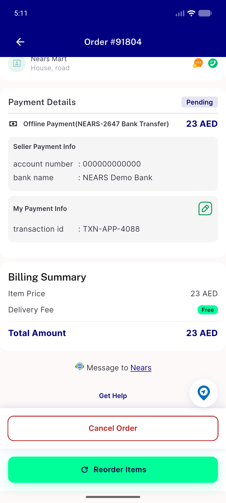
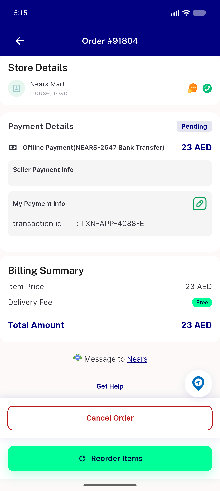
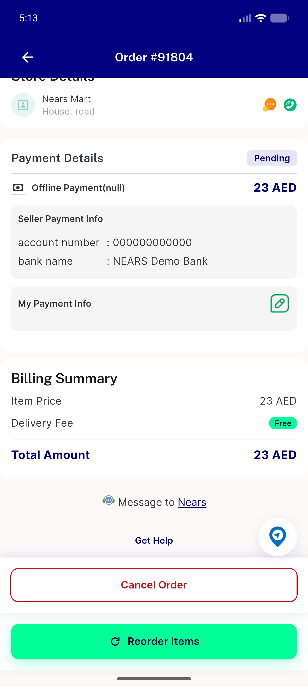
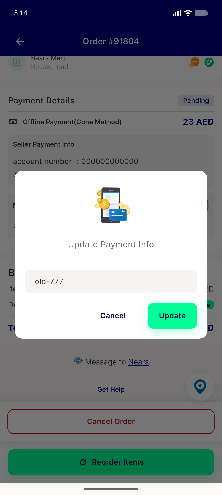

# QA Evidence — NEARS-4088

**PASS - AC1-AC7 verified live (curl+UserApp emulator-5554), 2 regression_bugs**

**5 screenshot(s).** Click any thumbnail for full resolution.

<table>
<tr>
<td align="center" width="33%"> ac6 healthy order detail</td>
<td align="center" width="33%"> ac6 method fields malformed</td>
<td align="center" width="33%"> ac6 method fields null</td>
</tr>
<tr>
<td align="center" width="33%"> ac6 payment info empty list</td>
<td align="center" width="33%"> ac7 legacy edit 403 failed toast</td>
</tr>
</table>

### Other artifacts
- [`bug-admin-order-view-legacy-offline-500.log`](bug-admin-order-view-legacy-offline-500.log)
- [`bug-verified-repending.log`](bug-verified-repending.log)
- [`progress.md`](progress.md)

---
*From `nears/docs/qa-evidence/NEARS-4088/` · public-repo scrub policy (no live secrets; verified clean).*
