# QA Evidence — NEARS-409

**FAIL — cycle-1 veg-glyph fix verified on all_store (white/visible/functional) + item_view_all behaviors green, BUT regressed store_item_search_screen veg glyph (white-on-white, invisible in light mode)**

**14 screenshot(s).** Click any thumbnail for full resolution.

<table>
<tr>
<td align="center" width="33%"><a href="01-item_view_all-light.png">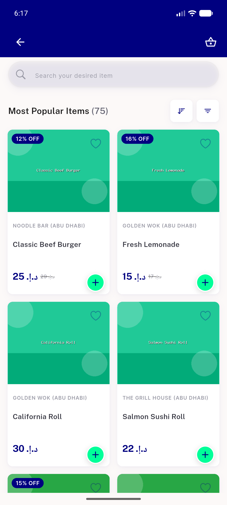</a> item view all light</td>
<td align="center" width="33%"><a href="02-item_view_all-paginated.png">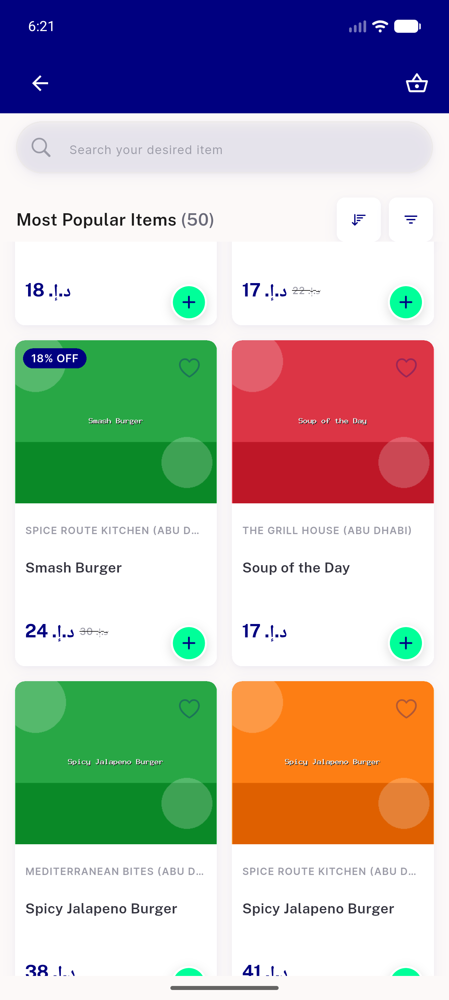</a> item view all paginated</td>
<td align="center" width="33%"><a href="03-item_view_all-empty.png">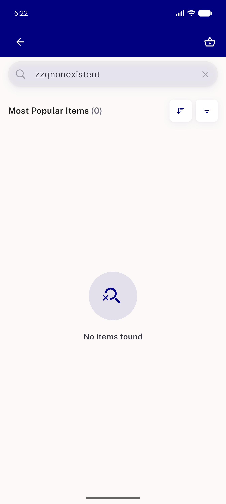</a> item view all empty</td>
</tr>
<tr>
<td align="center" width="33%"><a href="04-all_store-veg-filter-light.png">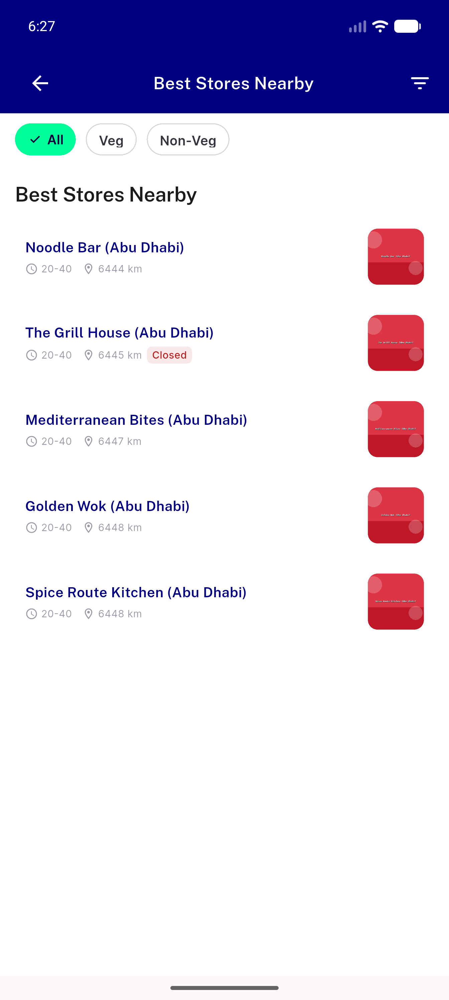</a> all store veg filter light</td>
<td align="center" width="33%"><a href="05-all_store-veg-popup.png">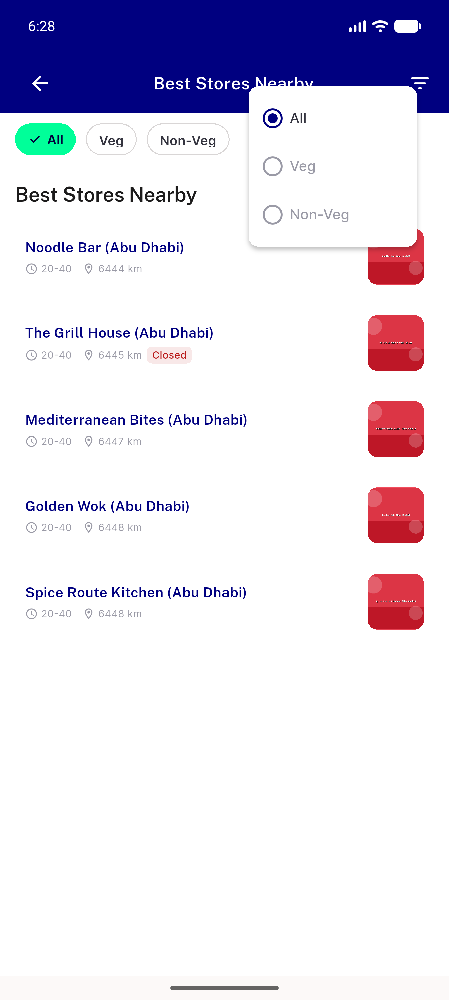</a> all store veg popup</td>
<td align="center" width="33%"><a href="06-all_store-recommended-noveg.png">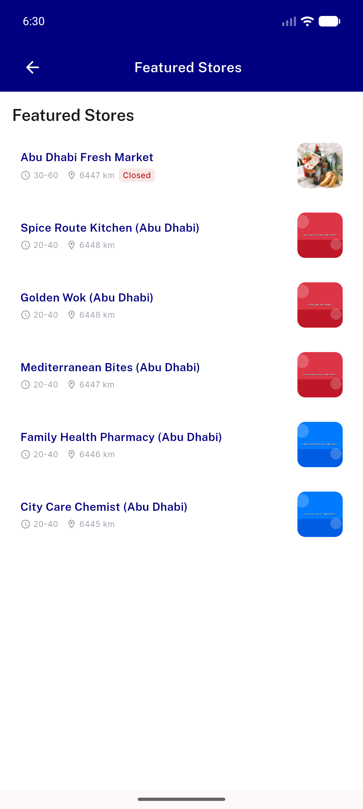</a> all store recommended noveg</td>
</tr>
<tr>
<td align="center" width="33%"><a href="07-category_item-veg-light.png">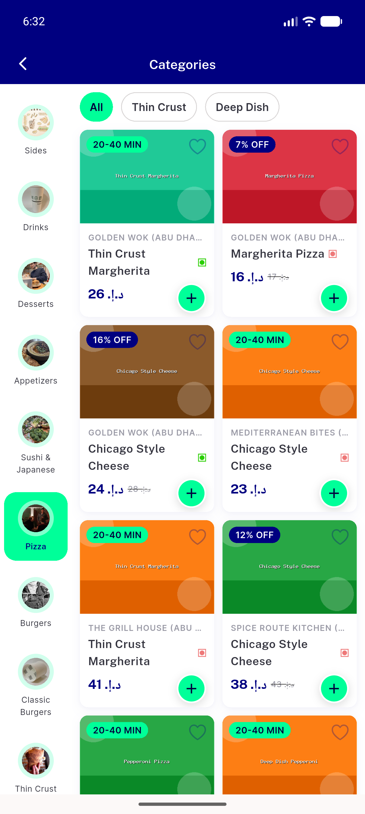</a> category item veg light</td>
<td align="center" width="33%"><a href="08-store_item_search-veg-light.png">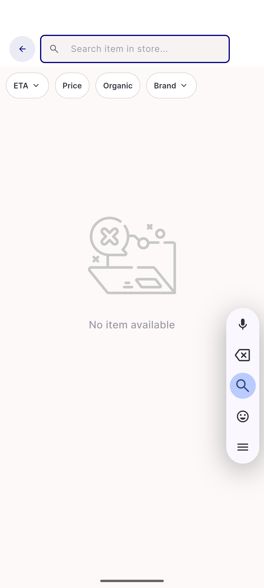</a> store item search veg light</td>
<td align="center" width="33%"><a href="08b-store_item_search-header.png">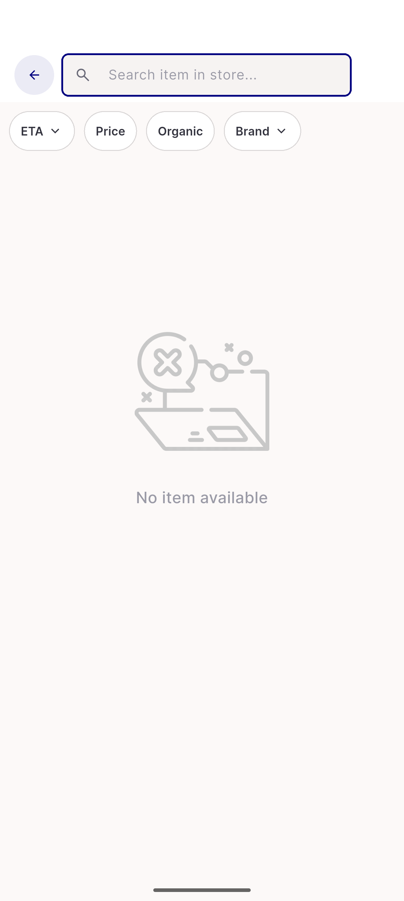</a> 08b store item search header</td>
</tr>
<tr>
<td align="center" width="33%"> 08c veg glyph region crop</td>
<td align="center" width="33%"><a href="09-all_store-RTL-arabic.png">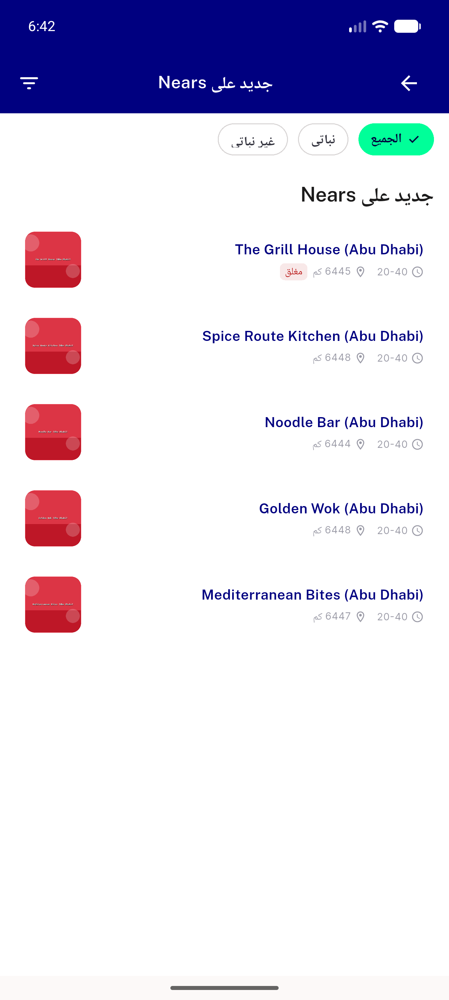</a> all store RTL arabic</td>
<td align="center" width="33%"> all store dark RTL</td>
</tr>
<tr>
<td align="center" width="33%"><a href="11-item_view_all-dark-search-NEARS429.png">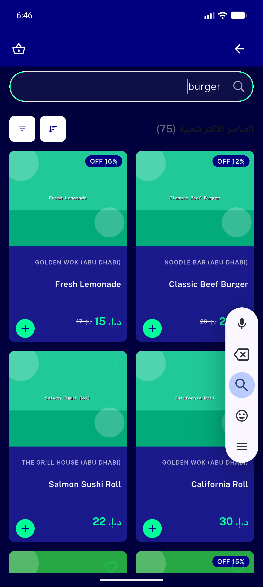</a> item view all dark search NEARS429</td>
<td align="center" width="33%"> store item search dark</td>
</tr>
</table>

### Other artifacts
- [`progress.md`](progress.md)

---
*From `nears/docs/qa-evidence/NEARS-409/` · public-repo scrub policy (no live secrets; verified clean).*
